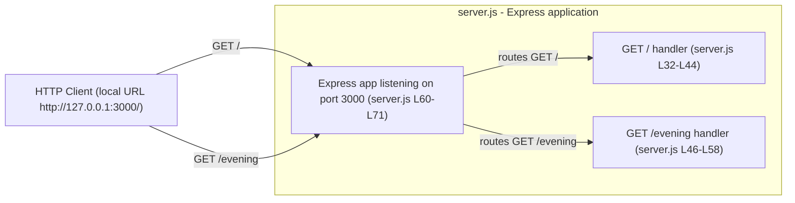
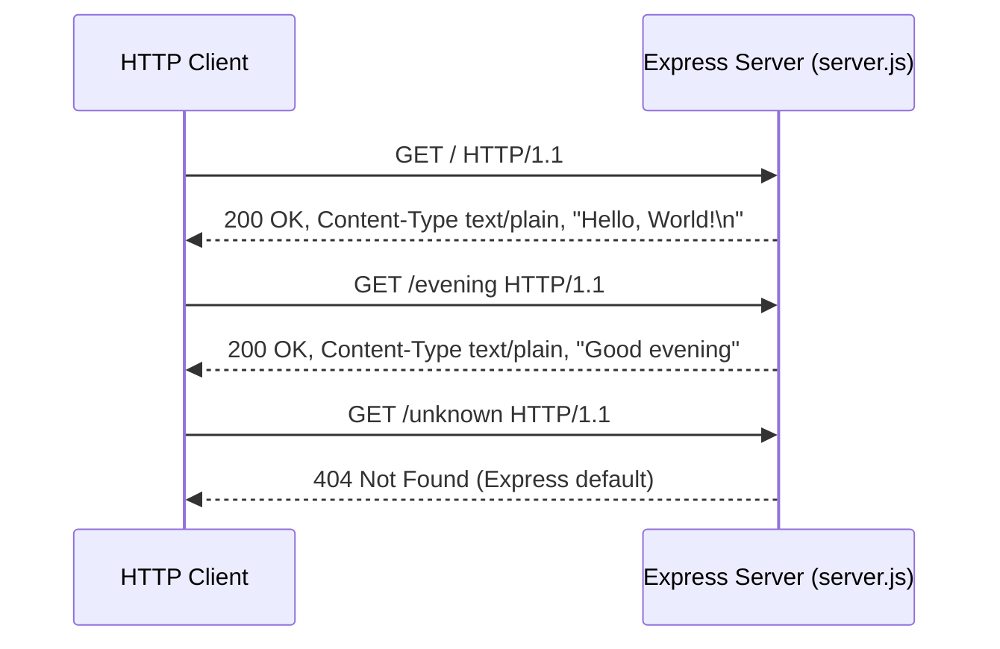

# hao-backprop-test

A simple Node.js "Hello World" HTTP server built with the Express.js framework.

> **Note — project naming:** The `package.json` `name` field is `hello_world`, while this
> README's title (the project title) is `hao-backprop-test`. This is a known inconsistency
> between the project/README title and the package name; it is documented here (not resolved)
> to avoid an unexpected rename. Source: `package.json`, `README.md`.

## Table of Contents

- [Overview](#overview)
- [Architecture](#architecture)
- [Prerequisites](#prerequisites)
- [Installation](#installation)
- [Configuration](#configuration)
- [Running the Server](#running-the-server)
- [API Documentation](#api-documentation)
- [Code Explanation](#code-explanation)
- [Deployment](#deployment)
- [Project Structure](#project-structure)
- [Troubleshooting](#troubleshooting)
- [License](#license)

## Overview

This project demonstrates a basic HTTP server using Express.js with multiple endpoints.
Originally created for backprop integration testing.

The entire application lives in a single file, `server.js`, which creates an Express
application, registers two plain-text `GET` endpoints (`/` and `/evening`), and starts an
HTTP listener on port `3000`. Its sole runtime dependency is `express`.
Source: `server.js`, `package.json`.

## Architecture

The application is a single-file Express server: an HTTP client sends `GET` requests that
are routed to one of two handlers, and the same Express application instance listens for
connections on port `3000`. Source: `server.js`.



## Prerequisites

- **Node.js `>= 18`** — required by the `express` dependency (`engines.node` = `">= 18"`).
  Source: `package-lock.json` (`node_modules/express` → `engines.node`).
- **npm** (the Node Package Manager, bundled with Node.js) — used for all install and run
  commands in this guide.

## Installation

From the project root — the directory that contains `server.js` and `package.json` — install
the runtime dependency with npm:

```bash
npm install
```

This installs the single runtime dependency, `express` (declared as `^5.2.1`, resolved to
`5.2.1`). Source: `package.json` (`dependencies.express`), `package-lock.json`
(`node_modules/express` → `5.2.1`).

## Configuration

All configuration is defined directly in `server.js`. There is currently **no
environment-variable support** (for example, `process.env.PORT` is not read), so changing
either value below requires editing the source file. Source: `server.js`.

| Setting | Value | Defined in | Notes |
|---------|-------|-----------|-------|
| Port | `3000` | `const port = 3000;` — `server.js` L26-L30 | Hardcoded; passed to `app.listen(port, ...)`. Changing it requires editing `server.js`. |
| Host | `127.0.0.1` | `app.listen()` startup log — `server.js` L60-L71 | Loopback address printed in the startup log (`Server running at http://127.0.0.1:3000/`) and used to reach the server locally. |

> **Note on host binding:** `app.listen(port, callback)` is called **without an explicit
> host argument**, so the server is not restricted to a single named interface. `127.0.0.1`
> is the local (loopback) address shown in the startup-log URL and is where the endpoints
> are reachable during local use. Source: `server.js` L60-L71.

## Running the Server

Start the server with npm:

```bash
npm start
```

`npm start` runs `node server.js` (Source: `package.json` → `scripts.start`). On startup,
the process prints:

```text
Server running at http://127.0.0.1:3000/
```

The server is then reachable at `http://127.0.0.1:3000/`. Source: `server.js` L60-L71.

## API Documentation

The server exposes two plain-text `GET` endpoints. Any other route returns Express's
default `404 Not Found` response. Every response includes the `X-Powered-By: Express`
header. Source: `server.js`.

| Method | Path | Status | Content-Type | Body |
|--------|------|--------|--------------|------|
| GET | `/` | `200 OK` | `text/plain; charset=utf-8` | `Hello, World!\n` |
| GET | `/evening` | `200 OK` | `text/plain; charset=utf-8` | `Good evening` |
| any | *(unmatched)* | `404 Not Found` | `text/html; charset=utf-8` | Express default error page |

### GET /

Returns a plain-text greeting. Source: `server.js` L32-L44.

- **Method:** `GET`
- **Path:** `/`
- **Status:** `200 OK`
- **Response headers:**
  - `Content-Type: text/plain; charset=utf-8`
  - `Content-Length: 14`
  - `X-Powered-By: Express`
- **Response body:** `Hello, World!\n` — 14 bytes, including the trailing newline.

Request:

```bash
curl -i http://127.0.0.1:3000/
```

Response (illustrative — captured from a local run; volatile headers vary, see note below):

```http
HTTP/1.1 200 OK
X-Powered-By: Express
Content-Type: text/plain; charset=utf-8
Content-Length: 14
ETag: W/"e-YP3pwjELDUytTauNEmsEOH77ook"
Date: <response timestamp>
Connection: keep-alive
Keep-Alive: timeout=5

Hello, World!
```

> **Illustrative response.** The **stable contract** for this endpoint is the `200 OK` status,
> `X-Powered-By: Express`, `Content-Type: text/plain; charset=utf-8`, and `Content-Length: 14`.
> The `Date`, `ETag`, `Connection`, and `Keep-Alive` headers are **variable** and depend on the
> runtime, the Express/Node version, the client, and the connection configuration — for example,
> a client that sends `Connection: close` receives `Connection: close` and no `Keep-Alive`
> header. The body ends with a trailing newline (`\n`), which is why `Content-Length` is `14`.

### GET /evening

Returns a plain-text evening greeting. Source: `server.js` L46-L58.

- **Method:** `GET`
- **Path:** `/evening`
- **Status:** `200 OK`
- **Response headers:**
  - `Content-Type: text/plain; charset=utf-8`
  - `Content-Length: 12`
  - `X-Powered-By: Express`
- **Response body:** `Good evening` — 12 bytes, no trailing newline.

Request:

```bash
curl -i http://127.0.0.1:3000/evening
```

Response (illustrative — captured from a local run; volatile headers vary, see note below):

```http
HTTP/1.1 200 OK
X-Powered-By: Express
Content-Type: text/plain; charset=utf-8
Content-Length: 12
ETag: W/"c-ak9U7+O0BzTfZwhjDzBQxAnHCaU"
Date: <response timestamp>
Connection: keep-alive
Keep-Alive: timeout=5

Good evening
```

> **Illustrative response.** The **stable contract** for this endpoint is the `200 OK` status,
> `X-Powered-By: Express`, `Content-Type: text/plain; charset=utf-8`, and `Content-Length: 12`.
> The `Date`, `ETag`, `Connection`, and `Keep-Alive` headers are **variable** and depend on the
> runtime, the Express/Node version, the client, and the connection configuration.

### Request/Response Flow



### Error Handling

No custom error handler is defined, so any request to an unmatched route falls through to
Express's built-in `404 Not Found` handler, which returns a small HTML error page.
Source: `server.js`.

- **Status:** `404 Not Found`
- **Content-Type:** `text/html; charset=utf-8`
- **Content-Length:** `146` was observed for the `GET /unknown` request shown below under
  Express `5.2.1`. The default error page is generated by Express (via `finalhandler`) from the
  request method and path, so the exact body and its `Content-Length` vary with the request
  method, path, and dependency version. Source: `package-lock.json` (`express` → `5.2.1`).

Request:

```bash
curl -i http://127.0.0.1:3000/unknown
```

Response (illustrative — captured from a local run; volatile headers vary, see note below):

```http
HTTP/1.1 404 Not Found
X-Powered-By: Express
Content-Security-Policy: default-src 'none'
X-Content-Type-Options: nosniff
Content-Type: text/html; charset=utf-8
Content-Length: 146
Date: <response timestamp>
Connection: keep-alive
Keep-Alive: timeout=5

<!DOCTYPE html>
<html lang="en">
<head>
<meta charset="utf-8">
<title>Error</title>
</head>
<body>
<pre>Cannot GET /unknown</pre>
</body>
</html>
```

> **Illustrative response.** The **stable contract** for the default 404 handler is the
> `404 Not Found` status, `X-Powered-By: Express`, `Content-Security-Policy: default-src 'none'`,
> `X-Content-Type-Options: nosniff`, and `Content-Type: text/html; charset=utf-8`. The body shown
> (and therefore `Content-Length: 146`) was observed for this specific `GET /unknown` request
> under Express `5.2.1` and varies with the request method, path, and dependency version. The
> `Date`, `Connection`, and `Keep-Alive` headers are **variable** and depend on the runtime,
> version, client, and connection configuration.

## Code Explanation

The entire application is contained in `server.js` (71 lines). The walkthrough below follows
the file from top to bottom. Source: `server.js`.

1. **Module header (JSDoc)** — `server.js` L1-L16: a `@fileoverview` / `@module` block
   documenting the server's purpose, its two endpoints, the default port, and the
   `@requires express` dependency.
2. **Import Express** — `server.js` L18: `const express = require('express');` loads the
   Express framework, the project's sole runtime dependency.
3. **Create the application instance** — `server.js` L20-L24: `const app = express();`
   creates the Express application used to register routes and handle requests (documented
   as `@const {express.Application}`).
4. **Port configuration constant** — `server.js` L26-L30: `const port = 3000;` defines the
   hardcoded TCP port (documented as `@const {number}`).
5. **`GET /` handler** — `server.js` L32-L44: registers the root route; the callback replies
   with `res.type('text/plain').send('Hello, World!\n')`, producing a `200` plain-text
   response.
6. **`GET /evening` handler** — `server.js` L46-L58: registers the `/evening` route; the
   callback replies with `res.type('text/plain').send('Good evening')`.
7. **Start the listener** — `server.js` L60-L71: `app.listen(port, () => { ... })` binds the
   server to port `3000` and logs `Server running at http://127.0.0.1:3000/` once it is
   ready to accept connections.

## Deployment

This is a single-file Node.js/Express service intended to run as one foreground process.

1. **Install dependencies** (once): `npm install`. Source: `package.json`.
2. **Start the process:** `npm start` (equivalently `node server.js`).
   Source: `package.json` → `scripts.start`.
3. The process runs in the foreground and listens on port `3000`; it prints
   `Server running at http://127.0.0.1:3000/` on startup. Source: `server.js` L60-L71.
4. **Verify it is running** by exercising the endpoints:

   ```bash
   curl -i http://127.0.0.1:3000/
   curl -i http://127.0.0.1:3000/evening
   ```

5. **Stop the process** with `Ctrl+C` in the terminal running it.

**Operational notes / limitations:** the port (`3000`) and the host shown in the startup log
(`127.0.0.1`) are hardcoded in `server.js`; there is no environment-variable configuration
and no production hardening (no reverse proxy, process manager, containerization, TLS, or
clustering) configured in this repository. These concerns are intentionally out of scope for
this minimal example. Source: `server.js`.

## Project Structure

Only the following application-relevant files make up this project:

| File | Purpose |
|------|---------|
| `server.js` | The Express application and entry point — all logic lives here. Source: `server.js`. |
| `package.json` | npm manifest: metadata, the `start` script (`node server.js`), and the `express` dependency. Source: `package.json`. |
| `package-lock.json` | Locked dependency tree pinning `express` to `5.2.1`. Source: `package-lock.json`. |
| `README.md` | This project guide. |

> **Naming note (known inconsistency):** the `package.json` `name` field is `hello_world`,
> whereas the repository/README is named `hao-backprop-test`. This mismatch is intentional
> and left unresolved. Source: `package.json`, `README.md`.

## Troubleshooting

- **Port `3000` already in use (`EADDRINUSE`):** another process is bound to port `3000`.
  Stop that process, or change the `port` constant in `server.js` (L26-L30) and restart.
  Source: `server.js`.
- **Node.js version too old:** `express` requires Node.js `>= 18`. Check with
  `node --version` and upgrade if necessary. Source: `package-lock.json`.
- **`Cannot find module 'express'` / missing dependencies:** run `npm install` to install
  dependencies before starting the server. Source: `package.json`.
- **`404 Not Found` responses:** only `/` and `/evening` are defined; any other path returns
  Express's default `404`. Source: `server.js`.

## License

MIT. Source: `package.json` (`license`).
