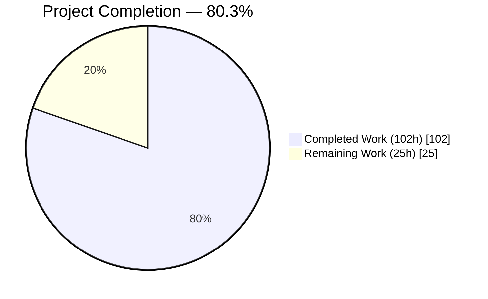
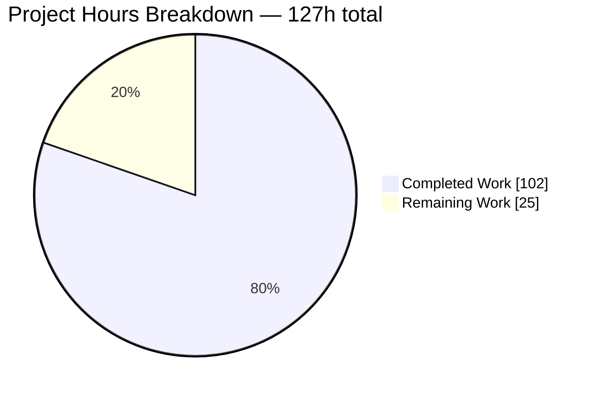
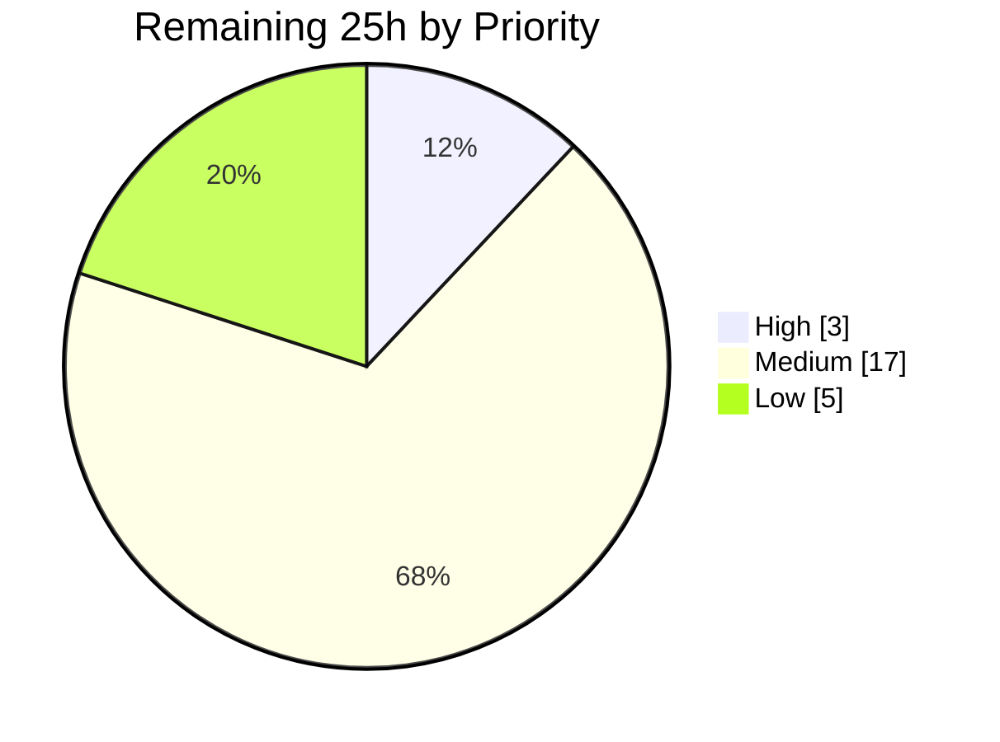
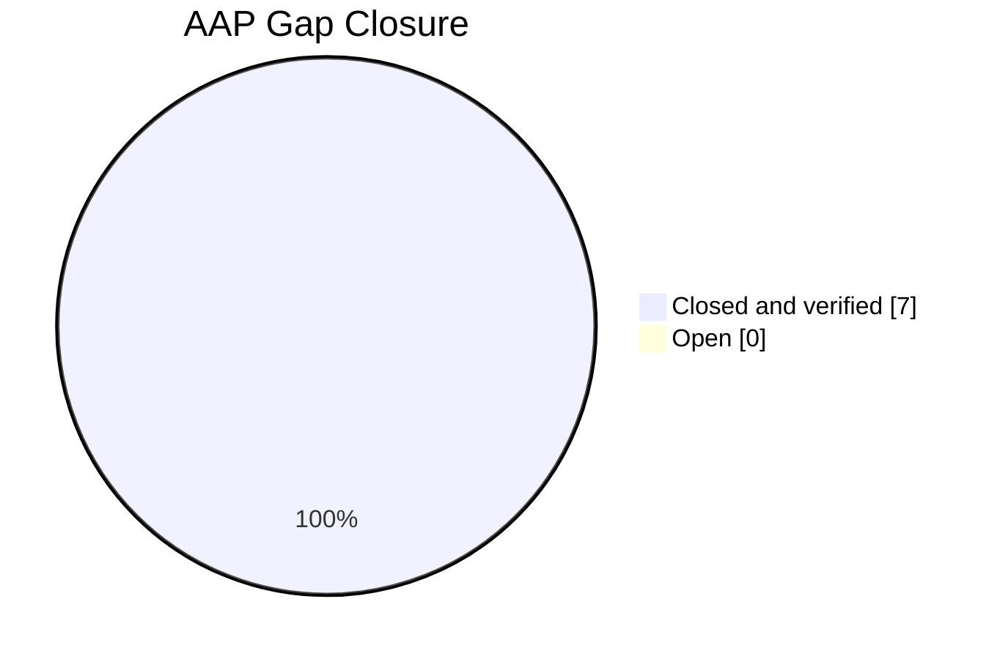

# 1. Executive Summary

## 1.1 Project Overview

`hello_world` is a Node.js tutorial HTTP service, now built on Express.js, serving two plain-text endpoints on `127.0.0.1:3000`: `GET /` returns the project's original greeting, `GET /evening` returns `Good evening`. Its audience is developers learning Express and anyone integrating against those endpoints. Scope is deliberately narrow — one CommonJS entrypoint, one production dependency, no build step, no database, no exposure beyond loopback. This work completed and hardened that feature: loopback binding restored, framework banner suppressed, every entrypoint code line commented, the failing test placeholder replaced with a working zero-dependency suite, the runtime pinned, advisories cleared, README made byte-accurate.

## 1.2 Completion Status



| Metric | Value |
|---|---|
| **Total Hours** | **127** |
| Completed Hours (AI + Manual) | 102 (AI 102 + Manual 0) |
| Remaining Hours | 25 |
| **Percent Complete** | **80.3%** |

102 ÷ 127 × 100 = **80.3%** of planned and path-to-production scope. Completed = Dark Blue `#5B39F3`; Remaining = White `#FFFFFF`.

## 1.3 Key Accomplishments

- ✅ `GET /` — 200, `text/plain; charset=utf-8`, 14 bytes, trailing newline intact.
- ✅ `GET /evening` — 200, same type, 12 bytes, no trailing newline.
- ✅ Socket binds `127.0.0.1` only; the routable address refuses the port.
- ✅ No `X-Powered-By`, no `Server` header, on any response.
- ✅ A failed bind reports on stderr and exits non-zero, never announcing readiness.
- ✅ `npm test` runs a real endpoint suite — 4 tests, 4 passing, zero added dependencies.
- ✅ `npm audit` reports zero vulnerabilities, `express` held at 5.2.1.
- ✅ Every code line of `server.js` is commented — audited at 19 of 19.

## 1.4 Critical Unresolved Issues

| Issue | Impact | Owner | ETA |
|---|---|---|---|
| Declared Node range (`^20.20.2 \|\| >=22.12.0`, `.nvmrc` `20.20.2`) differs from the project's original "Node 18 or higher" prerequisite | Needs a decision, not a fix. The range and the test command are coupled, so moving one requires moving the other (see §5.2 #1) | Tech Lead / Platform | 2h |
| `server.js` carries a fourth substantive change — the listen-callback error branch — and is 67 lines / 19 code lines against a planned 53 / 14 | Behaviour is correct and Rule 1 still holds; the planned arithmetic no longer describes the file and needs sign-off (§5.2 #4) | Tech Lead | 1h |
| `tests/server.test.js` is 1778 lines for four tests | Every part is load-bearing, but the footprint is far larger than planned; approve it or commission a trim that keeps all four guarantees (§5.2 #3) | Tech Lead | 6h |
| The bind-failure branch and the suite's diagnostics redaction have no automated guard | Both were exercised by hand; a future edit could regress either without any test failing | Backend Engineer | 5h |
| ~942 KB of transient binaries remain reachable in branch history (`.git` 13 MB vs a 12 MB tree) | Repository size only — the delivered tree is exactly the seven changed files (§5.2 #6) | Tech Lead / DevOps | 3h |
| `.nvmrc` pins `20.20.2`, a Node line past end of life | Runtime-level security fixes will not reach anyone who follows the pin; the declared range already admits supported lines | DevOps | 3h |

## 1.5 Access Issues

**No access issues identified.** `npm ci` completes against the public npm registry with no authentication; no `.npmrc` exists at any level; no private or scoped packages are referenced; `process.env` appears zero times and no `.env` exists; no database, cache, queue or third-party service is involved. The only prerequisite is an unoccupied TCP port 3000.

## 1.6 Recommended Next Steps

1. **[High]** Adjudicate the declared Node range against the original "Node 18 or higher" prerequisite; if it moves, change `engines.node`, the lock-root mirror, `.nvmrc` and `README.md:11-16` together, then re-run `npm test`.
2. **[High]** Sign off `server.js` at 67 lines / 19 commented code lines, including the listen-callback error branch.
3. **[Medium]** Decide the endpoint suite's footprint — approve 1778 lines, or trim while keeping all four guarantees.
4. **[Medium]** Move the pinned runtime off the end-of-life Node 20 line, then re-run `npm ci`, `npm test`, `npm audit`.
5. **[Medium]** Add automated coverage for the bind-failure branch and a guard against absolute paths in failure output.

# 2. Project Hours Breakdown

## 2.1 Completed Work Detail

| Component | Hours | Description |
|---|---|---|
| Endpoint verification suite (`tests/server.test.js`) | 34 | Zero-dependency suite wired to `npm test`: 4 tests, 14 strict assertions, a pre-spawn proof that port 3000 is free, readiness read from the child's own stdout, liveness bracketing around every request, a bounded SIGTERM → SIGKILL → deadline teardown that releases listeners and handles, redaction of every diagnostic that could carry a filesystem path, and an in-file front end that runs the suite under `node --test` and filters the runner's own report. |
| Verification and acceptance programme | 22 | Full acceptance sweeps of all fifteen criteria on Node 20.20.2 with portability confirmation on 22.23.2; roughly 1,100 assertions spanning HTTP contracts, kernel socket tables, process lifecycle, adversarial input, HTTP-protocol robustness, supply-chain posture and install determinism. |
| Dependency security refresh (`package-lock.json`) | 8 | Lockfile-only regeneration closing six published advisories — `path-to-regexp` 8.3.0 → 8.4.2, `qs` 6.14.0 → 6.15.3, `body-parser` 2.2.1 → 2.3.0 — with `express` held at 5.2.1 and `dependencies.express` still exactly `^5.2.1`. Patched versions confirmed in the physically installed tree, including `path-to-regexp` nested under `router`. |
| Documentation (`README.md`) | 7 | Rewritten to describe only verified behaviour: declared runtime range with its end-of-life disclosure, loopback-only note and the exact startup line, a Testing section naming all four tests and the five contracts they check, a byte-precise endpoint table explaining the one-byte newline asymmetry, and curl examples with a `wc -c` verification block. |
| Express application hardening (`server.js`) | 6 | Loopback-only binding restored via a `host` constant passed as the second argument to `app.listen`, with the startup log interpolating it to render the identical string; `app.disable('x-powered-by')` placed before any route registration so the framework banner is never written. |
| Per-line commented entrypoint + compliance audit | 6 | Every code line of `server.js` given its own explanatory trailing comment, with the four JSDoc blocks retained and rewritten as timeless contracts and both `@returns` tags corrected; compliance measured by a mechanical audit that skips blank and comment lines and masks string literals. |
| npm script surface and runtime declaration (`package.json`, `.nvmrc`) | 6 | `engines` declaring `node ^20.20.2 \|\| >=22.12.0` and `npm >=10.0.0`, mirrored into the lock root by tooling; `.nvmrc` pinning the verified runtime; a `test` script that works on every supported Node line; `main` and `start` left untouched. |
| Repository hygiene and change-set discipline | 5 | `.gitignore` limited to the four authorised exclusion groups and verified not to hide any tracked or in-scope path; the delivered diff confined to exactly the seven changed files, with the two reference documents and all seven unrelated tracked artifacts byte-unchanged. |
| Response-contract confirmation | 5 | Both bodies verified at byte level with `wc -c`, `od -c` and `cmp` against golden fixtures, and proven unchanged by comparing the framework-computed weak ETags before and after the work — a body hash, not a visual diff. |
| Listen-failure reporting (`server.js`) | 3 | The listen callback inspects the error Express hands it: a failed bind writes the cause to stderr, sets a non-zero exit code and returns before the readiness line, so a server holding no socket cannot report success. |
| **Total** | **102** | Matches Completed Hours in §1.2. |

## 2.2 Remaining Work Detail

| Category | Hours | Priority |
|---|---|---|
| Runtime-range adjudication and four-place alignment | 2 | High |
| Sign-off on the entrypoint's fourth delta and revised line arithmetic | 1 | High |
| Endpoint-suite footprint decision (approve or trim) | 6 | Medium |
| Automated coverage for the bind-failure branch | 3 | Medium |
| Standing guard against absolute paths in failure output | 2 | Medium |
| Branch-history residue decision (accept or coordinated rewrite) | 3 | Medium |
| Move the pinned primary runtime to a supported Node line and re-verify | 3 | Medium |
| Reference-document reconciliation under `blitzy/documentation/` | 3 | Low |
| Working-tree cleanup — seven untracked screenshots | 0.5 | Low |
| Advisory re-check cadence on any dependency touch | 1.5 | Low |
| **Total** | **25** | Matches Remaining Hours in §1.2 and the §7 pie chart. |

## 2.3 Hours Reconciliation

| Check | Result |
|---|---|
| §2.1 completed total | 102h |
| §2.2 remaining total | 25h |
| §2.1 + §2.2 | 127h — equals Total Hours in §1.2 ✅ |
| Completion formula | 102 ÷ 127 × 100 = 80.3% — the figure used in §1.2, §7 and §8 ✅ |
| §7 pie values | Completed 102 / Remaining 25 — identical to §1.2 ✅ |

Confidence: **High** for the seven closed gaps and the ten completed components, each of which is backed by a command whose output was observed directly. **Medium** for the footprint-trim estimate, which depends on a decision that has not been taken yet.

# 3. Test Results

The project's whole automated test surface is `tests/server.test.js`, run by `npm test`. Every number below was observed by executing the suite and the supporting commands directly on Node v20.20.2 / npm 10.8.2 at the repository root.

| Area / Category | Framework | Tests | Passed | Failed | Coverage | What This Proves |
|---|---|---|---|---|---|---|
| Endpoint contracts — `GET /`, `GET /evening` | `node:test` (built-in) | 2 | 2 | 0 | Both routes, byte level | Each endpoint answers 200 with `text/plain; charset=utf-8` and a body of exactly 14 and 12 bytes, the newline asymmetry included. |
| Loopback-only exposure | `node:test` + `node:net` | in test 1 | pass | 0 | The single listener | While `127.0.0.1:3000` is serving, every address outside the binding refuses the port — a wildcard bind fails this. |
| Response-header hardening | `node:test` | 1 | 1 | 0 | Both routes | Neither response advertises the framework via `x-powered-by`. |
| Unmatched-route handling | `node:test` | 1 | 1 | 0 | Router fallthrough | An unregistered path reaches Express's default handler and answers 404. |
| Suite totals (`npm test`) | `node:test` | 4 | 4 | 0 | 14 strict assertions, 0 skipped / 0 todo | The delivered contracts hold end to end: `# tests 4 / # pass 4 / # fail 0`, exit 0, 188 ms. |
| Cross-runtime portability | `node:test` | 4 | 4 | 0 | Node 20.20.2 and 22.23.2 | The suite and the server behave identically on both supported Node lines. |
| Occupied-port behaviour (deliberate negative run) | `node:test` | 4 | 0 | 4 as designed | Pre-flight refusal path | With port 3000 held by something else, the run refuses in 304 ms with an explanatory message and exit 1 — never a hang and never a green that proved nothing. Its output carries no absolute path and no raw stack frame. |
| Static and dependency gates | `node --check`, `npm ci`, `npm audit`, `npm ls` | 5 checks | 5 | 0 | Both JS files, full graph | Both files parse; a clean-room install adds 67 packages / audits 68; `express@5.2.1` is the only direct dependency; the tree reports zero vulnerabilities. |

Every row except the deliberate negative run reports a clean pass. That negative run is included because a suite that cannot fail correctly proves nothing: the four failures there are the expected outcome of pointing the suite at a port it does not own.

**Not Covered** — delivered behaviour that no automated test exercises. A human should confirm each before release:

- **The bind-failure branch** (`server.js:60-67`). Its stderr message, non-zero exit and suppression of the readiness line were driven by hand — a second `npm start` against a live server exits 1 with `listen EADDRINUSE: address already in use 127.0.0.1:3000` and no readiness output — but no committed test asserts it, so a regression here would pass the suite.
- **Diagnostics redaction.** A deliberately failing run is clean today, but nothing fails if a future edit puts an absolute path or a raw frame back into failure output. The two-command reproduction is documented at `README.md:80`.
- **`.nvmrc`.** No test or tool in this project reads it, and no version manager is installed; it was verified only by byte inspection and by agreeing with `engines.node` and the README.
- **The `engines` rejection path.** Only the accepting path is exercised, because both available runtimes satisfy the declared range. Satisfaction for Node 24 and 26 rests on semver evaluation rather than on running them.
- **README prose.** Every command it contains was executed and every number re-derived from source, but no automated check guards it against future drift.
- **Deep harness branches.** The signal-delivery-refused path, the teardown-error path, the response-cancellation rejection, the spawn-failure branch of the front end and the non-POSIX signal fallback are all guarded and reviewed, but cannot be provoked in a normal Linux environment.
- **Sustained load.** Concurrency was exercised only as a bounded anti-hang check (up to 50 parallel requests, all 200); there is no soak or load test.

# 4. Runtime Validation and UI Verification

The server was started, driven and stopped directly; every line below records what was observed at runtime, not what the source implies.

- ✅ **Start-up** — `npm start` prints exactly `Server running at http://127.0.0.1:3000/` on stdout (41 bytes, single terminator under `cat -A`) with stderr empty.
- ✅ **`GET /`** — 200, `text/plain; charset=utf-8`, `Content-Length: 14`, `od -c` ends `!  \n`, ETag `W/"e-YP3pwjELDUytTauNEmsEOH77ook"` — the same weak ETag the pre-Express server produced, so the body is provably byte-identical.
- ✅ **`GET /evening`** — 200, same content type, `Content-Length: 12`, `od -c` terminates at `g` with no newline byte, ETag `W/"c-ak9U7+O0BzTfZwhjDzBQxAnHCaU"`.
- ✅ **Loopback-only binding** — `/proc/net/tcp` shows one LISTEN row at `0100007F:0BB8`; `/proc/net/tcp6` shows no port-3000 row; a request to the host's routable address `10.76.1.21:3000` is refused (curl exit 7, HTTP 000) while `127.0.0.1` answers 200.
- ✅ **Header hardening** — zero `x-powered-by` occurrences on both routes, and no `Server` header at all; confirmed across method and route combinations, 304 revalidations and 404 responses.
- ✅ **Unmatched routes and methods** — unregistered paths answer 404 with Express's default page carrying `Content-Security-Policy: default-src 'none'` and `X-Content-Type-Options: nosniff`; POST, PUT, PATCH, DELETE and TRACE answer 404, never 5xx; HEAD answers 200 and OPTIONS reports `GET, HEAD`.
- ✅ **Bind-failure path** — a second `npm start` while the first holds the port exits 1 with `Failed to start server at http://127.0.0.1:3000/: listen EADDRINUSE: address already in use 127.0.0.1:3000` on stderr, no readiness line on stdout, and the first server unaffected.
- ✅ **Input inertness** — script, SQL, template-expression, prototype-pollution, null-byte, CRLF and traversal payloads in query strings and paths leave both bodies byte-exact with nothing reflected; the 404 page percent-encodes the echoed path, and a browser session recorded no dialog, no executable script and no console error originating from either endpoint.
- ✅ **Install and audit** — a clean-room `npm ci` adds 67 packages and audits 68 with zero vulnerabilities, repeatably and with the manifest and lockfile byte-stable; `npm ls --depth=0` reports `express@5.2.1` alone.
- ⚠ **Runtime line** — the server and suite were driven on Node 20.20.2 and confirmed on 22.23.2. Node 18, which the project's original prerequisite named, was never exercised: it is excluded by the declared `engines` range and is not installable here, so that floor rests on the declared range rather than on observed behaviour.

**Not exercised at runtime.** There is no user interface to verify — both endpoints emit `text/plain` and the project ships no markup, template engine, stylesheet or client-side asset, so no screen, form or navigation flow exists to drive. Nothing in the project reaches an external service, database, cache or queue, so there is no integration to exercise beyond the public npm registry used at install time. Node 24 and 26, which the declared range admits, were not run.

# 5. Compliance & Quality Review

## 5.1 Compliance Matrix

Each row records where the deliverable stands now, against the benchmark it was measured by.

| # | Deliverable | Benchmark | Status | Evidence |
|---|---|---|---|---|
| 1 | Express is a real, exercised dependency | Declared, locked, installable and owning the listener | ✅ PASS | `package.json:17` `^5.2.1`; `server.js:14,16,60`; `npm ls --depth=0` → `express@5.2.1` only |
| 2 | `GET /evening` emits `Good evening` | 200, plain text, exactly 12 bytes, no trailing newline | ✅ PASS | `server.js:40-42`; observed `Content-Length: 12`, `od -c` ends `g` |
| 3 | `GET /` preserved byte-for-byte | 14 bytes including the trailing newline | ✅ PASS | `server.js:29-31` response expression unchanged; ETag identical to the pre-Express baseline |
| 4 | Loopback-only listener | Binds `127.0.0.1` and refuses every other address | ✅ PASS | `server.js:19,60`; single `/proc/net/tcp` LISTEN row; routable address refused |
| 5 | Framework banner suppressed | No `x-powered-by` on any response | ✅ PASS | `server.js:17` precedes both routes; zero occurrences observed |
| 6 | Executable proof of both endpoint contracts | A real suite wired to `npm test` | ✅ PASS | `tests/server.test.js`; `# tests 4 / # pass 4 / # fail 0` |
| 7 | Dependency tree free of known vulnerabilities | `npm audit` reports zero | ✅ PASS | Zero vulnerabilities; `path-to-regexp` 8.4.2, `qs` 6.15.3, `body-parser` 2.3.0 confirmed on disk |
| 8 | Runtime expectation machine-enforceable | `engines` present and mirrored in the lock root | ✅ PASS (with an open decision) | `package.json:12-15`; lock root identical; `.nvmrc` `20.20.2`; declared range differs from the original prerequisite — §5.2 #1 |
| 9 | Installed dependencies not committable | `git status` never lists `node_modules` | ✅ PASS | `.gitignore:2`; `git check-ignore -v node_modules/` matches |
| 10 | Rule 1 — every code line of the entrypoint commented | Mechanical audit reports zero uncommented code lines | ✅ PASS | 19 code lines examined, 0 without an inline comment |
| 11 | Rule 2 — `rule-04-08-01` | Honour the rule as written | ✅ PASS | The rule's body is empty; no requirement was invented on its behalf |
| 12 | Architectural constraints preserved | Single-file CommonJS, hardcoded configuration, no added middleware or frameworks | ✅ PASS | `server.js`: `process.env` 0, `module.exports` 0, `app.use` 0, one `require`; no `devDependencies`; all suite imports are `node:` built-ins |

## 5.2 AAP & Rule Divergences and Gaps

| # | What the AAP/Rule Required | What Was Delivered Instead | Why It Diverged | Impact | Remediation |
|---|---|---|---|---|---|
| 1 | `engines.node` `">=18.0.0"` and `.nvmrc` `18` | `^20.20.2 \|\| >=22.12.0` and `20.20.2` (`package.json:13`, `.nvmrc:1`, lock root, `README.md:11`) | Sanctioned — the supported-runtime policy this project is built under excludes Node 18 and sets floors of 20.20.2 on the 20.x line and 22.12.0 on 22.x | Nothing at runtime; the declared floor is simply higher than the original prerequisite | Adjudicate, then align all four places together if the decision moves them (§1.4) |
| 2 | `"test": "node --test tests/"` | `"test": "node tests/server.test.js"` (`package.json:8`) | The directory form works only on Node 20; from Node 22 the positional argument is read as a glob and resolves to nothing | Positive — `npm test` now runs on every supported line | None required |
| 3 | "The smallest possible artifact" — one file, four assertions | `tests/server.test.js`, 1778 lines, 4 tests, 14 assertions | Four independent guarantees all had to live in the one file the planned change set permits | Zero dependencies preserved; maintenance surface far larger than planned | Approve the footprint or commission a trim that keeps all four guarantees |
| 4 | `server.js` frozen at three substantive deltas, 53 lines / 14 code lines | Four deltas, 67 lines / 19 code lines (`server.js:60-67`) | Express installs the listen callback as the socket's error handler, so only a callback that inspects its argument can distinguish a bound socket from a failed bind | Behaviour strictly better; Rule 1 still holds at 19 of 19 | Sign off the delta count and the revised arithmetic |
| 5 | Five `node:` built-ins in the suite | Eight (`tests/server.test.js:56-63`) | The loopback guard needs TCP dialling and interface enumeration; the redaction filter needs a stream transform and a multi-byte-safe line splitter | None — still zero third-party dependencies and no `devDependencies` | None required |
| 6 | A seven-file change set, with no other tracked file changed | The delivered tree is exactly those seven files, but ~942 KB of transient binaries remain reachable in branch history | History-rewriting git operations are not permitted on a published branch, so the files left the tree by forward deletion | `.git` is 13 MB against a 12 MB working tree; no effect on the delivered code | Accept, or schedule a coordinated rewrite with everyone who has cloned the branch |
| 7 | All validation performed on Node 18.20.8 | All validation performed on Node 20.20.2, with portability confirmed on 22.23.2 | Same policy as #1 — that runtime is excluded here and is not installable | The Node 18 floor is asserted from the declared range rather than exercised | Run `npm ci && npm test` once on Node 18 only if that floor is genuinely intended |

**#1 — Declared Node runtime range.** The original prerequisite was an open lower bound, "Node.js v18 or higher", inherited from the pre-Express README and corroborated by Express 5.2.1's own `engines: { node: ">= 18" }`. The delivered manifest instead declares `^20.20.2 || >=22.12.0` (`package.json:13`), mirrored byte-for-byte into the lock root and echoed at `README.md:11`, with `.nvmrc` pinning `20.20.2`. The reason is the supported-runtime policy this project is built under: it excludes Node 18 outright, that runtime is not installed in the build environment, and no version manager exists there to provision it. Operationally nothing is lost — the range accepts every currently supported line — but the declared floor is higher than the text a reader may have in hand. Decide which stands. If Node 18 support is wanted, `engines.node`, the regenerated lock-root mirror, `.nvmrc` and `README.md:11-16` must move together, and `npm test` re-run.

**#2 — Test command form.** The plan named `node --test tests/`, which relies on a positional argument being searched as a directory — the Node 20 runner's contract. From Node 22 the same argument is a glob pattern, so that command exits 1 with `MODULE_NOT_FOUND` on any newer line the declared range admits. The delivered `node tests/server.test.js` (`package.json:8`) names the file, which behaves identically on every supported line, and routes the run through a front end inside the same file that spawns `node --test` and filters the runner's own report — the only place the runner's `location` and `stack` fields can be reached. The runner is still Node's built-in one, its exit status passes through untouched, and the four-test count is still read from its own summary. No action needed; `node --test tests/server.test.js` remains the documented direct equivalent.

**#3 — Endpoint-suite footprint.** The plan called for the smallest artifact that could discharge the endpoint-verification gate: one file, four assertions, no dependency. The delivered file is 1778 lines. Every part of the excess is load-bearing. The pre-spawn proof that port 3000 is free and the liveness bracketing around each request together make a green run impossible unless the process under test answered it. The bounded teardown stops a child that will not die from holding the port or the runner. The loopback guard is the only executable check on the binding, and it is decisive: with the host argument dropped from `app.listen`, it fails while the other three tests pass. The redaction filter keeps filesystem layout out of failure logs. Trimming any one of them removes a guarantee the suite currently provides. The dependency constraint was honoured literally — `npm ls --depth=0` still shows one package. Approve the footprint, or commission a trim that preserves all four guarantees explicitly.

**#4 — Fourth delta in the entrypoint.** The plan froze `server.js` at three changes and recorded a 53-line file with 14 code lines. The file is 67 lines with 19 code lines because the listen callback takes the error Express passes it (`server.js:60-67`): on a failed bind it writes the cause to stderr, sets `process.exitCode = 1` and returns before the readiness line. That branch is what makes a failed bind observable at all — Express installs the same callback as the socket's error handler, so a callback that ignores its argument cannot tell a bound socket from an `EADDRINUSE`, and prints readiness either way. `process.exitCode` rather than `process.exit(1)` avoids truncating pending output. Rule 1 is unaffected: the audit reports 19 of 19 commented. Confirm the branch stays and record 67 / 19 as the current figures.

**#5 — Built-in module surface.** The suite was planned around `node:test`, `node:assert/strict`, `node:child_process`, `node:path` and global `fetch`. It also imports `node:net`, `node:os`, `node:stream` and `node:string_decoder` (`tests/server.test.js:56-63`). `net` dials the addresses outside the binding at the TCP layer, so a foreign listener is never handed a request; `os` enumerates this host's own addresses so the check can never walk an empty list; `stream` and `string_decoder` implement the redaction filter without splitting a multi-byte character across two chunks. All four ship with Node, so the exclusion of third-party test frameworks holds literally: the manifest declares no `devDependencies` and `npm ls --depth=0` shows `express@5.2.1` alone. No action required.

**#6 — Change-set excursion and its history residue.** The plan fixed an exhaustive seven-file change set and required that no other tracked file change. Five browser-validation binaries totalling 941,799 bytes were briefly tracked under `blitzy/` and then removed. The delivered tree is correct — `git ls-files` shows nothing under `blitzy/screenshots` or `blitzy/screen_recordings`, and the diff against the base is exactly the seven intended paths — but because rebase, reset and force are not permitted on a published branch, those files left the tree by forward deletion and the blobs stay reachable. `.git` therefore measures 13 MB against a 12 MB working tree. Separately, seven untracked PNGs sit under `blitzy/screenshots/` in the working tree; they affect nothing and can simply be deleted. Accept the residue or schedule a deliberate rewrite.

**#7 — Validation runtime.** Every check was to run on Node 18.20.8. All of them ran on Node 20.20.2, with the suite and both endpoints additionally confirmed on 22.23.2. The cause is the same policy as #1: that runtime is excluded and absent, and the delivered `engines` range does not admit it, so running on it would contradict the project's own declaration. The practical consequence is narrow — both response ETags came out identical to the values recorded before this work, which is strong evidence the behaviour is runtime-independent here — but the Node 18 floor itself is asserted from the declared range and semver rather than exercised. If that floor matters, run `npm ci && npm test` once on a Node 18.x runtime where it is permitted.

# 6. Risk Assessment

Forward-looking risks only — what could still go wrong from here.

| Risk | Category | Severity | Probability | Mitigation | Status |
|---|---|---|---|---|---|
| `.nvmrc` pins `20.20.2`, a Node line past end of life, so runtime-level security fixes never reach anyone who follows the pin | Technical | Medium | High | The declared range already admits 22.12.0, 24 and 26, and the suite is verified on 22.23.2; move the pin, then re-run `npm ci`, `npm test` and `npm audit`. Disclosed at `README.md:14` | Open |
| No automated test covers the bind-failure branch, so a regression could restore a server that reports readiness while holding no socket | Technical | Medium | Medium | The branch was driven by hand (exit 1, empty stdout, `EADDRINUSE` on stderr); add a check when the four-test contract is next revisited | Open |
| Zero-advisory status is a point-in-time result: `express@5.2.1` pins several transitive ranges, so a new advisory against one of them needs another lockfile refresh | Security | Medium | Medium | Run `npm audit` on any dependency touch; the lockfile-only refresh pattern is proven to clear advisories without touching the manifest. `send@1.2.0` and `serve-static@2.2.0` sit one patch behind latest but are advisory-free and unreachable at runtime | Open — monitoring |
| Nothing fails if a future edit reintroduces absolute paths or raw stack frames into failure output | Security | Low | Medium | A failing run currently shows `<repo>`-relative locations and collapsed frame counts; the two-command reproduction is documented at `README.md:80` | Open |
| Port 3000 is a hardcoded constant with no override, so only one instance can run per host and the suite refuses to start when anything else holds it | Technical | Low | High | Deliberate (`server.js:19-20`); contention fails loudly in ~300 ms with an explanatory message rather than testing a foreign listener. Serialise runs on shared machines | Accepted by design |
| `tests/server.test.js` is 1778 lines and carries two roles — the suite and the redacting front end — a maintenance surface far larger than the 67-line server | Technical | Low | Medium | One file, zero dependencies, both roles documented in the header and at the single dispatch point | Open — footprint decision pending |
| No continuous integration, container image or process supervision exists, so the gates are run by hand and nothing restarts the process if it exits | Operational | Low | Medium | `npm ci`, `npm test`, `npm audit` and `npm start` are documented and reproduce exactly as written; all four were run in this environment | Accepted by design |
| ~942 KB of transient binaries remain reachable in branch history, inflating the repository against its working tree | Integration | Low | Low | The delivered tree is exactly the seven changed files; removal needs a coordinated rewrite of a published branch | Open — accepted with a caveat |

# 7. Visual Project Status

### Overall Progress



Colours: **Completed Work = Dark Blue `#5B39F3`**, **Remaining Work = White `#FFFFFF`**.

### Remaining Work by Priority



### Remaining Hours by Category

| Category | Hours | Share of the remaining 25h |
|---|---|---|
| Endpoint-suite footprint decision | 6 | 24% |
| Test-coverage gaps (bind-failure branch, redaction guard) | 5 | 20% |
| Runtime decisions (range adjudication, move off the end-of-life pin) | 5 | 20% |
| Repository history and working-tree cleanup | 3.5 | 14% |
| Reference-document reconciliation | 3 | 12% |
| Entrypoint sign-off | 1 | 4% |
| Advisory re-check cadence | 1.5 | 6% |
| **Total** | **25** | **100%** |

### Gap Closure and Acceptance



All fifteen acceptance criteria pass, and all seven identified gaps are closed. The 25 remaining hours are decisions, coverage additions and path-to-production hygiene — not unfinished functionality.

# 8. Summary & Recommendations

The project asked for Express.js in a Node.js tutorial server and a second endpoint returning `Good evening`, with the original `Hello world` endpoint left alone. Both endpoints now work exactly as specified and are proven at byte level: `GET /` returns 14 bytes ending in a newline, `GET /evening` returns 12 bytes without one, and the framework-computed weak ETags on both routes are identical to the values the pre-Express server produced — a body hash, not a visual comparison. Around those two contracts, this engagement closed the seven gaps that separated the repository from a finished feature: loopback-only binding restored, the framework banner suppressed, a failed bind now reported instead of announced, every code line of the entrypoint commented and mechanically audited, the failing test placeholder replaced with a working zero-dependency suite, the supported runtime pinned and declared, `node_modules` kept out of version control, and six published advisories cleared from the dependency tree with `express` held at 5.2.1 and the manifest range untouched.

The verification behind those claims is unusually thorough for a project this small. All fifteen acceptance criteria pass, and each was re-observed directly rather than taken on trust: the suite reports `# tests 4 / # pass 4 / # fail 0` in 188 ms on Node 20.20.2 and again on 22.23.2; a clean-room `npm ci` adds 67 packages and audits 68 with zero vulnerabilities; the kernel socket table shows a single loopback listener with the host's own routable address refusing the port; and roughly 1,100 assertions across HTTP contracts, process lifecycle, adversarial input, HTTP-protocol robustness, supply-chain posture and install determinism found no functional defect. The suite also fails correctly: with port 3000 occupied it refuses to run in 304 ms with an explanatory message, disclosing no filesystem path.

**The project is 80.3% complete** against the plan's scope — 102 of 127 hours. The 25 hours outstanding contain no broken functionality. Three hours are sign-offs a human owns: whether the declared Node range (`^20.20.2 || >=22.12.0`) or the original "Node 18 or higher" prerequisite stands, and whether the entrypoint's fourth change and its revised 67-line / 19-code-line shape are accepted. Six hours are a decision on the endpoint suite's 1778-line footprint, every part of which is load-bearing but which is far larger than planned. Five hours close the two real coverage gaps — the bind-failure branch and the diagnostics redaction, both exercised by hand and neither guarded by a test. The remaining eleven hours are path-to-production hygiene: moving the pinned runtime off an end-of-life Node line, deciding what to do about roughly 942 KB of transient binaries still reachable in branch history, reconciling two stale reference documents, clearing seven untracked screenshots, and making `npm audit` a standing step on any dependency touch.

The critical path is short and sequential. Settle the runtime question first, because the declared range and the test command are coupled — widening one without the other silently breaks test discovery. Then sign off the entrypoint and the suite footprint, so the delivered shape is the recorded shape. Then move the pin to a supported Node line and re-run the three gates. Success is measurable and already defined: `npm ci` clean, `npm audit` at zero, `npm test` at four passing, both endpoints at 14 and 12 bytes, and the routable address still refusing port 3000.

**Production readiness for its stated scope: ready, with two caveats.** For what this project is — a loopback-only, plain-text, two-route tutorial — the delivered code is sound: it discloses nothing about its stack or filesystem, treats hostile input as inert data, logs no sensitive value, installs deterministically from a lockfile with zero advisories, and both contracts survived every probe byte-for-byte. The caveats are the pinned end-of-life runtime and the two unguarded branches; neither is a defect in what was built, and both are closed by the tasks above. Anything beyond the tutorial's scope — a non-loopback host, a process manager, containerisation, continuous integration, a health endpoint or environment-driven configuration — was deliberately declined by the plan and remains a separate engagement.

# 9. Development Guide

Every command below was executed in this environment and produced the output shown. Run all of them from the repository root.

### System Prerequisites

| Requirement | Value | How to check |
|---|---|---|
| Node.js | `^20.20.2 \|\| >=22.12.0` — verified on 20.20.2 and 22.23.2 | `node --version` |
| npm | `>=10.0.0` — verified on 10.8.2 and 11.18.0 | `npm --version` |
| Free TCP port | 3000, hardcoded in `server.js:19-20` | see Troubleshooting below |
| Network | Public npm registry for install only | `npm ping` |
| Everything else | Nothing — no database, cache, queue, container, environment variable or secret | — |

```bash
node --version   # v20.20.2
npm --version    # 10.8.2
```

There is no build, transpile or bundle step. `.nvmrc` names `20.20.2` for version managers; note that this line is past end of life, and the declared range also accepts 22.12.0 and newer.

### Environment Setup

No environment variables and no `.env` file are used — `process.env` appears zero times in the application, and host and port are literal constants. No `.npmrc` is shipped, so no registry configuration or token is required.

### Dependency Installation

```bash
# Reproducible install from the lockfile (preferred)
npm ci
# → added 67 packages, and audited 68 packages
# → found 0 vulnerabilities

# The README-documented equivalent; leaves both manifests byte-identical
npm install
```

Confirm the dependency surface and the advisory state:

```bash
npm ls --depth=0
# → hello_world@1.0.0
# → └── express@5.2.1

npm audit
# → found 0 vulnerabilities
```

### Application Startup

```bash
npm start
# > hello_world@1.0.0 start
# > node server.js
# Server running at http://127.0.0.1:3000/
```

That line is the readiness signal — the endpoint suite waits for it byte-for-byte. Stop the server with Ctrl-C.

To leave it running in this shell and stop it later by its own process id:

```bash
# start in the background; its output still arrives in this terminal
setsid npm start &
sleep 2

# stop only the node process started from this directory
for p in /proc/[0-9]*; do
  pid=${p#/proc/}
  if tr '\0' ' ' < "$p/cmdline" 2>/dev/null | grep -q 'node server.js' \
     && [ "$(readlink "$p/cwd" 2>/dev/null)" = "$(pwd)" ]; then
    kill "$pid"
  fi
done
```

### Verification Steps

```bash
# 1. Syntax — the project's whole compilation surface
node --check server.js
node --check tests/server.test.js      # both exit 0 with no output

# 2. Endpoint verification suite
npm test
# → # tests 4 / # suites 0 / # pass 4 / # fail 0 / # duration_ms ~188

# 3. Same suite under the runner directly, with unredacted frames
node --test tests/server.test.js
# → # tests 4 / # pass 4 / # fail 0

# 4. Runtime declaration is satisfied
npm install --dry-run                  # no EBADENGINE, no engine warnings

# 5. Installed dependencies stay out of version control
git check-ignore -v node_modules/      # → .gitignore:2:node_modules/
```

### Example Usage

With the server running:

```bash
curl http://127.0.0.1:3000/
# Hello, World!            (14 bytes, ending in one newline byte)

curl http://127.0.0.1:3000/evening
# Good evening             (12 bytes, no trailing newline — your prompt
#                           lands on the same line; that is the terminal)

curl -s http://127.0.0.1:3000/ | wc -c          # 14
curl -s http://127.0.0.1:3000/evening | wc -c   # 12

curl -i http://127.0.0.1:3000/
# HTTP/1.1 200 OK
# Content-Type: text/plain; charset=utf-8
# Content-Length: 14
# ETag: W/"e-YP3pwjELDUytTauNEmsEOH77ook"

curl -o /dev/null -w '%{http_code}\n' http://127.0.0.1:3000/no-such-route
# 404
```

Confirm the loopback-only binding — a request to `127.0.0.1` alone cannot prove it, so check the socket table and dial an address outside the binding:

```bash
awk 'NR>1 { split($2,a,":");
            if (a[2]=="0BB8" && $4=="0A") print "listening on", $2 }' /proc/net/tcp
# → listening on 0100007F:0BB8      (that is 127.0.0.1:3000)

curl -s --noproxy '*' --connect-timeout 3 \
     -o /dev/null -w '%{http_code}\n' "http://$(hostname -i | awk '{print $1}'):3000/"
# → 000, and curl exits 7 — the routable address refuses the port
```

### Troubleshooting

- **`npm test` fails immediately with "Refusing to start: http://127.0.0.1:3000 is already in use".** Something else holds the port. That is the suite protecting you: it will not test a server it did not start. Free the port and re-run. Expect the failure in roughly 300 ms — it is never a hang.
- **`npm start` exits 1 with `listen EADDRINUSE: address already in use 127.0.0.1:3000`.** Same cause. Note that no readiness line is printed, so a script watching stdout will not be misled.
- **Finding what holds port 3000** (`ss`, `netstat` and `lsof` are not installed here):

  ```bash
  awk 'NR>1 { split($2,a,":");
              if (a[2]=="0BB8" && $4=="0A") print "held; socket inode", $10 }' /proc/net/tcp
  # then map that inode to a pid
  for f in /proc/[0-9]*/fd/*; do
    [ "$(readlink "$f" 2>/dev/null)" = "socket:[INODE]" ] && echo "$f"
  done
  ```

- **You backgrounded `npm start`, stopped it, and the port is still held.** `npm start` spawns `node server.js` as a grandchild; stopping the npm wrapper leaves it running. Use the cmdline-and-cwd loop shown under Application Startup.
- **`/proc/net/tcp` still shows port 3000 after the server stops.** Rows in state `06` are kernel-owned `TIME_WAIT` entries that clear in about a minute. They do not prevent re-binding — only a state `0A` row does.
- **`npm warn EBADENGINE` on install.** Your Node version is outside `engines.node`. It is a warning, not a failure: this project ships no `.npmrc`, so `engine-strict` is off. Switch to a runtime in the declared range.
- **`Cannot find module '<path>/tests'`.** You ran `node --test tests/`. From Node 22 that argument is a glob, not a directory to search. Use `npm test`, or `node --test tests/server.test.js`.

# 10. Appendices

## A. Command Reference

| Command | Purpose | Observed result |
|---|---|---|
| `npm ci` | Reproducible install from the lockfile | added 67 packages, audited 68, 0 vulnerabilities |
| `npm install` | Documented equivalent; leaves manifests byte-identical | same package counts, no lockfile drift |
| `npm start` | Launch the server (`node server.js`) | `Server running at http://127.0.0.1:3000/` |
| `npm test` | Endpoint verification suite | `# tests 4 / # pass 4 / # fail 0`, ~188 ms |
| `node --test tests/server.test.js` | Same suite under the runner, unredacted frames | `# tests 4 / # pass 4 / # fail 0` |
| `node --check server.js` | Whole compilation surface for the entrypoint | exit 0, no output |
| `node --check tests/server.test.js` | Same for the suite | exit 0, no output |
| `npm audit` | Advisory check over the installed graph | found 0 vulnerabilities |
| `npm ls --depth=0` | Direct dependency surface | `hello_world@1.0.0 └── express@5.2.1` |
| `npm install --dry-run` | Runtime-declaration check | no `EBADENGINE`, no engine warnings |
| `git check-ignore -v node_modules/` | Confirm install output is ignored | `.gitignore:2:node_modules/` |

## B. Port Reference

| Port | Bound address | Used by | Configurable |
|---|---|---|---|
| 3000 | `127.0.0.1` only | The Express listener (`server.js:20,60`) | No — a literal constant, deliberately. Nothing reads the environment |

The suite targets the same fixed port, so only one instance can run per host.

## C. Key File Locations

| Path | Role |
|---|---|
| `server.js` | The entire application — 67 lines, two GET routes, one listener, every code line commented |
| `tests/server.test.js` | Endpoint verification suite and its redacting front end — 1778 lines, zero dependencies |
| `package.json` | `main`, `start`, `test`, `engines`, the sole dependency — 19 lines |
| `package-lock.json` | lockfileVersion 3, 68 records, the patched transitive graph |
| `.nvmrc` | Runtime pin for version managers — `20.20.2` |
| `.gitignore` | Four exclusion groups: `node_modules/`, `npm-debug.log*`, `.env`, `.DS_Store` |
| `README.md` | The project's human-facing contract — 117 lines |
| `blitzy/documentation/` | Two reference documents, not modified by this work and now stale in places (see §5.2 and §2.2) |

Not part of the application and untouched: `100Pages.pdf`, `demo.jpg`, `sample.doc`, `industry.csv`, `LoginTest.java` (a Java stub no toolchain compiles), `test.py.txt` and `test.txt.txt` (both empty).

## D. Technology Versions

| Component | Declared | Verified against |
|---|---|---|
| Node.js | `^20.20.2 \|\| >=22.12.0` | 20.20.2 and 22.23.2 |
| npm | `>=10.0.0` | 10.8.2 and 11.18.0 |
| express | `^5.2.1` | resolved 5.2.1 — the current `latest` |
| Module system | CommonJS, no build step | one `require`, zero `import`/`export` |
| Test runner | `node:test`, built in | zero `devDependencies` |

Patched transitive versions confirmed in the installed tree: `path-to-regexp` 8.4.2 (nested under `router` 2.2.0), `qs` 6.15.3, `body-parser` 2.3.0, `type-is` 2.1.0, `send` 1.2.0, `serve-static` 2.2.0, `finalhandler` 2.1.1.

## E. Environment Variable Reference

**None.** `process.env` appears zero times in the application, no `.env` file exists, and no `.npmrc` is shipped at any level. Host and port are literal constants in `server.js`. `.env` appears in `.gitignore` purely as a standing guard.

## F. Developer Tools Guide

- **Linting and formatting:** none configured, and none may be added without introducing a dependency. The standing mechanical gates are `node --check` on both JavaScript files, `JSON.parse` on both manifests, `git diff --check` for whitespace, and the per-line comment audit on `server.js` (skip blank and comment lines, mask string and template literals, treat statement-closing lines as code; the current result is 19 code lines examined, 0 uncommented).
- **Byte-level inspection:** `wc -c` for length, `od -c` for the terminating byte, `cmp` against a golden fixture for identity. This matters because the two contracts differ precisely in a trailing newline that ordinary terminal output hides.
- **Body-equivalence check:** the framework computes a weak ETag as a hash of the response body, so comparing `ETag` before and after a change proves the body did not move. The current values are `W/"e-YP3pwjELDUytTauNEmsEOH77ook"` for `/` and `W/"c-ak9U7+O0BzTfZwhjDzBQxAnHCaU"` for `/evening`.
- **Socket inspection:** `ss`, `netstat`, `lsof` and `xxd` are not installed; read `/proc/net/tcp` and `/proc/net/tcp6` directly. `0100007F:0BB8` is `127.0.0.1:3000`; state `0A` is LISTEN and `06` is `TIME_WAIT`.

## G. Glossary

| Term | Meaning here |
|---|---|
| Loopback-only binding | The listening socket is bound to `127.0.0.1` specifically, so the host's own routable address refuses the port. A request to `127.0.0.1` alone cannot prove this — the negative check can |
| Weak ETag | `W/"…"`, a hash of the response body that Express sets by default; used here as proof that a body did not change |
| Byte-exact contract | `GET /` returns 14 bytes ending in one LF (`0x0A`); `GET /evening` returns 12 bytes with none. The one-byte difference is deliberate and is the backward-compatibility commitment |
| Redacted diagnostics | Failure output in which the checkout is labelled `<repo>`, the interpreter `<node>`, any other absolute path `<path>`, and runs of stack frames replaced by a count |
| Front end (of the suite) | The role `tests/server.test.js` plays when run directly: it spawns `node --test` on itself and filters that runner's report, passing the exit status through untouched |
| Lockfile-only refresh | Regenerating `package-lock.json` with tooling so transitive versions move while the manifest's declared ranges stay untouched |
| `EBADENGINE` | npm's warning that the running runtime falls outside `engines`; advisory unless `engine-strict` is enabled, which this project does not ship |
