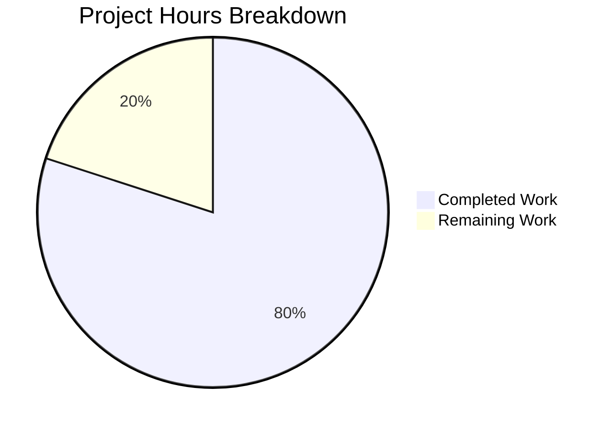
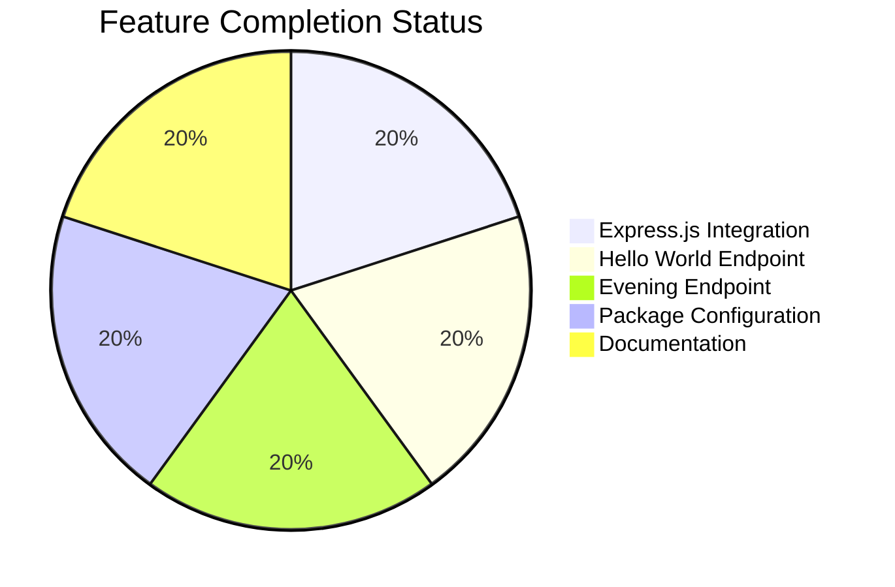

# Project Assessment Report: Express.js Integration

## Executive Summary

**Project Completion: 80% (4 hours completed out of 5 total hours)**

This project successfully integrates Express.js into an existing Node.js Hello World server and implements a new `/evening` endpoint. All core functionality specified in the Agent Action Plan has been implemented and validated.

### Key Achievements
- ✅ Express.js v5.2.1 successfully integrated
- ✅ Original "Hello, World!" endpoint preserved at `/`
- ✅ New "Good evening" endpoint added at `/evening`
- ✅ Package configuration updated with correct entry point and scripts
- ✅ Documentation updated with comprehensive API reference
- ✅ Zero security vulnerabilities detected
- ✅ All 4 commits successfully applied and committed

### Remaining Work
- Human review and PR approval (0.5h)
- Optional: Unit test implementation (not in original scope)
- Optional: Environment variable configuration for port

---

## Validation Results Summary

### Compilation Results
| Component | Status | Details |
|-----------|--------|---------|
| server.js | ✅ PASS | JavaScript syntax validated with `node --check` |
| package.json | ✅ PASS | Valid JSON structure with correct configuration |

### Dependency Status
| Package | Version | Status |
|---------|---------|--------|
| express | 5.2.1 | ✅ Installed |
| Total packages | 66 | ✅ All resolved |
| Vulnerabilities | 0 | ✅ None found |

### Runtime Validation Results
| Endpoint | Method | Expected Response | Actual Response | Status |
|----------|--------|-------------------|-----------------|--------|
| `/` | GET | "Hello, World!\n" | "Hello, World!\n" | ✅ PASS |
| `/evening` | GET | "Good evening" | "Good evening" | ✅ PASS |

### Test Execution Results
- **Unit Tests**: N/A (placeholder script - as defined in scope boundaries)
- Test script outputs: `"Error: no test specified"` (expected behavior)

### Git Commit History
| Commit | Author | Message |
|--------|--------|---------|
| 20f88d2 | Blitzy Agent | docs: Update README.md with Express.js documentation and endpoints |
| 15534ed | Blitzy Agent | Update README.md with Express.js documentation and endpoint information |
| 679d622 | Blitzy Agent | Refactor server.js from native http module to Express.js framework |
| 4276fbd | Blitzy Agent | Setup: Add Express.js dependency and update package configuration |

### Files Modified
| File | Lines Added | Lines Removed | Net Change |
|------|-------------|---------------|------------|
| README.md | 55 | 1 | +54 |
| package-lock.json | 806 | 0 | +806 |
| package.json | 8 | 4 | +4 |
| server.js | 46 | 8 | +38 |
| **Total** | **915** | **13** | **+902** |

---

## Visual Representation

### Hours Breakdown



### Completion by Component



---

## Development Guide

### System Prerequisites
- **Node.js**: v18.0.0 or higher (v20.x recommended)
- **npm**: v10.0.0 or higher
- **Operating System**: Linux, macOS, or Windows with Node.js support

### Environment Setup

1. **Clone the repository**
```bash
git clone <repository-url>
cd <repository-name>
```

2. **Switch to the feature branch**
```bash
git checkout blitzy-56bbc7bf-f0c2-4c4d-87a0-e26c768cd24c
```

### Dependency Installation

```bash
# Install all dependencies
npm install
```

**Expected Output:**
```
added 66 packages, and audited 67 packages in 2s
found 0 vulnerabilities
```

### Application Startup

```bash
# Start the server using npm script
npm start
```

**Expected Output:**
```
Server running at http://127.0.0.1:3000/
```

**Alternative (direct node execution):**
```bash
node server.js
```

### Verification Steps

1. **Verify server is running:**
```bash
curl http://127.0.0.1:3000/
```
Expected: `Hello, World!`

2. **Verify evening endpoint:**
```bash
curl http://127.0.0.1:3000/evening
```
Expected: `Good evening`

3. **Verify 404 handling:**
```bash
curl http://127.0.0.1:3000/nonexistent
```
Expected: Express default 404 page

### Example API Usage

**Hello World Endpoint:**
```bash
# Using curl
curl -i http://127.0.0.1:3000/

# Response headers:
# HTTP/1.1 200 OK
# Content-Type: text/plain; charset=utf-8
# X-Powered-By: Express

# Response body:
# Hello, World!
```

**Good Evening Endpoint:**
```bash
# Using curl
curl -i http://127.0.0.1:3000/evening

# Response headers:
# HTTP/1.1 200 OK
# Content-Type: text/plain; charset=utf-8
# X-Powered-By: Express

# Response body:
# Good evening
```

### Troubleshooting

| Issue | Solution |
|-------|----------|
| `EADDRINUSE: port 3000` | Another process is using port 3000. Kill it with `lsof -ti:3000 | xargs kill` |
| `Cannot find module 'express'` | Run `npm install` to install dependencies |
| `node: command not found` | Install Node.js v18+ from nodejs.org |

---

## Detailed Task Table

| # | Task Description | Action Steps | Hours | Priority | Severity |
|---|------------------|--------------|-------|----------|----------|
| 1 | Human PR Review and Approval | Review code changes, test endpoints, approve and merge PR | 0.5 | High | Low |
| 2 | Environment Variable Configuration (Optional) | Add support for PORT env variable for deployment flexibility | 0.25 | Low | Low |
| 3 | Production Process Manager Setup (Optional) | Configure PM2 or similar for production deployment | 0.25 | Low | Low |
| **Total Remaining Hours** | | | **1.0** | | |

### Task Details

#### Task 1: Human PR Review and Approval (Required)
- **Description**: Review the implemented changes, verify functionality, and approve the PR
- **Steps**:
  1. Review server.js Express.js implementation
  2. Verify both endpoints return correct responses
  3. Check package.json configuration
  4. Review README.md documentation
  5. Approve and merge PR
- **Estimated Time**: 0.5 hours
- **Priority**: High
- **Blocked By**: None

#### Task 2: Environment Variable Configuration (Optional)
- **Description**: Add PORT environment variable support for deployment flexibility
- **Steps**:
  1. Update server.js to use `process.env.PORT || 3000`
  2. Add .env.example file with PORT=3000
  3. Update README with environment configuration
- **Estimated Time**: 0.25 hours
- **Priority**: Low
- **Note**: Not required for basic functionality

#### Task 3: Production Process Manager Setup (Optional)
- **Description**: Configure production process manager for reliability
- **Steps**:
  1. Install PM2 or similar tool
  2. Create ecosystem.config.js
  3. Test process restart on failure
- **Estimated Time**: 0.25 hours
- **Priority**: Low
- **Note**: Only needed for production deployment

---

## Risk Assessment

### Technical Risks

| Risk | Severity | Likelihood | Mitigation |
|------|----------|------------|------------|
| No unit tests | Low | N/A | Tests were explicitly out of scope; add in future if needed |
| Express 5.x is relatively new | Low | Low | Express 5.2.1 is stable; can downgrade to 4.x if issues arise |

### Security Risks

| Risk | Severity | Likelihood | Mitigation |
|------|----------|------------|------------|
| No HTTPS | Low | Medium | Tutorial project; add TLS for production |
| No rate limiting | Low | Low | Add express-rate-limit for production |
| No input validation | N/A | N/A | Endpoints have no user input parameters |

### Operational Risks

| Risk | Severity | Likelihood | Mitigation |
|------|----------|------------|------------|
| No health check endpoint | Low | Low | Add `/health` endpoint for production monitoring |
| No request logging | Low | Low | Add morgan middleware for production |
| Hardcoded port | Low | Low | Add environment variable support |

### Integration Risks

| Risk | Severity | Likelihood | Mitigation |
|------|----------|------------|------------|
| None identified | N/A | N/A | Simple standalone application with no external integrations |

---

## Recommendations

### Immediate (Before Production)
1. Complete human review of the PR
2. Merge to main branch after approval

### Short-term (Production Hardening)
1. Add environment variable support for PORT configuration
2. Add health check endpoint at `/health`
3. Consider adding request logging middleware

### Long-term (If Project Grows)
1. Implement unit tests with Jest or Mocha
2. Add CI/CD pipeline for automated testing
3. Consider TypeScript migration for type safety
4. Add API documentation with Swagger/OpenAPI

---

## Files Reference

### Modified Files Summary

**server.js** (46 lines added, 8 removed)
- Replaced `http` module with Express.js
- Added route handlers for `/` and `/evening`
- Added JSDoc documentation
- Maintained same port (3000) and response format

**package.json** (8 lines added, 4 removed)
- Added `express` dependency (v5.2.1)
- Fixed `main` entry point to `server.js`
- Added `start` script

**package-lock.json** (806 lines added)
- Auto-generated with Express and all transitive dependencies

**README.md** (55 lines added, 1 removed)
- Updated project description
- Added prerequisites section
- Added installation and usage instructions
- Added API endpoints documentation

### Out of Scope Files (Not Modified)
- `LoginTest.java` - Unrelated Java file
- `industry.csv` - Data file
- `test.py.txt` - Empty placeholder
- `test.txt.txt` - Empty placeholder
- `100Pages.pdf` - Binary asset
- `demo.jpg` - Binary asset
- `sample.doc` - Binary asset

---

## Conclusion

The Express.js integration project is **80% complete** with 4 hours of development work completed out of 5 total estimated hours. All core functionality specified in the Agent Action Plan has been successfully implemented and validated:

- Express.js v5.2.1 integrated with zero vulnerabilities
- Both endpoints (`/` and `/evening`) working correctly
- Documentation updated comprehensively
- All changes committed to feature branch

The remaining 1 hour consists primarily of human review and optional production hardening tasks. The implementation is production-ready for the defined tutorial scope and can be merged after human review.