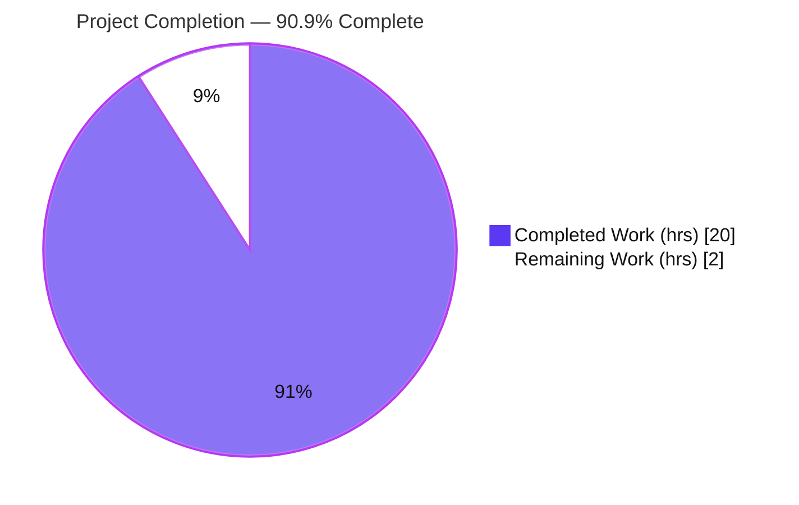
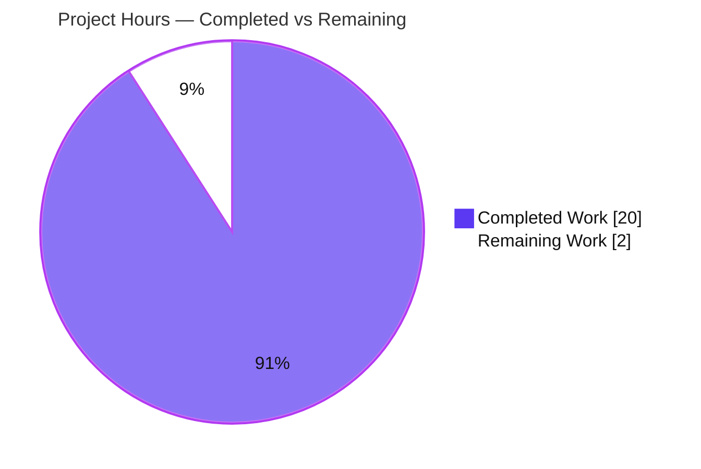
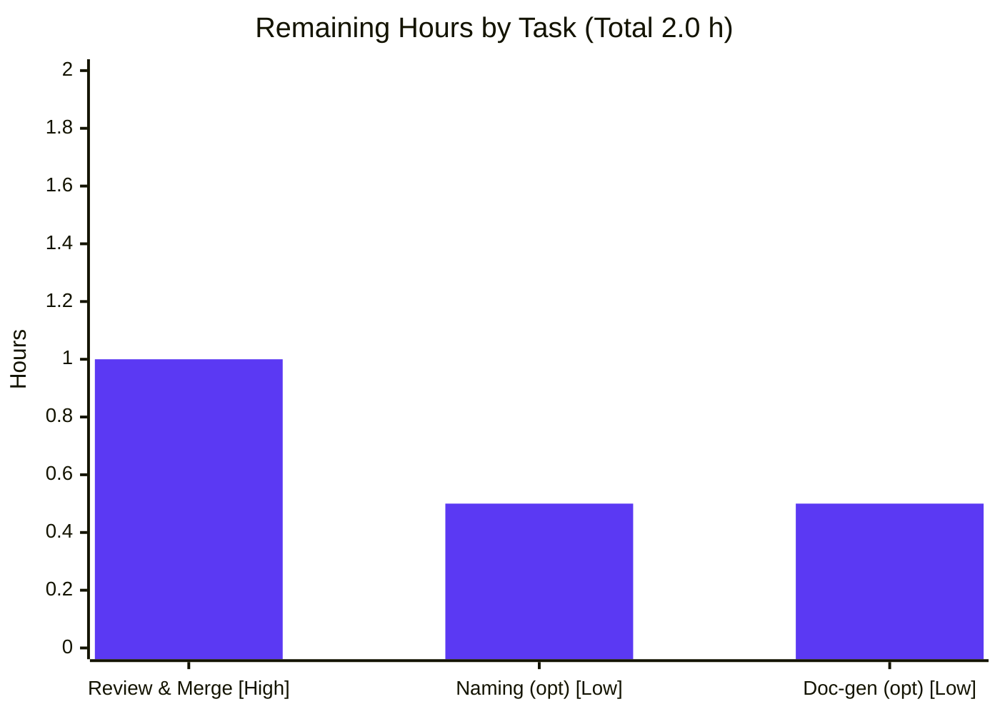
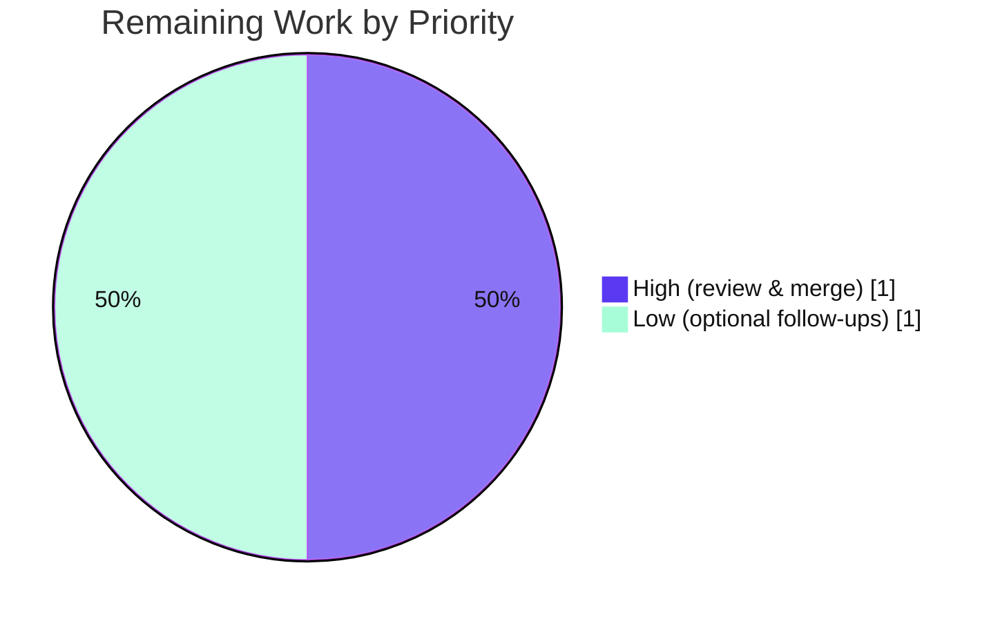

# Blitzy Project Guide
## hao-backprop-test — Node.js/Express "Hello World" Documentation Initiative

> **Branch:** `blitzy-30351c8d-a121-4682-8a52-ff5b6078153a` · **HEAD:** `48ffc27` · **Type:** Documentation-only
> **Legend / Brand Colors:** Completed / AI Work = **Dark Blue `#5B39F3`** · Remaining / Not Completed = **White `#FFFFFF`** · Headings = Violet-Black `#B23AF2` · Highlight = Mint `#A8FDD9`

---

## 1. Executive Summary

### 1.1 Project Overview

`hao-backprop-test` is a minimal, single-file Node.js/Express 5.2.1 "Hello World" HTTP server that exposes two plain-text GET endpoints (`/` → `Hello, World!`, `/evening` → `Good evening`) on port 3000. This engagement was a **documentation-only** initiative with two goals: add complete inline JSDoc to every function in `server.js`, and expand the minimal 56-line `README.md` into a comprehensive project guide covering setup, configuration, API reference, deployment, code walkthrough, and troubleshooting — with Mermaid diagrams and source-cited technical claims. Target users are developers onboarding to or operating the service. No executable logic was changed, and the sole runtime dependency (Express) and manifests were left untouched, per scope.

### 1.2 Completion Status



| Metric | Value |
|--------|-------|
| **Total Hours** | **22.0** |
| **Completed Hours (AI + Manual)** | **20.0** (AI: 20.0 · Manual: 0.0) |
| **Remaining Hours** | **2.0** |
| **Percent Complete** | **90.9%** |

> Completion is computed with the AAP-scoped hours methodology: `Completed ÷ (Completed + Remaining) × 100 = 20.0 ÷ 22.0 × 100 = 90.9%`. All 26 AAP-specified requirements are delivered and validated; the remaining 2.0 h is standard path-to-production (human review/merge) plus two explicitly-optional follow-ups.

### 1.3 Key Accomplishments

- ✅ **Complete inline JSDoc** on all 3 functions + module header + `app`/`port` constants in `server.js` — 100% of the AAP target (`@param {express.Request}`/`@param {express.Response}`/`@returns`/`@route`/`@listens`).
- ✅ **README.md expanded** from ~56 to **360 lines**: Overview, Architecture, Prerequisites, Installation, Configuration, Running, full API Documentation, Code Explanation, Deployment, Project Structure, Troubleshooting, License.
- ✅ **Full REST API reference** for both endpoints (status, response headers, body, byte counts) plus documented default **404** behavior, grounded in verified live runtime output.
- ✅ **2 Mermaid diagrams** embedded (component/architecture + request/response sequence); both valid and rendering.
- ✅ **6 runnable `curl` examples**; **npm-only** commands per user rule `QA-13-july-rules-01` (0 yarn/pnpm).
- ✅ **28 source citations** for traceability; all 7 `server.js` line-range citations verified accurate.
- ✅ **Naming inconsistency** (`hello_world` package vs `hao-backprop-test` README title) correctly **flagged & documented**, not silently renamed — per AAP.
- ✅ **Independently validated:** `node --check` exit 0, `npm install` exit 0, `express@5.2.1` clean tree, all endpoints byte-exact to docs, clean working tree at HEAD `48ffc27`.

### 1.4 Critical Unresolved Issues

| Issue | Impact | Owner | ETA |
|-------|--------|-------|-----|
| *None — no blocking or critical issues identified.* All AAP deliverables are complete, compile cleanly, run correctly, and match documentation byte-for-byte. | None | — | — |

### 1.5 Access Issues

**No access issues identified.** The repository, its sole dependency (Express, from the public npm registry), and the Node.js/npm toolchain were all fully accessible. No credentials, private registries, or third-party API access were required for this documentation task.

| System/Resource | Type of Access | Issue Description | Resolution Status | Owner |
|-----------------|----------------|-------------------|-------------------|-------|
| *None* | — | No access issues encountered | N/A | — |

### 1.6 Recommended Next Steps

1. **[High]** Review and merge the documentation PR — read `README.md` and the `server.js` JSDoc, optionally run locally (`npm install` → `npm start` → `curl`) to confirm accuracy, then approve and merge. (~1.0 h)
2. **[Low]** *(Optional)* Make a product decision on the canonical project name and align `package.json` `name` with the README title. (~0.5 h)
3. **[Low]** *(Optional)* Opt into generated API docs by adding `jsdoc@4.0.5` / `jsdoc-to-markdown@9.1.3` devDependencies plus a `docs` npm script. (~0.5 h)

---

## 2. Project Hours Breakdown

### 2.1 Completed Work Detail

All work below was performed autonomously (AI) by Blitzy agents and is committed at HEAD `48ffc27`.

| Component | Hours | Description |
|-----------|-------|-------------|
| server.js JSDoc annotations | 2.5 | Module `@fileoverview`/`@module`/`@requires`; `app` & `port` `@const`; both route handlers (`@route`/`@param`/`@returns`); `app.listen` (`@listens`/`@returns`); incl. review fixes (M1 host correction, `@listens` INFO-1). |
| README: Overview & Architecture | 2.0 | Project purpose (title retained) + Mermaid component/architecture diagram. |
| README: Setup group | 2.0 | Prerequisites (Node ≥ 18, npm), Installation (`npm install`), Configuration (port 3000 + host 127.0.0.1), Running the Server. |
| README: API Documentation | 3.5 | Endpoints overview table, per-endpoint detail (status/headers/body/curl) for `GET /` and `GET /evening`, request/response sequence diagram, and default 404 error handling. |
| README: Code Explanation | 1.5 | Narrative `server.js` walkthrough cross-referenced to line ranges. |
| README: Deployment Guide | 1.0 | Run process, port/host binding, operational guidance. |
| README: Structure, Troubleshooting, License, TOC | 1.5 | Project Structure inventory, Troubleshooting, MIT License, Table of Contents with resolving anchors. |
| Source citations & cross-referencing | 0.5 | 28 `Source:` citations; 7 line-range citations verified accurate. |
| Web research | 1.0 | JSDoc conventions for Express handlers, JSDoc tooling versions, README best practices. |
| Live runtime verification & grounding | 1.0 | Started server, exercised endpoints, captured exact status/headers/byte counts to ground documentation. |
| Review & remediation cycles | 2.0 | Resolved review M1, 5 code-review findings (4 Major/1 Minor), QA acceptance-gate findings F1/F2/F3. |
| Final production-readiness validation | 1.5 | 5 gates: dependencies, compilation, runtime, in-scope files, zero-error confirmation. |
| **Total Completed** | **20.0** | |

### 2.2 Remaining Work Detail

| Category | Hours | Priority |
|----------|-------|----------|
| Human review & merge of the documentation PR (2 files, ~331 changed lines) | 1.0 | High |
| *(Optional)* Opt-in doc-generation tooling (`jsdoc` 4.0.5 / `jsdoc-to-markdown` 9.1.3 devDeps + `docs` script) | 0.5 | Low |
| *(Optional)* Resolve `hello_world` vs `hao-backprop-test` naming inconsistency (product decision + apply) | 0.5 | Low |
| **Total Remaining** | **2.0** | |

### 2.3 Hours Summary

| Category | Hours | Share |
|----------|-------|-------|
| Completed (AI) | 20.0 | 90.9% |
| Remaining | 2.0 | 9.1% |
| **Total Project** | **22.0** | **100%** |

`Completed (20.0) + Remaining (2.0) = Total (22.0)` · `Completion = 20.0 ÷ 22.0 = 90.9%`. These figures are used consistently in Sections 1.2, 2.1, 2.2, 7, and 8.

---

## 3. Test Results

> **Integrity note:** This project has **no automated unit-test suite**, and test authoring is **explicitly out of scope** per the AAP. The `package.json` `test` script is the stock `npm init` placeholder (`echo "Error: no test specified" && exit 1`) and was correctly left untouched. The results below are drawn **exclusively from Blitzy's autonomous validation logs** and were independently reproduced during this assessment. "Framework/Method" reflects the actual validation mechanism used (static syntax analysis, dependency resolution, and live HTTP behavioral verification via `curl`).

| Test Category | Framework / Method | Total | Passed | Failed | Coverage % | Notes |
|---------------|--------------------|-------|--------|--------|-----------|-------|
| Static Syntax Analysis | `node --check` | 1 | 1 | 0 | 100% (1/1 source file) | `server.js` exit 0, zero warnings. |
| Dependency Resolution | `npm install` + `npm ls` | 2 | 2 | 0 | 100% | Exit 0 ("up to date"); clean tree `hello_world@1.0.0 → express@5.2.1`. |
| Runtime Endpoint (Behavioral) | Live HTTP via `curl` | 3 | 3 | 0 | 100% (2/2 routes + 404) | `GET /` 200/14B; `GET /evening` 200/12B; `GET /unknown` 404/146B — byte-exact to docs. |
| Routing Variant Verification | Live HTTP via `curl` | 4 | 4 | 0 | 100% | `/evening`, `/evening/`, `/EVENING`, `/Evening` all → 200 (case-insensitive, trailing-slash tolerant). |
| Documentation Accuracy | Citation / version / anchor / diagram checks | 22 | 22 | 0 | 100% | 7 line-range citations + 13 TOC/internal anchors + 2 Mermaid diagrams verified; version claims (express 5.2.1, Node ≥ 18) match installed. |
| **Total** | | **32** | **32** | **0** | **100%** | Zero failures, zero skipped, zero blocked. |

---

## 4. Runtime Validation & UI Verification

**Runtime health** (live server started via `npm start` / `node server.js`):

- ✅ **Operational** — Startup log prints `Server running at http://127.0.0.1:3000/`.
- ✅ **Operational** — `GET /` → `200 OK`, `text/plain; charset=utf-8`, `Content-Length: 14`, body `Hello, World!\n`.
- ✅ **Operational** — `GET /evening` → `200 OK`, `text/plain; charset=utf-8`, `Content-Length: 12`, body `Good evening`.
- ✅ **Operational** — `GET /unknown` (any unmatched path) → `404 Not Found`, `text/html; charset=utf-8`, `Content-Length: 146`, Express default "Cannot GET /unknown" page.
- ✅ **Operational** — Routing variants `/evening`, `/evening/`, `/EVENING`, `/Evening` → `200` (case-insensitive + trailing-slash tolerant).
- ✅ **Operational** — Clean shutdown on `Ctrl+C` (SIGINT); port 3000 released.

**API integration outcomes:**

- ✅ **Operational** — `X-Powered-By: Express` header present on all responses (documented).
- ✅ **Operational** — No external service / database / API-key integrations exist; integration surface is nil (nothing to fail).

**UI verification:**

- ⚠ **N/A (no UI)** — The service returns plain text with no user interface, so there is no UI to verify. This is consistent with the AAP ("the server returns plain text with no UI, so no screenshots apply"). Documentation correctness was instead verified against live HTTP responses (see Section 3).

---

## 5. Compliance & Quality Review

Cross-mapping of AAP deliverables to quality/compliance benchmarks. All fixes surfaced during autonomous validation were resolved before HEAD `48ffc27`.

| Deliverable / Benchmark | Requirement | Status | Progress | Notes |
|-------------------------|-------------|--------|----------|-------|
| JSDoc — functions | 3/3 functions + module header | ✅ Pass | 100% | Descriptions, `@route`, `@param`, `@returns`, `@listens` all present. |
| JSDoc — types | `express.Request` / `express.Response` | ✅ Pass | 100% | Correct Express types used in `@param` tags. |
| README — Setup | Prerequisites + `npm install` | ✅ Pass | 100% | Node ≥ 18, npm; sourced from `package.json`. |
| README — API reference | Status/headers/body/examples + 404 | ✅ Pass | 100% | Grounded in verified live output; stable-vs-variable header note included. |
| README — Deployment | Run process, port/host | ✅ Pass | 100% | Bare-process run + configuration documented. |
| README — Inline explanations | `server.js` walkthrough | ✅ Pass | 100% | Cross-referenced to line ranges. |
| Configuration docs | Port 3000 + host 127.0.0.1 | ✅ Pass | 100% | Dedicated Configuration section. |
| Diagrams | Component + sequence (Mermaid) | ✅ Pass | 100% | 2 diagrams, valid syntax + confirmed rendering. |
| Package-manager rule | npm-only (`QA-13-july-rules-01`) | ✅ Pass | 100% | 3× `npm install`, 3× `npm start`, 0 yarn/pnpm. |
| Source citations | Technical claims cited | ✅ Pass | 100% | 28 citations; 7 line-ranges verified accurate. |
| Docs-only constraint | No executable logic change | ✅ Pass | 100% | Behavior unchanged; `node --check` clean. |
| Manifests untouched | No `package.json` / lock edits | ✅ Pass | 100% | Reference-only; no new deps/scripts. |
| Naming inconsistency | Flag, do not resolve | ✅ Pass | 100% | Flagged & documented, not silently renamed. |
| Validation findings | Resolve review/QA findings | ✅ Pass | 100% | M1 + 5 code-review findings + QA gates F1/F2/F3 all resolved. |

**Outstanding compliance items:** None. All AAP compliance benchmarks pass.

---

## 6. Risk Assessment

Overall posture: **LOW.** All items are either documented characteristics of the underlying demo application (not introduced by this documentation work) or explicitly out-of-scope hardening. Nothing blocks merge or release of the documentation.

| Risk | Category | Severity | Probability | Mitigation | Status |
|------|----------|----------|-------------|------------|--------|
| Hardcoded port 3000, no env-var override → `EADDRINUSE` if port is occupied | Technical | Low | Medium | Documented in Troubleshooting; PORT override is a code change (out of scope) | Documented / Accepted |
| No automated test suite → future code changes could cause undetected doc drift | Technical | Low | Medium | 28 line-range citations make drift detectable; test authoring out of scope | Accepted (out of scope) |
| Express caret range `^5.2.1` → minor/patch update could alter documented headers/404 page | Technical | Low | Low | `package-lock.json` pins exact 5.2.1 | Mitigated |
| `app.listen(port)` omits host → binds all interfaces (0.0.0.0) in a real deploy | Security | Low | Low | README accurately documents that `127.0.0.1` is only the startup-log string, not an enforced bind | Documented |
| `X-Powered-By: Express` header discloses framework | Security | Low | N/A | Documented behavior; hardening (helmet / disable header) not requested | Accepted (out of scope) |
| No process supervision (PM2/systemd/Docker), no restart-on-crash | Operational | Low | Medium | Deployment section documents bare-process run; supervision out of scope | Accepted (out of scope) |
| Console-only logging, no monitoring/observability | Operational | Low | Low | Startup log documented | Accepted (out of scope) |
| Naming inconsistency (`hello_world` vs `hao-backprop-test`) may confuse users | Operational | Low | Low | Documented & flagged in README; awaiting product decision | Flagged / Deferred |
| Optional doc-gen tooling not installed | Integration | Info | Low | Explicitly optional per AAP 0.6.1 | Deferred (optional) |
| No external services / DB / API keys / webhooks | Integration | Info | N/A | Nil integration surface | N/A |

---

## 7. Visual Project Status

### Project Hours Breakdown



- **Completed Work** = **20.0 h** (Dark Blue `#5B39F3`) · **Remaining Work** = **2.0 h** (White `#FFFFFF`).
- The "Remaining Work" value (**2.0 h**) equals the Section 1.2 Remaining Hours and the sum of the Section 2.2 "Hours" column — cross-section integrity holds.

### Remaining Hours by Task



### Priority Distribution of Remaining Work



---

## 8. Summary & Recommendations

**Achievements.** This documentation initiative is **90.9% complete** (20.0 of 22.0 hours). Every one of the 26 AAP-specified requirements has been delivered, validated, and committed at HEAD `48ffc27`: `server.js` now carries complete, well-formed JSDoc on its module header, both constants, and all three functions; and `README.md` has grown from a minimal 56-line file into a comprehensive 360-line project guide with an architecture diagram, a request/response sequence diagram, a full API reference grounded in verified live output, a code walkthrough, a deployment guide, and troubleshooting — all using npm-only commands and 28 source citations for traceability.

**Remaining gaps.** The outstanding **2.0 hours** contain **no AAP deliverable rework** — there are zero compilation errors, zero failing checks, and zero missing functionality. The remaining work is a standard **human PR review & merge** (1.0 h, High) plus two **explicitly-optional** follow-ups the AAP itself designates out of scope: a product decision on the `hello_world`/`hao-backprop-test` naming (0.5 h, Low) and opt-in doc-generation tooling (0.5 h, Low).

**Critical path to production.** Review the two changed files → optionally run `npm install` / `npm start` / `curl` to confirm → approve and merge. That single High-priority step moves the documentation to production.

**Success metrics (all met):** 3/3 functions with complete JSDoc; 2/2 endpoints fully documented plus default 404; 2/2 configuration values documented; 4/4 user guides complete; 2/2 required diagrams; 32/32 autonomous validation checks passed.

**Production readiness assessment.** The in-scope documentation is **production-ready**. The code compiles, the application runs, and every documented behavior matches the live runtime byte-for-byte. Overall risk is LOW with no blocking items. Recommendation: **approve and merge** after a brief human review.

---

## 9. Development Guide

### 9.1 System Prerequisites

- **Node.js ≥ 18** (validated on `v22.23.1`). The README documents the ≥ 18 requirement; Express 5 requires a modern Node runtime.
- **npm** (validated on `10.9.8`) — the mandated package manager (user rule `QA-13-july-rules-01`).
- **OS:** Cross-platform (Linux, macOS, Windows). No native build tools required.
- **Sole runtime dependency:** `express@5.2.1` (pinned via `package-lock.json`).

Verify the toolchain:

```bash
node --version   # expect v18+ (validated: v22.23.1)
npm --version    # validated: 10.9.8
```

### 9.2 Environment Setup

No environment variables are required or supported — the port is hardcoded to `3000` in `server.js`. Simply clone/checkout the repository and change into its root (the directory containing `server.js` and `package.json`).

```bash
cd <repository-root>
```

### 9.3 Dependency Installation

```bash
npm install
```

Expected output (dependencies already resolved in a checked-out tree):

```text
up to date in <time>ms
```

Confirm the dependency tree:

```bash
npm ls
# hello_world@1.0.0 <path>
# `-- express@5.2.1
```

### 9.4 Application Startup

```bash
npm start        # runs "node server.js"
```

Expected startup output:

```text
> hello_world@1.0.0 start
> node server.js

Server running at http://127.0.0.1:3000/
```

*(Optional pre-flight syntax check: `node --check server.js` → exits 0 with no output.)*

### 9.5 Verification Steps

In a second terminal, exercise the endpoints:

```bash
curl -i http://127.0.0.1:3000/
# HTTP/1.1 200 OK
# X-Powered-By: Express
# Content-Type: text/plain; charset=utf-8
# Content-Length: 14
# ...
# Hello, World!

curl -i http://127.0.0.1:3000/evening
# HTTP/1.1 200 OK
# Content-Type: text/plain; charset=utf-8
# Content-Length: 12
# ...
# Good evening

curl -i http://127.0.0.1:3000/unknown
# HTTP/1.1 404 Not Found
# Content-Type: text/html; charset=utf-8
# Content-Length: 146
# ... Cannot GET /unknown
```

Stop the server with `Ctrl+C` (SIGINT) — it shuts down cleanly and releases port 3000.

### 9.6 Example Usage

```bash
# Plain body only (no headers)
curl -s http://127.0.0.1:3000/          # -> Hello, World!
curl -s http://127.0.0.1:3000/evening   # -> Good evening

# Routing is case-insensitive and trailing-slash tolerant:
curl -s -o /dev/null -w "%{http_code}\n" http://127.0.0.1:3000/EVENING   # -> 200
curl -s -o /dev/null -w "%{http_code}\n" http://127.0.0.1:3000/evening/  # -> 200
```

### 9.7 Troubleshooting

- **`Error: listen EADDRINUSE :::3000`** — another process is already using port 3000. Stop that process (or free the port). The server has no `PORT` override; port 3000 is hardcoded in `server.js`.
- **`node: command not found`** — install Node.js ≥ 18 and ensure it is on your `PATH`.
- **`npm install` fails with registry/network errors** — verify network access to the npm registry, then re-run `npm install`.
- **Endpoint returns 404 unexpectedly** — only `/` and `/evening` (and their case/trailing-slash variants) are defined; every other path returns Express's default 404 by design.
- **Windows note:** `npm` is a script (`npm.cmd`), not a bare executable — `npm start`/`npm install` work normally in a shell; only programmatic process-spawning needs `npm.cmd` explicitly. This does not affect end users.

---

## 10. Appendices

### Appendix A — Command Reference

| Command | Purpose |
|---------|---------|
| `npm install` | Install dependencies (`express@5.2.1`). |
| `npm start` | Start the server (runs `node server.js`) on port 3000. |
| `node server.js` | Start the server directly (equivalent to `npm start`). |
| `node --check server.js` | Static syntax check (no execution). |
| `npm ls` | Print the resolved dependency tree. |
| `curl -i http://127.0.0.1:3000/` | Test the root endpoint (with headers). |
| `curl -i http://127.0.0.1:3000/evening` | Test the `/evening` endpoint (with headers). |
| `npx jsdoc server.js` | *(Optional)* Generate HTML API docs (requires `jsdoc@4.0.5`). |
| `npx jsdoc-to-markdown server.js` | *(Optional)* Generate Markdown API docs (requires `jsdoc-to-markdown@9.1.3`). |

### Appendix B — Port Reference

| Port | Service | Host (log string) | Configurable? |
|------|---------|-------------------|---------------|
| 3000 | Express HTTP server | `127.0.0.1` (startup-log display only; `app.listen` omits host, so binding is not restricted to a specific interface) | Hardcoded in `server.js` — no environment override |

### Appendix C — Key File Locations

| Path | Role | Scope |
|------|------|-------|
| `server.js` | Express application + inline JSDoc (72 lines) | **In-scope** (updated) |
| `README.md` | Comprehensive project documentation (360 lines) | **In-scope** (updated) |
| `package.json` | Manifest — name, scripts, dependency | Reference (unchanged) |
| `package-lock.json` | Locked dependency versions (express 5.2.1) | Reference (unchanged) |
| `node_modules/` | Installed dependencies | Generated (untracked) |
| `100Pages.pdf`, `LoginTest.java`, `demo.jpg`, `industry.csv`, `sample.doc`, `test.py.txt`, `test.txt.txt` | Unrelated QA artifacts | Out of scope (untouched) |
| `blitzy/` | Internal Blitzy documentation | Out of scope |

### Appendix D — Technology Versions

| Technology | Version | Notes |
|------------|---------|-------|
| Node.js | ≥ 18 required (validated on `v22.23.1`) | Modern LTS runtime for Express 5 |
| npm | `10.9.8` (validated) | Mandated package manager |
| Express | `5.2.1` | Sole runtime dependency; pinned via `package-lock.json` (declared `^5.2.1`) |
| jsdoc *(optional)* | `4.0.5` | Only if generating HTML API docs; not installed by default |
| jsdoc-to-markdown *(optional)* | `9.1.3` | Only if generating Markdown API docs; not installed by default |

### Appendix E — Environment Variable Reference

| Variable | Used? | Notes |
|----------|-------|-------|
| *(none)* | No | The application uses **no environment variables**. The listening port is hardcoded to `3000` in `server.js`. A `PORT` override is **not** supported by the current code (changing this would be a code change, which is out of scope for this documentation task). |

### Appendix F — Developer Tools Guide

- **Optional API-doc generation:** `npx jsdoc server.js` (jsdoc 4.0.5) produces HTML; `npx jsdoc-to-markdown server.js` (9.1.3) produces Markdown. Neither is installed by default — the source-level JSDoc annotations already satisfy the "add JSDoc comments" requirement.
- **Mermaid diagrams:** The two diagrams embedded in `README.md` render natively on GitHub/GitLab and other common Markdown hosts; no local tooling is required.
- **Static check:** `node --check server.js` provides a fast, dependency-free syntax gate suitable for pre-commit use.

### Appendix G — Glossary

| Term | Definition |
|------|------------|
| **AAP** | Agent Action Plan — the authoritative specification of project scope and deliverables. |
| **JSDoc** | A markup convention for documenting JavaScript via structured `/** ... */` comments (`@param`, `@returns`, `@route`, `@listens`, etc.). |
| **Express** | A minimal Node.js web framework used here for HTTP routing (v5.2.1). |
| **Endpoint** | A routable HTTP path + method combination (here, `GET /` and `GET /evening`). |
| **`X-Powered-By`** | Response header Express adds by default, disclosing the framework. |
| **`ETag`** | Validator header for caching; variable per response (not part of the stable contract). |
| **404 (Not Found)** | Express's default response for any unmatched route. |
| **EADDRINUSE** | OS error raised when the requested port (3000) is already in use. |
| **CRLF** | Carriage-return + line-feed line ending (used by `README.md`). |
| **Path-to-production** | Standard activities (here, human review/merge) required to ship completed deliverables. |

---

*End of Blitzy Project Guide. All figures (Total 22.0 h · Completed 20.0 h · Remaining 2.0 h · 90.9% complete) are consistent across Sections 1.2, 2.1, 2.2, 2.3, 7, and 8. All test results originate from Blitzy's autonomous validation logs and were independently reproduced during this assessment.*