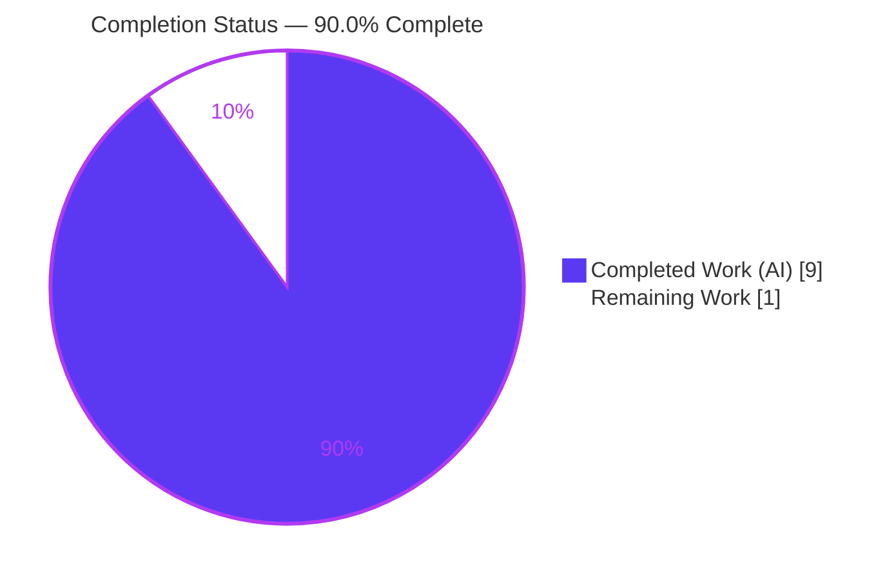
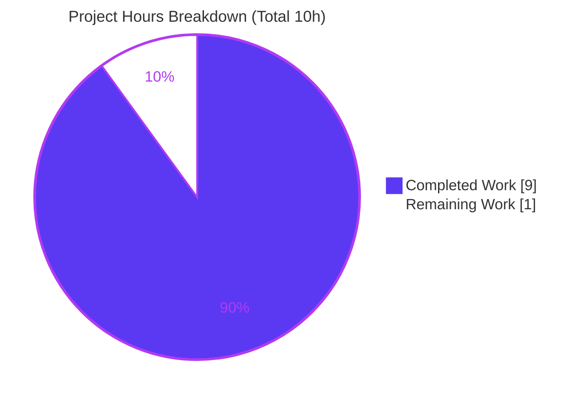

# Blitzy Project Guide

> **Project:** Express.js Migration & "Good evening" Endpoint Addition
> **Repository:** `existing-projects-qa-test-08-dec` (branch `blitzy-d3ddd1c5-0a08-4e7c-929b-18ac874f511e`)
> **Change Type:** ADD FEATURE
> **Status:** <span style="color:#5B39F3">**90.0% Complete — Production-Ready pending human review**</span>

---

## 1. Executive Summary

### 1.1 Project Overview

This project introduces the **Express.js** web framework into an existing minimal Node.js tutorial server and adds a second HTTP endpoint. The target users are developers/learners exercising a simple two-route HTTP service. The work migrates `server.js` from Node's native `http` module to a single shared Express application, preserves the original `GET /` route returning `Hello, World!\n` byte-for-byte, and adds `GET /evening` returning `Good evening`. It also corrects a latent packaging bug (missing `start` script and a non-existent `main`), regenerates the dependency lockfile deterministically, and updates documentation. Technical scope is intentionally narrow: four files, one direct dependency, no database, no UI, no external integrations.

### 1.2 Completion Status

The completion percentage is calculated using the AAP-scoped, hours-based methodology: **Completed Hours ÷ Total Hours**. The work universe is the AAP deliverables plus standard path-to-production gating.



| Metric | Hours |
|--------|-------|
| **Total Hours** | **10** |
| Completed Hours (AI) | 9 |
| Completed Hours (Manual) | 0 |
| **Completed Hours (AI + Manual)** | **9** |
| **Remaining Hours** | **1** |
| **Percent Complete** | **90.0%** |

> **Calculation:** `9 completed ÷ (9 completed + 1 remaining) × 100 = 90.0%`
> **Color key:** Completed = Dark Blue `#5B39F3` · Remaining = White `#FFFFFF`

### 1.3 Key Accomplishments

- ✅ **Express.js integrated** as the sole direct runtime dependency, pinned at `express@^5.2.1` (resolved `5.2.1`).
- ✅ **`server.js` migrated** from native `http` to a single shared Express application instance.
- ✅ **`GET /` preserved** byte-for-byte: `Hello, World!\n` (14 bytes, trailing newline intact), `text/plain`, HTTP 200.
- ✅ **`GET /evening` added**: `Good evening` (12 bytes, no trailing newline), `text/plain`, HTTP 200.
- ✅ **Latent packaging bug fixed**: added `"start": "node server.js"`; corrected `main` from non-existent `index.js` → `server.js`.
- ✅ **Runtime surface preserved and hardened**: loopback-only `127.0.0.1:3000` bind, exact startup log, and a graceful `EADDRINUSE` handler.
- ✅ **`package-lock.json` regenerated** deterministically (lockfileVersion 3) with security-patched transitive dependencies; `npm audit` → **0 vulnerabilities**.
- ✅ **`README.md` updated** with prerequisites, install/run steps, endpoints table, and `curl` examples.
- ✅ **All six acceptance criteria (AC-1 … AC-6) PASS**, independently re-verified in this session.

### 1.4 Critical Unresolved Issues

| Issue | Impact | Owner | ETA |
|-------|--------|-------|-----|
| _None_ | No blocking issues. Implementation compiles, installs, runs, and passes all acceptance criteria. | — | — |

> There are **no critical unresolved issues**. All remaining items are standard, non-blocking path-to-production gating (see §1.6 and §2.2).

### 1.5 Access Issues

| System/Resource | Type of Access | Issue Description | Resolution Status | Owner |
|-----------------|----------------|-------------------|-------------------|-------|
| _None_ | — | No access issues identified. Repository, branch, and npm registry were all reachable; `npm ci` succeeded with 0 vulnerabilities. | N/A | — |

> **No access issues identified.**

### 1.6 Recommended Next Steps

1. **[High]** Review and approve the in-scope diff (`server.js`, `package.json`, `package-lock.json`, `README.md`) — a small, well-documented change set (+962 / −13 across 4 files).
2. **[Medium]** Merge branch `blitzy-d3ddd1c5-0a08-4e7c-929b-18ac874f511e` into the target branch and confirm any branch-protection/CI checks.
3. **[Medium]** Run a post-merge smoke verification in the target environment: `npm ci`, `npm start`, then `curl` both endpoints and confirm byte-exact responses.
4. **[Low]** _(Optional, out of AAP scope)_ Add a `.gitignore` excluding `node_modules/` and `blitzy/` to prevent accidental commits.
5. **[Low]** _(Optional, out of AAP scope)_ Update the README clone URL to your team's canonical remote if it differs from the documented one.

---

## 2. Project Hours Breakdown

### 2.1 Completed Work Detail

All completed work was performed autonomously by Blitzy agents (Manual = 0h). Each component traces to specific AAP requirements.

| Component | Hours | Description |
|-----------|-------|-------------|
| Express framework integration + `server.js` migration | 2.0 | **FR-1, IR-1** — Replace native `http` with `require('express')`; instantiate `const app = express()`; convert to `app.listen(...)`. |
| `GET /` endpoint preservation (byte-exact) | 0.5 | **FR-3, IR-6** — Re-implement `app.get('/')` returning `Hello, World!\n` via `res.type('text/plain').send(...)`; backward compatible. |
| `GET /evening` endpoint | 0.5 | **FR-2, IR-6** — New `app.get('/evening')` returning `Good evening`, `text/plain`. |
| Runtime surface preservation + robustness hardening | 1.5 | **IR-4** — Loopback-only `127.0.0.1:3000` bind; startup log from `listening` event; `EADDRINUSE` handler with clear message + non-zero exit. |
| `package.json` manifest | 0.5 | **FR-1, IR-3** — Add `dependencies.express`; add `scripts.start`; fix `main` → `server.js`; update `description`. |
| `package-lock.json` deterministic lockfile + security patch | 1.0 | **IR-2** — Regenerate lockfileVersion 3 with resolved URLs + sha512 integrity for `express@5.2.1` and its 64 transitive packages; patched transitive deps. |
| `README.md` documentation | 1.0 | **IR-5** — Prerequisites, install (`npm install`), usage (`npm start`), endpoints table, `curl` examples. |
| Autonomous validation, smoke testing & QA-fix cycle | 2.0 | **AC-1 … AC-6** — `npm ci`, `node --check`, JSON validation, live byte-level endpoint verification, plus the QA-driven hardening cycle (loopback fix, EADDRINUSE, README executable clone). |
| **Total Completed** | **9.0** | |

> **Section 2.1 total = 9.0h**, matching Completed Hours in §1.2. ✔

### 2.2 Remaining Work Detail

All remaining work is human path-to-production gating. Each item traces to a standard production-readiness need. _(Optional out-of-AAP-scope enhancements are listed in §6 and §8 and are intentionally excluded from these totals.)_

| Category | Hours | Priority |
|----------|-------|----------|
| Human code review & sign-off of the 4 in-scope files | 0.50 | High |
| Merge to target branch + confirm CI/branch protections | 0.25 | Medium |
| Post-merge runtime smoke verification (`npm ci` → `npm start` → `curl` both endpoints) | 0.25 | Medium |
| **Total Remaining** | **1.00** | |

> **Section 2.2 total = 1.0h**, matching Remaining Hours in §1.2 and the "Remaining Work" slice in §7. ✔

### 2.3 Hours Reconciliation

| Check | Value | Result |
|-------|-------|--------|
| §2.1 Completed total | 9.0h | ✔ matches §1.2 |
| §2.2 Remaining total | 1.0h | ✔ matches §1.2 & §7 |
| §2.1 + §2.2 | 10.0h | ✔ equals §1.2 Total |
| Completion % | 9 ÷ 10 = 90.0% | ✔ matches §1.2, §7, §8 |

---

## 3. Test Results

All results below originate exclusively from **Blitzy's autonomous validation logs** for this project (Final Validator run + independent re-verification in this session). This project has **no automated unit/integration test framework by design** — the AAP (§0.5.2) explicitly excludes jest/mocha and mandates the `npm test` placeholder remain. Accordingly, "tests" here are Blitzy's autonomous validation checks. Coverage instrumentation is not applicable (no instrumented suite).

| Test Category | Framework / Tool | Total | Passed | Failed | Coverage % | Notes |
|---------------|------------------|-------|--------|--------|------------|-------|
| Dependency Install Validation | `npm ci` (npm 10.9.8) | 1 | 1 | 0 | N/A | 65 packages installed, **0 vulnerabilities**, `express@5.2.1` confirmed. |
| Static Analysis (syntax + JSON) | `node --check`, `JSON.parse` | 4 | 4 | 0 | N/A | `server.js` check exit 0; `package.json` valid; `package-lock.json` valid; `require('express')` resolves. |
| Runtime Endpoint Smoke | `curl.exe` / Node `http` client | 4 | 4 | 0 | N/A | Startup log exact; `GET /` 14 bytes `\n`-terminated; `GET /evening` 12 bytes; loopback-only bind confirmed. |
| Acceptance Criteria | Blitzy autonomous validation | 6 | 6 | 0 | N/A | AC-1 … AC-6 all PASS. |
| Unit / Integration Suite | _None (out of scope)_ | 0 | 0 | 0 | N/A | `npm test` is an intentional exit-1 placeholder per AAP §0.5.2 — **not** a failing assertion. |
| **Total** | | **15** | **15** | **0** | N/A | **100% pass rate** across all autonomous validation checks. |

> **Integrity note:** No fabricated or external test data is included. The `npm test` placeholder is correctly reported as in-spec design, not a failure.

---

## 4. Runtime Validation & UI Verification

**User Interface:** _Not applicable_ — this is an HTTP API with plain-text responses; there is no HTML/CSS, templating engine, or front-end component.

**Runtime health (verified live in this session):**

- ✅ **Server startup** — `npm start` / `node server.js` binds `127.0.0.1:3000` and logs exactly `Server running at http://127.0.0.1:3000/`.
- ✅ **Loopback-only bind** — service is reachable on `127.0.0.1`/`localhost`, not on external interfaces (intended security posture).
- ✅ **Clean shutdown** — process terminates cleanly on signal; port released.
- ✅ **Port-collision handling** — a second instance prints `Port 3000 is already in use.` and exits non-zero (`EADDRINUSE`), never displacing the running instance.

**API endpoint verification (`curl.exe -i`, verified live):**

- ✅ `GET /` → `HTTP/1.1 200 OK`, `X-Powered-By: Express`, `Content-Type: text/plain; charset=utf-8`, `Content-Length: 14`, body `Hello, World!\n` (hex tail `64 21 0a` — trailing newline preserved).
- ✅ `GET /evening` → `HTTP/1.1 200 OK`, `X-Powered-By: Express`, `Content-Type: text/plain; charset=utf-8`, `Content-Length: 12`, body `Good evening` (no trailing newline).

**API integration:** _Not applicable_ — no external services, no credentials, no outbound calls.

---

## 5. Compliance & Quality Review

Cross-map of AAP deliverables and governing rules to their delivery status, including fixes applied during autonomous validation.

| Deliverable / Rule | Requirement | Status | Evidence / Progress |
|--------------------|-------------|--------|---------------------|
| **FR-1** Introduce Express.js | `express@^5.2.1` as sole direct dependency | ✅ Pass | `dependencies.express: "^5.2.1"`; installed `5.2.1`; lockfile-pinned. |
| **FR-2** `GET /evening` | Returns `Good evening`, `text/plain` | ✅ Pass | Live: 200, 12 bytes, `text/plain`. |
| **FR-3** Preserve `GET /` | Returns `Hello, World!\n` byte-for-byte | ✅ Pass | Live: 200, 14 bytes, trailing `\n` (hex `64 21 0a`). |
| **IR-1** Framework migration | Single Express app, not two servers | ✅ Pass | No `require('http')`; one `app.listen`. |
| **IR-2** Manifest + lockfile | Deterministic lockfile v3 | ✅ Pass | `package-lock.json` w/ URLs + integrity; security-patched (commit `c57ebf3`). |
| **IR-3** Runnable project | `start` script + `main` fix | ✅ Pass | `main: "server.js"`, `scripts.start: "node server.js"`. |
| **IR-4** Preserve runtime surface | Port 3000, `127.0.0.1`, startup log | ✅ Pass | Loopback bind + exact log; hardened via `EADDRINUSE` handler (commits `773ec3a`, `a84da49`). |
| **IR-5** Documentation | README Express usage + endpoints | ✅ Pass | Prerequisites, install/run, endpoints table, `curl` examples. |
| **IR-6** Content-Type | Both endpoints `text/plain` | ✅ Pass | `res.type('text/plain')`; live headers confirm. |
| **AC-1 … AC-6** | All acceptance criteria | ✅ Pass (6/6) | Independently re-verified this session. |
| **Rule: QA-13-july-rules** | Use npm | ✅ Pass | Deterministic `npm ci`; lockfile in sync. |
| **Rule: Ajit_New Product** — flow separation | Distinct handlers per flow | ✅ Pass | Two independent, commented `app.get(...)` handlers, no shared branching. |
| **Rule: Ajit_New Product** — performance-neutral | No heavy work / middleware | ✅ Pass | O(1) synchronous string responses; zero middleware. |
| **Rule: Ajit_New Product** — "Python" clause | Language directive | ✅ Resolved | Correctly superseded — repo/prompt are Node.js/JS; documented in AAP §0.1.2. |

**Fixes applied during autonomous validation (QA cycle):**
- 🔧 `c57ebf3` — regenerated `package-lock.json` to patched transitive dependencies (security).
- 🔧 `773ec3a` — bound the Express listener to `127.0.0.1` loopback only (security).
- 🔧 `a84da49` — surfaced `EADDRINUSE` on port collision via a listener error handler (robustness).
- 🔧 `42c502d` — made README Installation step 1 executable with `git clone` (docs).

**Outstanding compliance items:** None within AAP scope.

---

## 6. Risk Assessment

Overall risk posture: **LOW**. A two-endpoint, static, read-only HTTP service with no user input, no secrets, and no external integrations, fully validated. Most residual items are AAP-out-of-scope (accepted) or minor optional hygiene.

| Risk | Category | Severity | Probability | Mitigation | Status |
|------|----------|----------|-------------|------------|--------|
| No automated regression test suite (placeholder `npm test`) | Technical | Low | Medium | Documented `curl` smoke test; optional jest+supertest post-scope | Accepted (out of scope §0.5.2) |
| Express 5.x is a recent major (ecosystem maturity if app grows) | Technical | Low | Low | Lockfile-pinned `5.2.1`; only core routing used | Mitigated |
| Hardcoded port 3000 / loopback; no fallback port | Technical | Low | Low | `EADDRINUSE` handler exits non-zero loudly | Mitigated |
| No authentication/authorization (public endpoints) | Security | Low | N/A | Static read-only GET; no input; no secrets | Accepted (by design) |
| Transitive dependency vulnerabilities | Security | Low | Low | `npm audit` = 0; lockfile security-patched; Express 5 ReDoS mitigations | Mitigated |
| No security headers (helmet not used) | Security | Low | Low | Minimal attack surface (no input) | Accepted (out of scope) |
| No health-check endpoint / monitoring / structured logging | Operational | Low | Medium | Startup log + `EADDRINUSE` error logging present | Accepted (out of scope) |
| No process manager / auto-restart policy | Operational | Low | Low | Non-zero exit on bind failure aids orchestrator visibility | Accepted (out of scope) |
| No `.gitignore` (`node_modules/`, `blitzy/` untracked) | Operational | Low | Low-Med | Validator left them uncommitted | **Open** (optional: add `.gitignore`) |
| npm registry access required for `npm ci` (air-gapped envs) | Integration | Low | Low | Deterministic lockfile; document registry requirement | Mitigated |
| No external service integrations / credentials | Integration | None | N/A | None exist in project | N/A |
| README clone URL is a specific GitHub repo | Integration | Low | Low | Human updates URL to canonical remote at merge | **Open** (optional doc note) |

---

## 7. Visual Project Status

**Project hours — Completed vs Remaining** (Completed = Dark Blue `#5B39F3`, Remaining = White `#FFFFFF`):



**Remaining work by priority** (sums to the 1.0h Remaining total in §1.2 and §2.2):

| Priority | Hours | Share of Remaining |
|----------|-------|--------------------|
| High | 0.50 | 50% |
| Medium | 0.50 | 50% |
| Low | 0.00 | 0% |
| **Total** | **1.00** | **100%** |

> **Integrity:** "Remaining Work" = **1** here = §1.2 Remaining Hours = §2.2 total. "Completed Work" = **9** = §1.2 Completed Hours = §2.1 total. ✔

---

## 8. Summary & Recommendations

**Achievements.** The feature is **fully implemented and independently validated**. Express.js is integrated at the pinned version, `server.js` has been cleanly migrated to a single Express application, the original `GET /` contract is preserved byte-for-byte (including its trailing newline), and the new `GET /evening` endpoint returns the exact requested greeting. The change also corrects a pre-existing latent packaging bug and hardens the runtime surface (loopback-only bind, graceful port-collision handling) beyond the literal request. All **six acceptance criteria pass**, `npm audit` reports **0 vulnerabilities**, and the working tree is clean.

**Remaining gaps.** No functional gaps remain within AAP scope. The outstanding **1 hour** is standard human path-to-production gating: code review, merge, and post-merge smoke verification.

**Critical path to production.**
1. Human review & approval of the in-scope diff → 2. Merge to target branch → 3. Post-merge `npm ci` + `npm start` + `curl` verification.

**Success metrics (all met).**

| Metric | Target | Actual |
|--------|--------|--------|
| Acceptance criteria passing | 6/6 | ✅ 6/6 |
| Dependency vulnerabilities | 0 | ✅ 0 |
| `GET /` backward compatibility | Byte-identical | ✅ 14 bytes, trailing `\n` |
| `GET /evening` correctness | Exact `Good evening` | ✅ 12 bytes |
| Autonomous validation checks | 100% pass | ✅ 15/15 |

**Production-readiness assessment.** The codebase is **production-ready for its stated tutorial scope**. At **90.0% complete** (9 of 10 hours), the only remaining work is human review/merge/verification. Optional, explicitly out-of-scope enhancements (a `.gitignore`, a canonical README clone URL, and a formal automated test suite) are recommended for long-term maintenance but are **not required** by the AAP and are **not** included in the hour totals.

---

## 9. Development Guide

Every command below was executed live in this session on the target repository. On Windows, use `curl.exe` (not the PowerShell `curl` alias) for raw HTTP output; on macOS/Linux use `curl`.

### 9.1 System Prerequisites

- **Node.js ≥ 18** (v20+ recommended; verified on **v22.23.1**).
- **npm** (verified on **10.9.8**).
- **npm registry access** (for installing `express` and its transitive tree).
- OS: any Node-supported platform (validated on Windows Server 2022).

### 9.2 Environment Setup

No environment variables, `.env` file, or external services are required. The server binds a fixed port and host: `127.0.0.1:3000`.

```bash
# From the repository root
node --version   # expect v18+ (validated on v22.23.1)
npm --version    # validated on 10.9.8
```

### 9.3 Dependency Installation

```bash
# Deterministic install from the committed lockfile (recommended)
npm ci
# Expected: "added 65 packages ... found 0 vulnerabilities"

# Development alternative
npm install
```

Verify the framework resolved to the pinned version:

```bash
npm ls express --depth=0
# Expected: `-- express@5.2.1
```

### 9.4 Static Verification (optional)

```bash
node --check server.js
# Expected: exit code 0 (no output)
```

### 9.5 Application Startup

```bash
npm start
# equivalent to: node server.js
# Expected log: Server running at http://127.0.0.1:3000/
```

The process runs in the foreground; stop it with `Ctrl+C`.

### 9.6 Verification Steps

Open a second terminal while the server is running:

```bash
# Hello World endpoint (original, preserved)
curl -i http://127.0.0.1:3000/
# HTTP/1.1 200 OK
# X-Powered-By: Express
# Content-Type: text/plain; charset=utf-8
# Content-Length: 14
# (body) Hello, World!

# Good Evening endpoint (new)
curl -i http://127.0.0.1:3000/evening
# HTTP/1.1 200 OK
# X-Powered-By: Express
# Content-Type: text/plain; charset=utf-8
# Content-Length: 12
# (body) Good evening
```

### 9.7 Example Usage

```bash
# Bodies only
curl -s http://127.0.0.1:3000/          # -> Hello, World!  (with trailing newline)
curl -s http://127.0.0.1:3000/evening   # -> Good evening   (no trailing newline)
```

### 9.8 Troubleshooting

| Symptom | Cause | Resolution |
|---------|-------|------------|
| `Port 3000 is already in use.` then exit 1 | Another process holds port 3000 (`EADDRINUSE`) | Stop the other process or free the port, then retry `npm start`. This is expected, correct behavior. |
| `curl` returns objects/HTML on Windows | PowerShell `curl` alias = `Invoke-WebRequest` | Use `curl.exe` explicitly for raw output. |
| Cannot reach server from another machine | Server binds `127.0.0.1` (loopback only) by design | Use `127.0.0.1`/`localhost`; external exposure is intentionally out of scope. |
| `npm test` exits 1 | Intentional placeholder (`echo "Error: no test specified" && exit 1`) | Expected per AAP §0.5.2 — not a failure; no test framework by design. |
| `npm ci` fails offline | No npm registry access | Provide registry/mirror access or pre-populate the npm cache. |

---

## 10. Appendices

### Appendix A — Command Reference

| Command | Purpose |
|---------|---------|
| `npm ci` | Deterministic install from `package-lock.json` (65 packages, 0 vulnerabilities). |
| `npm install` | Development install (updates lockfile if needed). |
| `npm ls express --depth=0` | Confirm `express@5.2.1` resolved. |
| `node --check server.js` | Static syntax validation (exit 0). |
| `npm start` | Start the server (`node server.js`). |
| `curl -i http://127.0.0.1:3000/` | Verify `GET /` (200, 14 bytes). |
| `curl -i http://127.0.0.1:3000/evening` | Verify `GET /evening` (200, 12 bytes). |
| `npm audit` | Dependency vulnerability scan (0 found). |

### Appendix B — Port Reference

| Port | Host | Protocol | Purpose |
|------|------|----------|---------|
| 3000 | 127.0.0.1 (loopback only) | HTTP | Express application serving `GET /` and `GET /evening`. |

### Appendix C — Key File Locations

| File | Role | Disposition |
|------|------|-------------|
| `server.js` | Express application entrypoint; both route handlers + listener | UPDATE (in scope) |
| `package.json` | npm manifest — `main`, `scripts.start`, `dependencies.express` | UPDATE (in scope) |
| `package-lock.json` | Deterministic dependency graph (lockfileVersion 3) | UPDATE (in scope) |
| `README.md` | Project documentation | UPDATE (in scope) |
| `node_modules/` | Installed dependencies (65 packages) | Untracked (do not commit) |
| `industry.csv`, `LoginTest.java`, `test.py.txt`, `test.txt.txt`, `100Pages.pdf`, `demo.jpg`, `sample.doc` | Unrelated repository artifacts | Out of scope (untouched) |
| `blitzy/documentation/**` | Generated Blitzy docs | Out of scope (untouched) |

### Appendix D — Technology Versions

| Technology | Version | Notes |
|------------|---------|-------|
| Node.js | ≥ 18 required; validated on **v22.23.1** | `engines.node >= 18` (from Express). |
| npm | **10.9.8** | Package manager (rule-mandated). |
| Express.js | **5.2.1** (declared `^5.2.1`) | Sole direct runtime dependency; MIT. |
| Transitive packages | 64 (65 total incl. Express) | Pinned in `package-lock.json`. |
| lockfileVersion | 3 | Deterministic installs via `npm ci`. |

### Appendix E — Environment Variable Reference

_No environment variables are used._ The server uses a hardcoded host/port (`127.0.0.1:3000`) by design; configurable port/host is explicitly out of scope (AAP §0.5.2).

### Appendix F — Developer Tools Guide

| Tool | Use |
|------|-----|
| `node --check <file>` | Fast syntax check without executing. |
| `npm ls <pkg> --depth=0` | Confirm a resolved top-level dependency version. |
| `npm audit` | Scan the dependency tree for known vulnerabilities. |
| `curl -i <url>` | Inspect HTTP status + headers + body (use `curl.exe` on Windows). |
| `git diff <base> HEAD --stat` | Review the change-set footprint. |

### Appendix G — Glossary

| Term | Definition |
|------|------------|
| **AAP** | Agent Action Plan — the authoritative interpretation of the user request driving this change. |
| **AC** | Acceptance Criterion — objective, testable condition for feature completion (AC-1 … AC-6). |
| **FR / IR** | Functional Requirement / Implicit Requirement from the AAP. |
| **EADDRINUSE** | Node.js error emitted when a port is already bound by another process. |
| **Loopback** | The `127.0.0.1` interface; reachable only from the local machine. |
| **lockfileVersion 3** | npm lockfile format enabling fully deterministic installs via `npm ci`. |
| **Path-to-production** | Standard steps (review, merge, verification) to move validated code to release. |

---

> **Cross-Section Integrity — validated before submission:**
> **Rule 1** (§1.2 ↔ §2.2 ↔ §7): Remaining = **1h** in all three. ✔
> **Rule 2** (§2.1 + §2.2 = Total): 9 + 1 = **10h** = §1.2 Total. ✔
> **Rule 3** (§3): All tests originate from Blitzy's autonomous validation logs. ✔
> **Rule 4** (§1.5): Access issues validated — none. ✔
> **Rule 5** (Colors): Completed = `#5B39F3`, Remaining = `#FFFFFF` throughout. ✔
> **Completion 90.0%** stated identically in §1.2, §7, and §8. ✔