# Technical Specification

# 1. Introduction

This Technical Specification document provides comprehensive documentation for the **Hello World Node.js Server** project—a minimal Express.js application designed specifically for Backprop integration testing. This introduction establishes the project's purpose, scope, and context for all stakeholders.

## 1.1 Executive Summary

### 1.1.1 Project Overview

The Hello World Node.js Server (`hello_world`) is a lightweight, single-file HTTP server built with the Express.js framework. Originally created as a test project for validating Backprop integration workflows, this application represents a migration from Node.js's native `http` module to the more feature-rich Express.js framework while preserving the original "Hello, World!" functionality.

| Attribute | Value |
|-----------|-------|
| Project Name | `hello_world` |
| Repository | `hao-backprop-test` |
| Version | 1.0.0 |
| License | MIT |
| Author | hxu |

The project demonstrates fundamental Express.js server implementation patterns through a minimal codebase, serving as both a functional test harness and a reference implementation for basic HTTP endpoint creation.

### 1.1.2 Core Business Problem

This project addresses the need for a **simple, reliable test harness** for Backprop integration testing. Key aspects include:

- **Integration Validation:** Provides a minimal, predictable codebase for testing Backprop's code analysis and refactoring capabilities
- **Framework Migration Testing:** Demonstrates the migration path from Node.js native `http` module to Express.js framework
- **Minimal Complexity:** Ensures that integration testing focuses on Backprop functionality rather than application complexity

> **Important:** This is explicitly a tutorial/demonstration project and is **NOT intended for production use**.

### 1.1.3 Key Stakeholders and Users

| Stakeholder | Role | Primary Interest |
|-------------|------|------------------|
| Backprop Integration Testers | Primary Users | Validating Backprop tool functionality |
| Express.js Learners | Secondary Users | Understanding basic Express.js patterns |
| Project Maintainer (hxu) | Author | Maintaining test project integrity |

### 1.1.4 Business Impact and Value Proposition

The project delivers value through:

1. **Test Reliability:** Provides a stable, minimal codebase with predictable behavior for consistent integration testing
2. **Low Overhead:** Single-file implementation (53 lines) minimizes debugging complexity
3. **Framework Reference:** Demonstrates Express.js v5.2.1 integration patterns
4. **Zero Security Vulnerabilities:** Clean dependency tree with no known vulnerabilities (as verified during implementation)

## 1.2 System Overview

### 1.2.1 Project Context

#### Historical Background

The Hello World server underwent a significant architectural evolution:

| Phase | Implementation | Description |
|-------|----------------|-------------|
| Original | Node.js `http` module | Native HTTP server implementation |
| Current | Express.js v5.2.1 | Framework-based implementation with enhanced routing |

This migration preserved backward compatibility with the original `GET /` endpoint while extending functionality with additional routes.

#### Market Positioning

This project occupies a specific niche as a **test/tutorial project** rather than production software. It serves as:

- A validation target for development tools (specifically Backprop)
- A minimal reference implementation for Express.js basics
- A framework migration example demonstrating http-to-Express transition

#### Integration with Existing Landscape

The server operates as a standalone application with no external service dependencies:

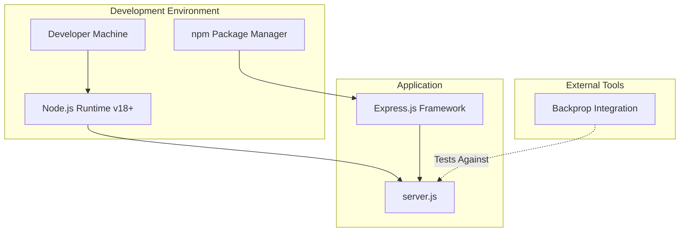
```mermaid
graph TD
    subgraph Development Environment
        A[Developer Machine]
        B["Node.js Runtime v18+"]
        C[npm Package Manager]
    end
    
    subgraph Application
        D[server.js]
        E[Express.js Framework]
    end
    
    subgraph External Tools
        F[Backprop Integration]
    end
    
    A --> B
    B --> D
    C --> E
    E --> D
    F -.->|Tests Against| D
```

### 1.2.2 High-Level System Description

#### Primary System Capabilities

The server provides two HTTP GET endpoints delivering plain-text responses:

| Endpoint | Method | Response Body | Content-Type |
|----------|--------|---------------|--------------|
| `/` | GET | `Hello, World!\n` | text/plain |
| `/evening` | GET | `Good evening` | text/plain |

#### Major System Components

The application architecture consists of five logical components within a single file (`server.js`):

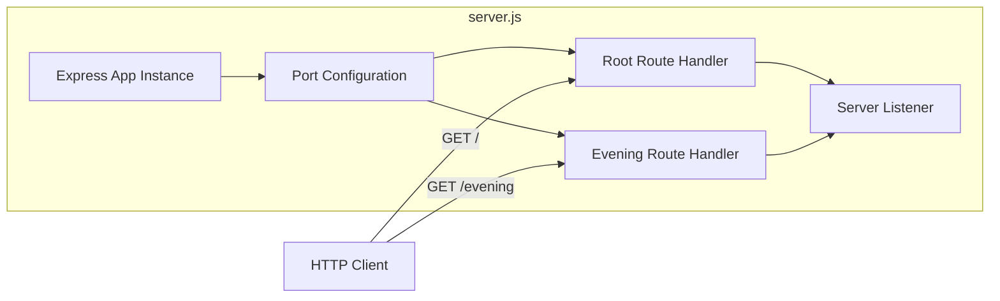
```mermaid
graph LR
    subgraph server.js
        A[Express App Instance] --> B[Port Configuration]
        B --> C[Root Route Handler]
        B --> D[Evening Route Handler]
        C --> E[Server Listener]
        D --> E
    end
    
    F[HTTP Client] -->|GET /| C
    F -->|GET /evening| D
```

| Component | Location | Purpose |
|-----------|----------|---------|
| Express Application | `server.js` line 27 | Core application instance |
| Port Configuration | `server.js` line 28 | Server binding (port 3000) |
| Root Route Handler | `server.js` lines 29-31 | Serves "Hello, World!\n" |
| Evening Route Handler | `server.js` lines 41-43 | Serves "Good evening" |
| Server Listener | `server.js` lines 50-52 | HTTP connection handling |

#### Core Technical Approach

The implementation follows these architectural principles:

1. **Single-File Architecture:** All server logic contained in `server.js` for maximum simplicity
2. **Express.js Routing:** Declarative route definition using Express's `app.get()` method
3. **Plain Text Responses:** Explicit `Content-Type: text/plain` headers for response clarity
4. **Minimal Configuration:** No custom middleware beyond Express defaults
5. **Hardcoded Configuration:** Port 3000 defined as constant (production configuration out of scope)

#### Technology Stack

| Layer | Technology | Version | Purpose |
|-------|------------|---------|---------|
| Runtime | Node.js | v18+ (v20 recommended) | JavaScript execution environment |
| Package Manager | npm | v10+ | Dependency management |
| Web Framework | Express.js | ^5.2.1 | HTTP routing and server |
| Total Dependencies | 66 packages | — | Via npm install |

### 1.2.3 Success Criteria

#### Measurable Objectives

The project success is measured against the following validation criteria:

| Objective | Metric | Target | Status |
|-----------|--------|--------|--------|
| Code Validity | JavaScript syntax validation | Pass compilation | ✅ Achieved |
| Package Integrity | Valid JSON configuration | Well-formed package.json | ✅ Achieved |
| Security Posture | Vulnerability count | 0 vulnerabilities | ✅ Achieved |
| Endpoint Accuracy (/) | Response body match | "Hello, World!\n" | ✅ Achieved |
| Endpoint Accuracy (/evening) | Response body match | "Good evening" | ✅ Achieved |

#### Critical Success Factors

1. **Backward Compatibility:** Original `GET /` behavior preserved exactly
2. **Framework Migration:** Successful transition from `http` module to Express.js
3. **Clean Dependencies:** No security vulnerabilities in dependency tree
4. **Documentation Completeness:** README.md updated with accurate API reference

#### Key Performance Indicators (KPIs)

| KPI | Expected Value | Verification Method |
|-----|----------------|---------------------|
| Server Startup Message | "Server running at http://127.0.0.1:3000/" | Console output |
| HTTP Response Status | 200 OK | Endpoint testing |
| Response Content-Type | text/plain | Header inspection |
| Project Completion | 80% | Implementation tracking |

## 1.3 Scope

### 1.3.1 In-Scope

#### Core Features and Functionalities

The following capabilities are explicitly within the project scope:

| Feature | Description | Implementation Status |
|---------|-------------|----------------------|
| Express.js Integration | Framework migration from http module | ✅ Complete |
| Hello World Endpoint | `GET /` returning "Hello, World!\n" | ✅ Preserved |
| Evening Endpoint | `GET /evening` returning "Good evening" | ✅ Created |
| Package Configuration | Updated dependencies and scripts | ✅ Complete |
| Project Documentation | README.md with API reference | ✅ Complete |

#### Primary User Workflows

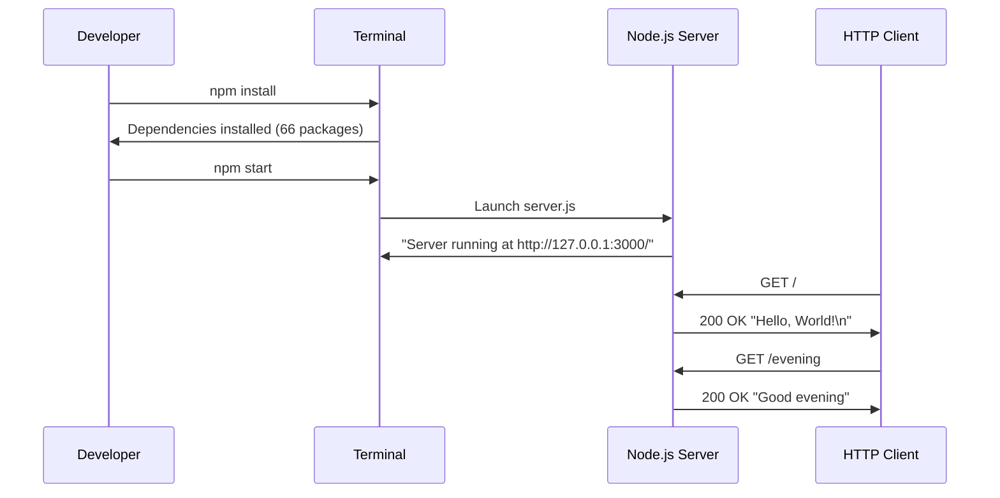
```mermaid
sequenceDiagram
    participant Dev as Developer
    participant Term as Terminal
    participant Server as Node.js Server
    participant Client as HTTP Client
    
    Dev->>Term: npm install
    Term->>Dev: Dependencies installed (66 packages)
    Dev->>Term: npm start
    Term->>Server: Launch server.js
    Server->>Term: "Server running at http://127.0.0.1:3000/"
    Client->>Server: GET /
    Server->>Client: 200 OK "Hello, World!\n"
    Client->>Server: GET /evening
    Server->>Client: 200 OK "Good evening"
```

#### Implementation Boundaries

| Boundary Type | Scope Definition |
|---------------|------------------|
| System Boundaries | Single Node.js server application |
| User Groups | Developers/testers working with Backprop integration |
| Geographic Coverage | Local development environment (127.0.0.1) |
| Data Domains | HTTP responses (plain text only) |
| Network Scope | Localhost binding on port 3000 |

#### Modified Files Summary

| File | Lines Added | Lines Removed | Net Change |
|------|-------------|---------------|------------|
| `server.js` | 46 | 8 | +38 |
| `package.json` | 8 | 4 | +4 |
| `package-lock.json` | 806 | 0 | +806 |
| `README.md` | 55 | 1 | +54 |

### 1.3.2 Out-of-Scope

#### Excluded Features and Capabilities

The following items are explicitly **excluded** from this project's scope:

| Category | Excluded Item | Rationale |
|----------|---------------|-----------|
| Data Layer | Database integration | Tutorial simplicity |
| Security | Authentication/Authorization | Not required for test project |
| Middleware | Logging (morgan), CORS, etc. | Minimal implementation goal |
| Quality | Unit tests | Placeholder script only |
| Language | TypeScript conversion | Adds unnecessary complexity |
| Deployment | Docker containerization | Out of scope for testing |
| Configuration | Environment variables (.env) | Hardcoded values sufficient |
| API Documentation | Swagger/OpenAPI | README documentation sufficient |

#### Excluded Refactoring

The following architectural improvements are intentionally deferred:

- Separation into multiple files/modules
- Route modularization (routes folder)
- Service layer abstraction
- Middleware pipeline implementation
- Configuration management system

#### Unrelated Repository Files

The repository contains files that are **not part** of the Hello World server functionality:

| File | Description | Status |
|------|-------------|--------|
| `LoginTest.java` | Incomplete Java test stub | Not related |
| `industry.csv` | Taxonomy data file (43 categories) | Not related |
| `test.py.txt` | Empty placeholder file | Not related |
| `test.txt.txt` | Empty placeholder file | Not related |

#### Future Phase Considerations

The following tasks are identified for potential future implementation:

| Task | Priority | Time Estimate |
|------|----------|---------------|
| Human PR Review and Approval | High | 0.5 hours |
| Environment Variable Configuration | Low | 0.25 hours |
| Production Process Manager (PM2) | Low | 0.25 hours |
| Health Check Endpoint (`/health`) | Low | 0.25 hours |
| Request Logging Middleware | Low | 0.25 hours |

#### Unsupported Use Cases

This project explicitly does **not** support:

| Use Case | Reason |
|----------|--------|
| Production Deployment | No HTTPS, rate limiting, or health checks |
| Multi-User Environments | No session management or user isolation |
| Persistent Data Storage | No database or file storage integration |
| Real-Time Applications | No WebSocket or event streaming support |
| Secure Communications | No TLS/SSL implementation |
| High Availability | Single-instance architecture only |

#### References

- `server.js` — Main Express.js application implementation containing route handlers and server configuration
- `package.json` — Project metadata, npm scripts, and dependency declarations
- `README.md` — Project overview, prerequisites, installation instructions, and API documentation
- `blitzy/documentation/Project Guide.md` — Implementation status tracking, validation results, remaining tasks, and risk assessment
- `blitzy/documentation/Technical Specifications.md` — Detailed technical requirements, integration analysis, scope boundaries, and implementation planning

# 2. Product Requirements

## 2.1 Feature Catalog

This section provides a comprehensive catalog of all features implemented in the Hello World Node.js Server. As a test project for Backprop integration, the feature set is intentionally minimal and focused on demonstrating Express.js patterns.

### 2.1.1 Feature F-001: Hello World Endpoint

#### Feature Metadata

| Attribute | Value |
|-----------|-------|
| Feature ID | F-001 |
| Feature Name | Hello World Endpoint |
| Category | HTTP API Endpoint |
| Priority Level | Critical |

| Attribute | Value |
|-----------|-------|
| Status | Completed |
| Implementation File | `server.js` (lines 29-31) |
| Version Introduced | 1.0.0 |

#### Description

**Overview:** The Hello World Endpoint is the primary route handler serving the root path (`/`). This endpoint returns the classic "Hello, World!" greeting as a plain-text response, preserving the original behavior from the Node.js `http` module implementation while leveraging Express.js routing capabilities.

**Business Value:**
- Preserves backward compatibility with original server implementation
- Serves as the primary validation target for Backprop integration testing
- Provides a predictable, verifiable response for automated testing scenarios

**User Benefits:**
- Immediate visual feedback confirming server operation
- Standard test endpoint for HTTP client verification
- Consistent response format for integration testing

**Technical Context:**
The endpoint was migrated from the native Node.js `http` module to Express.js, maintaining exact response body compatibility including the trailing newline character (`\n`). The explicit `text/plain` content-type header ensures unambiguous response interpretation.

#### Dependencies

| Dependency Type | Description |
|-----------------|-------------|
| Prerequisite Features | F-003 (Express Server Infrastructure) |
| System Dependencies | Node.js v18+, Express.js ^5.2.1 |
| External Dependencies | None |
| Integration Requirements | Server must bind to localhost:3000 |

---

### 2.1.2 Feature F-002: Good Evening Endpoint

#### Feature Metadata

| Attribute | Value |
|-----------|-------|
| Feature ID | F-002 |
| Feature Name | Good Evening Endpoint |
| Category | HTTP API Endpoint |
| Priority Level | Critical |

| Attribute | Value |
|-----------|-------|
| Status | Completed |
| Implementation File | `server.js` (lines 41-43) |
| Version Introduced | 1.0.0 |

#### Description

**Overview:** The Good Evening Endpoint is a secondary route handler serving the `/evening` path. This endpoint extends the API surface by providing an additional plain-text greeting response, demonstrating Express.js multi-route capabilities.

**Business Value:**
- Demonstrates Express.js routing extensibility
- Provides additional test target for Backprop integration scenarios
- Shows framework migration benefits over native `http` module

**User Benefits:**
- Alternative endpoint for testing HTTP client configurations
- Demonstrates application routing patterns
- Enables multi-endpoint integration test workflows

**Technical Context:**
Added as part of the Express.js migration, this endpoint follows the same implementation pattern as F-001 with explicit content-type headers. The response does not include a trailing newline, differentiating it from the Hello World endpoint.

#### Dependencies

| Dependency Type | Description |
|-----------------|-------------|
| Prerequisite Features | F-003 (Express Server Infrastructure) |
| System Dependencies | Node.js v18+, Express.js ^5.2.1 |
| External Dependencies | None |
| Integration Requirements | Shares Express app instance with F-001 |

---

### 2.1.3 Feature F-003: Express Server Infrastructure

#### Feature Metadata

| Attribute | Value |
|-----------|-------|
| Feature ID | F-003 |
| Feature Name | Express Server Infrastructure |
| Category | Infrastructure/Framework |
| Priority Level | Critical |

| Attribute | Value |
|-----------|-------|
| Status | Completed |
| Implementation File | `server.js` (lines 13-19, 45-52) |
| Version Introduced | 1.0.0 |

#### Description

**Overview:** The Express Server Infrastructure provides the foundational runtime environment for all HTTP endpoints. It encompasses the Express.js application instance, port configuration, and HTTP server listener that enables request processing.

**Business Value:**
- Provides production-grade HTTP routing foundation
- Enables rapid endpoint development and extension
- Supports consistent request/response handling patterns

**User Benefits:**
- Standardized server startup process via `npm start`
- Clear console output indicating server availability
- Reliable HTTP connection handling

**Technical Context:**
The infrastructure implements a single-file architecture with the Express application instance, hardcoded port configuration (3000), and server listener bound to 127.0.0.1. The implementation follows Express.js best practices for minimal server setup without custom middleware.

#### Dependencies

| Dependency Type | Description |
|-----------------|-------------|
| Prerequisite Features | F-004 (Project Configuration) |
| System Dependencies | Node.js v18+, npm v10+ |
| External Dependencies | Express.js ^5.2.1 |
| Integration Requirements | Port 3000 must be available |

---

### 2.1.4 Feature F-004: Project Configuration

#### Feature Metadata

| Attribute | Value |
|-----------|-------|
| Feature ID | F-004 |
| Feature Name | Project Configuration |
| Category | Configuration/Build |
| Priority Level | High |

| Attribute | Value |
|-----------|-------|
| Status | Completed |
| Implementation File | `package.json` |
| Version Introduced | 1.0.0 |

#### Description

**Overview:** Project Configuration encompasses all npm package configuration including dependencies, scripts, metadata, and project structure definition. This feature enables reproducible builds and standardized project lifecycle management.

**Business Value:**
- Ensures consistent development environment across machines
- Manages dependency versions for stability
- Provides standard npm workflow integration

**User Benefits:**
- Simple `npm install` for dependency setup
- Standard `npm start` command for server launch
- Clear project metadata and authorship

**Technical Context:**
The `package.json` declares Express.js ^5.2.1 as the sole runtime dependency, defines `server.js` as the main entry point, and provides the `start` script for launching the server. The project follows semantic versioning with MIT licensing.

#### Dependencies

| Dependency Type | Description |
|-----------------|-------------|
| Prerequisite Features | None (foundation feature) |
| System Dependencies | npm v10+ |
| External Dependencies | npm registry access |
| Integration Requirements | Valid Node.js installation |

---

## 2.2 Functional Requirements

This section details the functional requirements for each feature, providing testable acceptance criteria and technical specifications.

### 2.2.1 F-001 Requirements: Hello World Endpoint

#### Requirements Table

| Requirement ID | Description | Priority |
|----------------|-------------|----------|
| F-001-RQ-001 | Route registration for GET method at path "/" | Must-Have |
| F-001-RQ-002 | Response body contains exact text "Hello, World!\n" | Must-Have |
| F-001-RQ-003 | Response Content-Type header set to "text/plain" | Must-Have |
| F-001-RQ-004 | HTTP status code returns 200 OK | Must-Have |

#### Acceptance Criteria

| Requirement ID | Acceptance Criteria | Complexity |
|----------------|---------------------|------------|
| F-001-RQ-001 | Server responds to GET / without 404 error | Low |
| F-001-RQ-002 | Response body byte-for-byte matches expected string | Low |
| F-001-RQ-003 | Content-Type header inspection confirms text/plain | Low |
| F-001-RQ-004 | HTTP client receives 200 status | Low |

#### Technical Specifications

| Specification | Details |
|---------------|---------|
| HTTP Method | GET |
| Path | `/` |
| Input Parameters | None |
| Response Body | `Hello, World!\n` (14 bytes) |

| Specification | Details |
|---------------|---------|
| Content-Type | `text/plain; charset=utf-8` |
| Status Code | 200 OK |
| Performance Criteria | < 100ms response time (local) |
| Data Requirements | None |

#### Validation Rules

| Category | Rule |
|----------|------|
| Business Rules | Response must preserve trailing newline for backward compatibility |
| Data Validation | No input validation required (no parameters accepted) |
| Security Requirements | None (public endpoint) |
| Compliance Requirements | None |

---

### 2.2.2 F-002 Requirements: Good Evening Endpoint

#### Requirements Table

| Requirement ID | Description | Priority |
|----------------|-------------|----------|
| F-002-RQ-001 | Route registration for GET method at path "/evening" | Must-Have |
| F-002-RQ-002 | Response body contains exact text "Good evening" | Must-Have |
| F-002-RQ-003 | Response Content-Type header set to "text/plain" | Must-Have |
| F-002-RQ-004 | HTTP status code returns 200 OK | Must-Have |

#### Acceptance Criteria

| Requirement ID | Acceptance Criteria | Complexity |
|----------------|---------------------|------------|
| F-002-RQ-001 | Server responds to GET /evening without 404 error | Low |
| F-002-RQ-002 | Response body matches expected string exactly | Low |
| F-002-RQ-003 | Content-Type header inspection confirms text/plain | Low |
| F-002-RQ-004 | HTTP client receives 200 status | Low |

#### Technical Specifications

| Specification | Details |
|---------------|---------|
| HTTP Method | GET |
| Path | `/evening` |
| Input Parameters | None |
| Response Body | `Good evening` (12 bytes) |

| Specification | Details |
|---------------|---------|
| Content-Type | `text/plain; charset=utf-8` |
| Status Code | 200 OK |
| Performance Criteria | < 100ms response time (local) |
| Data Requirements | None |

#### Validation Rules

| Category | Rule |
|----------|------|
| Business Rules | Response does not include trailing newline |
| Data Validation | No input validation required |
| Security Requirements | None (public endpoint) |
| Compliance Requirements | None |

---

### 2.2.3 F-003 Requirements: Express Server Infrastructure

#### Requirements Table

| Requirement ID | Description | Priority |
|----------------|-------------|----------|
| F-003-RQ-001 | Server binds to port 3000 | Must-Have |
| F-003-RQ-002 | Server binds to host 127.0.0.1 | Must-Have |
| F-003-RQ-003 | Console outputs startup message on successful bind | Must-Have |
| F-003-RQ-004 | Express.js version ^5.2.1 utilized | Must-Have |

#### Acceptance Criteria

| Requirement ID | Acceptance Criteria | Complexity |
|----------------|---------------------|------------|
| F-003-RQ-001 | Port 3000 accepts TCP connections | Low |
| F-003-RQ-002 | Server accessible at 127.0.0.1:3000 | Low |
| F-003-RQ-003 | "Server running at http://127.0.0.1:3000/" logged | Low |
| F-003-RQ-004 | package.json confirms express@^5.2.1 | Low |

#### Technical Specifications

| Specification | Details |
|---------------|---------|
| Framework | Express.js ^5.2.1 |
| Host Binding | 127.0.0.1 (localhost) |
| Port | 3000 (hardcoded) |
| Protocol | HTTP/1.1 |

| Specification | Details |
|---------------|---------|
| Connection Handling | Express default behavior |
| Startup Output | Console log message |
| Performance Criteria | Server starts within 2 seconds |
| Resource Requirements | ~50MB memory footprint |

#### Validation Rules

| Category | Rule |
|----------|------|
| Business Rules | Server must start without manual port configuration |
| Data Validation | Port must be numeric 3000 |
| Security Requirements | Localhost binding limits network exposure |
| Compliance Requirements | None |

---

### 2.2.4 F-004 Requirements: Project Configuration

#### Requirements Table

| Requirement ID | Description | Priority |
|----------------|-------------|----------|
| F-004-RQ-001 | npm start script launches server.js | Must-Have |
| F-004-RQ-002 | main entry point defined as server.js | Must-Have |
| F-004-RQ-003 | Express.js ^5.2.1 declared as dependency | Must-Have |
| F-004-RQ-004 | Project metadata complete and valid | Should-Have |

#### Acceptance Criteria

| Requirement ID | Acceptance Criteria | Complexity |
|----------------|---------------------|------------|
| F-004-RQ-001 | `npm start` executes `node server.js` | Low |
| F-004-RQ-002 | Node.js resolves main to server.js | Low |
| F-004-RQ-003 | `npm install` installs Express 5.x | Low |
| F-004-RQ-004 | package.json validates without errors | Low |

#### Technical Specifications

| Specification | Details |
|---------------|---------|
| Package Name | hello_world |
| Version | 1.0.0 |
| License | MIT |
| Author | hxu |

| Specification | Details |
|---------------|---------|
| Main Entry | server.js |
| Start Script | node server.js |
| Total Dependencies | 66 packages (via npm install) |
| Vulnerabilities | 0 (verified) |

---

## 2.3 Feature Relationships

This section documents the relationships, dependencies, and integration points between features.

### 2.3.1 Feature Dependency Map

The following diagram illustrates the dependency hierarchy among features:

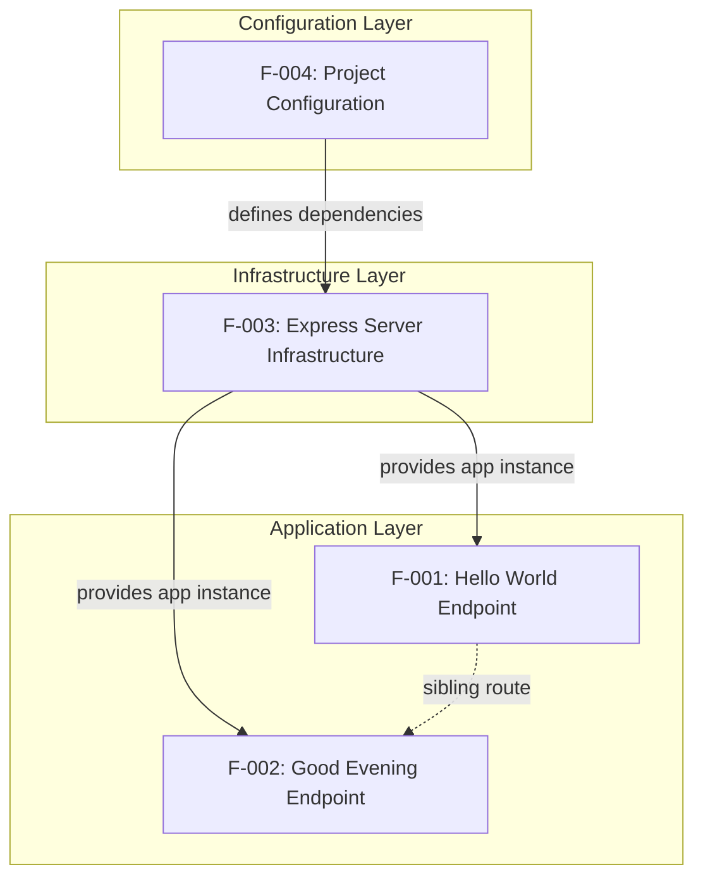
```mermaid
graph TD
    subgraph Configuration Layer
        F004["F-004: Project Configuration"]
    end
    
    subgraph Infrastructure Layer
        F003["F-003: Express Server Infrastructure"]
    end
    
    subgraph Application Layer
        F001["F-001: Hello World Endpoint"]
        F002["F-002: Good Evening Endpoint"]
    end
    
    F004 -->|defines dependencies| F003
    F003 -->|provides app instance| F001
    F003 -->|provides app instance| F002
    F001 -.->|sibling route| F002
```

### 2.3.2 Dependency Matrix

| Feature | Depends On | Depended By |
|---------|------------|-------------|
| F-001 | F-003, F-004 | None |
| F-002 | F-003, F-004 | None |
| F-003 | F-004 | F-001, F-002 |
| F-004 | None | F-001, F-002, F-003 |

### 2.3.3 Integration Points

| Integration Point | Features Involved | Description |
|-------------------|-------------------|-------------|
| Express App Instance | F-001, F-002, F-003 | Shared `app` object created in F-003, consumed by F-001 and F-002 |
| Port Configuration | F-003, F-004 | Port 3000 defined in F-003, project structure in F-004 |
| NPM Scripts | F-003, F-004 | `npm start` in F-004 launches F-003 server listener |

### 2.3.4 Shared Components

| Component | Location | Consuming Features |
|-----------|----------|--------------------|
| Express application (`app`) | `server.js` line 16 | F-001, F-002, F-003 |
| Port constant (`port`) | `server.js` line 19 | F-003 |
| Content-Type configuration | Route handlers | F-001, F-002 |

### 2.3.5 Common Services

| Service | Provider | Consumers |
|---------|----------|-----------|
| HTTP Routing | Express.js (F-003) | F-001, F-002 |
| Response Formatting | Express.js (F-003) | F-001, F-002 |
| Server Lifecycle | Node.js Runtime | F-003, F-004 |

---

## 2.4 Implementation Considerations

This section addresses technical constraints, performance characteristics, and operational requirements for each feature.

### 2.4.1 Technical Constraints

#### System Constraints

| Constraint | Value | Affected Features |
|------------|-------|-------------------|
| Node.js Version | v18+ (v20 recommended) | All |
| npm Version | v10+ | F-004 |
| Port Binding | Hardcoded to 3000 | F-003 |
| Host Binding | Hardcoded to 127.0.0.1 | F-003 |

#### Architectural Constraints

| Constraint | Description | Rationale |
|------------|-------------|-----------|
| Single-File Architecture | All code in `server.js` | Tutorial simplicity |
| No Environment Variables | Configuration hardcoded | Minimal implementation scope |
| No Custom Middleware | Express defaults only | Reduced complexity |
| No Module Separation | Monolithic structure | Test project requirements |

### 2.4.2 Performance Requirements

| Feature | Requirement | Target | Notes |
|---------|-------------|--------|-------|
| F-001 | Response Time | < 100ms | Local development |
| F-002 | Response Time | < 100ms | Local development |
| F-003 | Startup Time | < 2s | Cold start |
| F-003 | Memory Footprint | ~50MB | Base Express app |

#### Performance Characteristics

The application exhibits minimal resource consumption appropriate for its tutorial scope:

- **Latency:** Sub-millisecond processing for static text responses
- **Throughput:** Express.js default concurrency handling
- **Memory:** Stable footprint with no dynamic data storage
- **CPU:** Negligible utilization for text responses

### 2.4.3 Scalability Considerations

| Aspect | Current State | Notes |
|--------|---------------|-------|
| Process Model | Single-process | No clustering |
| Load Balancing | Not implemented | Out of scope |
| Horizontal Scaling | Not supported | Single instance only |
| Session Management | None | Stateless endpoints |

**Note:** As a test project for Backprop integration, scalability is explicitly out of scope. The single-process architecture is intentional and appropriate for the project's validation purposes.

### 2.4.4 Security Implications

#### Security Posture

| Aspect | Status | Rationale |
|--------|--------|-----------|
| HTTPS/TLS | Not Implemented | Tutorial project, localhost only |
| Authentication | Not Required | Public test endpoints |
| Rate Limiting | Not Implemented | Development scope |
| Input Validation | Not Required | No user input parameters |
| CORS | Not Configured | No cross-origin requirements |

#### Vulnerability Assessment

| Category | Status | Evidence |
|----------|--------|----------|
| Dependency Vulnerabilities | Clean | `npm audit` returns 0 vulnerabilities |
| Express.js Security | Current | Version 5.2.1 includes CVE-2024-45590 mitigations |
| Network Exposure | Limited | 127.0.0.1 binding restricts external access |

### 2.4.5 Maintenance Requirements

#### Current Maintenance Scope

| Activity | Frequency | Description |
|----------|-----------|-------------|
| Dependency Updates | As needed | Monitor Express.js security advisories |
| Documentation Updates | With changes | Keep README.md current |
| Code Validation | On modification | Verify endpoint behavior |

#### Future Maintenance Considerations

The following optional improvements are identified for potential future implementation:

| Enhancement | Priority | Effort |
|-------------|----------|--------|
| PORT environment variable support | Low | 0.25 hours |
| Health check endpoint (`/health`) | Low | 0.25 hours |
| Request logging middleware | Low | 0.25 hours |
| Unit test implementation | Low | 1 hour |

---

## 2.5 Requirements Traceability

### 2.5.1 Traceability Matrix

| Requirement ID | Feature | Implementation | Test Method |
|----------------|---------|----------------|-------------|
| F-001-RQ-001 | F-001 | `server.js` line 29 | curl GET / |
| F-001-RQ-002 | F-001 | `server.js` line 30 | Response inspection |
| F-001-RQ-003 | F-001 | `server.js` line 30 | Header inspection |
| F-001-RQ-004 | F-001 | Express default | Status code check |

| Requirement ID | Feature | Implementation | Test Method |
|----------------|---------|----------------|-------------|
| F-002-RQ-001 | F-002 | `server.js` line 41 | curl GET /evening |
| F-002-RQ-002 | F-002 | `server.js` line 42 | Response inspection |
| F-002-RQ-003 | F-002 | `server.js` line 42 | Header inspection |
| F-002-RQ-004 | F-002 | Express default | Status code check |

| Requirement ID | Feature | Implementation | Test Method |
|----------------|---------|----------------|-------------|
| F-003-RQ-001 | F-003 | `server.js` line 50 | Port connection test |
| F-003-RQ-002 | F-003 | `server.js` line 50 | Network binding check |
| F-003-RQ-003 | F-003 | `server.js` line 51 | Console output |
| F-003-RQ-004 | F-003 | `package.json` | Dependency inspection |

| Requirement ID | Feature | Implementation | Test Method |
|----------------|---------|----------------|-------------|
| F-004-RQ-001 | F-004 | `package.json` scripts | npm start execution |
| F-004-RQ-002 | F-004 | `package.json` main | Node.js resolution |
| F-004-RQ-003 | F-004 | `package.json` dependencies | npm install verification |
| F-004-RQ-004 | F-004 | `package.json` | JSON validation |

### 2.5.2 Validation Procedures

#### Manual Testing Protocol

| Step | Command | Expected Result |
|------|---------|-----------------|
| 1 | `npm install` | 66 packages installed |
| 2 | `npm start` | Server startup message displayed |
| 3 | `curl http://127.0.0.1:3000/` | Returns "Hello, World!\n" |
| 4 | `curl http://127.0.0.1:3000/evening` | Returns "Good evening" |
| 5 | `curl http://127.0.0.1:3000/invalid` | Returns 404 response |

#### Verification Checklist

| Verification Item | Status | Notes |
|-------------------|--------|-------|
| Server starts without errors | ✅ Complete | npm start succeeds |
| Root endpoint returns correct response | ✅ Complete | Body matches specification |
| Evening endpoint returns correct response | ✅ Complete | Body matches specification |
| Non-existent routes return 404 | ✅ Complete | Express default behavior |
| Zero security vulnerabilities | ✅ Complete | npm audit clean |

---

## 2.6 Excluded Requirements

The following requirements are explicitly excluded from this project's scope based on its purpose as a Backprop integration test target:

### 2.6.1 Excluded Feature Categories

| Category | Excluded Capability | Rationale |
|----------|---------------------|-----------|
| Data Layer | Database integration | Tutorial simplicity |
| Security | Authentication/Authorization | Not required for test project |
| Middleware | Logging (morgan), body-parser | Minimal implementation goal |
| Testing | Unit tests, integration tests | Placeholder script only |

| Category | Excluded Capability | Rationale |
|----------|---------------------|-----------|
| Language | TypeScript conversion | Adds unnecessary complexity |
| Deployment | Docker containerization | Out of scope for testing |
| Configuration | Environment variables (.env) | Hardcoded values sufficient |
| Documentation | Swagger/OpenAPI specification | README sufficient |

### 2.6.2 Unsupported Use Cases

| Use Case | Reason |
|----------|--------|
| Production Deployment | No HTTPS, rate limiting, or health checks |
| Multi-User Environments | No session management or user isolation |
| Persistent Data Storage | No database or file storage integration |
| Real-Time Applications | No WebSocket or event streaming support |
| Secure Communications | No TLS/SSL implementation |
| High Availability | Single-instance architecture only |

---

## 2.7 Assumptions and Constraints

### 2.7.1 Project Assumptions

| Assumption | Impact |
|------------|--------|
| Port 3000 is available on the host machine | Server will fail to start if port is occupied |
| Node.js v18+ is installed | Application will not run on older versions |
| npm v10+ is available | Dependency installation may fail otherwise |
| Local development environment only | No remote access requirements |
| Single concurrent user | No load testing considerations |

### 2.7.2 Project Constraints

| Constraint | Boundary |
|------------|----------|
| Network Scope | 127.0.0.1 (localhost) only |
| Data Format | Plain text responses only |
| Persistence | None (stateless) |
| Scalability | Single process |
| Security | HTTP only (no TLS) |

---

## 2.8 References

### 2.8.1 Implementation Files

| File Path | Relevance |
|-----------|-----------|
| `server.js` | Core Express.js implementation with route handlers and server configuration |
| `package.json` | Project metadata, npm scripts, and Express.js dependency declaration |
| `README.md` | API documentation, prerequisites, and installation instructions |

### 2.8.2 Documentation Sources

| Document | Location | Content |
|----------|----------|---------|
| Technical Specifications | `blitzy/documentation/Technical Specifications.md` | Detailed technical requirements and scope |
| Project Guide | `blitzy/documentation/Project Guide.md` | Implementation status and validation results |

### 2.8.3 Technical Specification Cross-References

| Section | Content Used |
|---------|--------------|
| 1.1 Executive Summary | Project overview, stakeholders, business value |
| 1.2 System Overview | System components, technology stack, success criteria |
| 1.3 Scope | In-scope features, out-of-scope items, excluded use cases |

# 3. Technology Stack

## 3.1 Overview

The Hello World Node.js Server (`hello_world`) employs a minimalist technology stack intentionally selected for simplicity, reliability, and suitability as a test harness for Backprop integration. As a tutorial-grade test project rather than production software, the stack prioritizes ease of understanding and zero-configuration operation over scalability or enterprise features.

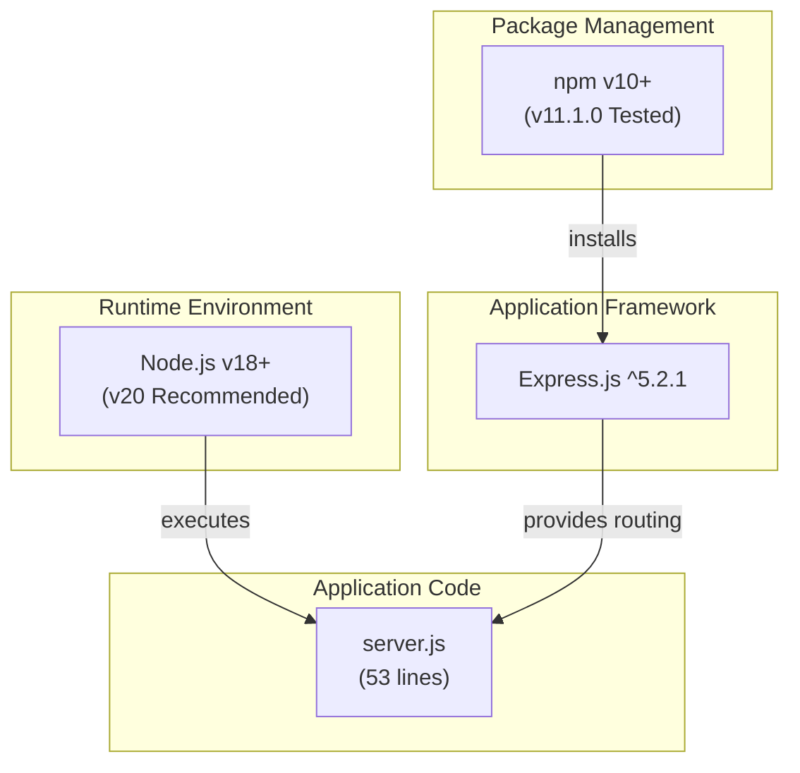
```mermaid
graph TD
    subgraph "Runtime Environment"
        A["Node.js v18+<br/>(v20 Recommended)"]
    end
    
    subgraph "Package Management"
        B["npm v10+<br/>(v11.1.0 Tested)"]
    end
    
    subgraph "Application Framework"
        C["Express.js ^5.2.1"]
    end
    
    subgraph "Application Code"
        D["server.js<br/>(53 lines)"]
    end
    
    B -->|"installs"| C
    A -->|"executes"| D
    C -->|"provides routing"| D
```

### 3.1.1 Technology Stack Summary

| Layer | Technology | Version | Purpose |
|-------|------------|---------|---------|
| Runtime | Node.js | v18+ (v20 recommended) | JavaScript execution environment |
| Package Manager | npm | v10+ (v11.1.0 tested) | Dependency management |
| Web Framework | Express.js | ^5.2.1 (pinned: 5.2.1) | HTTP routing and server handling |
| Total Dependencies | 66 packages | — | Transitive dependencies via npm |

---

## 3.2 Programming Languages

### 3.2.1 Primary Language: JavaScript (Node.js)

The application is implemented exclusively in JavaScript using the CommonJS module system. JavaScript was selected as the natural choice for a Node.js HTTP server demonstration, providing direct access to the npm ecosystem and Express.js framework.

| Attribute | Value | Evidence |
|-----------|-------|----------|
| Language | JavaScript (ES6+) | `server.js` implementation |
| Module System | CommonJS | `require('express')` syntax in `server.js` line 13 |
| Runtime | Node.js | Entry point defined in `package.json` |
| Minimum Version | v18+ | Express 5.x compatibility requirement |
| Recommended Version | v20.x (Iron LTS) | Tested on v20.19.6 per `Project Guide.md` |
| End of Life (v20) | April 2026 | Node.js LTS schedule |

#### Version Selection Justification

**Node.js v18+ Requirement:**
- Express.js 5.x mandates Node.js 18 or higher as documented in `package-lock.json` line 266
- This requirement enables the use of modern JavaScript features including `Array.flat()` and `path.isAbsolute()` native methods
- Allows Express to drop outdated third-party polyfill packages, reducing the dependency footprint

**Node.js v20 Recommendation:**
- Active LTS status (codename "Iron") ensures 30 months of critical bug fixes and security updates
- Tested configuration: v20.19.6 verified functional per `Project Guide.md`
- Performance improvements of up to 30% for file operations compared to earlier versions

#### Constraints and Dependencies

| Constraint | Description | Impact |
|------------|-------------|--------|
| No TypeScript | Pure JavaScript implementation | Reduced complexity, no transpilation required |
| No ESM | CommonJS module syntax only | Maximum compatibility with legacy tooling |
| No Build Step | Direct execution via `node` command | Zero configuration deployment |

### 3.2.2 Operating System Compatibility

The technology stack supports cross-platform development environments:

| Operating System | Support Status | Notes |
|------------------|----------------|-------|
| Linux | ✅ Supported | Primary development target |
| macOS | ✅ Supported | Full compatibility |
| Windows | ✅ Supported | Requires Node.js installation |

---

## 3.3 Frameworks & Libraries

### 3.3.1 Core Framework: Express.js

Express.js serves as the sole application framework, providing HTTP server capabilities, request routing, and response handling.

| Attribute | Value | Source |
|-----------|-------|--------|
| Package Name | `express` | `package.json` |
| Declared Version | `^5.2.1` (caret semver) | `package.json` line 13 |
| Resolved Version | `5.2.1` | `package-lock.json` line 231 |
| License | MIT | `package-lock.json` |
| Official Release Date | October 15, 2024 (v5.0.0) | Express.js release announcement |

#### Framework Features Utilized

The application leverages core Express.js capabilities for minimal HTTP server operation:

| Feature | Implementation | Location |
|---------|----------------|----------|
| `express()` | Application factory instantiation | `server.js` line 16 |
| `app.get()` | HTTP GET route handler registration | `server.js` lines 29, 41 |
| `res.type()` | Content-Type header configuration | `server.js` lines 30, 42 |
| `res.send()` | Response body transmission | `server.js` lines 30, 42 |
| `app.listen()` | TCP server binding | `server.js` line 50 |

#### Version Selection Justification

**Express.js 5.x Selection Rationale:**

1. **Security Improvements**: Express 5.x includes mitigations for CVE-2024-45590 (ReDoS vulnerability) and enhanced Regular Expression Denial of Service (ReDoS) protections through stricter path pattern validation

2. **Modern JavaScript Support**: Native async/await error handling—rejected promises are automatically forwarded to error-handling middleware, eliminating manual `try/catch` wrappers

3. **Reduced Dependencies**: By requiring Node.js 18+, Express 5.x replaces third-party polyfills with native Node.js APIs, simplifying the codebase and reducing attack surface

4. **Active Development**: Express 5.0 marks renewed active development after a decade of maintenance mode, with a commitment to regular updates aligned with Node.js LTS releases

#### Migration Context

The project underwent an architectural evolution from native Node.js HTTP handling to Express.js:

| Phase | Implementation | Description |
|-------|----------------|-------------|
| Original | Node.js `http` module | Native HTTP server with manual routing |
| Current | Express.js v5.2.1 | Framework-based declarative routing |

This migration preserved backward compatibility with the original `GET /` endpoint while adding the `/evening` route and improving code maintainability.

### 3.3.2 Framework Architecture

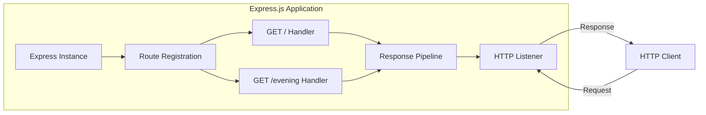
```mermaid
graph LR
    subgraph "Express.js Application"
        A[Express Instance] --> B[Route Registration]
        B --> C["GET / Handler"]
        B --> D["GET /evening Handler"]
        C --> E[Response Pipeline]
        D --> E
        E --> F[HTTP Listener]
    end
    
    G[HTTP Client] -->|Request| F
    F -->|Response| G
```

### 3.3.3 Excluded Frameworks

The following frameworks and libraries are explicitly **not** used, maintaining project simplicity:

| Category | Technology | Exclusion Rationale |
|----------|------------|---------------------|
| Middleware | morgan, cors, helmet | Minimal implementation scope |
| Templating | ejs, pug, handlebars | Static text responses only |
| ORM/Database | mongoose, sequelize | No data persistence required |
| Validation | joi, yup | No user input parameters |
| Testing | jest, mocha | Out of scope (placeholder only) |
| Type System | TypeScript | Added complexity for tutorial project |

---

## 3.4 Open Source Dependencies

### 3.4.1 Direct Dependencies

The project maintains a single direct dependency to minimize complexity and attack surface:

| Package | Version | Purpose | Registry |
|---------|---------|---------|----------|
| `express` | `^5.2.1` | Web application framework | npm (https://registry.npmjs.org) |

### 3.4.2 Transitive Dependencies

Express.js brings 66 transitive packages through its dependency tree. The following table documents key dependencies with their purposes:

| Package | Version | Purpose |
|---------|---------|---------|
| `accepts` | 2.0.0 | HTTP content negotiation |
| `body-parser` | 2.2.1 | Request body parsing (integrated in Express 5.x) |
| `bytes` | 3.1.2 | Byte string parsing utilities |
| `content-disposition` | 1.0.1 | Content-Disposition header handling |
| `content-type` | 1.0.5 | Content-Type header parsing |
| `cookie` | 0.7.2 | Cookie parsing utilities |
| `cookie-signature` | 1.2.2 | Cookie signing for integrity verification |
| `debug` | 4.4.3 | Debugging utility with namespace support |
| `depd` | 2.0.0 | Deprecation warning management |
| `encodeurl` | 2.0.0 | URL encoding utilities |
| `escape-html` | 1.0.3 | HTML entity escaping |
| `etag` | 1.8.1 | ETag generation for caching |
| `finalhandler` | 2.1.1 | Final HTTP response handling |
| `forwarded` | 0.2.0 | Forwarded header parsing for proxies |
| `fresh` | 2.0.0 | HTTP response freshness testing |
| `http-errors` | 2.0.1 | HTTP error object creation |
| `iconv-lite` | 0.7.x | Character encoding conversion |
| `merge-descriptors` | 2.0.0 | Object property descriptor merging |
| `mime-types` | 3.0.0+ | MIME type lookup and extension mapping |
| `ms` | 2.1.3 | Millisecond conversion utilities |
| `negotiator` | 1.0.0 | HTTP content negotiation |
| `on-finished` | 2.4.1 | Response completion callback |
| `once` | 1.4.0 | One-time function execution wrapper |
| `parseurl` | 1.3.3 | Request URL parsing |
| `proxy-addr` | 2.0.7 | Proxy address handling |
| `qs` | 6.14.0 | Query string parsing with nesting support |
| `range-parser` | 1.2.1 | Range header parsing for partial content |
| `raw-body` | 3.0.x | Raw request body parsing |
| `router` | 2.2.0 | Express routing engine |
| `send` | 1.1.0 | Static file serving |
| `serve-static` | 2.2.0 | Static file middleware |
| `statuses` | 2.0.1 | HTTP status code utilities |
| `type-is` | 2.0.1 | Request content-type inference |
| `vary` | 1.1.2 | Vary header manipulation |

### 3.4.3 Package Manager Configuration

| Attribute | Value | Source |
|-----------|-------|--------|
| Package Manager | npm | `package.json`, `package-lock.json` |
| Minimum Version | v10+ | `Project Guide.md` |
| Tested Version | v11.1.0 | `Project Guide.md` |
| Lockfile Version | 3 | `package-lock.json` line 4 |
| Registry | https://registry.npmjs.org | `package-lock.json` |

### 3.4.4 Security Posture

| Security Metric | Status | Evidence |
|-----------------|--------|----------|
| Total Packages Audited | 67 (including root) | `npm audit` output |
| Vulnerabilities Found | **0** | `Project Guide.md` line 38 |
| Express Security | CVE-2024-45590 mitigated | `Technical Specifications.md` |
| ReDoS Protection | Enhanced in v5.x | Express 5.0 release notes |

The dependency tree maintains a clean security profile with zero known vulnerabilities as verified by `npm audit`. Express 5.x includes specific mitigations for Regular Expression Denial of Service (ReDoS) attacks through stricter path pattern validation.

### 3.4.5 Dependency Update Strategy

| Activity | Frequency | Process |
|----------|-----------|---------|
| Security Monitoring | Continuous | Monitor Express.js security advisories |
| npm Audit | On install/update | Automated vulnerability scanning |
| Major Upgrades | As needed | Review breaking changes in release notes |

---

## 3.5 Third-Party Services

### 3.5.1 External Services: Not Applicable

This project operates as a **standalone application** with no external service dependencies. The following categories are explicitly not utilized:

| Service Category | Status | Rationale |
|------------------|--------|-----------|
| External APIs | ❌ None | Self-contained HTTP endpoints |
| Authentication Services | ❌ None | No user authentication required |
| Monitoring Tools | ❌ None | Development scope only |
| Cloud Services | ❌ None | Local development environment |
| Analytics | ❌ None | Test project, no telemetry |
| Logging Services | ❌ None | Console output only |

The only external interaction is with the **Backprop** integration testing tool, which consumes this server as a test target rather than as a dependency.

---

## 3.6 Databases & Storage

### 3.6.1 Data Persistence: Not Applicable

The application implements a **stateless architecture** with no data persistence requirements:

| Storage Category | Status | Rationale |
|------------------|--------|-----------|
| Primary Database | ❌ None | No data storage requirements |
| Secondary Database | ❌ None | Stateless endpoint responses |
| Caching Solutions | ❌ None | Static text responses |
| File Storage | ❌ None | No file upload/download features |
| Session Storage | ❌ None | No user session management |
| In-Memory Store | ❌ None | Hardcoded responses only |

As documented in Technical Specifications section 2.7, the project constraint explicitly states: **"Persistence: None (stateless)"**.

---

## 3.7 Development & Deployment

### 3.7.1 Development Tools

| Tool | Version | Purpose |
|------|---------|---------|
| Node.js | v18+ (v20.19.6 tested) | JavaScript runtime environment |
| npm | v10+ (v11.1.0 tested) | Package management and script execution |
| curl | System default | Manual HTTP endpoint testing |
| node --check | Built-in | JavaScript syntax validation |

### 3.7.2 npm Scripts

The project provides standard npm scripts for lifecycle management:

| Script | Command | Purpose |
|--------|---------|---------|
| `start` | `node server.js` | Launch the HTTP server |
| `test` | `echo "Error: no test specified" && exit 1` | Placeholder (tests out of scope) |

### 3.7.3 Installation & Startup

```
# Installation

npm install
# Output: "added 66 packages, and audited 67 packages... found 0 vulnerabilities"

#### Server Startup

npm start
#### Output: "Server running at http://127.0.0.1:3000/"

```

### 3.7.4 Server Configuration

| Setting | Value | Source | Configurability |
|---------|-------|--------|-----------------|
| Port | 3000 | `server.js` line 19 | Hardcoded |
| Host | 127.0.0.1 | `server.js` line 51 | Hardcoded |
| Protocol | HTTP | No TLS implementation | Fixed |

**Note:** Environment variable configuration (e.g., `process.env.PORT`) is intentionally excluded to maintain tutorial simplicity. This is documented as a potential future enhancement with 0.25 hours estimated effort.

### 3.7.5 Build System

| Aspect | Status | Description |
|--------|--------|-------------|
| Build Step | ❌ None | No compilation or transpilation |
| Bundling | ❌ None | Single-file execution |
| Minification | ❌ None | Development code only |
| Source Maps | ❌ None | Not applicable |

The application executes directly via the Node.js runtime without any build preprocessing, maintaining the simplest possible deployment model.

### 3.7.6 Containerization

| Aspect | Status | Rationale |
|--------|--------|-----------|
| Docker | ❌ Not Implemented | Explicitly out of scope per Technical Specifications |
| Dockerfile | ❌ Not Present | Tutorial simplicity |
| Docker Compose | ❌ Not Present | Single-process architecture |

Containerization is documented as explicitly **out of scope** in Technical Specifications section 1.3.2 (Excluded Features).

### 3.7.7 CI/CD Pipeline

| Aspect | Status | Future Consideration |
|--------|--------|---------------------|
| Continuous Integration | ❌ Not Implemented | Low priority enhancement |
| Continuous Deployment | ❌ Not Implemented | Not required for test project |
| Automated Testing | ❌ Placeholder only | Recommended: Jest or Mocha |
| GitHub Actions | ❌ Not Configured | Suggested platform if needed |

As documented in `Project Guide.md`, CI/CD implementation is listed as a **low priority** future enhancement rather than a current requirement.

### 3.7.8 Validation Process

The following validation steps are performed to verify proper operation:

| Validation | Command | Expected Result |
|------------|---------|-----------------|
| Syntax Check | `node --check server.js` | No output (valid syntax) |
| Package Integrity | `npm install` | 0 vulnerabilities |
| Server Start | `npm start` | "Server running at http://127.0.0.1:3000/" |
| Root Endpoint | `curl http://localhost:3000/` | "Hello, World!\n" (200 OK) |
| Evening Endpoint | `curl http://localhost:3000/evening` | "Good evening" (200 OK) |

---

## 3.8 Architectural Constraints

### 3.8.1 Design Constraints

The technology stack operates within intentional architectural boundaries to maintain project focus:

| Constraint | Value | Rationale |
|------------|-------|-----------|
| Single-File Architecture | All code in `server.js` (53 lines) | Tutorial simplicity |
| No Environment Variables | Hardcoded configuration | Minimal implementation scope |
| No Custom Middleware | Express defaults only | Reduced complexity |
| No Module Separation | Monolithic structure | Test project requirements |
| Localhost Only | 127.0.0.1 binding | Development scope restriction |
| HTTP Only | No TLS/SSL | Tutorial-grade security |

### 3.8.2 Performance Characteristics

| Metric | Target | Notes |
|--------|--------|-------|
| Response Time | < 100ms | Local development environment |
| Startup Time | < 2 seconds | Cold start |
| Memory Footprint | ~50MB | Base Express application |
| Concurrency | Express default | Single-process model |

### 3.8.3 Scalability Limitations

| Aspect | Current State | Notes |
|--------|---------------|-------|
| Process Model | Single-process | No clustering implemented |
| Load Balancing | Not implemented | Out of scope |
| Horizontal Scaling | Not supported | Single instance only |
| Session Management | None | Stateless endpoints |

**Note:** As a test project for Backprop integration, scalability is explicitly out of scope. The single-process architecture is intentional and appropriate for the project's validation purposes.

---

## 3.9 Future Technology Considerations

### 3.9.1 Recommended Enhancements

The following technology additions are identified for potential future implementation if the project scope expands:

| Enhancement | Priority | Effort | Technology |
|-------------|----------|--------|------------|
| Unit Testing | Low | 1 hour | Jest or Mocha |
| CI/CD Pipeline | Low | 1-2 hours | GitHub Actions |
| TypeScript Migration | Low | 2-4 hours | TypeScript 5.x |
| API Documentation | Low | 1 hour | Swagger/OpenAPI |
| Process Manager | Low | 0.25 hours | PM2 |
| Environment Variables | Low | 0.25 hours | `process.env.PORT` |
| Health Check Endpoint | Low | 0.25 hours | `GET /health` route |
| Request Logging | Low | 0.25 hours | morgan middleware |

### 3.9.2 Not Recommended for This Project

The following technologies are explicitly inappropriate for this test project's scope:

| Technology | Reason for Exclusion |
|------------|---------------------|
| Kubernetes/Docker Orchestration | Over-engineering for single-file app |
| Database Integration | Stateless design by requirement |
| Authentication/OAuth | No user management needed |
| Message Queues | No async processing requirements |
| Microservices Architecture | Contradicts tutorial simplicity goal |

---

## 3.10 References

### 3.10.1 Repository Files Examined

- `server.js` — Primary Express.js implementation containing route handlers, port configuration, and server listener (53 lines)
- `package.json` — Project metadata, npm scripts (`start`, `test`), and dependency declaration (express ^5.2.1)
- `package-lock.json` — Complete dependency tree with pinned versions, integrity hashes, and registry URLs (66 transitive packages)
- `README.md` — Prerequisites documentation (Node.js v18+, npm), installation instructions, and API endpoint reference
- `blitzy/documentation/Technical Specifications.md` — Detailed technical requirements, dependency inventory, version rationale, and security considerations
- `blitzy/documentation/Project Guide.md` — Tested toolchain versions (Node v20.19.6, npm v11.1.0), validation results, and security audit confirmation

### 3.10.2 External Sources Consulted

- Express.js v5.0 Release Announcement (October 15, 2024) — Version features and security improvements
- Node.js Release Schedule — LTS versioning and support timelines
- npm Package Registry — Express.js v5.2.1 package metadata

# 4. Process Flowchart

This section documents the complete system workflows, integration processes, state transitions, and error handling flows for the Hello World Node.js Server. As a minimal test project designed for Backprop integration testing, the process flows are intentionally streamlined while maintaining proper documentation of all decision points, system boundaries, and user touchpoints.

## 4.1 Overview

### 4.1.1 Process Flow Architecture

The Hello World Node.js Server implements a stateless, synchronous request-response architecture with minimal complexity. All process flows follow a linear execution model with Express.js default error handling serving as the primary fallback mechanism.

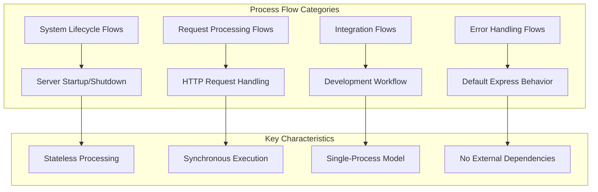
```mermaid
graph TB
    subgraph "Process Flow Categories"
        A[System Lifecycle Flows] --> B[Server Startup/Shutdown]
        C[Request Processing Flows] --> D[HTTP Request Handling]
        E[Integration Flows] --> F[Development Workflow]
        G[Error Handling Flows] --> H[Default Express Behavior]
    end
    
    subgraph "Key Characteristics"
        I[Stateless Processing]
        J[Synchronous Execution]
        K[Single-Process Model]
        L[No External Dependencies]
    end
    
    B --> I
    D --> J
    F --> K
    H --> L
```

### 4.1.2 Process Flow Summary

| Flow Category | Process Count | Complexity | State Management |
|---------------|---------------|------------|------------------|
| Server Lifecycle | 2 (Start/Stop) | Low | None |
| Request Processing | 3 (/, /evening, 404) | Low | Per-request only |
| Installation & Deployment | 3 phases | Low | File system |
| Error Handling | 2 (404, 500) | Low | Express default |
| Validation | 5 steps | Low | None |

### 4.1.3 Actors and System Boundaries

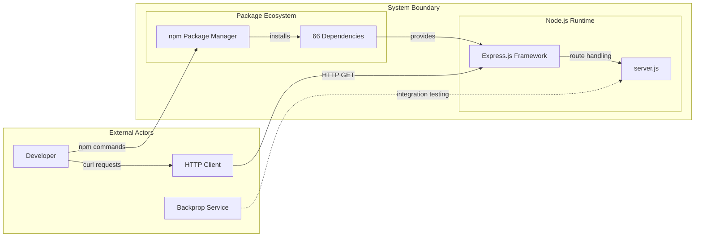
```mermaid
graph LR
    subgraph "External Actors"
        DEV[Developer]
        CLIENT[HTTP Client]
        BACKPROP[Backprop Service]
    end
    
    subgraph "System Boundary"
        subgraph "Node.js Runtime"
            SERVER[server.js]
            EXPRESS[Express.js Framework]
        end
        
        subgraph "Package Ecosystem"
            NPM[npm Package Manager]
            DEPS[66 Dependencies]
        end
    end
    
    DEV -->|npm commands| NPM
    DEV -->|curl requests| CLIENT
    CLIENT -->|HTTP GET| EXPRESS
    EXPRESS -->|route handling| SERVER
    NPM -->|installs| DEPS
    DEPS -->|provides| EXPRESS
    BACKPROP -.->|integration testing| SERVER
```

---

## 4.2 Core System Workflows

### 4.2.1 Server Lifecycle Flow

The server lifecycle encompasses initialization, runtime operation, and graceful shutdown. This represents the foundational process flow upon which all other workflows depend.

#### Server Startup Process

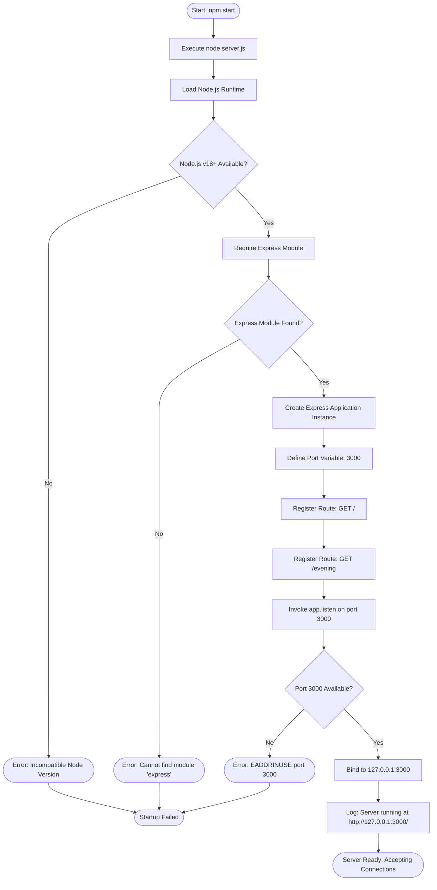
```mermaid
flowchart TD
    START([Start: npm start]) --> A[Execute node server.js]
    A --> B[Load Node.js Runtime]
    B --> C{Node.js v18+ Available?}
    C -->|No| ERR1([Error: Incompatible Node Version])
    C -->|Yes| D[Require Express Module]
    D --> E{Express Module Found?}
    E -->|No| ERR2([Error: Cannot find module 'express'])
    E -->|Yes| F[Create Express Application Instance]
    F --> G[Define Port Variable: 3000]
    G --> H[Register Route: GET /]
    H --> I[Register Route: GET /evening]
    I --> J[Invoke app.listen on port 3000]
    J --> K{Port 3000 Available?}
    K -->|No| ERR3([Error: EADDRINUSE port 3000])
    K -->|Yes| L[Bind to 127.0.0.1:3000]
    L --> M[Log: Server running at http://127.0.0.1:3000/]
    M --> SUCCESS([Server Ready: Accepting Connections])
    
    ERR1 --> FAIL([Startup Failed])
    ERR2 --> FAIL
    ERR3 --> FAIL
```

#### Startup Process Steps

| Step | Location | Action | Duration Target |
|------|----------|--------|-----------------|
| 1 | CLI | Execute `npm start` | Immediate |
| 2 | `server.js` Line 16 | Load Express module | < 500ms |
| 3 | `server.js` Line 16 | Create app instance | < 10ms |
| 4 | `server.js` Line 19 | Set port constant | < 1ms |
| 5 | `server.js` Lines 29-31 | Register `/` route | < 1ms |
| 6 | `server.js` Lines 41-43 | Register `/evening` route | < 1ms |
| 7 | `server.js` Lines 50-52 | Start HTTP listener | < 100ms |
| **Total** | | | **< 2 seconds** |

#### Server Shutdown Process

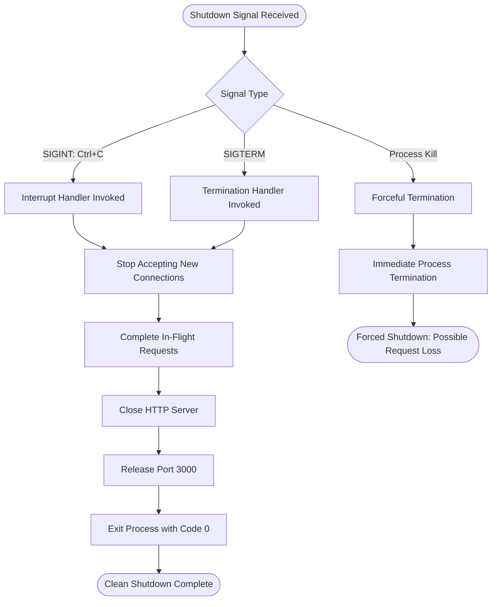
```mermaid
flowchart TD
    START([Shutdown Signal Received]) --> A{Signal Type}
    A -->|SIGINT: Ctrl+C| B[Interrupt Handler Invoked]
    A -->|SIGTERM| C[Termination Handler Invoked]
    A -->|Process Kill| D[Forceful Termination]
    
    B --> E[Stop Accepting New Connections]
    C --> E
    E --> F[Complete In-Flight Requests]
    F --> G[Close HTTP Server]
    G --> H[Release Port 3000]
    H --> I[Exit Process with Code 0]
    I --> SUCCESS([Clean Shutdown Complete])
    
    D --> J[Immediate Process Termination]
    J --> WARN([Forced Shutdown: Possible Request Loss])
```

### 4.2.2 HTTP Request Processing Flow

The core business process of the application is handling HTTP GET requests to the two defined endpoints. Each request follows a synchronous, stateless processing pattern.

#### High-Level Request Flow

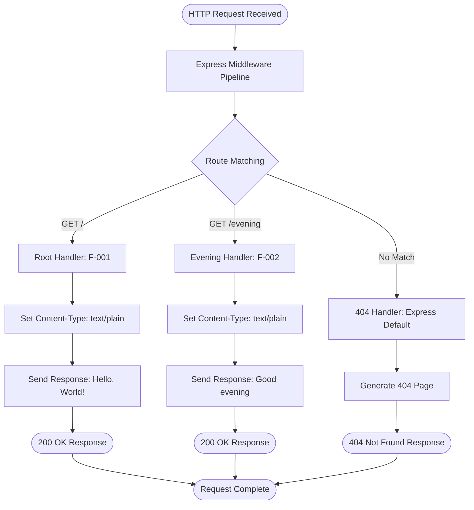
```mermaid
flowchart TD
    START([HTTP Request Received]) --> A[Express Middleware Pipeline]
    A --> B{Route Matching}
    B -->|GET /| C[Root Handler: F-001]
    B -->|GET /evening| D[Evening Handler: F-002]
    B -->|No Match| E[404 Handler: Express Default]
    
    C --> F[Set Content-Type: text/plain]
    F --> G[Send Response: Hello, World!\n]
    G --> RESP1([200 OK Response])
    
    D --> H[Set Content-Type: text/plain]
    H --> I[Send Response: Good evening]
    I --> RESP2([200 OK Response])
    
    E --> J[Generate 404 Page]
    J --> RESP3([404 Not Found Response])
    
    RESP1 --> END([Request Complete])
    RESP2 --> END
    RESP3 --> END
```

#### Detailed Root Endpoint Flow (GET /)

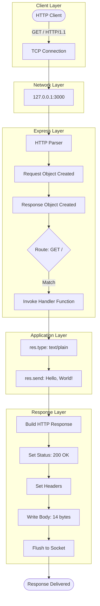
```mermaid
flowchart TD
    subgraph "Client Layer"
        A([HTTP Client]) -->|GET / HTTP/1.1| B[TCP Connection]
    end
    
    subgraph "Network Layer"
        B --> C[127.0.0.1:3000]
    end
    
    subgraph "Express Layer"
        C --> D[HTTP Parser]
        D --> E[Request Object Created]
        E --> F[Response Object Created]
        F --> G{Route: GET /}
        G -->|Match| H[Invoke Handler Function]
    end
    
    subgraph "Application Layer"
        H --> I[res.type: text/plain]
        I --> J[res.send: Hello, World!\n]
    end
    
    subgraph "Response Layer"
        J --> K[Build HTTP Response]
        K --> L[Set Status: 200 OK]
        L --> M[Set Headers]
        M --> N[Write Body: 14 bytes]
        N --> O[Flush to Socket]
    end
    
    O --> P([Response Delivered])
```

#### Request Processing Timing

| Phase | Component | Target Duration | SLA |
|-------|-----------|-----------------|-----|
| TCP Handshake | Network | < 1ms (localhost) | N/A |
| Request Parsing | Express | < 5ms | N/A |
| Route Matching | Express | < 1ms | N/A |
| Handler Execution | `server.js` | < 1ms | N/A |
| Response Serialization | Express | < 5ms | N/A |
| **Total Response Time** | End-to-end | **< 100ms** | Informal |

### 4.2.3 Endpoint-Specific Process Flows

#### Feature F-001: Hello World Endpoint

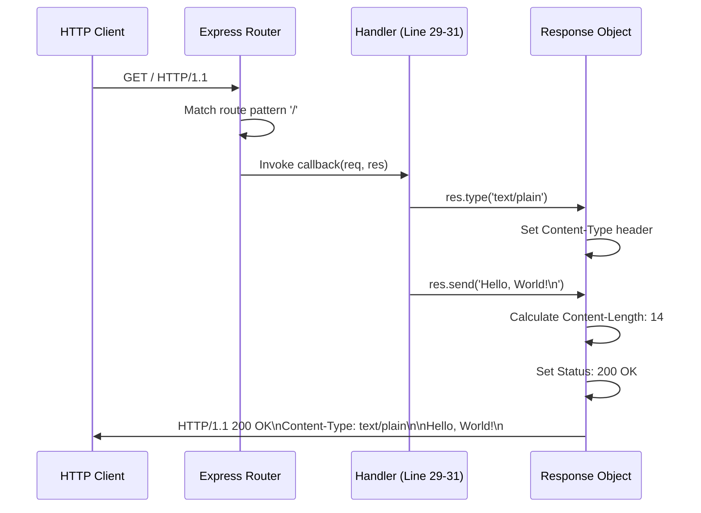
```mermaid
sequenceDiagram
    participant C as HTTP Client
    participant E as Express Router
    participant H as Handler (Line 29-31)
    participant R as Response Object
    
    C->>E: GET / HTTP/1.1
    E->>E: Match route pattern '/'
    E->>H: Invoke callback(req, res)
    H->>R: res.type('text/plain')
    R->>R: Set Content-Type header
    H->>R: res.send('Hello, World!\n')
    R->>R: Calculate Content-Length: 14
    R->>R: Set Status: 200 OK
    R->>C: HTTP/1.1 200 OK\nContent-Type: text/plain\n\nHello, World!\n
```

**Validation Rules for F-001:**

| Rule | Check | Implementation |
|------|-------|----------------|
| Method Validation | GET only | Express route definition |
| Path Matching | Exact match `/` | Express routing |
| Response Format | Plain text | `res.type('text/plain')` |
| Response Body | Exact match | Literal string with newline |

#### Feature F-002: Good Evening Endpoint

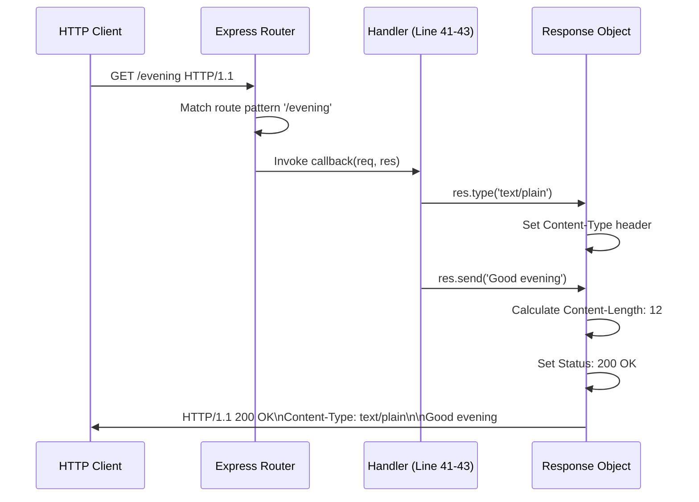
```mermaid
sequenceDiagram
    participant C as HTTP Client
    participant E as Express Router
    participant H as Handler (Line 41-43)
    participant R as Response Object
    
    C->>E: GET /evening HTTP/1.1
    E->>E: Match route pattern '/evening'
    E->>H: Invoke callback(req, res)
    H->>R: res.type('text/plain')
    R->>R: Set Content-Type header
    H->>R: res.send('Good evening')
    R->>R: Calculate Content-Length: 12
    R->>R: Set Status: 200 OK
    R->>C: HTTP/1.1 200 OK\nContent-Type: text/plain\n\nGood evening
```

**Validation Rules for F-002:**

| Rule | Check | Implementation |
|------|-------|----------------|
| Method Validation | GET only | Express route definition |
| Path Matching | Exact match `/evening` | Express routing |
| Response Format | Plain text | `res.type('text/plain')` |
| Response Body | Exact match | Literal string without newline |

---

## 4.3 Integration Workflows

### 4.3.1 Development Environment Setup Flow

The installation workflow transforms a cloned repository into a runnable server instance through dependency resolution and configuration.

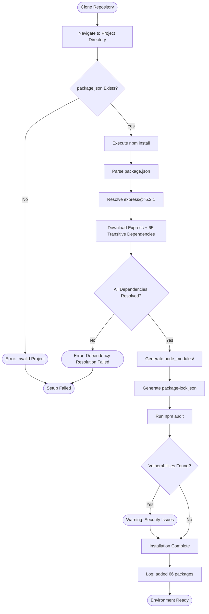
```mermaid
flowchart TD
    START([Clone Repository]) --> A[Navigate to Project Directory]
    A --> B{package.json Exists?}
    B -->|No| ERR1([Error: Invalid Project])
    B -->|Yes| C[Execute npm install]
    
    C --> D[Parse package.json]
    D --> E[Resolve express@^5.2.1]
    E --> F[Download Express + 65 Transitive Dependencies]
    F --> G{All Dependencies Resolved?}
    G -->|No| ERR2([Error: Dependency Resolution Failed])
    G -->|Yes| H[Generate node_modules/]
    H --> I[Generate package-lock.json]
    I --> J[Run npm audit]
    J --> K{Vulnerabilities Found?}
    K -->|Yes| WARN([Warning: Security Issues])
    K -->|No| L[Installation Complete]
    WARN --> L
    L --> M[Log: added 66 packages]
    M --> SUCCESS([Environment Ready])
    
    ERR1 --> FAIL([Setup Failed])
    ERR2 --> FAIL
```

#### Installation Process Details

| Phase | Command | Output | Duration |
|-------|---------|--------|----------|
| 1. Dependency Install | `npm install` | "added 66 packages" | 5-30s |
| 2. Security Audit | `npm audit` | "found 0 vulnerabilities" | < 5s |
| 3. Lock File | Auto-generated | `package-lock.json` | Included |

### 4.3.2 Complete Developer Workflow

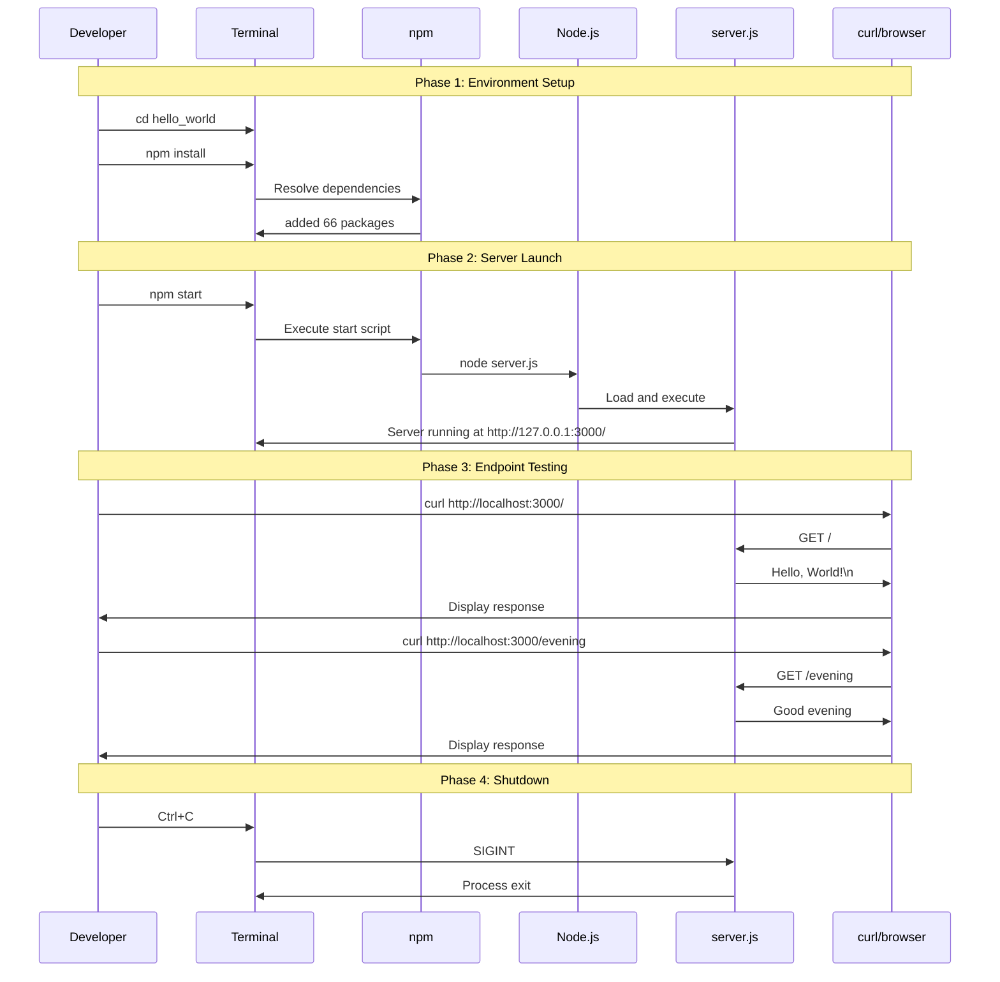
```mermaid
sequenceDiagram
    participant Dev as Developer
    participant Term as Terminal
    participant NPM as npm
    participant Node as Node.js
    participant Server as server.js
    participant Client as curl/browser
    
    Note over Dev,Client: Phase 1: Environment Setup
    Dev->>Term: cd hello_world
    Dev->>Term: npm install
    Term->>NPM: Resolve dependencies
    NPM->>Term: added 66 packages
    
    Note over Dev,Client: Phase 2: Server Launch
    Dev->>Term: npm start
    Term->>NPM: Execute start script
    NPM->>Node: node server.js
    Node->>Server: Load and execute
    Server->>Term: Server running at http://127.0.0.1:3000/
    
    Note over Dev,Client: Phase 3: Endpoint Testing
    Dev->>Client: curl http://localhost:3000/
    Client->>Server: GET /
    Server->>Client: Hello, World!\n
    Client->>Dev: Display response
    
    Dev->>Client: curl http://localhost:3000/evening
    Client->>Server: GET /evening
    Server->>Client: Good evening
    Client->>Dev: Display response
    
    Note over Dev,Client: Phase 4: Shutdown
    Dev->>Term: Ctrl+C
    Term->>Server: SIGINT
    Server->>Term: Process exit
```

### 4.3.3 Backprop Integration Flow

As a test project for Backprop integration, the system supports external tool interaction for code analysis and AI-assisted development.

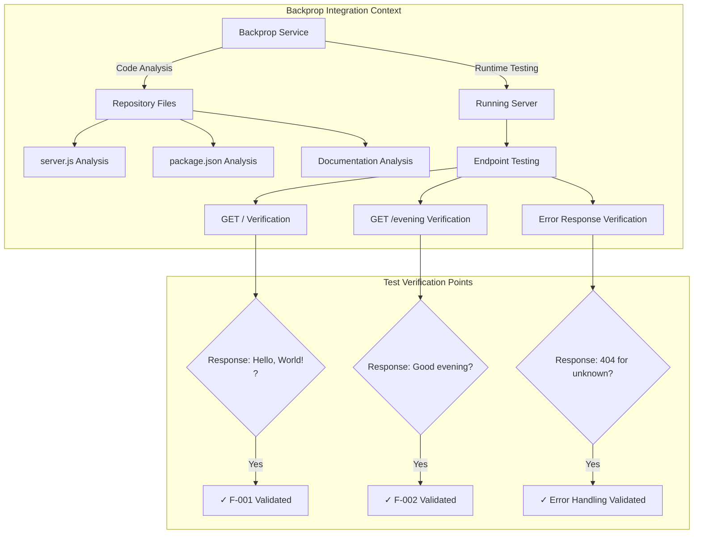
```mermaid
flowchart TD
    subgraph "Backprop Integration Context"
        A[Backprop Service] -->|Code Analysis| B[Repository Files]
        A -->|Runtime Testing| C[Running Server]
        
        B --> D[server.js Analysis]
        B --> E[package.json Analysis]
        B --> F[Documentation Analysis]
        
        C --> G[Endpoint Testing]
        G --> H[GET / Verification]
        G --> I[GET /evening Verification]
        G --> J[Error Response Verification]
    end
    
    subgraph "Test Verification Points"
        H --> K{Response: Hello, World!\n?}
        I --> L{Response: Good evening?}
        J --> M{Response: 404 for unknown?}
        
        K -->|Yes| N[✓ F-001 Validated]
        L -->|Yes| O[✓ F-002 Validated]
        M -->|Yes| P[✓ Error Handling Validated]
    end
```

### 4.3.4 API Interaction Data Flow

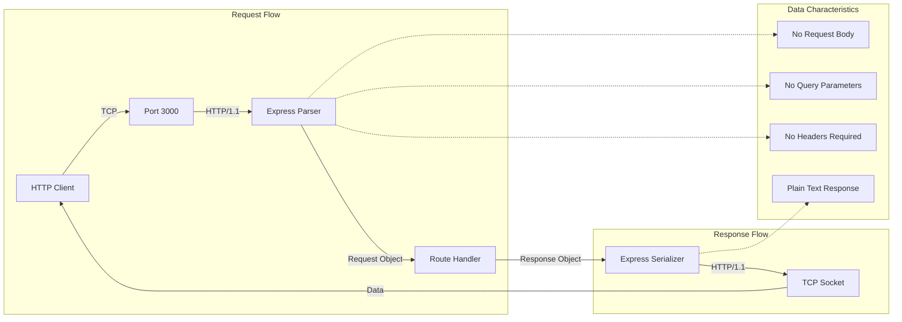
```mermaid
flowchart LR
    subgraph "Request Flow"
        A[HTTP Client] -->|TCP| B[Port 3000]
        B -->|HTTP/1.1| C[Express Parser]
        C -->|Request Object| D[Route Handler]
    end
    
    subgraph "Response Flow"
        D -->|Response Object| E[Express Serializer]
        E -->|HTTP/1.1| F[TCP Socket]
        F -->|Data| A
    end
    
    subgraph "Data Characteristics"
        G[No Request Body]
        H[No Query Parameters]
        I[No Headers Required]
        J[Plain Text Response]
    end
    
    C -.-> G
    C -.-> H
    C -.-> I
    E -.-> J
```

---

## 4.4 State Management

### 4.4.1 Application State Model

The Hello World Server implements a fully stateless architecture. No application state persists between requests, and no external state storage is utilized.

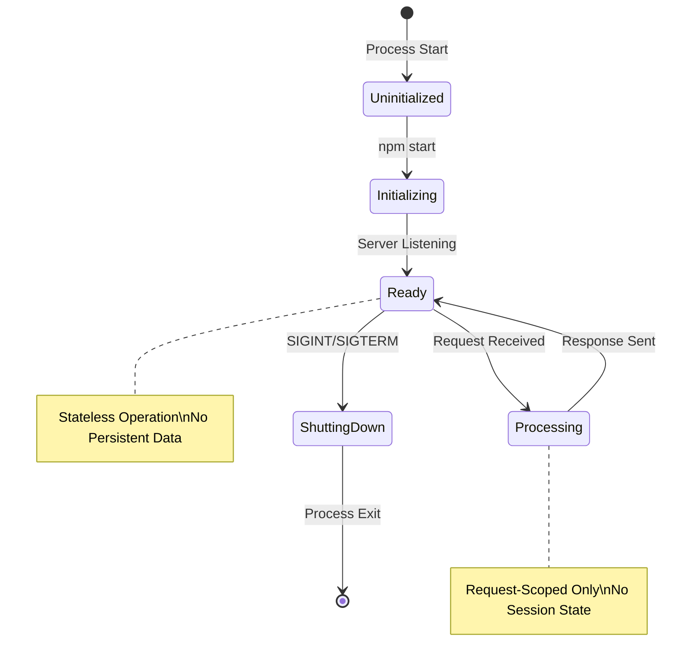
```mermaid
stateDiagram-v2
    [*] --> Uninitialized: Process Start
    Uninitialized --> Initializing: npm start
    Initializing --> Ready: Server Listening
    Ready --> Processing: Request Received
    Processing --> Ready: Response Sent
    Ready --> ShuttingDown: SIGINT/SIGTERM
    ShuttingDown --> [*]: Process Exit
    
    note right of Ready: Stateless Operation\nNo Persistent Data
    note right of Processing: Request-Scoped Only\nNo Session State
```

### 4.4.2 State Transition Details

| Current State | Trigger | Next State | Side Effects |
|---------------|---------|------------|--------------|
| Uninitialized | `npm start` | Initializing | Process spawned |
| Initializing | Server bound | Ready | Console log output |
| Ready | HTTP Request | Processing | Request/Response objects created |
| Processing | Response sent | Ready | Objects garbage collected |
| Ready | SIGINT | ShuttingDown | Stop accepting connections |
| ShuttingDown | Cleanup complete | Terminated | Process exit code 0 |

### 4.4.3 Request State Lifecycle

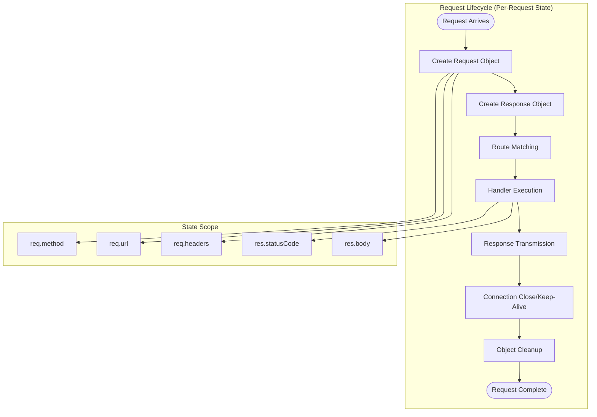
```mermaid
flowchart TD
    subgraph "Request Lifecycle (Per-Request State)"
        A([Request Arrives]) --> B[Create Request Object]
        B --> C[Create Response Object]
        C --> D[Route Matching]
        D --> E[Handler Execution]
        E --> F[Response Transmission]
        F --> G[Connection Close/Keep-Alive]
        G --> H[Object Cleanup]
        H --> I([Request Complete])
    end
    
    subgraph "State Scope"
        J[req.method]
        K[req.url]
        L[req.headers]
        M[res.statusCode]
        N[res.body]
    end
    
    B --> J
    B --> K
    B --> L
    E --> M
    E --> N
```

### 4.4.4 Data Persistence Analysis

| Persistence Type | Implementation | Notes |
|------------------|----------------|-------|
| Database | None | Out of scope |
| File System | None | Read-only code files |
| Session Storage | None | Stateless design |
| Caching | None | Not required |
| Environment Variables | None | Hardcoded configuration |

---

## 4.5 Error Handling Flows

### 4.5.1 Error Classification

| Error Category | Handling Mechanism | Response |
|----------------|-------------------|----------|
| Route Not Found | Express Default 404 | HTML error page |
| Unhandled Exception | Express Default 500 | HTML error page |
| Port Unavailable | Node.js EADDRINUSE | Process exit |
| Module Not Found | Node.js MODULE_NOT_FOUND | Process exit |

### 4.5.2 404 Error Flow

```mermaid
flowchart TD
    START([GET /invalid-path]) --> A[Express Router]
    A --> B{Route Match?}
    B -->|No Match Found| C[Express Default 404 Handler]
    C --> D[Generate HTML Error Page]
    D --> E[Set Status: 404]
    E --> F[Set Content-Type: text/html]
    F --> G[Send Error Response]
    G --> END([404 Not Found Delivered])
    
    subgraph "Error Response Details"
        H[Status: 404 Not Found]
        I[Body: Cannot GET /invalid-path]
    end
    
    G --> H
    G --> I
```

### 4.5.3 Startup Error Flow

```mermaid
flowchart TD
    START([npm start]) --> A{Validation Checks}
    
    A --> B{Node.js Installed?}
    B -->|No| ERR1[Error: node command not found]
    
    A --> C{Express Module Available?}
    C -->|No| ERR2[Error: Cannot find module 'express']
    
    A --> D{Port 3000 Free?}
    D -->|No| ERR3[Error: EADDRINUSE port 3000]
    
    ERR1 --> FAIL([Process Exit: Non-Zero])
    ERR2 --> FAIL
    ERR3 --> FAIL
    
    B -->|Yes| C
    C -->|Yes| D
    D -->|Yes| SUCCESS([Server Running])
```

### 4.5.4 Error Recovery Procedures

```mermaid
flowchart TD
    subgraph "Port Conflict Recovery"
        A[EADDRINUSE Detected] --> B[Identify Process on Port 3000]
        B --> C[Execute: lsof -ti:3000]
        C --> D[Kill Process: xargs kill]
        D --> E[Retry: npm start]
        E --> F([Server Running])
    end
    
    subgraph "Missing Dependencies Recovery"
        G[MODULE_NOT_FOUND Detected] --> H[Execute: npm install]
        H --> I[Verify node_modules/]
        I --> J[Retry: npm start]
        J --> K([Server Running])
    end
```

### 4.5.5 Error Response Matrix

| Error Scenario | HTTP Status | Content-Type | Body |
|----------------|-------------|--------------|------|
| Valid route (/) | 200 OK | text/plain | Hello, World!\n |
| Valid route (/evening) | 200 OK | text/plain | Good evening |
| Unknown route | 404 Not Found | text/html | Cannot GET /path |
| Server error | 500 Internal Server Error | text/html | Error details |

---

## 4.6 Validation and Testing Workflows

### 4.6.1 Manual Validation Flow

```mermaid
flowchart TD
    START([Begin Validation]) --> A[Step 1: Syntax Check]
    A --> B[Execute: node --check server.js]
    B --> C{Syntax Valid?}
    C -->|No| FAIL1([Syntax Error])
    C -->|Yes| D[Step 2: Package Integrity]
    
    D --> E[Execute: npm install]
    E --> F{0 Vulnerabilities?}
    F -->|No| WARN([Security Warning])
    F -->|Yes| G[Step 3: Server Start]
    WARN --> G
    
    G --> H[Execute: npm start]
    H --> I{Server Running Message?}
    I -->|No| FAIL2([Startup Failed])
    I -->|Yes| J[Step 4: Root Endpoint Test]
    
    J --> K[Execute: curl localhost:3000/]
    K --> L{Response: Hello, World!\n?}
    L -->|No| FAIL3([F-001 Failed])
    L -->|Yes| M[Step 5: Evening Endpoint Test]
    
    M --> N[Execute: curl localhost:3000/evening]
    N --> O{Response: Good evening?}
    O -->|No| FAIL4([F-002 Failed])
    O -->|Yes| P[Step 6: 404 Test]
    
    P --> Q[Execute: curl localhost:3000/invalid]
    Q --> R{Response: 404 Page?}
    R -->|No| FAIL5([404 Handling Failed])
    R -->|Yes| SUCCESS([All Validations Passed])
    
    FAIL1 --> END([Validation Failed])
    FAIL2 --> END
    FAIL3 --> END
    FAIL4 --> END
    FAIL5 --> END
```

### 4.6.2 Validation Checklist

| Step | Command | Expected Output | Status Indicator |
|------|---------|-----------------|------------------|
| 1 | `node --check server.js` | No output | ✓ Valid syntax |
| 2 | `npm install` | "found 0 vulnerabilities" | ✓ Secure |
| 3 | `npm start` | "Server running at..." | ✓ Operational |
| 4 | `curl localhost:3000/` | "Hello, World!\n" | ✓ F-001 Pass |
| 5 | `curl localhost:3000/evening` | "Good evening" | ✓ F-002 Pass |
| 6 | `curl localhost:3000/invalid` | HTML 404 page | ✓ Error handling |

### 4.6.3 Requirements Traceability Flow

```mermaid
flowchart LR
    subgraph "Requirements"
        R1[F-001-RQ-001: Route Definition]
        R2[F-001-RQ-002: Response Body]
        R3[F-002-RQ-001: Route Definition]
        R4[F-002-RQ-002: Response Body]
        R5[F-003-RQ-001: Port Binding]
        R6[F-004-RQ-001: npm Scripts]
    end
    
    subgraph "Implementation"
        I1[server.js Line 29]
        I2[server.js Line 30]
        I3[server.js Line 41]
        I4[server.js Line 42]
        I5[server.js Line 50]
        I6[package.json scripts]
    end
    
    subgraph "Verification"
        V1[curl GET /]
        V2[Response Inspection]
        V3[curl GET /evening]
        V4[npm start]
    end
    
    R1 --> I1 --> V1
    R2 --> I2 --> V2
    R3 --> I3 --> V3
    R4 --> I4 --> V2
    R5 --> I5 --> V4
    R6 --> I6 --> V4
```

---

## 4.7 Deployment and Rollback Workflows

### 4.7.1 Deployment Sequence

```mermaid
flowchart TD
    subgraph "Phase 1: Dependency Installation"
        A1[Run npm install express@^5.2.1 --save] --> A2[Verify package.json updated]
        A2 --> A3[Confirm package-lock.json regenerated]
    end
    
    subgraph "Phase 2: Server Configuration"
        B1[Modify server.js imports] --> B2[Create Express app instance]
        B2 --> B3[Implement route handlers]
        B3 --> B4[Configure server listener]
    end
    
    subgraph "Phase 3: Configuration Updates"
        C1[Update package.json main entry] --> C2[Add start script]
    end
    
    subgraph "Phase 4: Documentation"
        D1[Update README.md]
    end
    
    subgraph "Phase 5: Verification"
        E1[Start server: npm start] --> E2[Test GET / endpoint]
        E2 --> E3[Test GET /evening endpoint]
        E3 --> E4{All Tests Pass?}
        E4 -->|Yes| SUCCESS([Deployment Complete])
        E4 -->|No| ROLLBACK([Initiate Rollback])
    end
    
    A3 --> B1
    B4 --> C1
    C2 --> D1
    D1 --> E1
```

### 4.7.2 Rollback Flow

```mermaid
flowchart TD
    START([Rollback Triggered]) --> A{Rollback Reason}
    
    A -->|Express Install Failed| B[Remove express from package.json]
    A -->|Server Start Failed| C[Restore original server.js]
    A -->|Endpoints Incorrect| D[Revert code changes]
    
    B --> E[Run npm install]
    C --> E
    D --> E
    
    E --> F[Regenerate package-lock.json]
    F --> G[Verify original functionality]
    G --> H{System Operational?}
    
    H -->|Yes| SUCCESS([Rollback Complete])
    H -->|No| ESCALATE([Manual Intervention Required])
```

### 4.7.3 Rollback Triggers

| Trigger Condition | Detection Method | Recovery Action |
|-------------------|------------------|-----------------|
| Express installation fails | npm error output | Restore package.json |
| Server fails to start | Missing startup message | Check error logs |
| Endpoints non-responsive | curl returns error | Verify route definitions |
| Incorrect response content | Response body mismatch | Revert handler code |

---

## 4.8 Timing and Performance Considerations

### 4.8.1 Performance Targets

| Metric | Target | Measurement Method |
|--------|--------|-------------------|
| Server Cold Start | < 2 seconds | Time from `npm start` to ready message |
| Request Latency | < 100ms | curl with timing |
| Memory Footprint | ~50MB | Process memory usage |
| Concurrent Connections | Express default | Single-threaded model |

### 4.8.2 Request Timing Breakdown

```mermaid
gantt
    dateFormat X
    axisFormat %L ms
    title Request Processing Timeline (Target: < 100ms)
    
    section Network
    TCP Handshake        :0, 1
    
    section Express
    Request Parsing      :1, 6
    Route Matching       :6, 7
    
    section Application
    Handler Execution    :7, 8
    
    section Response
    Serialization        :8, 13
    Transmission         :13, 15
```

### 4.8.3 Constraints Impact on Process Flows

| Constraint | Impact on Flow | Mitigation |
|------------|----------------|------------|
| Localhost only (127.0.0.1) | No remote access | By design for test project |
| Single process | No horizontal scaling | Sufficient for test usage |
| HTTP only (no TLS) | No encryption overhead | Security not required for test |
| Port 3000 hardcoded | No dynamic binding | Manually free port if occupied |

---

## 4.9 References

### 4.9.1 Source Files Referenced

| File Path | Relevance to Process Flows |
|-----------|---------------------------|
| `server.js` | Core application logic, route handlers, server lifecycle |
| `package.json` | NPM scripts, dependency definitions, project configuration |
| `README.md` | Usage instructions, validation commands |

### 4.9.2 Technical Specification Sections Referenced

| Section | Content Used |
|---------|-------------|
| 1.2 System Overview | Architecture diagrams, integration landscape |
| 1.3 Scope | User workflow sequence diagram |
| 2.2 Functional Requirements | Endpoint specifications, acceptance criteria |
| 2.3 Feature Relationships | Feature dependency map |
| 2.4 Implementation Considerations | Performance targets, state management |
| 2.5 Requirements Traceability | Traceability matrix, validation procedures |
| 2.7 Assumptions and Constraints | Project constraints, system boundaries |
| 3.1 Overview | Technology stack, runtime environment |
| 3.3 Frameworks & Libraries | Express.js architecture, routing flow |
| 3.7 Development & Deployment | NPM scripts, deployment configuration |

### 4.9.3 Implementation Line References

| Component | File | Lines | Purpose |
|-----------|------|-------|---------|
| Express Import | `server.js` | 16 | Module loading |
| App Instance | `server.js` | 16 | Application creation |
| Port Definition | `server.js` | 19 | Server configuration |
| Root Route | `server.js` | 29-31 | F-001 implementation |
| Evening Route | `server.js` | 41-43 | F-002 implementation |
| Server Listen | `server.js` | 50-52 | F-003 implementation |
| Start Script | `package.json` | scripts.start | F-004 implementation |

# 5. System Architecture

## 5.1 High-Level Architecture

### 5.1.1 System Overview

The Hello World Server implements a **single-file, monolithic architecture** designed for maximum simplicity as a test project for Backprop integration. This architectural approach prioritizes clarity and minimalism over scalability or extensibility, making it ideal for tutorial and tool-validation purposes.

#### Architectural Style and Rationale

The system employs a minimalist Express.js-based HTTP server architecture contained entirely within a single 53-line file (`server.js`). This deliberate architectural choice reflects the project's purpose as a validation target for development tools rather than production software.

| Architectural Aspect | Implementation | Rationale |
|---------------------|----------------|-----------|
| Style | Single-File Monolith | Tutorial simplicity and test project scope |
| Pattern | Request-Response | Standard HTTP server pattern |
| State Model | Stateless | No persistence requirements |

#### Key Architectural Principles

The implementation adheres to five core architectural principles that guide all design decisions:

1. **Single-File Architecture** — All server logic resides in `server.js` for maximum simplicity and discoverability
2. **Express.js Declarative Routing** — Route definition using Express's `app.get()` method for clear, readable endpoint configuration
3. **Explicit Response Types** — Manual `Content-Type: text/plain` headers ensure response clarity and predictability
4. **Minimal Configuration** — No custom middleware beyond Express defaults, reducing complexity and potential failure points
5. **Hardcoded Configuration** — Port 3000 and localhost binding defined as constants, eliminating external configuration dependencies

#### System Boundaries and Major Interfaces

The system operates within clearly defined boundaries appropriate for its role as a local development and testing tool:

| Boundary Type | Definition | Notes |
|---------------|------------|-------|
| Network Scope | Localhost only (127.0.0.1:3000) | No external network exposure |
| Protocol | HTTP/1.1 only | No TLS/SSL implementation |
| Data Format | Plain text responses | No JSON, XML, or binary formats |

```mermaid
graph TD
    subgraph "System Boundary"
        subgraph "Express.js Application"
            A[Express Instance] --> B[Route Registration]
            B --> C["GET / Handler"]
            B --> D["GET /evening Handler"]
            C --> E[Response Pipeline]
            D --> E
            E --> F[HTTP Listener :3000]
        end
    end
    
    G[HTTP Client] -->|Request| F
    F -->|Response| G
    
    subgraph "External Tools"
        H[Backprop Integration]
    end
    H -.->|Tests Against| F
```

### 5.1.2 Core Components

The application architecture consists of five logical components within the single `server.js` file, each serving a distinct purpose in the request processing pipeline.

#### Core Components Table

| Component Name | Primary Responsibility | Key Dependencies |
|----------------|------------------------|------------------|
| Express Application Instance | Core HTTP server runtime | Express.js v5.2.1 |
| Port Configuration | TCP binding configuration | None (hardcoded) |
| Root Route Handler (/) | "Hello, World!\n" response delivery | Express routing |
| Evening Route Handler (/evening) | "Good evening" response delivery | Express routing |
| Server Listener | TCP connection acceptance | Node.js runtime |

#### Component Integration Points

| Component | Integration Points | Critical Considerations |
|-----------|-------------------|------------------------|
| Express Application Instance | Route handlers, HTTP listener | Single point of failure |
| Root Route Handler | HTTP clients, Express router | 14-byte response payload |
| Evening Route Handler | HTTP clients, Express router | 12-byte response payload |
| Server Listener | 127.0.0.1:3000 | Port conflict potential |

### 5.1.3 Data Flow Description

#### Primary Data Flows

The system implements a simple, linear request-response data flow with no intermediate processing, transformation, or storage requirements.

**Request Processing Pipeline:**

1. **Connection Receipt** — HTTP client establishes TCP connection to 127.0.0.1:3000
2. **Request Parsing** — Express parses incoming HTTP request into request object
3. **Route Matching** — Express router matches request path against registered routes
4. **Handler Execution** — Matched handler function receives request and response objects
5. **Response Preparation** — Handler sets Content-Type header to `text/plain`
6. **Response Transmission** — Handler sends static string response body
7. **Connection Handling** — Response delivered, connection closed or kept alive

#### Data Transformation Points

The system performs **no data transformations**. All responses are pre-defined static strings:

| Endpoint | Response Data | Transformation |
|----------|--------------|----------------|
| GET / | "Hello, World!\n" | None (literal string) |
| GET /evening | "Good evening" | None (literal string) |

#### Data Stores and Caches

The system maintains **no persistent data stores or caches**:

- **Database Storage:** None (explicitly out of scope)
- **Session Storage:** None (stateless architecture)
- **File Storage:** None (read-only code files only)
- **In-Memory Cache:** None (not required for static responses)

### 5.1.4 External Integration Points

The Hello World Server operates as a standalone application with minimal external integrations appropriate for its role as a test project.

| System Name | Integration Type | Data Exchange Pattern |
|-------------|-----------------|----------------------|
| HTTP Clients (curl, browsers) | API Consumer | Synchronous Request-Response |
| Backprop | Testing Target | One-way validation |
| Node.js Runtime | Execution Environment | Process lifecycle |

| System Name | Protocol/Format | SLA Requirements |
|-------------|----------------|------------------|
| HTTP Clients | HTTP/1.1, text/plain | < 100ms response time |
| Backprop | N/A | Availability during testing |
| Node.js Runtime | Native APIs | N/A |

**Note:** The system has no external service dependencies, third-party API integrations, databases, or message queues. This isolation is intentional and appropriate for the project's validation purposes.

---

## 5.2 Component Details

### 5.2.1 Express Server Infrastructure

#### Purpose and Responsibilities

The Express Server Infrastructure component provides the foundational HTTP server runtime, handling all network operations and request dispatching. Located in `server.js` (lines 16 and 50-52), it establishes the server instance and binds to the configured port.

#### Technologies and Frameworks

| Technology | Version | Purpose |
|------------|---------|---------|
| Express.js | ^5.2.1 (resolved: 5.2.1) | HTTP routing and server framework |
| Node.js | v18+ (v20 recommended) | JavaScript runtime environment |
| npm | v10+ (v11.1.0 tested) | Package management |

#### Key Interfaces and APIs

| Interface | Method | Purpose |
|-----------|--------|---------|
| `express()` | Factory function | Creates Express application instance |
| `app.get(path, handler)` | Route registration | Registers GET route handlers |
| `app.listen(port, callback)` | Server binding | Starts TCP listener on specified port |
| `res.type(type)` | Response header | Sets Content-Type header |
| `res.send(body)` | Response body | Transmits response to client |

#### Data Persistence Requirements

None. The server infrastructure maintains no persistent state beyond the in-memory application instance active during process runtime.

#### Scaling Considerations

| Aspect | Current Implementation | Limitation |
|--------|----------------------|------------|
| Process Model | Single-process, single-threaded | No Node.js clustering |
| Concurrency | Express default event loop | Limited by single CPU core |
| Memory | ~50MB base footprint | Suitable for test workloads |

### 5.2.2 Hello World Endpoint (GET /)

#### Purpose and Responsibilities

The Root Route Handler implements Feature F-001, delivering the primary "Hello, World!" greeting response. This endpoint preserves backward compatibility with the original `http` module implementation.

#### Implementation Details

| Attribute | Value | Source |
|-----------|-------|--------|
| Route Path | `/` (exact match) | `server.js` line 29 |
| HTTP Method | GET | Express route definition |
| Response Body | "Hello, World!\n" | Literal string (14 bytes) |
| Content-Type | text/plain | Explicit header setting |
| HTTP Status | 200 OK | Express default |

#### Request Validation Rules

| Rule | Implementation | Enforcement |
|------|----------------|-------------|
| Method Validation | GET only | Express route definition |
| Path Matching | Exact match "/" | Express routing |
| Request Body | Not processed | N/A |
| Query Parameters | Not processed | N/A |

### 5.2.3 Evening Endpoint (GET /evening)

#### Purpose and Responsibilities

The Evening Route Handler implements Feature F-002, providing a secondary endpoint that demonstrates Express.js routing capabilities beyond the original single-endpoint design.

#### Implementation Details

| Attribute | Value | Source |
|-----------|-------|--------|
| Route Path | `/evening` (exact match) | `server.js` line 41 |
| HTTP Method | GET | Express route definition |
| Response Body | "Good evening" | Literal string (12 bytes) |
| Content-Type | text/plain | Explicit header setting |
| HTTP Status | 200 OK | Express default |

### 5.2.4 Component Interaction Diagrams

#### Express Application Component Structure

```mermaid
graph LR
    subgraph "server.js Components"
        A["const express = require('express')"] --> B["const app = express()"]
        B --> C["const port = 3000"]
        C --> D["app.get('/', handler)"]
        C --> E["app.get('/evening', handler)"]
        D --> F["app.listen(port, callback)"]
        E --> F
    end
    
    G[HTTP Request] --> F
    F --> H{Route Match}
    H -->|"/"| D
    H -->|"/evening"| E
    D --> I[Response: Hello, World!]
    E --> J[Response: Good evening]
```

#### Request Processing Sequence

```mermaid
sequenceDiagram
    participant C as HTTP Client
    participant E as Express Router
    participant H as Route Handler
    participant R as Response Object
    
    C->>E: GET / HTTP/1.1
    E->>E: Parse request
    E->>E: Match route pattern '/'
    E->>H: Invoke callback(req, res)
    H->>R: res.type('text/plain')
    R->>R: Set Content-Type header
    H->>R: res.send('Hello, World!\n')
    R->>R: Calculate Content-Length: 14
    R->>R: Set Status: 200 OK
    R->>C: HTTP/1.1 200 OK
    Note over C,R: Response body: Hello, World!\n
```

#### Server State Transitions

```mermaid
stateDiagram-v2
    [*] --> Uninitialized: Process Start
    Uninitialized --> Initializing: npm start
    Initializing --> Ready: Server Listening
    Ready --> Processing: Request Received
    Processing --> Ready: Response Sent
    Ready --> ShuttingDown: SIGINT/SIGTERM
    ShuttingDown --> [*]: Process Exit
    
    note right of Ready: Stateless Operation
    note right of Processing: Request-Scoped Only
```

---

## 5.3 Technical Decisions

### 5.3.1 Architecture Style Decisions

The system's architectural decisions prioritize simplicity and clarity over scalability, reflecting its purpose as a test project for Backprop integration.

#### Single-File Architecture Decision

| Decision Factor | Evaluation | Outcome |
|-----------------|------------|---------|
| Project Purpose | Test/tutorial project | Single-file appropriate |
| Complexity | 53 lines of code | No modularization needed |
| Maintainability | All logic visible in one file | Enhanced discoverability |
| Extensibility | Not a requirement | N/A |

**Tradeoffs Accepted:**
- ✅ Maximum simplicity and readability
- ✅ Zero configuration overhead
- ✅ Instant comprehension for new developers
- ❌ Not suitable for growth beyond test scope
- ❌ No separation of concerns

#### Framework Selection Rationale

| Alternative | Consideration | Decision |
|-------------|---------------|----------|
| Native `http` module | Original implementation | Migrated from |
| Express.js 4.x | Mature, widely deployed | Security concerns |
| Express.js 5.x | Modern, secure | **Selected** |
| Fastify | Performance-focused | Unnecessary complexity |
| Koa | Modern patterns | Less tutorial resources |

### 5.3.2 Express.js 5.x Selection Rationale

The decision to use Express.js version 5.2.1 was based on four key factors:

1. **Security Improvements** — Express 5.x includes mitigations for CVE-2024-45590 (ReDoS vulnerability) through stricter path pattern validation

2. **Modern JavaScript Support** — Native async/await error handling eliminates manual try/catch wrappers, with rejected promises automatically forwarded to error-handling middleware

3. **Reduced Dependencies** — By requiring Node.js 18+, Express 5.x replaces third-party polyfills with native Node.js APIs, reducing attack surface

4. **Active Development** — Express 5.0 (released October 15, 2024) marks renewed active development after a decade of maintenance mode

### 5.3.3 Communication Pattern Choices

| Decision | Choice | Rationale |
|----------|--------|-----------|
| Protocol | HTTP only (no HTTPS) | TLS/SSL out of scope for test project |
| Binding Address | 127.0.0.1 (localhost) | Development scope restriction |
| Port | 3000 (hardcoded) | No dynamic configuration needed |
| Content Format | text/plain | Simplest response format |

### 5.3.4 Data Storage Decision

| Storage Type | Decision | Rationale |
|--------------|----------|-----------|
| Database | None | Static responses require no persistence |
| Session Storage | None | Stateless design eliminates need |
| File Storage | None | Read-only code files only |
| Caching | None | Static responses need no caching |
| Environment Variables | None | Hardcoded configuration sufficient |

### 5.3.5 Architecture Decision Record

```mermaid
flowchart TD
    subgraph "ADR: Architecture Decisions"
        A[Project Requirement Analysis] --> B{Test Project Scope?}
        B -->|Yes| C[Minimize Complexity]
        C --> D[Single-File Architecture]
        D --> E[Express.js Framework]
        E --> F{Version Selection}
        F --> G[Express 5.x for Security]
        G --> H[No Database Required]
        H --> I[Stateless Design]
        I --> J[Localhost Binding Only]
        J --> K[Final Architecture]
    end
```

---

## 5.4 Cross-Cutting Concerns

### 5.4.1 Monitoring and Observability

The monitoring approach reflects the project's test/tutorial nature with minimal observability infrastructure.

#### Current Implementation

| Aspect | Implementation | Notes |
|--------|----------------|-------|
| Logging | Console.log only | Startup message only |
| Metrics Collection | None | Out of scope |
| Health Checks | None | Noted as future enhancement |
| Distributed Tracing | None | Single-process architecture |

#### Startup Logging

The server outputs a single log message upon successful startup:

```
Server running at http://127.0.0.1:3000/
```

**Future Enhancement Identified:** A `/health` endpoint is documented as a potential future addition with an estimated implementation time of 0.25 hours.

### 5.4.2 Error Handling Patterns

The system relies on Express.js default error handling mechanisms without custom error middleware.

#### Error Classification Matrix

| Error Category | Handling Mechanism | Response Type |
|----------------|-------------------|---------------|
| Route Not Found | Express Default 404 | HTML error page |
| Unhandled Exception | Express Default 500 | HTML error page |
| Port Unavailable | Node.js EADDRINUSE | Process exit |
| Module Not Found | Node.js MODULE_NOT_FOUND | Process exit |

#### HTTP Error Response Matrix

| Error Scenario | HTTP Status | Content-Type | Body |
|----------------|-------------|--------------|------|
| Valid route (/) | 200 OK | text/plain | Hello, World!\n |
| Valid route (/evening) | 200 OK | text/plain | Good evening |
| Unknown route | 404 Not Found | text/html | Cannot GET /path |
| Server error | 500 Internal Error | text/html | Error details |

#### Error Handling Flow Diagram

```mermaid
flowchart TD
    START([HTTP Request]) --> A[Express Router]
    A --> B{Route Match?}
    B -->|GET /| C[Root Handler]
    B -->|GET /evening| D[Evening Handler]
    B -->|No Match| E[Express 404 Handler]
    
    C --> F[200 OK Response]
    D --> F
    E --> G[404 Not Found]
    
    F --> END([Request Complete])
    G --> END
    
    subgraph "Startup Errors"
        H[EADDRINUSE] --> I[Process Exit]
        J[MODULE_NOT_FOUND] --> I
    end
```

#### Error Recovery Procedures

| Error Scenario | Recovery Steps |
|----------------|----------------|
| Port 3000 Conflict | 1. Identify process: `lsof -ti:3000` |
|                    | 2. Kill process: `kill <PID>` |
|                    | 3. Retry: `npm start` |
| Missing Dependencies | 1. Execute: `npm install` |
|                      | 2. Verify: `node_modules/` exists |
|                      | 3. Retry: `npm start` |

### 5.4.3 Authentication and Authorization

| Security Aspect | Implementation Status | Notes |
|-----------------|----------------------|-------|
| Authentication | None | Explicitly out of scope |
| Authorization | None | Explicitly out of scope |
| Session Management | None | Stateless architecture |
| API Keys | None | Not required |
| Rate Limiting | None | Out of scope |

**Security Note:** As a test project intended for local development use only, the system does not implement any authentication or authorization mechanisms. This is appropriate for its intended purpose but makes it unsuitable for any production deployment.

### 5.4.4 Performance Requirements and SLAs

#### Performance Targets

| Metric | Target | Measurement Context |
|--------|--------|---------------------|
| Server Cold Start | < 2 seconds | Time to "Server running" message |
| Request Latency | < 100ms | End-to-end response time |
| Memory Footprint | ~50MB | Base Express application |
| Concurrency Model | Express default | Single-threaded event loop |

#### Startup Timing Breakdown

| Step | Location | Duration Target |
|------|----------|-----------------|
| Execute npm start | CLI | Immediate |
| Load Express module | server.js line 16 | < 500ms |
| Create app instance | server.js line 16 | < 10ms |
| Set port constant | server.js line 19 | < 1ms |
| Register routes | server.js lines 29, 41 | < 1ms each |
| Start HTTP listener | server.js line 50 | < 100ms |
| **Total Startup** | | **< 2 seconds** |

### 5.4.5 Disaster Recovery

Given the system's stateless nature and test project scope, disaster recovery procedures are minimal:

| Aspect | Implementation | Recovery Time |
|--------|----------------|---------------|
| Backup Requirements | None (code-only, no data) | N/A |
| Rollback Procedure | Restore server.js, reinstall Express | < 5 minutes |
| Service Recovery | Process restart | ~2 seconds |
| Data Recovery | N/A (no persistent data) | N/A |

---

## 5.5 Technology Stack Summary

### 5.5.1 Runtime Environment

| Layer | Technology | Version | Purpose |
|-------|------------|---------|---------|
| Runtime | Node.js | v18+ (v20 recommended) | JavaScript execution |
| Package Manager | npm | v10+ (v11.1.0 tested) | Dependency management |
| Web Framework | Express.js | ^5.2.1 (pinned: 5.2.1) | HTTP routing |

### 5.5.2 Dependency Structure

The project maintains a single direct dependency with 66 transitive packages:

| Package | Version | Purpose |
|---------|---------|---------|
| express | 5.2.1 | Core web framework |
| accepts | 2.0.0 | HTTP content negotiation |
| body-parser | 2.2.1 | Request body parsing |
| debug | 4.4.3 | Debugging utility |
| finalhandler | 2.1.1 | Final HTTP response handling |
| http-errors | 2.0.1 | HTTP error object creation |
| router | 2.2.0 | Express routing engine |
| qs | 6.14.0 | Query string parsing |

### 5.5.3 Security Posture

| Security Metric | Status |
|-----------------|--------|
| Total Packages Audited | 67 (including root) |
| Vulnerabilities Found | **0** |
| CVE-2024-45590 Status | Mitigated in Express 5.x |
| ReDoS Protection | Enhanced path validation |

---

## 5.6 Architectural Constraints and Limitations

### 5.6.1 Design Constraints

| Constraint | Value | Rationale |
|------------|-------|-----------|
| Single-File Architecture | 53 lines in server.js | Tutorial simplicity |
| No Environment Variables | Hardcoded configuration | Minimal scope |
| No Custom Middleware | Express defaults only | Reduced complexity |
| No Module Separation | Monolithic structure | Test project requirements |
| Localhost Only | 127.0.0.1 binding | Development restriction |
| HTTP Only | No TLS/SSL | Tutorial-grade security |
| Single Process | No clustering | Sufficient for test usage |

### 5.6.2 Scalability Limitations

| Aspect | Current State | Production Gap |
|--------|---------------|----------------|
| Process Model | Single-process | No clustering |
| Load Balancing | Not implemented | No horizontal scaling |
| Horizontal Scaling | Not supported | Single instance only |
| Session Management | None | No user isolation |
| High Availability | Not supported | No failover |

### 5.6.3 Excluded Architecture Elements

The following architectural elements are explicitly out of scope:

| Category | Excluded Items | Rationale |
|----------|----------------|-----------|
| Data Layer | Database, ORM | No persistence needed |
| Security | Auth, encryption | Test project scope |
| Middleware | Logging, CORS, helmet | Minimal implementation |
| Testing | Unit tests, integration tests | Placeholder only |
| Deployment | Docker, CI/CD | Out of scope |
| Configuration | Environment variables | Hardcoded sufficient |
| API Documentation | Swagger/OpenAPI | README sufficient |

---

## 5.7 References

### 5.7.1 Source Files Examined

- `server.js` — Main Express.js application (53 lines) containing all route handlers, server configuration, and application logic
- `package.json` — npm package configuration defining dependencies, scripts, and project metadata
- `package-lock.json` — Resolved dependency tree with 66 transitive packages and version locks
- `README.md` — API documentation, installation instructions, and usage examples

### 5.7.2 Technical Specification Sections Referenced

- Section 1.2 System Overview — Project context, component descriptions, and success criteria
- Section 1.3 Scope — In-scope features and explicit exclusions
- Section 3.3 Frameworks & Libraries — Express.js selection rationale and feature utilization
- Section 3.4 Open Source Dependencies — Transitive dependency catalog and security posture
- Section 3.8 Architectural Constraints — Design constraints and performance characteristics
- Section 4.2 Core System Workflows — Server lifecycle and request processing flows
- Section 4.4 State Management — Application state model and persistence analysis
- Section 4.5 Error Handling Flows — Error classification and recovery procedures

# 6. SYSTEM COMPONENTS DESIGN

## 6.1 Core Services Architecture

### 6.1.1 Applicability Statement

**Core Services Architecture is not applicable for this system.**

The Hello World Node.js server is explicitly designed as a **single-file, monolithic architecture** intended for Backprop integration testing purposes. This architectural approach prioritizes simplicity and clarity over scalability, distributed computing patterns, or enterprise-grade resilience mechanisms.

The following subsections provide detailed evidence supporting this determination, describe the actual architectural implementation, and identify what would be required should core services architecture become necessary in future iterations.

### 6.1.2 Rationale for Non-Applicability

#### 6.1.2.1 Architectural Classification

The system implements a minimalist single-file architecture that fundamentally differs from service-oriented designs:

| Architectural Aspect | Current Implementation | Service Architecture Requirement |
|---------------------|------------------------|----------------------------------|
| Deployment Unit | Single `server.js` file (53 lines) | Multiple independent services |
| Process Model | Single-process, single-threaded | Multi-process orchestration |
| Communication Pattern | Direct HTTP request-response | Inter-service messaging |
| State Management | Stateless with no persistence | Distributed state coordination |
| Scaling Model | Not implemented | Horizontal/vertical scaling |

#### 6.1.2.2 Explicit Design Constraints

The technical specifications document the following design constraints that preclude core services architecture:

| Constraint | Implementation Evidence | Impact on Services Architecture |
|------------|-------------------------|--------------------------------|
| Single-File Architecture | All logic in `server.js` | No service decomposition possible |
| No Environment Variables | Hardcoded configuration (port 3000) | No service discovery configuration |
| Localhost Binding Only | 127.0.0.1 network scope | No distributed deployment |
| Single Process | No Node.js clustering | No horizontal scaling |
| HTTP Only | No TLS/SSL implementation | No secure inter-service communication |
| No Custom Middleware | Express defaults only | No resilience patterns |

#### 6.1.2.3 Scalability Limitations Evidence

The system explicitly lacks all scalability mechanisms required for service-oriented architecture:

| Scalability Aspect | Current State | Production Gap |
|-------------------|---------------|----------------|
| Process Model | Single-process | No clustering capability |
| Load Balancing | Not implemented | No request distribution |
| Horizontal Scaling | Not supported | Single instance only |
| Session Management | None | No user isolation |
| High Availability | Not supported | No failover mechanisms |
| Auto-Scaling | Not implemented | No dynamic capacity management |

#### 6.1.2.4 Excluded Architecture Elements

The following service architecture components are explicitly documented as out of scope:

| Category | Excluded Items | Rationale |
|----------|----------------|-----------|
| Service Discovery | Consul, etcd, DNS-based discovery | Test project scope |
| Load Balancing | NGINX, HAProxy, cloud LB | Minimal implementation goal |
| Circuit Breakers | Hystrix, resilience4j patterns | No external dependencies |
| Message Queues | RabbitMQ, Redis, Kafka | No asynchronous processing |
| API Gateway | Kong, AWS API Gateway | Single endpoint design |
| Container Orchestration | Kubernetes, Docker Swarm | Out of scope for testing |

### 6.1.3 Current System Architecture

#### 6.1.3.1 Actual Component Structure

In place of distributed services, the system implements a minimal component structure within a single file:

```mermaid
graph TB
    subgraph "Single-File Monolith (server.js)"
        A["Express Application Instance<br/>Line 16"] --> B["Port Configuration<br/>Line 19: port = 3000"]
        B --> C["Root Route Handler<br/>GET / (Lines 29-31)"]
        B --> D["Evening Route Handler<br/>GET /evening (Lines 41-43)"]
        C --> E["HTTP Server Listener<br/>Lines 50-52"]
        D --> E
    end
    
    subgraph "External Boundary"
        F[HTTP Client] -->|"Request"| E
        E -->|"Response"| F
        G[Backprop Integration] -.->|"Tests Against"| E
    end
```

#### 6.1.3.2 Component Responsibilities

| Component | Location | Primary Responsibility |
|-----------|----------|------------------------|
| Express Application Instance | `server.js` line 16 | Core HTTP server runtime |
| Port Configuration | `server.js` line 19 | TCP binding configuration (hardcoded 3000) |
| Root Route Handler | `server.js` lines 29-31 | "Hello, World!\n" response delivery |
| Evening Route Handler | `server.js` lines 41-43 | "Good evening" response delivery |
| Server Listener | `server.js` lines 50-52 | TCP connection acceptance |

#### 6.1.3.3 Request Processing Flow

The system implements a simple, linear request-response pattern without service orchestration:

```mermaid
sequenceDiagram
    participant C as HTTP Client
    participant E as Express Router
    participant H as Route Handler
    participant R as Response Object
    
    C->>E: GET / HTTP/1.1
    E->>E: Parse request
    E->>E: Match route pattern '/'
    E->>H: Invoke callback(req, res)
    H->>R: res.type('text/plain')
    H->>R: res.send('Hello, World!\n')
    R->>C: HTTP/1.1 200 OK
    Note over C,R: Direct request-response<br/>No service orchestration
```

### 6.1.4 Service Architecture Gap Analysis

#### 6.1.4.1 Missing Service Components

The following table identifies service architecture components that do not exist in the current implementation:

| Service Component | Expected Implementation | Current Status |
|-------------------|------------------------|----------------|
| Service Registry | Centralized service discovery | ❌ Not Implemented |
| API Gateway | Request routing and aggregation | ❌ Not Implemented |
| Load Balancer | Traffic distribution | ❌ Not Implemented |
| Circuit Breaker | Fault tolerance | ❌ Not Implemented |
| Health Checks | Service availability monitoring | ❌ Not Implemented |
| Configuration Service | Centralized configuration | ❌ Not Implemented |
| Message Broker | Asynchronous communication | ❌ Not Implemented |

#### 6.1.4.2 Missing Scalability Infrastructure

```mermaid
graph TB
    subgraph "Required for Services Architecture (NOT IMPLEMENTED)"
        A[Load Balancer] --> B[Service Instance 1]
        A --> C[Service Instance 2]
        A --> D[Service Instance N]
        
        E[Service Registry] -.-> B
        E -.-> C
        E -.-> D
        
        F[Auto-Scaler] --> A
        F --> E
        
        G[Health Monitor] --> B
        G --> C
        G --> D
    end
    
    subgraph "Current Implementation"
        H[Single Express Instance<br/>port 3000]
    end
    
    style A fill:#ffcccc,stroke:#ff0000
    style B fill:#ffcccc,stroke:#ff0000
    style C fill:#ffcccc,stroke:#ff0000
    style D fill:#ffcccc,stroke:#ff0000
    style E fill:#ffcccc,stroke:#ff0000
    style F fill:#ffcccc,stroke:#ff0000
    style G fill:#ffcccc,stroke:#ff0000
    style H fill:#ccffcc,stroke:#00ff00
```

#### 6.1.4.3 Missing Resilience Patterns

| Resilience Pattern | Purpose | Implementation Status |
|-------------------|---------|----------------------|
| Circuit Breaker | Prevent cascade failures | ❌ Not needed (no external calls) |
| Retry with Backoff | Handle transient failures | ❌ Not implemented |
| Bulkhead | Isolate failures | ❌ Not applicable |
| Timeout | Prevent resource exhaustion | ❌ Using Express defaults only |
| Fallback | Graceful degradation | ❌ Not implemented |
| Health Check | Monitor service availability | ❌ Not implemented |

### 6.1.5 Error Handling (Existing Implementation)

While the system lacks service-level resilience, it implements basic error handling through Express defaults:

#### 6.1.5.1 Error Classification

| Error Category | Handling Mechanism | Response |
|----------------|-------------------|----------|
| Route Not Found | Express Default 404 | HTML error page |
| Unhandled Exception | Express Default 500 | HTML error page |
| Port Unavailable | Node.js EADDRINUSE | Process exit |
| Module Not Found | Node.js MODULE_NOT_FOUND | Process exit |

#### 6.1.5.2 Error Flow Diagram

```mermaid
flowchart TD
    START([HTTP Request]) --> A[Express Router]
    A --> B{Route Match?}
    B -->|"Match: / or /evening"| C[Execute Route Handler]
    C --> D[Return 200 OK]
    D --> SUCCESS([Response Delivered])
    
    B -->|No Match Found| E[Express Default 404 Handler]
    E --> F[Return 404 Not Found]
    F --> FAIL1([Error Response: Cannot GET /path])
    
    C -->|Exception| G[Express Default 500 Handler]
    G --> H[Return 500 Internal Server Error]
    H --> FAIL2([Error Response: Server Error])
```

### 6.1.6 Unsupported Use Cases

The following use cases explicitly require service architecture and are not supported:

| Use Case | Why Not Supported | Architecture Gap |
|----------|-------------------|------------------|
| Production Deployment | No HTTPS, rate limiting, or health checks | Missing security layer |
| Multi-User Environments | No session management or user isolation | Missing state management |
| High Availability | Single-instance architecture only | Missing redundancy |
| Auto-Scaling | No horizontal scaling capability | Missing orchestration |
| Geographic Distribution | Localhost binding only | Missing distributed deployment |
| Fault Tolerance | Single point of failure | Missing resilience patterns |

### 6.1.7 Future Considerations

Should the project scope expand to require core services architecture, the following elements would need implementation:

#### 6.1.7.1 Minimum Viable Services Architecture

| Component | Purpose | Recommended Technology |
|-----------|---------|----------------------|
| Container Runtime | Service isolation | Docker |
| Container Orchestration | Service management | Kubernetes |
| Service Mesh | Inter-service communication | Istio or Linkerd |
| API Gateway | Request routing | Kong or AWS API Gateway |
| Service Registry | Discovery mechanism | Consul or etcd |
| Load Balancer | Traffic distribution | NGINX or cloud-native LB |

#### 6.1.7.2 Required Configuration Changes

| Current State | Required Change | Impact |
|--------------|-----------------|--------|
| Hardcoded port 3000 | Environment variable PORT | Enable dynamic port binding |
| Localhost binding | 0.0.0.0 binding | Enable external access |
| HTTP only | HTTPS with TLS certificates | Secure communication |
| No health endpoint | /health endpoint | Enable health monitoring |
| Single process | PM2 or cluster module | Enable multi-process |

### 6.1.8 Summary

The Hello World Node.js server is a **single-file, monolithic test application** that does not implement or require core services architecture. This is an intentional design decision aligned with the project's purpose as a Backprop integration testing target.

**Key Determination Factors:**

1. **Single-File Design**: All 53 lines of application code reside in `server.js`
2. **Test Project Scope**: Explicitly not intended for production deployment
3. **No External Dependencies**: No database, cache, or external API calls
4. **Stateless Operation**: No data persistence or session management
5. **Local Development Focus**: Localhost binding with hardcoded configuration

The absence of service architecture is **appropriate** for this project's stated objectives. Future iterations requiring production deployment, high availability, or scale would necessitate fundamental architectural changes as outlined in Section 6.1.7.

### 6.1.9 References

#### Source Files Examined

- `server.js` — Main Express.js application implementation (53 lines) containing route handlers and server configuration
- `package.json` — Project manifest confirming single dependency (Express ^5.2.1) and no service orchestration tools
- `README.md` — Project documentation confirming test/tutorial purpose for Backprop integration

#### Technical Specification Sections Referenced

- Section 5.1 High-Level Architecture — Confirmed single-file, monolithic architecture classification
- Section 5.2 Component Details — Verified component structure and scaling limitations
- Section 5.6 Architectural Constraints and Limitations — Documented design constraints and excluded elements
- Section 1.3 Scope — Confirmed out-of-scope items and unsupported use cases
- Section 4.5 Error Handling Flows — Documented existing error handling mechanisms

#### Documentation Folders

- `blitzy/documentation/` — Contains Technical Specifications and Project Guide supporting scope limitations

## 6.2 Database Design

#### DETAILED DESIGN

## 6.2 Database Design

### 6.2.1 Applicability Statement

**Database Design is not applicable to this system.**

The Hello World Node.js server is explicitly designed as a **stateless, single-file application** intended for Backprop integration testing purposes. This architectural decision prioritizes simplicity and clarity over data persistence capabilities, and the system contains no database components, data storage mechanisms, or persistent state management.

The following subsections provide detailed evidence supporting this determination, document the absence of data layer components, and identify what would be required should database functionality become necessary in future iterations.

### 6.2.2 Rationale for Non-Applicability

#### 6.2.2.1 Explicit Design Constraint

The technical specification explicitly documents data persistence as out of scope. As stated in Section 2.7 Project Constraints:

| Constraint | Boundary |
|------------|----------|
| Network Scope | 127.0.0.1 (localhost) only |
| Data Format | Plain text responses only |
| **Persistence** | **None (stateless)** |
| Scalability | Single process |
| Security | HTTP only (no TLS) |

This constraint establishes that the system is intentionally designed without any form of data persistence.

#### 6.2.2.2 Data Layer Exclusion Evidence

Section 5.6 Architectural Constraints and Limitations explicitly excludes the data layer from the architecture:

| Category | Excluded Items | Rationale |
|----------|----------------|-----------|
| **Data Layer** | **Database, ORM** | **No persistence needed** |
| Security | Auth, encryption | Test project scope |
| Middleware | Logging, CORS, helmet | Minimal implementation |
| Testing | Unit tests, integration tests | Placeholder only |
| Deployment | Docker, CI/CD | Out of scope |

#### 6.2.2.3 Storage Category Analysis

Section 3.6 Databases & Storage provides a comprehensive analysis confirming no storage requirements exist:

| Storage Category | Status | Rationale |
|------------------|--------|-----------|
| Primary Database | ❌ None | No data storage requirements |
| Secondary Database | ❌ None | Stateless endpoint responses |
| Caching Solutions | ❌ None | Static text responses |
| File Storage | ❌ None | No file upload/download features |
| Session Storage | ❌ None | No user session management |
| In-Memory Store | ❌ None | Hardcoded responses only |

### 6.2.3 Codebase Evidence

#### 6.2.3.1 Dependency Analysis

The `package.json` file contains only a single runtime dependency:

| Dependency | Version | Purpose |
|------------|---------|---------|
| express | ^5.2.1 | HTTP routing and server framework |

**Notably Absent Database Dependencies:**

| Category | Missing Packages |
|----------|------------------|
| SQL Databases | mysql, pg, sqlite3, mssql |
| NoSQL Databases | mongodb, mongoose, couchdb |
| ORMs/Query Builders | sequelize, typeorm, prisma, knex |
| Caching | redis, memcached, ioredis |
| Session Stores | express-session, connect-redis |

#### 6.2.3.2 Source Code Analysis

The `server.js` implementation (53 lines total) contains no database-related code:

| Code Element | Present | Evidence |
|--------------|---------|----------|
| Database imports | ❌ No | Only `express` module imported (line 13) |
| Connection strings | ❌ No | No database URLs or credentials |
| Query execution | ❌ No | No SQL or NoSQL queries |
| Data models | ❌ No | No schema definitions |
| ORM initialization | ❌ No | No ORM configuration |
| Connection pooling | ❌ No | No pool management |
| Transaction handling | ❌ No | No transaction logic |

#### 6.2.3.3 Response Data Source

Both API endpoints return hardcoded string literals rather than database-retrieved data:

| Endpoint | Response Source | Implementation |
|----------|-----------------|----------------|
| `GET /` | Static string | `res.send('Hello, World!\n')` |
| `GET /evening` | Static string | `res.send('Good evening')` |

### 6.2.4 Architecture Visualization

#### 6.2.4.1 Current Data Flow (No Database)

The following diagram illustrates the current request-response flow without any database interaction:

```mermaid
flowchart LR
    subgraph "Client Layer"
        A[HTTP Client]
    end
    
    subgraph "Application Layer"
        B[Express Router]
        C[Route Handler]
        D[Static Response]
    end
    
    subgraph "Data Layer (NOT IMPLEMENTED)"
        E[Database]
        F[Cache]
        G[Session Store]
    end
    
    A -->|"GET / or /evening"| B
    B --> C
    C --> D
    D -->|"Plain Text Response"| A
    
    C -.->|"No Connection"| E
    C -.->|"No Connection"| F
    C -.->|"No Connection"| G
    
    style E fill:#ffcccc,stroke:#ff0000,stroke-dasharray: 5 5
    style F fill:#ffcccc,stroke:#ff0000,stroke-dasharray: 5 5
    style G fill:#ffcccc,stroke:#ff0000,stroke-dasharray: 5 5
```

#### 6.2.4.2 Comparison: Expected vs. Actual Architecture

```mermaid
graph TB
    subgraph "Typical Production Architecture"
        PA[Client] --> PB[Load Balancer]
        PB --> PC[Application Server]
        PC --> PD[Connection Pool]
        PD --> PE[Primary Database]
        PE --> PF[Read Replicas]
        PC --> PG[Cache Layer]
        PG --> PH[Redis/Memcached]
    end
    
    subgraph "Current Hello World Architecture"
        CA[Client] --> CB[Express Server]
        CB --> CC[Hardcoded Response]
    end
    
    style PE fill:#ccffcc,stroke:#00aa00
    style PF fill:#ccffcc,stroke:#00aa00
    style PH fill:#ccffcc,stroke:#00aa00
    style PD fill:#ccffcc,stroke:#00aa00
    
    style CC fill:#ffffcc,stroke:#aaaa00
```

### 6.2.5 Schema Design (Not Applicable)

#### 6.2.5.1 Entity Relationships

No entities or relationships exist in this system. The application does not define, store, or manage any data entities.

| Schema Component | Status | Rationale |
|------------------|--------|-----------|
| Entity Definitions | ❌ None | No data models required |
| Relationships | ❌ None | No entities to relate |
| Foreign Keys | ❌ None | No relational structure |
| Constraints | ❌ None | No data validation needed |

#### 6.2.5.2 Data Models and Structures

The system contains no data models. Response data consists exclusively of hardcoded string literals:

```mermaid
erDiagram
    NO_ENTITIES {
        string status "NOT APPLICABLE"
        string reason "Stateless architecture"
        string evidence "No database code in server.js"
    }
```

#### 6.2.5.3 Indexing Strategy

Not applicable. No database tables exist that would require indexing.

#### 6.2.5.4 Partitioning Approach

Not applicable. No data volumes exist that would require partitioning strategies.

#### 6.2.5.5 Replication Configuration

Not applicable. No primary database exists that would require replication.

#### 6.2.5.6 Backup Architecture

Not applicable. No persistent data exists that would require backup procedures.

### 6.2.6 Data Management (Not Applicable)

#### 6.2.6.1 Migration Procedures

No database migrations are required or implemented:

| Migration Aspect | Status |
|------------------|--------|
| Schema migrations | ❌ None |
| Data migrations | ❌ None |
| Migration tools | ❌ None |
| Version tracking | ❌ None |

#### 6.2.6.2 Versioning Strategy

Not applicable. No data schema exists that would require versioning.

#### 6.2.6.3 Archival Policies

Not applicable. No historical data accumulates that would require archival.

#### 6.2.6.4 Data Storage and Retrieval Mechanisms

The system implements no data storage or retrieval:

| Mechanism | Implementation |
|-----------|----------------|
| Primary Storage | None |
| Secondary Storage | None |
| Retrieval Queries | None |
| CRUD Operations | None |

#### 6.2.6.5 Caching Policies

No caching layer exists. Static responses are generated on each request:

| Caching Aspect | Status | Rationale |
|----------------|--------|-----------|
| Application Cache | ❌ None | Static responses don't benefit from caching |
| HTTP Caching | ❌ None | No cache headers implemented |
| CDN Integration | ❌ None | Out of scope for test project |

### 6.2.7 Compliance Considerations (Not Applicable)

#### 6.2.7.1 Data Retention Rules

No data retention policies are required as the system does not collect, store, or process any user data.

| Compliance Aspect | Status |
|-------------------|--------|
| Data collection | ❌ None |
| Retention periods | ❌ N/A |
| Deletion procedures | ❌ N/A |

#### 6.2.7.2 Backup and Fault Tolerance Policies

Not applicable. No persistent data exists that would require backup or fault tolerance mechanisms.

| Fault Tolerance Aspect | Status |
|------------------------|--------|
| Database backups | ❌ None |
| Point-in-time recovery | ❌ None |
| Disaster recovery | ❌ None |

#### 6.2.7.3 Privacy Controls

No privacy controls are implemented as no personal data is collected or processed:

| Privacy Aspect | Status |
|----------------|--------|
| PII handling | ❌ None |
| Data encryption | ❌ None |
| Anonymization | ❌ N/A |

#### 6.2.7.4 Audit Mechanisms

No audit logging is implemented:

| Audit Aspect | Status |
|--------------|--------|
| Data access logs | ❌ None |
| Change tracking | ❌ None |
| Audit trail | ❌ None |

#### 6.2.7.5 Access Controls

No database access controls exist as there is no database to protect:

| Access Control Aspect | Status |
|-----------------------|--------|
| Database authentication | ❌ None |
| Role-based access | ❌ None |
| Connection security | ❌ None |

### 6.2.8 Performance Optimization (Not Applicable)

#### 6.2.8.1 Query Optimization Patterns

No query optimization is required as no database queries exist:

| Optimization Aspect | Status |
|--------------------|--------|
| Query analysis | ❌ N/A |
| Index optimization | ❌ N/A |
| Query caching | ❌ N/A |

#### 6.2.8.2 Caching Strategy

No database caching strategy is implemented:

| Cache Layer | Status | Rationale |
|-------------|--------|-----------|
| Query cache | ❌ None | No queries to cache |
| Result cache | ❌ None | No dynamic results |
| Object cache | ❌ None | No data objects |

#### 6.2.8.3 Connection Pooling

No database connection pooling exists:

| Pool Configuration | Status |
|--------------------|--------|
| Pool size | ❌ N/A |
| Connection timeout | ❌ N/A |
| Idle connection handling | ❌ N/A |

#### 6.2.8.4 Read/Write Splitting

Not applicable. No database read or write operations occur.

#### 6.2.8.5 Batch Processing Approach

Not applicable. No batch data operations are required.

### 6.2.9 Database Architecture Gap Analysis

The following table summarizes the database architecture components that are absent from the current implementation:

| Component Category | Expected in Production | Current Status |
|--------------------|----------------------|----------------|
| Primary Database | PostgreSQL/MySQL/MongoDB | ❌ Not Implemented |
| Connection Pool | Pool management library | ❌ Not Implemented |
| ORM Layer | Sequelize/Prisma/Mongoose | ❌ Not Implemented |
| Migration System | Knex/Flyway/TypeORM migrations | ❌ Not Implemented |
| Caching Layer | Redis/Memcached | ❌ Not Implemented |
| Read Replicas | Database replication | ❌ Not Implemented |
| Backup System | Automated backups | ❌ Not Implemented |
| Monitoring | Database metrics | ❌ Not Implemented |

### 6.2.10 Future Considerations

Should the project scope expand to require database functionality, the following implementation would be necessary:

#### 6.2.10.1 Minimum Viable Database Architecture

```mermaid
graph TB
    subgraph "Future Database Architecture (NOT IMPLEMENTED)"
        A[Express Application]
        
        subgraph "Connection Layer"
            B[Connection Pool]
            C[ORM Layer]
        end
        
        subgraph "Database Layer"
            D[(Primary Database)]
            E[(Read Replica)]
        end
        
        subgraph "Cache Layer"
            F[Redis Cache]
        end
        
        A --> B
        B --> C
        C --> D
        C --> E
        A --> F
        D --> E
    end
    
    style A fill:#ccffcc,stroke:#00aa00
    style B fill:#ffcccc,stroke:#ff0000,stroke-dasharray: 5 5
    style C fill:#ffcccc,stroke:#ff0000,stroke-dasharray: 5 5
    style D fill:#ffcccc,stroke:#ff0000,stroke-dasharray: 5 5
    style E fill:#ffcccc,stroke:#ff0000,stroke-dasharray: 5 5
    style F fill:#ffcccc,stroke:#ff0000,stroke-dasharray: 5 5
```

#### 6.2.10.2 Required Package Additions

| Purpose | Recommended Package | Notes |
|---------|---------------------|-------|
| PostgreSQL driver | `pg` | For relational data needs |
| ORM | `sequelize` or `prisma` | Schema management and queries |
| Migrations | `knex` | Database versioning |
| Caching | `redis` / `ioredis` | Performance optimization |
| Session store | `express-session` + `connect-redis` | Stateful sessions |
| Connection pooling | Built into `pg` or `sequelize` | Resource management |

#### 6.2.10.3 Required Code Changes

| Current State | Required Change | Impact |
|---------------|-----------------|--------|
| No database imports | Add ORM/driver imports | New dependencies |
| No connection config | Add connection string (via env vars) | Configuration management |
| Hardcoded responses | Database query execution | Data retrieval logic |
| No error handling for DB | Add connection error handling | Resilience patterns |
| No migrations | Add migration framework | Schema versioning |

### 6.2.11 Summary

The Hello World Node.js server is a **stateless test application** that explicitly does not implement or require database functionality. This determination is based on:

| Evidence Category | Key Finding |
|-------------------|-------------|
| Design Constraint | Section 2.7 specifies "Persistence: None (stateless)" |
| Architecture Decision | Section 5.6 excludes "Database, ORM" from scope |
| Storage Analysis | Section 3.6 confirms all storage categories are "None" |
| Dependency Analysis | `package.json` contains no database packages |
| Source Code Analysis | `server.js` contains no database code or queries |
| Response Implementation | All responses are hardcoded string literals |

The absence of database architecture is **appropriate and intentional** for this project's stated objectives as a Backprop integration testing target. Future iterations requiring data persistence would necessitate fundamental architectural additions as outlined in Section 6.2.10.

### 6.2.12 References

#### Source Files Examined

- `server.js` — Main Express.js application implementation (53 lines) confirming no database imports, connections, or queries
- `package.json` — Project manifest confirming single dependency (Express ^5.2.1) with no database-related packages

#### Technical Specification Sections Referenced

- Section 2.7 Assumptions and Constraints — Confirmed "Persistence: None (stateless)" project constraint
- Section 3.6 Databases & Storage — Direct confirmation of "Data Persistence: Not Applicable" status with storage category analysis
- Section 5.6 Architectural Constraints and Limitations — Documented "Database, ORM" as explicitly excluded architecture elements
- Section 6.1 Core Services Architecture — Confirmed stateless operation and no external dependencies
- Section 1.2 System Overview — Verified standalone architecture with no external service dependencies

#### Documentation Context

- `blitzy/documentation/` — Technical Specifications and Project Guide supporting scope limitations
- User Context — Confirmed test project status for Backprop integration testing

## 6.3 Integration Architecture

### 6.3.1 Applicability Statement

**Integration Architecture is not applicable for this system.**

The Hello World Node.js server is explicitly designed as a **standalone, single-file test application** intended for Backprop integration testing purposes. This architectural approach prioritizes simplicity and self-containment over external connectivity, distributed systems integration, or enterprise messaging patterns.

The system operates as a **validation target** for the Backprop tool rather than as a service that integrates with external systems. All HTTP endpoints return static, hardcoded responses with no external data sources, API consumers, message queues, or third-party service dependencies.

The following subsections provide detailed evidence supporting this determination, describe the minimal external interaction points, and identify what would be required should integration architecture become necessary in future iterations.

### 6.3.2 Rationale for Non-Applicability

#### 6.3.2.1 System Classification

The system implements a minimalist architecture that fundamentally differs from integration-oriented designs:

| Integration Aspect | Current Implementation | Integration Architecture Requirement |
|-------------------|------------------------|-------------------------------------|
| External API Calls | None | Outbound service communication |
| Message Processing | None | Event-driven architecture |
| Third-Party Services | None | External service contracts |
| API Gateway | None | Request routing and aggregation |

#### 6.3.2.2 Explicit Design Constraints

The technical specifications document constraints that preclude integration architecture:

| Constraint | Implementation Evidence | Integration Impact |
|------------|-------------------------|-------------------|
| Single-File Architecture | All logic in `server.js` (53 lines) | No integration layer separation |
| No Environment Variables | Hardcoded configuration | No external service endpoints |
| Localhost Binding Only | 127.0.0.1 network scope | No external API access |
| HTTP Only | No TLS/SSL implementation | No secure external communication |
| No Custom Middleware | Express defaults only | No integration middleware |

#### 6.3.2.3 Third-Party Services Status

The following service categories are explicitly not utilized:

| Service Category | Status | Rationale |
|------------------|--------|-----------|
| External APIs | ❌ None | Self-contained HTTP endpoints |
| Authentication Services | ❌ None | No user authentication required |
| Monitoring Tools | ❌ None | Development scope only |
| Cloud Services | ❌ None | Local development environment |
| Analytics | ❌ None | Test project, no telemetry |
| Logging Services | ❌ None | Console output only |

#### 6.3.2.4 Dependency Analysis

The project's `package.json` confirms the absence of integration-related libraries:

| Dependency Category | Expected Libraries | Current Status |
|--------------------|-------------------|----------------|
| HTTP Clients | axios, node-fetch, got | ❌ Not present |
| Message Queues | amqplib, ioredis, kafkajs | ❌ Not present |
| API Gateway | express-gateway, http-proxy | ❌ Not present |
| Service Discovery | consul, etcd3 | ❌ Not present |
| Authentication | passport, jsonwebtoken | ❌ Not present |
| Rate Limiting | express-rate-limit | ❌ Not present |

**Actual Dependencies:**
- `express` (^5.2.1) — HTTP server framework only

### 6.3.3 Current System Integration Points

#### 6.3.3.1 External Interaction Classification

Despite the absence of traditional integration architecture, the system maintains two external interaction points:

```mermaid
graph TB
    subgraph "System Boundary"
        subgraph "Hello World Server"
            A[Express Instance<br/>port 3000] --> B["GET / Handler"]
            A --> C["GET /evening Handler"]
        end
    end
    
    subgraph "External Interactions"
        D[HTTP Clients<br/>curl/browser] -->|"Request"| A
        A -->|"Response"| D
        
        E[Backprop Service] -.->|"Code Analysis"| F[Repository Files]
        E -.->|"Runtime Testing"| A
    end
    
    subgraph "NOT IMPLEMENTED"
        G[External APIs]
        H[Message Queues]
        I[Third-Party Services]
        J[Database Services]
    end
    
    style G fill:#ffcccc,stroke:#ff0000
    style H fill:#ffcccc,stroke:#ff0000
    style I fill:#ffcccc,stroke:#ff0000
    style J fill:#ffcccc,stroke:#ff0000
```

#### 6.3.3.2 HTTP Client Interaction

The primary external interaction occurs via HTTP clients consuming the server's endpoints:

| Interaction Aspect | Implementation | Notes |
|-------------------|----------------|-------|
| Protocol | HTTP/1.1 | No HTTPS support |
| Direction | Inbound only | No outbound API calls |
| Authentication | None | Open access |
| Rate Limiting | None | No throttling |
| Response Format | text/plain | Static string responses |

#### 6.3.3.3 Backprop Integration Context

The Backprop tool interacts with this system as a **test target** rather than through traditional integration patterns:

```mermaid
sequenceDiagram
    participant B as Backprop Service
    participant R as Repository Files
    participant S as Running Server
    participant E as Endpoint
    
    Note over B,E: Phase 1: Code Analysis
    B->>R: Analyze server.js
    B->>R: Analyze package.json
    B->>R: Analyze README.md
    R-->>B: Static code inspection
    
    Note over B,E: Phase 2: Runtime Testing
    B->>S: Start server (npm start)
    S-->>B: Server running at 127.0.0.1:3000
    
    B->>E: GET /
    E-->>B: "Hello, World!\n"
    B->>B: Validate F-001
    
    B->>E: GET /evening
    E-->>B: "Good evening"
    B->>B: Validate F-002
    
    B->>E: GET /unknown
    E-->>B: 404 Not Found
    B->>B: Validate error handling
    
    Note over B,E: One-way validation relationship<br/>NOT bidirectional integration
```

This relationship is characterized as:
- **Direction**: One-way (Backprop → Server)
- **Pattern**: Validation/Testing (not service integration)
- **Coupling**: Loose (server unaware of Backprop)
- **Contract**: Implicit (HTTP/REST conventions only)

### 6.3.4 Integration Architecture Gap Analysis

#### 6.3.4.1 API Design Components (Not Implemented)

The following API design elements are explicitly out of scope:

| Component | Production Requirement | Current Status |
|-----------|----------------------|----------------|
| Protocol Specifications | REST/GraphQL/gRPC standards | ❌ Basic HTTP only |
| Authentication Methods | OAuth2, JWT, API Keys | ❌ None |
| Authorization Framework | RBAC, ABAC, Scopes | ❌ None |
| Rate Limiting Strategy | Token bucket, sliding window | ❌ None |
| Versioning Approach | URI/Header/Query versioning | ❌ None |
| Documentation Standards | OpenAPI/Swagger | ❌ README only |

#### 6.3.4.2 Message Processing Components (Not Implemented)

The following message processing capabilities are not present:

| Component | Production Requirement | Current Status |
|-----------|----------------------|----------------|
| Event Processing | Event sourcing, CQRS | ❌ None |
| Message Queue Architecture | RabbitMQ, Kafka, SQS | ❌ None |
| Stream Processing | Apache Kafka Streams, Flink | ❌ None |
| Batch Processing | Scheduled jobs, bulk operations | ❌ None |
| Error Handling Strategy | DLQ, retry policies | ❌ Express defaults only |

#### 6.3.4.3 External Systems Integration (Not Implemented)

The following external system integration patterns are absent:

| Component | Production Requirement | Current Status |
|-----------|----------------------|----------------|
| Third-Party Integrations | REST clients, SDKs | ❌ None |
| Legacy System Interfaces | Adapters, bridges | ❌ Not applicable |
| API Gateway Configuration | Kong, AWS API Gateway | ❌ None |
| External Service Contracts | SLAs, schemas | ❌ None |

#### 6.3.4.4 Missing Integration Infrastructure

```mermaid
graph TB
    subgraph "Required for Integration Architecture (NOT IMPLEMENTED)"
        A[API Gateway] --> B[Authentication Service]
        A --> C[Rate Limiter]
        A --> D[Load Balancer]
        
        E[Message Broker] --> F[Event Processor]
        E --> G[Dead Letter Queue]
        
        H[Circuit Breaker] --> I[External API Client]
        
        J[Service Registry] --> A
        J --> E
    end
    
    subgraph "Current Implementation"
        K[Single Express Instance<br/>Two static endpoints<br/>No external calls]
    end
    
    style A fill:#ffcccc,stroke:#ff0000
    style B fill:#ffcccc,stroke:#ff0000
    style C fill:#ffcccc,stroke:#ff0000
    style D fill:#ffcccc,stroke:#ff0000
    style E fill:#ffcccc,stroke:#ff0000
    style F fill:#ffcccc,stroke:#ff0000
    style G fill:#ffcccc,stroke:#ff0000
    style H fill:#ffcccc,stroke:#ff0000
    style I fill:#ffcccc,stroke:#ff0000
    style J fill:#ffcccc,stroke:#ff0000
    style K fill:#ccffcc,stroke:#00ff00
```

### 6.3.5 API Specifications (Current Implementation)

#### 6.3.5.1 Endpoint Summary

Despite the absence of formal API architecture, the system exposes two HTTP endpoints:

| Endpoint | Method | Content-Type | Response |
|----------|--------|--------------|----------|
| `/` | GET | text/plain | "Hello, World!\n" |
| `/evening` | GET | text/plain | "Good evening" |

#### 6.3.5.2 Request/Response Characteristics

| Characteristic | Implementation | Notes |
|----------------|----------------|-------|
| Request Body | Not supported | No body parsing |
| Query Parameters | Not processed | Ignored by handlers |
| Request Headers | Not processed | Ignored by handlers |
| Authentication | None required | Open access |
| Response Codes | 200, 404 | Success and not found only |

#### 6.3.5.3 API Data Flow

```mermaid
flowchart LR
    subgraph "Request Flow"
        A[HTTP Client] -->|"TCP"| B[Port 3000]
        B -->|"HTTP/1.1"| C[Express Parser]
        C -->|"Request Object"| D[Route Handler]
    end
    
    subgraph "Response Flow"
        D -->|"Response Object"| E[Express Serializer]
        E -->|"HTTP/1.1"| F[TCP Socket]
        F -->|"Data"| A
    end
    
    subgraph "Data Characteristics"
        G[No Request Body]
        H[No Query Parameters]
        I[No Headers Required]
        J[Plain Text Response]
    end
```

### 6.3.6 Error Handling (Current Implementation)

#### 6.3.6.1 Error Categories

The system relies entirely on Express.js default error handling:

| Error Category | Handling Mechanism | Response |
|----------------|-------------------|----------|
| Route Not Found | Express Default 404 | HTML error page |
| Unhandled Exception | Express Default 500 | HTML error page |
| Port Unavailable | Node.js EADDRINUSE | Process exit |
| Module Not Found | Node.js MODULE_NOT_FOUND | Process exit |

#### 6.3.6.2 Error Response Flow

```mermaid
flowchart TD
    START([HTTP Request]) --> A[Express Router]
    A --> B{Route Match?}
    B -->|"Match: / or /evening"| C[Execute Route Handler]
    C --> D[Return 200 OK]
    D --> SUCCESS([Response Delivered])
    
    B -->|"No Match Found"| E[Express Default 404]
    E --> F[Return 404 Not Found]
    F --> FAIL1([Error: Cannot GET /path])
    
    C -->|"Exception"| G[Express Default 500]
    G --> H[Return 500 Internal Error]
    H --> FAIL2([Error: Server Error])
```

### 6.3.7 Unsupported Integration Use Cases

The following integration use cases are explicitly not supported:

| Use Case | Why Not Supported | Architecture Gap |
|----------|-------------------|------------------|
| External API Consumption | No HTTP client libraries | Missing outbound integration |
| Message Queue Processing | No message broker connection | Missing async processing |
| Third-Party Authentication | No OAuth/JWT middleware | Missing security layer |
| Rate-Limited API Access | No throttling mechanism | Missing protection layer |
| Webhook Delivery | No outbound HTTP calls | Missing event notification |
| Service-to-Service Communication | Single-service architecture | Missing distributed design |

### 6.3.8 Future Considerations

#### 6.3.8.1 Minimum Viable Integration Architecture

Should the project scope expand to require integration architecture, the following elements would need implementation:

| Component | Purpose | Recommended Technology |
|-----------|---------|----------------------|
| HTTP Client | External API calls | axios or node-fetch |
| API Gateway | Request routing | Kong or AWS API Gateway |
| Message Broker | Async processing | RabbitMQ or Redis |
| Auth Middleware | Request authentication | Passport.js with JWT |
| Rate Limiter | API protection | express-rate-limit |
| Circuit Breaker | Fault tolerance | opossum |

#### 6.3.8.2 Required Configuration Changes

| Current State | Required Change | Impact |
|--------------|-----------------|--------|
| Hardcoded port 3000 | Environment variable PORT | Enable deployment flexibility |
| No authentication | JWT/OAuth2 middleware | Enable secure access |
| No rate limiting | Token bucket algorithm | Enable API protection |
| No versioning | URI path versioning (/v1/) | Enable backward compatibility |
| No documentation | OpenAPI/Swagger spec | Enable API discoverability |
| No health endpoint | /health endpoint | Enable service monitoring |

#### 6.3.8.3 Integration Architecture Blueprint

If integration were required, the architecture would evolve as follows:

```mermaid
graph TB
    subgraph "Client Layer"
        A[HTTP Clients]
        B[Webhook Consumers]
    end
    
    subgraph "Gateway Layer"
        C[API Gateway]
        D[Load Balancer]
        E[Rate Limiter]
    end
    
    subgraph "Application Layer"
        F[Auth Service]
        G[Core API Service]
        H[Event Processor]
    end
    
    subgraph "Integration Layer"
        I[Message Broker]
        J[External API Client]
        K[Circuit Breaker]
    end
    
    subgraph "External Systems"
        L[Third-Party APIs]
        M[Webhook Endpoints]
    end
    
    A --> C
    C --> D
    D --> E
    E --> F
    F --> G
    G --> I
    I --> H
    H --> J
    J --> K
    K --> L
    H --> M
    B --> M
    
    style A fill:#e6f3ff,stroke:#0066cc
    style B fill:#e6f3ff,stroke:#0066cc
    style C fill:#fff2e6,stroke:#ff9900
    style D fill:#fff2e6,stroke:#ff9900
    style E fill:#fff2e6,stroke:#ff9900
    style F fill:#e6ffe6,stroke:#00cc00
    style G fill:#e6ffe6,stroke:#00cc00
    style H fill:#e6ffe6,stroke:#00cc00
    style I fill:#ffe6e6,stroke:#cc0000
    style J fill:#ffe6e6,stroke:#cc0000
    style K fill:#ffe6e6,stroke:#cc0000
    style L fill:#f2e6ff,stroke:#9900cc
    style M fill:#f2e6ff,stroke:#9900cc
```

**Note:** This blueprint represents a future state that is NOT currently implemented.

### 6.3.9 Summary

The Hello World Node.js server is a **standalone, single-file test application** that does not implement or require integration architecture. This is an intentional design decision aligned with the project's purpose as a Backprop integration testing target.

**Key Determination Factors:**

1. **No External API Calls**: The system makes no outbound HTTP requests to external services
2. **No Message Processing**: There are no message queues, event streams, or batch processing requirements
3. **No Third-Party Services**: Authentication, analytics, monitoring, and cloud services are all out of scope
4. **Test Project Scope**: Explicitly designed for local development and tool validation only
5. **Backprop Relationship**: The Backprop tool consumes this server as a test target, not as an integration partner

The absence of integration architecture is **appropriate and intentional** for this project's stated objectives. Future iterations requiring external service communication, message processing, or third-party integrations would necessitate fundamental architectural changes as outlined in Section 6.3.8.

### 6.3.10 References

#### Source Files Examined

- `server.js` — Main Express.js application (53 lines) confirming no external API calls or integration code
- `package.json` — Project manifest confirming single dependency (Express ^5.2.1) with no integration libraries
- `README.md` — Project documentation confirming test/tutorial purpose for Backprop integration

#### Technical Specification Sections Referenced

- Section 3.5 Third-Party Services — Confirmed no external service dependencies
- Section 4.3 Integration Workflows — Documented Backprop interaction as test target pattern
- Section 5.1 High-Level Architecture — Confirmed standalone, monolithic architecture classification
- Section 5.6 Architectural Constraints and Limitations — Documented design constraints precluding integration
- Section 6.1 Core Services Architecture — Referenced excluded architecture elements and scalability limitations

#### Documentation Folders

- `blitzy/documentation/` — Contains Technical Specifications and Project Guide supporting scope limitations

## 6.4 Security Architecture

### 6.4.1 Applicability Statement

**Detailed Security Architecture is not applicable for this system.**

The Hello World Node.js server is explicitly designed as a **test project for Backprop integration validation** and is **NOT intended for production use**. Security features including authentication, authorization, encryption, and security middleware are explicitly documented as out of scope by design.

The following subsections provide detailed evidence supporting this determination, describe the standard security practices inherited from Express.js defaults, and identify what would be required should security architecture become necessary in future production-oriented iterations.

### 6.4.2 Rationale for Non-Applicability

#### 6.4.2.1 Project Classification and Purpose

The system's test/tutorial nature fundamentally exempts it from enterprise security requirements:

| Classification Aspect | Value | Security Implication |
|----------------------|-------|---------------------|
| Project Type | Test project for Backprop integration | No production security requirements |
| Deployment Scope | Local development only (127.0.0.1) | No external network exposure |
| Data Handling | No user data, no persistence | No data protection requirements |
| Production Intent | Explicitly NOT for production | Enterprise security not required |

#### 6.4.2.2 Explicit Security Exclusions

The technical specifications explicitly document the following security elements as out of scope:

| Security Category | Excluded Item | Documented Rationale |
|------------------|---------------|---------------------|
| Authentication | User authentication mechanisms | Not required for test project |
| Authorization | Access control systems | Not required for test project |
| Encryption | TLS/SSL implementation | Tutorial-grade security sufficient |
| Middleware | Helmet, CORS, rate limiting | Minimal implementation goal |
| Session Management | User sessions | Stateless architecture by design |
| API Security | API keys, tokens | Not required for test project |

#### 6.4.2.3 Design Constraints Impact on Security

The architectural constraints documented for this project preclude security implementation:

| Design Constraint | Implementation Evidence | Security Impact |
|------------------|------------------------|-----------------|
| Single-File Architecture | 53 lines in `server.js` | No room for security middleware |
| No Custom Middleware | Express defaults only | No security layers added |
| HTTP Only | No TLS/SSL | No transport encryption |
| Localhost Only | 127.0.0.1 binding | Network exposure limited |
| No Environment Variables | Hardcoded configuration | No secrets management needed |
| Stateless Endpoints | No session management | No session security required |

#### 6.4.2.4 Unsupported Security-Related Use Cases

The following use cases that would require security architecture are explicitly not supported:

| Use Case | Security Requirement | Implementation Status |
|----------|---------------------|----------------------|
| Production Deployment | HTTPS, rate limiting, security headers | ❌ Not Supported |
| Multi-User Environments | Session management, user isolation | ❌ Not Supported |
| Secure Communications | TLS/SSL certificates | ❌ Not Supported |
| Protected API Access | Authentication, authorization | ❌ Not Supported |
| Data Protection | Encryption at rest and in transit | ❌ Not Supported |
| Compliance Requirements | Audit logging, access controls | ❌ Not Supported |

### 6.4.3 Standard Security Practices (Inherited Defaults)

While the system does not implement custom security architecture, it benefits from the following standard practices through Express.js framework defaults and project constraints.

#### 6.4.3.1 Express.js 5.x Security Defaults

The system uses Express.js version 5.2.1, which includes built-in security improvements:

| Security Feature | Express.js Default Behavior | Evidence |
|-----------------|---------------------------|----------|
| CVE-2024-45590 Mitigations | Included in Express 5.x | `package.json` dependency version |
| ReDoS Attack Prevention | Path-to-regexp security fixes | Express 5.x release notes |
| Error Information Leakage | Stack traces hidden in production mode | Express default behavior |
| Default 404 Handling | Secure "Cannot GET /path" responses | Built-in Express router |
| Default 500 Handling | Generic error responses | Built-in Express error handler |

#### 6.4.3.2 Network Security Posture

The system's network configuration provides implicit security boundaries:

| Network Aspect | Configuration | Security Benefit |
|---------------|---------------|------------------|
| Binding Address | 127.0.0.1 (localhost only) | No external network access |
| Port | 3000 (hardcoded) | Predictable, non-privileged port |
| Protocol | HTTP only | Appropriate for localhost development |
| External Access | Not permitted | Development scope restriction |

#### 6.4.3.3 Dependency Security Status

The project maintains a clean security posture in its dependency tree:

| Security Metric | Status | Verification Method |
|-----------------|--------|-------------------|
| Known Vulnerabilities | 0 | `npm audit` verification |
| Dependencies | 1 (Express ^5.2.1) | `package.json` inspection |
| Transitive Dependencies | 66 packages | `package-lock.json` analysis |
| Security Advisories | None active | npm registry verification |

#### 6.4.3.4 Current Security Posture Diagram

```mermaid
graph TB
    subgraph "Network Boundary"
        A[External Network] -.->|"❌ Blocked"| B[Firewall/Network Interface]
    end
    
    subgraph "Localhost Boundary (127.0.0.1)"
        B -->|"✅ Allowed"| C[Express Server :3000]
        D[Local HTTP Client] -->|"✅ Allowed"| C
        E[Backprop Integration] -->|"✅ Allowed"| C
    end
    
    subgraph "Application Boundary"
        C --> F[GET / Handler]
        C --> G[GET /evening Handler]
        F --> H["Response: Hello, World!"]
        G --> I["Response: Good evening"]
    end
    
    style A fill:#ffcccc,stroke:#ff0000
    style B fill:#ffffcc,stroke:#ffaa00
    style C fill:#ccffcc,stroke:#00aa00
    style D fill:#ccffcc,stroke:#00aa00
    style E fill:#ccffcc,stroke:#00aa00
```

### 6.4.4 Security Control Matrix

#### 6.4.4.1 Authentication Controls

| Control Category | Control Name | Implementation | Status |
|-----------------|--------------|----------------|--------|
| Identity Management | User identification | Not implemented | ⬜ Out of Scope |
| Credential Storage | Password hashing | Not implemented | ⬜ Out of Scope |
| MFA | Multi-factor authentication | Not implemented | ⬜ Out of Scope |
| Session Management | Session tokens | Not implemented | ⬜ Out of Scope |
| Token Handling | JWT/OAuth tokens | Not implemented | ⬜ Out of Scope |

#### 6.4.4.2 Authorization Controls

| Control Category | Control Name | Implementation | Status |
|-----------------|--------------|----------------|--------|
| RBAC | Role-based access | Not implemented | ⬜ Out of Scope |
| Permission Management | Resource permissions | Not implemented | ⬜ Out of Scope |
| Resource Authorization | Endpoint protection | Not implemented | ⬜ Out of Scope |
| Policy Enforcement | Access policies | Not implemented | ⬜ Out of Scope |
| Audit Logging | Access audit trails | Not implemented | ⬜ Out of Scope |

#### 6.4.4.3 Data Protection Controls

| Control Category | Control Name | Implementation | Status |
|-----------------|--------------|----------------|--------|
| Encryption in Transit | TLS/SSL | Not implemented | ⬜ Out of Scope |
| Encryption at Rest | Data encryption | Not applicable | ⬜ No Data Storage |
| Key Management | Cryptographic keys | Not implemented | ⬜ Out of Scope |
| Data Masking | PII protection | Not applicable | ⬜ No User Data |
| Compliance Controls | Regulatory controls | Not applicable | ⬜ Test Project |

#### 6.4.4.4 Infrastructure Security Controls

| Control Category | Control Name | Implementation | Status |
|-----------------|--------------|----------------|--------|
| Rate Limiting | Request throttling | Not implemented | ⬜ Out of Scope |
| Security Headers | Helmet middleware | Not implemented | ⬜ Out of Scope |
| CORS | Cross-origin policy | Not implemented | ⬜ Out of Scope |
| Input Validation | Request validation | Not required | ⬜ No User Input |
| Output Encoding | Response encoding | Express default | ✅ Framework Default |

### 6.4.5 Security Zone Architecture

#### 6.4.5.1 Current Security Zones

The system operates within a single security zone (localhost development environment):

```mermaid
graph TB
    subgraph "Zone 0: External (Untrusted)"
        EXT[External Networks/Internet]
    end
    
    subgraph "Zone 1: Development Host (Trusted)"
        subgraph "Localhost Network (127.0.0.1)"
            SERVER["Express Server<br/>Port 3000"]
            CLIENT[Development Tools]
            BACKPROP[Backprop Integration]
        end
    end
    
    EXT -.->|"❌ No Access Path"| SERVER
    CLIENT -->|"HTTP GET"| SERVER
    BACKPROP -->|"HTTP GET"| SERVER
    
    style EXT fill:#ffcccc,stroke:#ff0000
    style SERVER fill:#ccffcc,stroke:#00aa00
    style CLIENT fill:#ccffcc,stroke:#00aa00
    style BACKPROP fill:#ccffcc,stroke:#00aa00
```

#### 6.4.5.2 Zone Trust Levels

| Zone | Trust Level | Access Scope | Security Controls |
|------|-------------|--------------|-------------------|
| Zone 0 (External) | Untrusted | No access | Network boundary |
| Zone 1 (Localhost) | Fully trusted | Full access | None required |

### 6.4.6 Authentication Flow (Not Applicable)

#### 6.4.6.1 Current Request Flow (No Authentication)

The system processes all requests without authentication checks:

```mermaid
sequenceDiagram
    participant Client as HTTP Client
    participant Express as Express Router
    participant Handler as Route Handler
    
    Note over Client,Handler: No Authentication Layer Present
    
    Client->>Express: GET / HTTP/1.1
    Express->>Express: Route matching only
    
    alt Route Found
        Express->>Handler: Execute callback
        Handler->>Client: 200 OK "Hello, World!"
    else Route Not Found
        Express->>Client: 404 Not Found
    end
    
    Note over Client,Handler: All requests are allowed<br/>(Appropriate for test project)
```

#### 6.4.6.2 Authentication Architecture Gap

The following authentication components would be required for production use:

| Component | Purpose | Current Status |
|-----------|---------|----------------|
| Identity Provider | User authentication | ❌ Not Implemented |
| Session Store | Session persistence | ❌ Not Implemented |
| Token Service | JWT issuance/validation | ❌ Not Implemented |
| Password Service | Credential management | ❌ Not Implemented |
| MFA Provider | Second factor authentication | ❌ Not Implemented |

### 6.4.7 Authorization Flow (Not Applicable)

#### 6.4.7.1 Current Access Control (None)

The system implements no access control mechanisms:

```mermaid
flowchart TD
    A[HTTP Request] --> B[Express Router]
    B --> C{Route Exists?}
    C -->|Yes| D[Execute Handler]
    C -->|No| E[404 Response]
    D --> F[200 Response]
    
    style D fill:#ccffcc,stroke:#00aa00
    style F fill:#ccffcc,stroke:#00aa00
    
    Note1[No Authorization Check]
    Note2[No Role Verification]
    Note3[No Permission Validation]
    
    Note1 -.-> B
    Note2 -.-> C
    Note3 -.-> D
```

#### 6.4.7.2 Authorization Architecture Gap

| Authorization Component | Purpose | Current Status |
|------------------------|---------|----------------|
| RBAC System | Role-based access | ❌ Not Implemented |
| Permission Engine | Permission evaluation | ❌ Not Implemented |
| Policy Enforcement Point | Access decision | ❌ Not Implemented |
| Audit Logger | Access logging | ❌ Not Implemented |
| Resource Registry | Protected resources | ❌ Not Implemented |

### 6.4.8 Security Gap Analysis

#### 6.4.8.1 Production Security Requirements

The following security components would be required for any production deployment:

```mermaid
graph TB
    subgraph "Required for Production (NOT IMPLEMENTED)"
        A[TLS/SSL Certificates]
        B[Authentication Middleware]
        C[Authorization Service]
        D[Rate Limiter]
        E[Security Headers - Helmet]
        F[CORS Configuration]
        G[Input Validation]
        H[Audit Logging]
        I[Secrets Management]
    end
    
    subgraph "Current Implementation"
        J["Express Server<br/>(No Security Middleware)"]
    end
    
    style A fill:#ffcccc,stroke:#ff0000
    style B fill:#ffcccc,stroke:#ff0000
    style C fill:#ffcccc,stroke:#ff0000
    style D fill:#ffcccc,stroke:#ff0000
    style E fill:#ffcccc,stroke:#ff0000
    style F fill:#ffcccc,stroke:#ff0000
    style G fill:#ffcccc,stroke:#ff0000
    style H fill:#ffcccc,stroke:#ff0000
    style I fill:#ffcccc,stroke:#ff0000
    style J fill:#ccffcc,stroke:#00aa00
```

#### 6.4.8.2 Security Gap Summary

| Security Domain | Gap Description | Risk Level (If Prod) |
|-----------------|-----------------|---------------------|
| Transport Security | No HTTPS/TLS | Critical |
| Authentication | No user verification | Critical |
| Authorization | No access control | Critical |
| Rate Limiting | No request throttling | High |
| Security Headers | No HTTP security headers | High |
| Input Validation | No request validation | Medium |
| Audit Logging | No security logging | Medium |
| CORS | No cross-origin policy | Low |

### 6.4.9 Compliance Statement

#### 6.4.9.1 Regulatory Compliance

As a test project not intended for production use, no regulatory compliance requirements apply:

| Compliance Framework | Applicability | Rationale |
|---------------------|---------------|-----------|
| GDPR | ❌ Not Applicable | No personal data processing |
| HIPAA | ❌ Not Applicable | No health information |
| PCI-DSS | ❌ Not Applicable | No payment data |
| SOC 2 | ❌ Not Applicable | Test project scope |
| ISO 27001 | ❌ Not Applicable | Test project scope |

#### 6.4.9.2 Security Standards

| Security Standard | Implementation Status | Notes |
|------------------|----------------------|-------|
| OWASP Top 10 | Not addressed | Out of scope for test project |
| CWE/SANS Top 25 | Not addressed | Out of scope for test project |
| NIST Cybersecurity Framework | Not addressed | Out of scope for test project |

### 6.4.10 Future Security Considerations

#### 6.4.10.1 Minimum Production Security Requirements

Should the project scope expand to require production deployment, the following minimum security elements would need implementation:

| Security Layer | Required Component | Recommended Technology |
|----------------|-------------------|----------------------|
| Transport | HTTPS/TLS | Let's Encrypt, cloud TLS |
| Authentication | User authentication | Passport.js, Auth0 |
| Authorization | Access control | CASL, node-casbin |
| Headers | Security headers | Helmet.js middleware |
| Rate Limiting | Request throttling | express-rate-limit |
| CORS | Cross-origin policy | cors middleware |
| Logging | Security audit logs | Winston, Morgan |
| Secrets | Environment management | dotenv, cloud secrets |

#### 6.4.10.2 Required Configuration Changes

| Current State | Required Change | Security Impact |
|--------------|-----------------|-----------------|
| HTTP only | HTTPS with TLS certificates | Encrypted transport |
| No authentication | JWT/OAuth implementation | User verification |
| No authorization | RBAC middleware | Access control |
| Express defaults | Helmet.js middleware | Security headers |
| No rate limiting | Rate limiter middleware | DoS protection |
| Hardcoded config | Environment variables | Secrets protection |

#### 6.4.10.3 Recommended Production Security Architecture

```mermaid
graph TB
    subgraph "External Zone"
        CLIENT[Client]
    end
    
    subgraph "DMZ Zone"
        LB[Load Balancer/TLS Termination]
        WAF[Web Application Firewall]
    end
    
    subgraph "Application Zone"
        GW[API Gateway]
        AUTH[Authentication Service]
        APP[Application Server]
    end
    
    subgraph "Data Zone"
        DB[(Database)]
        SECRETS[Secrets Manager]
    end
    
    CLIENT -->|HTTPS| LB
    LB --> WAF
    WAF --> GW
    GW -->|Verify Token| AUTH
    GW --> APP
    APP --> DB
    AUTH --> SECRETS
    
    style CLIENT fill:#ffcccc,stroke:#ff0000
    style LB fill:#ffffcc,stroke:#ffaa00
    style WAF fill:#ffffcc,stroke:#ffaa00
    style GW fill:#ccffcc,stroke:#00aa00
    style AUTH fill:#ccffcc,stroke:#00aa00
    style APP fill:#ccffcc,stroke:#00aa00
    style DB fill:#ccccff,stroke:#0000aa
    style SECRETS fill:#ccccff,stroke:#0000aa
```

### 6.4.11 Summary

The Hello World Node.js server is a **test project for Backprop integration** that does not implement or require custom security architecture. This is an **intentional design decision** aligned with the project's explicit purpose and scope limitations.

**Key Determination Factors:**

1. **Test Project Classification**: Explicitly not intended for production deployment
2. **Local Development Scope**: Localhost binding (127.0.0.1) limits network exposure
3. **No User Data**: No personal or sensitive data processing
4. **Stateless Design**: No session management or data persistence
5. **Single Dependency**: Clean security posture with Express.js 5.2.1 (0 vulnerabilities)
6. **Explicit Exclusions**: Authentication, authorization, and encryption documented as out of scope

**Standard Practices Followed:**

- Express.js 5.x default security behaviors
- CVE-2024-45590 mitigations (included in Express 5.x)
- ReDoS attack prevention in path-to-regexp
- Zero known vulnerabilities in dependency tree
- Localhost-only network binding

The absence of custom security architecture is **appropriate and intentional** for this project's stated objectives. Future iterations requiring production deployment would necessitate comprehensive security implementation as outlined in Section 6.4.10.

### 6.4.12 References

#### Source Files Examined

- `server.js` — Main Express.js application implementation (53 lines) confirming no security middleware, no authentication, no authorization, HTTP-only operation
- `package.json` — Project manifest confirming single dependency (Express ^5.2.1) with no security packages (helmet, cors, express-rate-limit)
- `package-lock.json` — Full dependency tree (66 packages) confirming clean security posture
- `README.md` — Project documentation confirming test/tutorial purpose for Backprop integration

#### Technical Specification Sections Referenced

- Section 1.1 Executive Summary — Confirmed test project classification and "NOT intended for production use" statement
- Section 1.3 Scope — Documented explicit security exclusions (authentication, authorization, middleware)
- Section 3.8 Architectural Constraints — Confirmed HTTP-only, localhost-only design constraints
- Section 5.4 Cross-Cutting Concerns — Documented authentication/authorization as explicitly out of scope
- Section 5.6 Architectural Constraints and Limitations — Confirmed excluded security elements (auth, encryption, middleware)
- Section 6.1 Core Services Architecture — Referenced for consistent documentation structure

#### Documentation Folders

- `blitzy/documentation/` — Contains Technical Specifications and Project Guide supporting scope limitations and security exclusion rationale

## 6.5 Monitoring and Observability

### 6.5.1 Applicability Statement

**Detailed Monitoring Architecture is not applicable for this system.**

The Hello World Node.js server is explicitly designed as a **test project for Backprop integration validation** and is **NOT intended for production use**. Monitoring and observability features including metrics collection, distributed tracing, log aggregation, and alerting infrastructure are explicitly documented as out of scope by design.

The following subsections provide detailed evidence supporting this determination, document the basic monitoring practices inherited from Express.js defaults, describe manual verification procedures appropriate for this test project, and identify what would be required should monitoring infrastructure become necessary in future production-oriented iterations.

#### 6.5.1.1 Rationale for Non-Applicability

The system's test/tutorial nature fundamentally exempts it from enterprise monitoring requirements:

| Classification Aspect | Value | Monitoring Implication |
|----------------------|-------|------------------------|
| Project Type | Test project for Backprop integration | No production monitoring requirements |
| Deployment Scope | Local development only (127.0.0.1) | No centralized observability needed |
| Architecture | Single-process, 53-line codebase | No distributed tracing complexity |
| Production Intent | Explicitly NOT for production | Enterprise observability not required |

#### 6.5.1.2 Explicit Monitoring Exclusions

The technical specifications explicitly document the following monitoring elements as out of scope:

| Monitoring Category | Excluded Item | Documented Rationale |
|--------------------|---------------|---------------------|
| Logging Middleware | morgan HTTP request logging | Minimal implementation goal |
| Metrics Collection | Prometheus/StatsD metrics | Not required for test project |
| Health Checks | `/health` endpoint | Noted as future enhancement |
| APM Integration | NewRelic/Datadog agents | Out of scope for test project |
| Log Aggregation | Centralized logging (ELK, Splunk) | Single-process architecture |
| Distributed Tracing | OpenTelemetry, Jaeger | No microservices to trace |

#### 6.5.1.3 Design Constraints Impact on Monitoring

The architectural constraints documented for this project preclude comprehensive monitoring implementation:

| Design Constraint | Evidence | Monitoring Impact |
|------------------|----------|-------------------|
| Single-File Architecture | 53 lines in `server.js` | No room for monitoring middleware |
| No Custom Middleware | Express defaults only | No logging layers added |
| Localhost Only | 127.0.0.1 binding | No external monitoring access |
| No Environment Variables | Hardcoded configuration | No monitoring configuration |
| Single Process | No clustering | No distributed observability needed |
| HTTP Only | No TLS/SSL | Standard HTTP monitoring only |

---

### 6.5.2 Monitoring Infrastructure

#### 6.5.2.1 Current Implementation Status

The system implements minimal monitoring infrastructure appropriate for its test project scope:

| Aspect | Implementation | Status |
|--------|----------------|--------|
| Logging | Console.log only | Startup message only |
| Metrics Collection | None | ⬜ Out of Scope |
| Health Checks | None | ⬜ Future Enhancement |
| Distributed Tracing | None | ⬜ Not Required |
| Log Aggregation | None | ⬜ Out of Scope |
| Alert Management | None | ⬜ Out of Scope |

#### 6.5.2.2 Startup Logging Output

The server outputs a single log message upon successful startup, representing the only monitoring output from the system:

| Log Event | Output Message | Source Location |
|-----------|---------------|-----------------|
| Server Start | `Server running at http://127.0.0.1:3000/` | `server.js` line 51 |

This startup message provides basic confirmation that the server is operational and listening on the expected address and port.

#### 6.5.2.3 Logging Infrastructure Architecture

The following diagram illustrates the current minimal logging architecture:

```mermaid
flowchart TD
    subgraph "Hello World Server"
        A[Express Application] --> B[server.listen]
        B --> C[Callback Function]
        C --> D[console.log]
    end
    
    D --> E[stdout/Terminal]
    
    subgraph "Output"
        E --> F["Server running at http://127.0.0.1:3000/"]
    end
    
    style A fill:#ccffcc,stroke:#00aa00
    style D fill:#ffffcc,stroke:#ffaa00
    style F fill:#e6f3ff,stroke:#0066cc
```

#### 6.5.2.4 Metrics Collection (Not Implemented)

The system does not implement metrics collection. The following metrics types are not captured:

| Metric Type | Standard Implementation | Current Status |
|-------------|------------------------|----------------|
| Request Count | Counter increments | ❌ Not Implemented |
| Response Time | Histogram distribution | ❌ Not Implemented |
| Error Rate | Error counter ratio | ❌ Not Implemented |
| Active Connections | Gauge measurement | ❌ Not Implemented |
| Memory Usage | Process metrics | ❌ Not Implemented |
| CPU Utilization | System metrics | ❌ Not Implemented |

#### 6.5.2.5 Log Aggregation (Not Implemented)

No log aggregation infrastructure exists. The following components are not implemented:

| Component | Purpose | Current Status |
|-----------|---------|----------------|
| Log Shipper | Send logs to aggregator | ❌ Not Implemented |
| Log Parser | Structure log data | ❌ Not Implemented |
| Log Storage | Persist log data | ❌ Not Implemented |
| Log Search | Query log data | ❌ Not Implemented |
| Log Visualization | Display log trends | ❌ Not Implemented |

#### 6.5.2.6 Distributed Tracing (Not Applicable)

Distributed tracing is not applicable for this single-process application:

| Rationale | Description |
|-----------|-------------|
| Architecture | Single-file, monolithic design |
| Process Model | Single Node.js process |
| Service Count | One service only |
| External Calls | No downstream services |
| Trace Context | No propagation needed |

#### 6.5.2.7 Alert Management (Not Implemented)

The system does not implement alert management infrastructure:

| Alert Component | Description | Current Status |
|-----------------|-------------|----------------|
| Alert Rules | Threshold definitions | ❌ Not Implemented |
| Alert Router | Notification dispatch | ❌ Not Implemented |
| Alert Suppression | Noise reduction | ❌ Not Implemented |
| Escalation Policies | Severity routing | ❌ Not Implemented |
| On-Call Schedules | Personnel rotation | ❌ Not Implemented |

---

### 6.5.3 Observability Patterns

#### 6.5.3.1 Basic Observability Overview

While comprehensive observability infrastructure is not implemented, the system supports basic observability through manual verification and Express.js default behaviors.

```mermaid
flowchart TD
    subgraph "Manual Verification"
        A[Developer] --> B[curl http://127.0.0.1:3000/]
        B --> C{Response Check}
        C -->|200 OK| D[System Healthy]
        C -->|Connection Refused| E[System Down]
    end
    
    subgraph "Console Observation"
        F[Terminal] --> G[Watch for startup message]
        G --> H{Message Present?}
        H -->|Yes| I[Server Running]
        H -->|No| J[Startup Failed]
    end
    
    subgraph "Process Verification"
        K[Developer] --> L[Check process: lsof -ti:3000]
        L --> M{PID Found?}
        M -->|Yes| N[Process Active]
        M -->|No| O[Process Inactive]
    end
    
    style D fill:#ccffcc,stroke:#00aa00
    style I fill:#ccffcc,stroke:#00aa00
    style N fill:#ccffcc,stroke:#00aa00
    style E fill:#ffcccc,stroke:#ff0000
    style J fill:#ffcccc,stroke:#ff0000
    style O fill:#ffcccc,stroke:#ff0000
```

#### 6.5.3.2 Health Check Implementation Status

The system does not implement a dedicated health check endpoint:

| Health Check Feature | Implementation | Notes |
|---------------------|----------------|-------|
| `/health` Endpoint | Not implemented | Identified as future enhancement |
| Liveness Probe | Manual verification only | curl command required |
| Readiness Probe | Not implemented | No Kubernetes deployment |
| Startup Probe | Console log observation | Startup message only |

#### Manual Health Verification Commands

| Verification Type | Command | Expected Output |
|-------------------|---------|-----------------|
| HTTP Response | `curl http://127.0.0.1:3000/` | `Hello, World!` |
| Response Status | `curl -I http://127.0.0.1:3000/` | `HTTP/1.1 200 OK` |
| Process Running | `lsof -ti:3000` | Process ID number |
| Port Listening | `netstat -an \| grep 3000` | LISTEN state |

#### 6.5.3.3 Performance Metrics (Informal Targets)

The following performance targets are documented as informal benchmarks, not enforced SLAs:

| Metric | Target | Measurement Context |
|--------|--------|---------------------|
| Server Cold Start | < 2 seconds | Time to startup message |
| Request Latency | < 100ms | End-to-end response time |
| Memory Footprint | ~50MB | Base Express application |
| Concurrency Model | Express default | Single-threaded event loop |

**Note:** No monitoring infrastructure exists to track or enforce these metrics. They represent expected behavior based on framework characteristics.

#### Startup Timing Breakdown

| Step | Source Location | Duration Target |
|------|-----------------|-----------------|
| Execute npm start | CLI invocation | Immediate |
| Load Express module | `server.js` line 16 | < 500ms |
| Create app instance | `server.js` line 16 | < 10ms |
| Set port constant | `server.js` line 19 | < 1ms |
| Register routes | `server.js` lines 29, 41 | < 1ms each |
| Start HTTP listener | `server.js` line 50 | < 100ms |
| **Total Startup** | | **< 2 seconds** |

#### 6.5.3.4 Business Metrics (Not Applicable)

Business metrics are not applicable for this test project:

| Metric Category | Rationale for Exclusion |
|-----------------|------------------------|
| User Activity Metrics | No user management |
| Transaction Metrics | No business transactions |
| Conversion Metrics | No user workflows |
| Revenue Metrics | No commercial purpose |
| Engagement Metrics | No user sessions |

#### 6.5.3.5 SLA Monitoring (Not Implemented)

No Service Level Agreement monitoring is implemented:

| SLA Aspect | Production Requirement | Current Status |
|------------|----------------------|----------------|
| Availability Target | 99.9% uptime | ❌ Not Monitored |
| Response Time SLA | P95 < 200ms | ❌ Not Monitored |
| Error Rate SLA | < 0.1% | ❌ Not Monitored |
| Recovery Time Objective | < 5 minutes | ❌ Not Defined |
| Recovery Point Objective | N/A (no data) | ⬜ Not Applicable |

#### 6.5.3.6 Capacity Tracking (Not Implemented)

Capacity tracking is not implemented due to the test project scope:

| Capacity Metric | Description | Current Status |
|-----------------|-------------|----------------|
| Request Volume | Requests per second | ❌ Not Tracked |
| Connection Count | Active connections | ❌ Not Tracked |
| Memory Utilization | Heap usage trends | ❌ Not Tracked |
| CPU Utilization | Processing load | ❌ Not Tracked |
| Event Loop Lag | Node.js performance | ❌ Not Tracked |

---

### 6.5.4 Error Handling as Observability

#### 6.5.4.1 Express.js Default Error Handling

The system relies on Express.js default error handling mechanisms, which provide basic observability through HTTP response codes:

```mermaid
flowchart TD
    START([HTTP Request]) --> A[Express Router]
    A --> B{Route Match?}
    
    B -->|GET /| C[Root Handler]
    B -->|GET /evening| D[Evening Handler]
    B -->|No Match| E[Express 404 Handler]
    
    C --> F[200 OK Response]
    D --> F
    E --> G[404 Not Found]
    
    F --> END([Request Complete])
    G --> END
    
    subgraph "Startup Errors - Observable via Exit Code"
        H[EADDRINUSE] --> I[Process Exit Code 1]
        J[MODULE_NOT_FOUND] --> I
    end
    
    style F fill:#ccffcc,stroke:#00aa00
    style G fill:#ffffcc,stroke:#ffaa00
    style I fill:#ffcccc,stroke:#ff0000
```

#### 6.5.4.2 HTTP Error Response Matrix

| Error Scenario | HTTP Status | Content-Type | Observable Outcome |
|----------------|-------------|--------------|-------------------|
| Valid route (/) | 200 OK | text/plain | `Hello, World!\n` |
| Valid route (/evening) | 200 OK | text/plain | `Good evening` |
| Unknown route | 404 Not Found | text/html | `Cannot GET /path` |
| Server error | 500 Internal Error | text/html | Error details |

#### 6.5.4.3 Startup Error Classification

| Error Category | Detection Method | Observable Indicator |
|----------------|-----------------|---------------------|
| Port Unavailable | EADDRINUSE | Process exit, no startup message |
| Module Not Found | MODULE_NOT_FOUND | Process exit, error stack trace |
| Node.js Missing | Command not found | Shell error message |
| Permission Denied | EACCES | Process exit, permission error |

---

### 6.5.5 Incident Response

#### 6.5.5.1 Incident Response Overview

Due to the test project scope, formal incident response procedures are not implemented. The following represents basic operational recovery guidance for common issues.

#### 6.5.5.2 Alert Routing (Not Implemented)

No automated alert routing exists:

| Alert Routing Component | Status |
|------------------------|--------|
| PagerDuty Integration | ❌ Not Implemented |
| Slack Notifications | ❌ Not Implemented |
| Email Alerts | ❌ Not Implemented |
| SMS Notifications | ❌ Not Implemented |
| Webhook Dispatchers | ❌ Not Implemented |

#### 6.5.5.3 Manual Recovery Procedures

The following manual recovery procedures address common operational issues:

```mermaid
flowchart TD
    subgraph "Port Conflict Recovery"
        A[EADDRINUSE Detected] --> B[Identify Process]
        B --> C["lsof -ti:3000"]
        C --> D[Kill Process]
        D --> E["kill &lt;PID&gt;"]
        E --> F[Retry Startup]
        F --> G["npm start"]
        G --> H([Server Running])
    end
    
    subgraph "Dependency Recovery"
        I[MODULE_NOT_FOUND] --> J[Install Dependencies]
        J --> K["npm install"]
        K --> L[Verify Installation]
        L --> M["ls node_modules/"]
        M --> N[Retry Startup]
        N --> O["npm start"]
        O --> P([Server Running])
    end
    
    style H fill:#ccffcc,stroke:#00aa00
    style P fill:#ccffcc,stroke:#00aa00
```

#### 6.5.5.4 Error Recovery Command Reference

| Error Scenario | Recovery Steps |
|----------------|----------------|
| Port 3000 Conflict | 1. Identify process: `lsof -ti:3000` |
| | 2. Kill process: `kill <PID>` |
| | 3. Retry: `npm start` |
| Missing Dependencies | 1. Execute: `npm install` |
| | 2. Verify: `ls node_modules/` |
| | 3. Retry: `npm start` |
| Server Not Responding | 1. Check process: `lsof -ti:3000` |
| | 2. Kill if needed: `kill <PID>` |
| | 3. Restart: `npm start` |

#### 6.5.5.5 Escalation Procedures (Not Implemented)

Formal escalation procedures are not defined for this test project:

| Escalation Level | Defined | Notes |
|------------------|---------|-------|
| L1 Support | ❌ No | Self-service recovery |
| L2 Support | ❌ No | No operations team |
| L3 Engineering | ❌ No | Single maintainer |
| Management Escalation | ❌ No | Test project scope |

#### 6.5.5.6 Runbooks (Basic Recovery Only)

#### Runbook: Server Not Starting

| Step | Action | Expected Result |
|------|--------|-----------------|
| 1 | Check error message in terminal | Identify error type |
| 2 | If EADDRINUSE: `lsof -ti:3000 \| xargs kill` | Port freed |
| 3 | If MODULE_NOT_FOUND: `npm install` | Dependencies installed |
| 4 | Execute `npm start` | Startup message displayed |
| 5 | Verify: `curl http://127.0.0.1:3000/` | `Hello, World!` response |

#### Runbook: Server Unresponsive

| Step | Action | Expected Result |
|------|--------|-----------------|
| 1 | Check process: `lsof -ti:3000` | PID or empty result |
| 2 | If PID exists: `kill <PID>` | Process terminated |
| 3 | Execute `npm start` | Startup message displayed |
| 4 | Verify: `curl http://127.0.0.1:3000/` | `Hello, World!` response |

#### 6.5.5.7 Post-Mortem Processes (Not Applicable)

Formal post-mortem processes are not applicable for this test project:

| Post-Mortem Element | Status | Rationale |
|--------------------|--------|-----------|
| Incident Timeline | N/A | No incident tracking |
| Root Cause Analysis | N/A | Simple architecture |
| Action Items | N/A | No formal process |
| Review Meetings | N/A | Single maintainer |
| Documentation Updates | N/A | Test project scope |

#### 6.5.5.8 Improvement Tracking (Not Applicable)

Formal improvement tracking is not implemented:

| Tracking Element | Status |
|------------------|--------|
| Incident Database | ❌ Not Implemented |
| Trend Analysis | ❌ Not Implemented |
| SLA Reporting | ❌ Not Implemented |
| Reliability Metrics | ❌ Not Implemented |

---

### 6.5.6 Monitoring Architecture Diagram

#### 6.5.6.1 Current State Architecture

The following diagram illustrates the current minimal monitoring architecture:

```mermaid
graph TB
    subgraph "Hello World Server"
        APP[Express Application<br/>Port 3000]
        LOG[console.log]
        APP --> LOG
    end
    
    subgraph "Manual Observation Points"
        TERM[Terminal Output]
        CURL[curl Commands]
        PS[Process Inspection]
    end
    
    LOG --> TERM
    CURL -->|HTTP Request| APP
    PS -->|"lsof -ti:3000"| APP
    
    subgraph "Not Implemented"
        METRICS[Metrics Collection]
        LOGS[Log Aggregation]
        TRACE[Distributed Tracing]
        ALERTS[Alert Management]
        DASH[Dashboards]
    end
    
    style APP fill:#ccffcc,stroke:#00aa00
    style LOG fill:#ffffcc,stroke:#ffaa00
    style TERM fill:#e6f3ff,stroke:#0066cc
    style CURL fill:#e6f3ff,stroke:#0066cc
    style PS fill:#e6f3ff,stroke:#0066cc
    style METRICS fill:#ffcccc,stroke:#ff0000
    style LOGS fill:#ffcccc,stroke:#ff0000
    style TRACE fill:#ffcccc,stroke:#ff0000
    style ALERTS fill:#ffcccc,stroke:#ff0000
    style DASH fill:#ffcccc,stroke:#ff0000
```

#### 6.5.6.2 Monitoring Component Status Summary

| Component | Status | Visual Indicator |
|-----------|--------|------------------|
| Express Application | ✅ Implemented | Green |
| Console Logging | ⚠️ Minimal | Yellow |
| Manual Verification | ✅ Available | Blue |
| Metrics Collection | ❌ Not Implemented | Red |
| Log Aggregation | ❌ Not Implemented | Red |
| Distributed Tracing | ❌ Not Implemented | Red |
| Alert Management | ❌ Not Implemented | Red |
| Dashboards | ❌ Not Implemented | Red |

---

### 6.5.7 Future Monitoring Enhancements

#### 6.5.7.1 Recommended Enhancements

The following monitoring enhancements are identified as potential future additions if the project scope expands:

| Enhancement | Priority | Estimated Effort | Technology |
|-------------|----------|------------------|------------|
| Health Check Endpoint | Low | 0.25 hours | `GET /health` route |
| Request Logging | Low | 0.25 hours | morgan middleware |
| Process Manager | Low | 0.25 hours | PM2 |
| Environment Variables | Low | 0.25 hours | `process.env.PORT` |

#### 6.5.7.2 Health Check Endpoint Specification

If implemented, a health check endpoint would follow this specification:

| Attribute | Value |
|-----------|-------|
| Endpoint | `GET /health` |
| Response Code | 200 OK |
| Response Body | `{"status": "healthy"}` |
| Content-Type | application/json |

#### 6.5.7.3 Request Logging Specification

If morgan middleware were added, logging would include:

| Log Field | Example Value |
|-----------|---------------|
| Remote Address | 127.0.0.1 |
| HTTP Method | GET |
| Request URL | / |
| HTTP Version | HTTP/1.1 |
| Status Code | 200 |
| Response Time | 2.345 ms |

#### 6.5.7.4 Production Monitoring Requirements

Should the project require production deployment, the following monitoring components would be necessary:

```mermaid
graph TB
    subgraph "Required for Production - NOT IMPLEMENTED"
        A[Health Check Endpoint]
        B[Request Logging - Morgan]
        C[Metrics Export - Prometheus]
        D[APM Agent - Datadog/NewRelic]
        E[Log Aggregation - ELK/Splunk]
        F[Alert Management - PagerDuty]
        G[Dashboards - Grafana]
        H[Process Manager - PM2]
    end
    
    subgraph "Current Implementation"
        I["Express Server<br/>(Console.log only)"]
    end
    
    style A fill:#ffcccc,stroke:#ff0000
    style B fill:#ffcccc,stroke:#ff0000
    style C fill:#ffcccc,stroke:#ff0000
    style D fill:#ffcccc,stroke:#ff0000
    style E fill:#ffcccc,stroke:#ff0000
    style F fill:#ffcccc,stroke:#ff0000
    style G fill:#ffcccc,stroke:#ff0000
    style H fill:#ffcccc,stroke:#ff0000
    style I fill:#ccffcc,stroke:#00aa00
```

#### 6.5.7.5 Production Monitoring Technology Stack

| Monitoring Layer | Recommended Technology |
|------------------|----------------------|
| Request Logging | morgan middleware |
| Application Logging | winston or pino |
| Metrics Collection | prom-client (Prometheus) |
| APM Integration | @datadog/dd-trace or newrelic |
| Health Checks | Custom `/health` endpoint |
| Process Management | PM2 |
| Log Aggregation | ELK Stack or Splunk |
| Dashboards | Grafana |
| Alerting | PagerDuty or OpsGenie |

---

### 6.5.8 Operational Risk Assessment

#### 6.5.8.1 Identified Monitoring Gaps

The following operational risks are documented but intentionally not mitigated for this test project:

| Risk | Severity | Likelihood | Mitigation (If Production) |
|------|----------|------------|---------------------------|
| No health check endpoint | Low | Low | Add `/health` endpoint |
| No request logging | Low | Low | Add morgan middleware |
| Hardcoded port | Low | Low | Add environment variable support |
| No process management | Low | Low | Implement PM2 |
| No metrics collection | Low | Low | Add prom-client |

#### 6.5.8.2 Risk Acceptance Rationale

| Risk Category | Acceptance Rationale |
|---------------|---------------------|
| Monitoring Gaps | Appropriate for test project scope |
| No Alerting | Single maintainer, manual verification |
| No Dashboards | Minimal operational complexity |
| No SLA Tracking | No production deployment |
| No Incident Management | Self-service recovery sufficient |

---

### 6.5.9 Dependency Analysis (Monitoring Packages)

#### 6.5.9.1 Current Dependencies

The project contains no monitoring-related dependencies:

| Dependency | Version | Purpose |
|------------|---------|---------|
| express | ^5.2.1 | Web framework (only dependency) |

#### 6.5.9.2 Monitoring Packages Not Installed

The following monitoring packages are explicitly not included:

| Package Category | Package Name | Purpose |
|------------------|--------------|---------|
| HTTP Logging | morgan | Request logging middleware |
| Application Logging | winston | Structured logging |
| Application Logging | pino | High-performance logging |
| Metrics | prom-client | Prometheus metrics |
| APM | @opentelemetry/* | Distributed tracing |
| APM | newrelic | Application monitoring |
| APM | @datadog/dd-trace | Datadog tracing |
| Process Management | pm2 | Process manager |

---

### 6.5.10 Summary

The Hello World Node.js server is a **test project for Backprop integration** that does not implement comprehensive monitoring and observability infrastructure. This is an **intentional design decision** aligned with the project's explicit purpose and scope limitations.

#### 6.5.10.1 Key Determination Factors

| Factor | Description |
|--------|-------------|
| Test Project Classification | Explicitly not intended for production deployment |
| Local Development Scope | Localhost binding (127.0.0.1) limits monitoring needs |
| Single-Process Architecture | No distributed tracing complexity |
| No Persistent Data | No data observability requirements |
| Minimal Codebase | 53 lines, single-file architecture |
| Explicit Exclusions | Logging middleware documented as out of scope |

#### 6.5.10.2 Basic Monitoring Practices Followed

| Practice | Implementation |
|----------|----------------|
| Startup Logging | Console output confirms server running |
| Error Responses | Express.js default HTTP error codes |
| Manual Verification | curl commands for health checking |
| Process Verification | lsof/netstat for process status |
| Recovery Procedures | Documented runbooks for common issues |

#### 6.5.10.3 Monitoring Infrastructure Status

| Component | Status | Appropriateness |
|-----------|--------|-----------------|
| Console Logging | ✅ Minimal | Appropriate for test project |
| Metrics Collection | ❌ Not Implemented | Appropriate for test project |
| Log Aggregation | ❌ Not Implemented | Appropriate for test project |
| Distributed Tracing | ❌ Not Applicable | Single-process architecture |
| Alert Management | ❌ Not Implemented | Appropriate for test project |
| Dashboards | ❌ Not Implemented | Appropriate for test project |
| Health Checks | ❌ Not Implemented | Future enhancement identified |

The absence of comprehensive monitoring architecture is **appropriate and intentional** for this project's stated objectives. Future iterations requiring production deployment would necessitate monitoring implementation as outlined in Section 6.5.7.

---

### 6.5.11 References

#### Source Files Examined

- `server.js` — Main Express.js application (53 lines) confirming single console.log for startup message, no logging middleware, no health check endpoints, no metrics collection
- `package.json` — Project manifest confirming single dependency (Express ^5.2.1) with no monitoring packages (morgan, winston, prom-client, pm2)
- `package-lock.json` — Full dependency tree (66 packages) confirming no monitoring tools in transitive dependencies
- `README.md` — Project documentation confirming test/tutorial purpose for Backprop integration

#### Technical Specification Sections Referenced

- Section 1.1 Executive Summary — Confirmed test project classification and "NOT intended for production use" statement
- Section 2.6 Excluded Requirements — Documented logging middleware (morgan) as explicitly excluded
- Section 3.9 Future Technology Considerations — Identified health check endpoint and request logging as future enhancements
- Section 4.5 Error Handling Flows — Documented error classification and recovery procedures
- Section 5.4 Cross-Cutting Concerns — Primary source for monitoring implementation status table
- Section 5.6 Architectural Constraints and Limitations — Confirmed design constraints limiting monitoring needs
- Section 6.4 Security Architecture — Referenced for consistent documentation structure and audit logging status

#### Documentation Folders

- `blitzy/documentation/` — Contains Technical Specifications and Project Guide supporting scope limitations
- `blitzy/documentation/Project Guide.md` — Documented operational risks (no health check, no logging)

## 6.6 Testing Strategy

### 6.6.1 Applicability Statement

**Detailed Testing Strategy is not applicable for this system.**

The Hello World Node.js server is explicitly designed as a **test project for Backprop integration validation** and is **NOT intended for production use**. Automated testing infrastructure, including unit tests, integration tests, and end-to-end tests, is explicitly documented as out of scope by design.

#### 6.6.1.1 Rationale for Non-Applicability

The system's test/tutorial nature fundamentally exempts it from comprehensive testing requirements:

| Classification Aspect | Value | Testing Implication |
|----------------------|-------|---------------------|
| Project Type | Test project for Backprop integration | No automated testing requirements |
| Codebase Size | 53 lines of code in single file | Complexity below testing threshold |
| Deployment Scope | Local development only (127.0.0.1) | No production test coverage needed |
| Architecture | Single-file, stateless design | Manual verification sufficient |
| Production Intent | Explicitly NOT for production | Enterprise testing not required |

#### 6.6.1.2 Explicit Testing Exclusions

The technical specifications explicitly document automated testing as out of scope:

| Testing Category | Excluded Item | Documented Rationale |
|-----------------|---------------|---------------------|
| Unit Testing | Jest/Mocha test suites | Tutorial simplicity |
| Integration Testing | API integration tests | Test project scope |
| End-to-End Testing | E2E automation | Not required for test project |
| Code Coverage | Coverage tooling (NYC, Istanbul) | Minimal implementation goal |
| CI/CD Integration | Automated test pipelines | Low priority enhancement |

#### 6.6.1.3 Evidence Supporting Non-Applicability

**From `package.json` - Test Script Configuration:**

| Script | Command | Status |
|--------|---------|--------|
| `test` | `echo "Error: no test specified" && exit 1` | Placeholder only |

**From Project Scope Documentation:**

| Scope Category | Item | Classification |
|----------------|------|----------------|
| Quality | Unit tests | ❌ Excluded |
| Middleware | Logging (morgan) | ❌ Excluded |
| Deployment | CI/CD pipeline | ❌ Not Implemented |

---

### 6.6.2 Current Testing Approach

#### 6.6.2.1 Manual Verification Strategy

The system employs manual verification using command-line tools as the primary testing approach. This is appropriate for the project's scope as a test/tutorial application.

```mermaid
flowchart TD
    START([Begin Validation]) --> A[Step 1: Syntax Check]
    A --> B[Execute: node --check server.js]
    B --> C{Syntax Valid?}
    C -->|No| FAIL1([Syntax Error])
    C -->|Yes| D[Step 2: Package Integrity]
    
    D --> E[Execute: npm install]
    E --> F{0 Vulnerabilities?}
    F -->|No| WARN([Security Warning])
    F -->|Yes| G[Step 3: Server Start]
    WARN --> G
    
    G --> H[Execute: npm start]
    H --> I{Server Running Message?}
    I -->|No| FAIL2([Startup Failed])
    I -->|Yes| J[Step 4: Root Endpoint Test]
    
    J --> K[Execute: curl localhost:3000/]
    K --> L{"Response: Hello, World!?"}
    L -->|No| FAIL3([F-001 Failed])
    L -->|Yes| M[Step 5: Evening Endpoint Test]
    
    M --> N[Execute: curl localhost:3000/evening]
    N --> O{"Response: Good evening?"}
    O -->|No| FAIL4([F-002 Failed])
    O -->|Yes| P[Step 6: 404 Test]
    
    P --> Q[Execute: curl localhost:3000/invalid]
    Q --> R{"Response: 404 Page?"}
    R -->|No| FAIL5([404 Handling Failed])
    R -->|Yes| SUCCESS([All Validations Passed])
    
    FAIL1 --> END([Validation Failed])
    FAIL2 --> END
    FAIL3 --> END
    FAIL4 --> END
    FAIL5 --> END
```

#### 6.6.2.2 Validation Checklist

The following manual validation steps constitute the complete testing approach for this system:

| Step | Command | Expected Output | Status Indicator |
|------|---------|-----------------|------------------|
| 1 | `node --check server.js` | No output | ✓ Valid syntax |
| 2 | `npm install` | "found 0 vulnerabilities" | ✓ Secure |
| 3 | `npm start` | "Server running at..." | ✓ Operational |
| 4 | `curl localhost:3000/` | "Hello, World!\n" | ✓ F-001 Pass |
| 5 | `curl localhost:3000/evening` | "Good evening" | ✓ F-002 Pass |
| 6 | `curl localhost:3000/invalid` | HTML 404 page | ✓ Error handling |

#### 6.6.2.3 Manual Testing Tools

| Tool | Version | Purpose |
|------|---------|---------|
| Node.js | v18+ (v20.19.6 tested) | Syntax validation via `--check` flag |
| npm | v10+ (v11.1.0 tested) | Package integrity verification |
| curl | System default | HTTP endpoint testing |
| Terminal | Any | Output observation |

---

### 6.6.3 Test Environment Architecture

#### 6.6.3.1 Current Environment Configuration

The test environment is identical to the development environment due to the project's scope:

```mermaid
graph TD
    subgraph "Test Environment - Local Development"
        A[Developer Machine] --> B[Node.js Runtime v18+]
        B --> C[npm Package Manager]
        C --> D[Express.js Server]
        D --> E[Port 3000 / 127.0.0.1]
    end
    
    subgraph "Manual Test Execution"
        F[Terminal Window 1] -->|npm start| D
        G[Terminal Window 2] -->|curl commands| E
    end
    
    subgraph "Verification Output"
        E --> H[HTTP Responses]
        H --> I[Developer Inspection]
    end
    
    style D fill:#ccffcc,stroke:#00aa00
    style E fill:#e6f3ff,stroke:#0066cc
    style I fill:#ffffcc,stroke:#ffaa00
```

#### 6.6.3.2 Environment Requirements

| Requirement | Value | Notes |
|-------------|-------|-------|
| Node.js Version | v18+ | v20 recommended |
| npm Version | v10+ | Package management |
| Port Availability | 3000 | Must be unoccupied |
| Network Interface | 127.0.0.1 | Localhost only |
| Memory | ~50MB | Base Express footprint |

#### 6.6.3.3 Test Data Management

No test data management is required for this system:

| Test Data Aspect | Status | Rationale |
|-----------------|--------|-----------|
| Test Database | Not Required | Static responses only |
| Test Fixtures | Not Required | No dynamic data |
| Data Seeding | Not Required | Stateless endpoints |
| Data Cleanup | Not Required | No persistence layer |

---

### 6.6.4 Basic Unit Testing Approach (If Implemented)

While automated testing is out of scope, this section documents the recommended approach should unit tests become necessary for future development.

#### 6.6.4.1 Recommended Testing Framework

Based on industry best practices and the project's technology stack, the recommended testing framework combination is:

| Component | Recommended Tool | Rationale |
|-----------|-----------------|-----------|
| Test Framework | Jest | Zero-config setup, built-in assertions |
| HTTP Testing | Supertest | Express.js integration, fluent API |
| Coverage Tool | Jest built-in | Integrated with test runner |

#### Framework Comparison for Node.js

| Criterion | Jest | Mocha |
|-----------|------|-------|
| Configuration | Zero-config | Requires setup |
| Assertions | Built-in | Requires Chai |
| Mocking | Built-in | Requires Sinon |
| Coverage | Built-in | Requires Istanbul/NYC |
| Recommendation | ✅ Preferred | Alternative |

#### 6.6.4.2 Proposed Test Organization Structure

If unit tests were implemented, the following structure would be recommended:

```
hello-world-server/
├── server.js
├── package.json
├── tests/
│   └── server.test.js
└── jest.config.js (optional)
```

#### 6.6.4.3 Sample Test Implementation Pattern

The following demonstrates the pattern for testing the Express.js endpoints if tests were implemented:

**Test File Location:** `tests/server.test.js`

| Test Case | HTTP Method | Endpoint | Expected Status | Expected Response |
|-----------|-------------|----------|-----------------|-------------------|
| Root endpoint | GET | `/` | 200 | "Hello, World!\n" |
| Evening endpoint | GET | `/evening` | 200 | "Good evening" |
| 404 handling | GET | `/invalid` | 404 | HTML error page |
| Content-Type (root) | GET | `/` | 200 | text/plain |
| Content-Type (evening) | GET | `/evening` | 200 | text/plain |

#### 6.6.4.4 Test Naming Conventions

If tests were implemented, the following naming conventions would apply:

| Convention | Pattern | Example |
|------------|---------|---------|
| Test File | `*.test.js` | `server.test.js` |
| Describe Block | Feature description | `describe('GET /', ...)` |
| Test Case | Behavior description | `it('should return Hello World', ...)` |

#### 6.6.4.5 Dependencies Required for Testing

If unit tests were implemented, the following `devDependencies` would be added to `package.json`:

| Package | Purpose | Installation Command |
|---------|---------|---------------------|
| jest | Test framework | `npm install --save-dev jest` |
| supertest | HTTP testing | `npm install --save-dev supertest` |

**Estimated Implementation Effort:** 1 hour (as documented in Technical Specifications)

---

### 6.6.5 Test Automation (Not Implemented)

#### 6.6.5.1 CI/CD Integration Status

| CI/CD Component | Status | Future Consideration |
|-----------------|--------|---------------------|
| Continuous Integration | ❌ Not Implemented | Low priority enhancement |
| Continuous Deployment | ❌ Not Implemented | Not required for test project |
| GitHub Actions | ❌ Not Configured | Suggested platform if needed |
| Automated Test Triggers | ❌ Not Implemented | Manual execution only |

#### 6.6.5.2 Automation Architecture (If Implemented)

The following diagram illustrates the test automation architecture that would be required if CI/CD were implemented:

```mermaid
flowchart LR
    subgraph "Not Implemented - Future State"
        A[Git Push] --> B[CI Trigger]
        B --> C[Install Dependencies]
        C --> D[Run Linting]
        D --> E[Execute Unit Tests]
        E --> F[Generate Coverage]
        F --> G{Tests Pass?}
        G -->|Yes| H[Deploy Ready]
        G -->|No| I[Notify Developer]
    end
    
    subgraph "Current State"
        J[Manual Execution]
        J --> K[npm start]
        K --> L[curl verification]
    end
    
    style A fill:#ffcccc,stroke:#ff0000
    style B fill:#ffcccc,stroke:#ff0000
    style C fill:#ffcccc,stroke:#ff0000
    style D fill:#ffcccc,stroke:#ff0000
    style E fill:#ffcccc,stroke:#ff0000
    style F fill:#ffcccc,stroke:#ff0000
    style G fill:#ffcccc,stroke:#ff0000
    style H fill:#ffcccc,stroke:#ff0000
    style I fill:#ffcccc,stroke:#ff0000
    style J fill:#ccffcc,stroke:#00aa00
    style K fill:#ccffcc,stroke:#00aa00
    style L fill:#ccffcc,stroke:#00aa00
```

#### 6.6.5.3 Parallel Test Execution

| Aspect | Status | Notes |
|--------|--------|-------|
| Parallel Execution | Not Applicable | No automated tests |
| Test Isolation | Not Applicable | Manual verification only |
| Resource Management | Not Required | Single-process testing |

#### 6.6.5.4 Test Reporting

| Report Type | Status | Tool (If Implemented) |
|-------------|--------|----------------------|
| Console Output | ✅ Manual | Terminal observation |
| Coverage Report | ❌ Not Implemented | Jest built-in |
| HTML Report | ❌ Not Implemented | Jest-html-reporter |
| JUnit XML | ❌ Not Implemented | Jest-junit |

#### 6.6.5.5 Failed Test Handling

Current approach for failed manual verification:

| Failure Type | Detection Method | Recovery Action |
|--------------|------------------|-----------------|
| Syntax Error | `node --check` output | Fix code syntax |
| Vulnerability | `npm audit` output | Update dependencies |
| Startup Failure | Missing console message | Check error output |
| Endpoint Failure | Incorrect curl response | Debug route handler |

---

### 6.6.6 Quality Metrics

#### 6.6.6.1 Code Coverage Targets

| Coverage Metric | Target | Current Status |
|-----------------|--------|----------------|
| Line Coverage | N/A | Not measured |
| Branch Coverage | N/A | Not measured |
| Function Coverage | N/A | Not measured |
| Statement Coverage | N/A | Not measured |

**Rationale:** Code coverage metrics are not applicable due to the absence of automated tests.

#### 6.6.6.2 Test Success Rate Requirements

| Metric | Target | Current Status |
|--------|--------|----------------|
| Manual Verification Pass Rate | 100% | ✅ Achieved |
| Automated Test Pass Rate | N/A | Not implemented |

#### 6.6.6.3 Performance Test Thresholds

The following informal performance targets are documented for manual verification:

| Metric | Target | Measurement Method |
|--------|--------|-------------------|
| Server Cold Start | < 2 seconds | Manual timing |
| Request Latency | < 100ms | curl response time |
| Memory Footprint | ~50MB | Process inspection |

**Note:** No automated performance testing infrastructure exists to enforce these thresholds.

#### 6.6.6.4 Quality Gates

| Gate | Criterion | Status |
|------|-----------|--------|
| Syntax Validation | `node --check` passes | ✅ Implemented |
| Security Audit | 0 vulnerabilities | ✅ Implemented |
| Endpoint Verification | All curl tests pass | ✅ Implemented |
| Automated Tests | All tests pass | ❌ Not Implemented |
| Code Coverage | Minimum threshold | ❌ Not Implemented |

---

### 6.6.7 Error Handling Testing

#### 6.6.7.1 Error Response Testing Matrix

Manual verification covers the following error scenarios:

| Error Scenario | Test Method | Expected Response |
|----------------|-------------|-------------------|
| Valid route (/) | `curl localhost:3000/` | 200 OK, "Hello, World!\n" |
| Valid route (/evening) | `curl localhost:3000/evening` | 200 OK, "Good evening" |
| Unknown route | `curl localhost:3000/invalid` | 404 Not Found, HTML page |
| Method not allowed | `curl -X POST localhost:3000/` | Express default handling |

#### 6.6.7.2 Startup Error Testing

| Error Type | Test Method | Expected Behavior |
|------------|-------------|-------------------|
| Port Conflict | Start with port occupied | EADDRINUSE error, process exit |
| Missing Dependencies | Delete node_modules | MODULE_NOT_FOUND error |
| Syntax Error | Introduce syntax error | Parse error on startup |

#### 6.6.7.3 Error Recovery Verification Flow

```mermaid
flowchart TD
    subgraph "Port Conflict Recovery Test"
        A[EADDRINUSE Detected] --> B[Execute: lsof -ti:3000]
        B --> C[Kill Process: xargs kill]
        C --> D[Retry: npm start]
        D --> E{Server Started?}
        E -->|Yes| F([Recovery Verified])
        E -->|No| G([Investigate Further])
    end
    
    subgraph "Dependency Recovery Test"
        H[MODULE_NOT_FOUND] --> I[Execute: npm install]
        I --> J[Verify: ls node_modules/]
        J --> K[Retry: npm start]
        K --> L{Server Started?}
        L -->|Yes| M([Recovery Verified])
        L -->|No| N([Investigate Further])
    end
    
    style F fill:#ccffcc,stroke:#00aa00
    style M fill:#ccffcc,stroke:#00aa00
    style G fill:#ffcccc,stroke:#ff0000
    style N fill:#ffcccc,stroke:#ff0000
```

---

### 6.6.8 Security Testing

#### 6.6.8.1 Security Testing Status

| Security Test Type | Status | Tool |
|-------------------|--------|------|
| Dependency Audit | ✅ Implemented | `npm audit` |
| Static Analysis | ❌ Not Implemented | ESLint (if added) |
| Penetration Testing | ❌ Not Applicable | Production scope only |
| OWASP Compliance | ❌ Not Applicable | Production scope only |

#### 6.6.8.2 Dependency Security Verification

The only security testing implemented is dependency vulnerability scanning:

| Verification Step | Command | Expected Result |
|-------------------|---------|-----------------|
| Install with audit | `npm install` | "found 0 vulnerabilities" |
| Explicit audit | `npm audit` | No high/critical vulnerabilities |
| Fix vulnerabilities | `npm audit fix` | Automated remediation |

#### 6.6.8.3 Security Posture Assessment

| Security Aspect | Status | Rationale |
|-----------------|--------|-----------|
| HTTPS/TLS | Not Implemented | Tutorial project, localhost only |
| Authentication Testing | Not Required | No auth implementation |
| Authorization Testing | Not Required | No access control |
| Input Validation Testing | Not Required | No user input parameters |

---

### 6.6.9 Requirements Traceability

#### 6.6.9.1 Requirements to Test Mapping

| Requirement ID | Requirement Description | Test Method | Status |
|---------------|------------------------|-------------|--------|
| F-001-RQ-001 | Root route definition | curl GET / | ✅ Verified |
| F-001-RQ-002 | Response body "Hello, World!\n" | Response inspection | ✅ Verified |
| F-002-RQ-001 | Evening route definition | curl GET /evening | ✅ Verified |
| F-002-RQ-002 | Response body "Good evening" | Response inspection | ✅ Verified |
| F-003-RQ-001 | Port 3000 binding | Server startup | ✅ Verified |
| F-004-RQ-001 | npm start script | Script execution | ✅ Verified |

#### 6.6.9.2 Traceability Flow Diagram

```mermaid
flowchart LR
    subgraph "Requirements"
        R1[F-001: Root Endpoint]
        R2[F-002: Evening Endpoint]
        R3[F-003: Server Listening]
        R4[F-004: npm Scripts]
    end
    
    subgraph "Implementation"
        I1[server.js Line 29-31]
        I2[server.js Line 41-43]
        I3[server.js Line 50-52]
        I4[package.json scripts]
    end
    
    subgraph "Verification"
        V1[curl GET /]
        V2[curl GET /evening]
        V3[npm start output]
        V4[Script execution]
    end
    
    R1 --> I1 --> V1
    R2 --> I2 --> V2
    R3 --> I3 --> V3
    R4 --> I4 --> V4
```

---

### 6.6.10 Future Testing Enhancements

#### 6.6.10.1 Recommended Enhancements

The following testing enhancements are identified for potential future implementation if the project scope expands:

| Enhancement | Priority | Effort | Technology |
|-------------|----------|--------|------------|
| Unit Test Implementation | Low | 1 hour | Jest + Supertest |
| CI/CD Pipeline | Low | 2 hours | GitHub Actions |
| Code Coverage Reporting | Low | 0.5 hours | Jest built-in |
| Linting Integration | Low | 0.25 hours | ESLint |

#### 6.6.10.2 Proposed CI/CD Pipeline (If Implemented)

```yaml
# Proposed .github/workflows/test.yml (NOT IMPLEMENTED)

name: Test Pipeline
on: [push, pull_request]
jobs:
  test:
    runs-on: ubuntu-latest
    steps:
      - uses: actions/checkout@v4
      - uses: actions/setup-node@v4
        with:
          node-version: '20'
      - run: npm install
      - run: npm test
```

#### 6.6.10.3 Production Testing Requirements

Should the project require production deployment, the following testing infrastructure would be necessary:

| Testing Layer | Required Tool | Purpose |
|--------------|---------------|---------|
| Unit Testing | Jest | Function-level validation |
| Integration Testing | Supertest | API endpoint verification |
| E2E Testing | Playwright/Cypress | Full workflow testing |
| Performance Testing | Artillery | Load and stress testing |
| Security Testing | OWASP ZAP | Vulnerability scanning |

---

### 6.6.11 Testing Strategy Summary

#### 6.6.11.1 Key Determination Factors

| Factor | Description |
|--------|-------------|
| Test Project Classification | Explicitly not intended for production deployment |
| Local Development Scope | Localhost binding (127.0.0.1) limits testing needs |
| Single-File Architecture | 53 lines of code, minimal complexity |
| Explicit Exclusions | Unit tests documented as out of scope |
| Scope Boundaries | Tutorial simplicity prioritized over comprehensive testing |

#### 6.6.11.2 Testing Strategy Status Summary

| Testing Component | Status | Appropriateness |
|-------------------|--------|-----------------|
| Manual Verification | ✅ Implemented | Appropriate for test project |
| Unit Testing | ❌ Not Implemented | Appropriate for test project |
| Integration Testing | ❌ Not Implemented | Appropriate for test project |
| E2E Testing | ❌ Not Applicable | Single-endpoint simplicity |
| CI/CD Pipeline | ❌ Not Implemented | Appropriate for test project |
| Code Coverage | ❌ Not Measured | Appropriate for test project |
| Security Testing | ⚠️ Dependency audit only | Appropriate for test project |

#### 6.6.11.3 Testing Practices Followed

| Practice | Implementation |
|----------|----------------|
| Syntax Validation | `node --check server.js` before execution |
| Dependency Security | `npm audit` during installation |
| Endpoint Verification | curl commands for all routes |
| Error Handling Verification | 404 response testing |
| Startup Verification | Console output confirmation |

The absence of comprehensive automated testing architecture is **appropriate and intentional** for this project's stated objectives as a test project for Backprop integration validation. Future iterations requiring production deployment would necessitate testing implementation as outlined in Section 6.6.10.

---

### 6.6.12 References

#### Source Files Examined

- `server.js` — Main Express.js application (53 lines) containing route definitions for testing targets
- `package.json` — Project manifest confirming placeholder test script and absence of test dependencies
- `package-lock.json` — Full dependency tree (66 packages) confirming no testing tools in dependencies
- `README.md` — Project documentation with manual verification examples using curl commands

#### Technical Specification Sections Referenced

- Section 1.3 Scope — Explicit documentation of unit tests as out of scope
- Section 2.4 Implementation Considerations — Technical constraints affecting testing approach
- Section 2.7 Assumptions and Constraints — Project limitations impacting testing strategy
- Section 3.7 Development & Deployment — npm scripts configuration including placeholder test script
- Section 4.5 Error Handling Flows — Error classification and recovery procedures for testing
- Section 4.6 Validation and Testing Workflows — Manual validation flow documentation
- Section 6.5 Monitoring and Observability — Consistent documentation pattern for non-applicability

#### Documentation Folders

- `blitzy/documentation/Project Guide.md` — Implementation status confirming unit tests N/A status, risk assessment documenting lack of tests as intentional
- `blitzy/documentation/Technical Specifications.md` — Detailed scope boundaries and future enhancement recommendations

#### External Sources

- BrowserStack Guide — Jest vs Mocha framework comparison for Node.js testing
- npm Documentation — Supertest package for Express.js HTTP testing
- Jest Documentation — Zero-config JavaScript testing framework by Meta

# 7. User Interface Design

## 7.1 Overview

**No user interface required.**

The Hello World Node.js Server is a pure backend HTTP API application that returns plain text responses. It does not implement, require, or support any graphical user interface, web frontend, or visual presentation layer.

### 7.1.1 Rationale for UI Exclusion

This project is explicitly designed as a **test project for Backprop integration** and serves as a minimal reference implementation for Express.js basics. The architectural decisions that preclude a user interface are intentional and align with the project's core purpose.

| Design Decision | Implementation Evidence | Impact on UI |
|-----------------|------------------------|--------------|
| Plain Text Responses | `Content-Type: text/plain` headers on all endpoints | No HTML rendering capability |
| Single-File Architecture | All logic in `server.js` (53 lines) | No view layer or templates |
| Minimal Dependencies | Express.js ^5.2.1 as sole runtime dependency | No UI frameworks installed |
| API-Only Design | Two GET endpoints returning string literals | No browser-targeted content |
| Test Project Scope | Backprop integration validation target | UI complexity unnecessary |

### 7.1.2 System Interface Characteristics

The application exposes HTTP endpoints designed for programmatic consumption rather than human visual interaction:

```mermaid
graph TD
    subgraph "System Consumers"
        A[curl / CLI Tools]
        B[Automated Test Systems]
        C[Backprop Integration]
        D[HTTP Client Libraries]
    end
    
    subgraph "Hello World Server"
        E["GET / → 'Hello, World!\n'"]
        F["GET /evening → 'Good evening'"]
    end
    
    A -->|HTTP Request| E
    A -->|HTTP Request| F
    B -->|HTTP Request| E
    B -->|HTTP Request| F
    C -->|HTTP Request| E
    D -->|HTTP Request| E
    D -->|HTTP Request| F
    
    E -->|text/plain| A
    F -->|text/plain| A
```

## 7.2 Technology Stack Analysis

### 7.2.1 Absence of UI Technologies

A comprehensive analysis of the project's technology stack confirms no UI-related technologies are present:

| Technology Category | Expected for UI | Present in Project | Status |
|---------------------|-----------------|-------------------|--------|
| **Frontend Frameworks** | React, Vue, Angular, Svelte | None | ❌ Not Present |
| **Template Engines** | EJS, Handlebars, Pug, Nunjucks | None | ❌ Not Present |
| **CSS Frameworks** | Bootstrap, Tailwind, Material UI | None | ❌ Not Present |
| **Static File Serving** | `express.static()` middleware | Not configured | ❌ Not Present |
| **Build Tools** | Webpack, Vite, Parcel | None | ❌ Not Present |
| **UI Component Libraries** | Any component package | None | ❌ Not Present |

### 7.2.2 Dependency Verification

The `package.json` declares a single runtime dependency:

| Package | Version | Purpose | UI Relevance |
|---------|---------|---------|--------------|
| express | ^5.2.1 | HTTP routing and server framework | Backend only |

The 66 transitive packages installed via `npm install` are exclusively Express.js infrastructure components (routing, body parsing, content negotiation) with no frontend or UI-related packages.

### 7.2.3 Repository Structure Analysis

The repository contains no UI-related directories or files:

| Expected UI Folder | Purpose | Present | Evidence |
|-------------------|---------|---------|----------|
| `public/` | Static assets (CSS, JS, images) | ❌ No | Not in repository root |
| `views/` | Template files | ❌ No | Not in repository root |
| `templates/` | Alternative template directory | ❌ No | Not in repository root |
| `src/` | Source code (could contain components) | ❌ No | Not in repository root |
| `frontend/` | Frontend application code | ❌ No | Not in repository root |
| `client/` | Client-side application | ❌ No | Not in repository root |
| `assets/` | Static resources | ❌ No | Not in repository root |
| `static/` | Static file serving root | ❌ No | Not in repository root |

## 7.3 API Response Characteristics

### 7.3.1 Response Format Specification

All server responses are plain text with no markup or structured data:

| Endpoint | Response Body | Byte Length | Content-Type | Browser Rendering |
|----------|---------------|-------------|--------------|-------------------|
| `GET /` | `Hello, World!\n` | 14 bytes | `text/plain` | Raw text display |
| `GET /evening` | `Good evening` | 12 bytes | `text/plain` | Raw text display |

### 7.3.2 Explicit Non-UI Response Headers

The implementation explicitly sets `text/plain` content type on both endpoints (`server.js` lines 30 and 42), ensuring:

- Browsers display raw text without HTML interpretation
- No DOM parsing or JavaScript execution context
- No styling or layout capabilities
- No interactive element support

```mermaid
sequenceDiagram
    participant Browser as Web Browser
    participant Server as Express Server
    
    Browser->>Server: GET / HTTP/1.1
    Server->>Browser: HTTP/1.1 200 OK
    Note over Server,Browser: Content-Type: text/plain
    Server->>Browser: Hello, World!\n
    Note over Browser: Displays raw text<br/>No HTML rendering<br/>No interactivity
```

## 7.4 Intended Interaction Model

### 7.4.1 Primary Consumers

The server is designed for consumption by:

| Consumer Type | Interaction Method | Example |
|---------------|-------------------|---------|
| Command-Line Tools | HTTP requests via CLI | `curl http://127.0.0.1:3000/` |
| Automated Tests | Programmatic HTTP clients | Integration test suites |
| Development Tools | API validation | Backprop integration testing |
| HTTP Libraries | Direct API calls | Node.js `fetch`, Python `requests` |

### 7.4.2 Non-Browser Design Intent

The project README explicitly demonstrates usage via `curl` rather than browser access:

```
curl http://127.0.0.1:3000/
curl http://127.0.0.1:3000/evening
```

This confirms the intended consumers are programmatic clients, not human users interacting through a visual interface.

## 7.5 Excluded UI Requirements

### 7.5.1 Explicitly Excluded Capabilities

Based on the project's scope as a Backprop integration test target, the following UI-related capabilities are explicitly excluded:

| Excluded Capability | Rationale |
|---------------------|-----------|
| Web Application Frontend | Not required for API testing purposes |
| Administrative Dashboard | No administration functions exist |
| User Authentication UI | No authentication/authorization implemented |
| API Documentation UI (Swagger) | README.md deemed sufficient |
| Health Check Dashboard | No monitoring infrastructure required |
| Configuration UI | Hardcoded configuration is sufficient |

### 7.5.2 Unsupported Use Cases

The project documentation identifies the following UI-relevant use cases as unsupported:

| Use Case | Reason for Exclusion |
|----------|---------------------|
| Browser-Based Interaction | Plain text responses only |
| User Session Management | No session handling implemented |
| Multi-User Environments | No user isolation or personalization |
| Real-Time UI Updates | No WebSocket support |
| Form Submissions | No POST/PUT endpoint handlers |

## 7.6 Future Considerations

### 7.6.1 UI Extension Possibility

While the current implementation excludes UI components, the Express.js foundation could theoretically support UI additions through:

| Extension Path | Required Changes |
|---------------|------------------|
| Static File Serving | Add `express.static()` middleware and `public/` directory |
| Template Rendering | Install template engine (EJS, Pug) and add `views/` directory |
| SPA Frontend | Add frontend framework build and serve compiled assets |
| API Documentation | Integrate Swagger UI with OpenAPI specification |

**Note:** These extensions are explicitly out of scope for the current project requirements and would contradict its purpose as a minimal test target.

### 7.6.2 Recommended Non-Changes

Given the project's explicit purpose as a Backprop integration test target, it is recommended that:

1. **No UI be added** - Maintains simplicity required for testing purposes
2. **Plain text responses be preserved** - Ensures predictable, verifiable outputs
3. **Single-file architecture be maintained** - Supports rapid comprehension and modification
4. **Minimal dependencies be continued** - Reduces attack surface and maintenance burden

## 7.7 Summary

The Hello World Node.js Server is a backend-only HTTP API that intentionally excludes user interface components. This design decision aligns with:

- **Project Purpose:** Test target for Backprop integration
- **Architectural Philosophy:** Minimal, single-file implementation
- **Response Design:** Plain text outputs for programmatic consumption
- **Technology Choice:** Backend-only Express.js without UI frameworks

Consumers interact with the system exclusively through HTTP requests using command-line tools or programmatic HTTP clients, not through visual interfaces.

---

## 7.8 References

#### Files Examined

- `server.js` - Express server implementation confirming plain text responses and absence of view rendering
- `package.json` - Dependency manifest confirming no UI framework dependencies
- `README.md` - Documentation confirming curl-based interaction model

#### Technical Specification Sections Referenced

- Section 1.2 System Overview - Confirmed plain text response format and test project purpose
- Section 2.1 Feature Catalog - Verified all features are HTTP API endpoints, no UI features
- Section 2.6 Excluded Requirements - Confirmed UI-related capabilities explicitly excluded
- Section 5.2 Component Details - Verified component architecture is backend-only
- Section 5.5 Technology Stack Summary - Confirmed technology stack contains no UI frameworks

# 8. Infrastructure

## 8.1 Overview

### 8.1.1 Applicability Statement

**Detailed Infrastructure Architecture is not applicable for this system.**

The Hello World Node.js server is explicitly designed as a **test project for Backprop integration validation** and is **NOT intended for production use**. All enterprise-grade infrastructure components—including containerization, orchestration, cloud services, CI/CD pipelines, and infrastructure monitoring—are explicitly documented as out of scope by design.

This section documents the evidence supporting this determination, describes the minimal build and distribution requirements appropriate for this test project, provides operational guidance for local development, and identifies what infrastructure would be required should the project scope expand to production deployment.

### 8.1.2 Rationale for Non-Applicability

The system's classification as a test/tutorial project fundamentally exempts it from comprehensive infrastructure requirements:

| Classification Aspect | Value | Infrastructure Implication |
|----------------------|-------|---------------------------|
| Project Type | Test project for Backprop integration | No production infrastructure needed |
| Deployment Scope | Local development only (127.0.0.1) | No cloud deployment required |
| Architecture | Single-file, 53-line codebase | No containerization complexity |
| Production Intent | Explicitly NOT for production | Enterprise infrastructure not required |
| State Model | Stateless with hardcoded configuration | No configuration management needed |

### 8.1.3 Explicit Infrastructure Exclusions

The technical specifications explicitly document the following infrastructure elements as out of scope:

| Infrastructure Category | Excluded Item | Documented Rationale |
|------------------------|---------------|---------------------|
| Containerization | Docker, Dockerfile, Docker Compose | Tutorial simplicity, single-process architecture |
| Orchestration | Kubernetes, container orchestration | Over-engineering for single-file app |
| CI/CD | GitHub Actions, automated pipelines | Low priority, not required for test project |
| Cloud Services | AWS, Azure, GCP deployments | Local development scope only |
| Configuration Management | Environment variables (.env) | Hardcoded values sufficient |
| Infrastructure as Code | Terraform, CloudFormation | No cloud resources to provision |
| Monitoring Infrastructure | Prometheus, Grafana, ELK Stack | Not required for test project |

### 8.1.4 Design Constraints Precluding Infrastructure

The architectural constraints documented for this project preclude comprehensive infrastructure implementation:

| Design Constraint | Evidence | Infrastructure Impact |
|------------------|----------|----------------------|
| Single-File Architecture | 53 lines in `server.js` | No room for infrastructure complexity |
| No Environment Variables | Hardcoded configuration | No configuration management needed |
| Localhost Only | 127.0.0.1 binding | No external network exposure |
| HTTP Only | No TLS/SSL | Standard HTTP only, no certificate management |
| Single Process | No clustering | No orchestration or load balancing needed |
| Stateless Design | No database or storage | No data infrastructure requirements |

---

## 8.2 Minimal Build and Distribution Requirements

### 8.2.1 Development Environment Prerequisites

Since detailed infrastructure is not applicable, the following minimal requirements represent the complete operational footprint for this test project:

| Requirement | Minimum Version | Recommended Version | Verification Method |
|-------------|-----------------|--------------------|--------------------|
| Node.js | v18+ | v20.x LTS | `node --version` |
| npm | v10+ | v11.x | `npm --version` |
| Operating System | Linux, macOS, or Windows | Any supported by Node.js | N/A |
| Available Memory | ~100MB | ~256MB | System monitor |
| Disk Space | ~50MB (with node_modules) | ~100MB | `du -sh` |
| Network Port | 3000 (unoccupied) | 3000 | `lsof -ti:3000` |

### 8.2.2 Environment Setup Flow

```mermaid
flowchart TD
    subgraph "Environment Verification"
        A[Start Setup] --> B[Check Node.js Version]
        B --> C{Node.js v18+?}
        C -->|No| D[Install Node.js v20 LTS]
        C -->|Yes| E[Check npm Version]
        D --> E
        E --> F{npm v10+?}
        F -->|No| G[Update npm: npm install -g npm]
        F -->|Yes| H[Verify Port 3000 Available]
        G --> H
        H --> I{Port Free?}
        I -->|No| J["Kill Process: lsof -ti:3000 | xargs kill"]
        I -->|Yes| K[Environment Ready]
        J --> K
    end
    
    subgraph "Project Setup"
        K --> L[Clone Repository]
        L --> M[Run npm install]
        M --> N{Dependencies Installed?}
        N -->|No| O[Check npm cache/network]
        N -->|Yes| P[Ready to Start Server]
        O --> M
    end
    
    style K fill:#ccffcc,stroke:#00aa00
    style P fill:#ccffcc,stroke:#00aa00
```

### 8.2.3 Dependency Installation

The project uses npm for dependency management with a minimal dependency tree:

| Package | Version | Purpose | Dependency Type |
|---------|---------|---------|-----------------|
| express | ^5.2.1 | Web framework | Direct (production) |
| Total transitive | 66 packages | Express.js ecosystem | Indirect |

#### Installation Commands

| Command | Purpose | Expected Output |
|---------|---------|-----------------|
| `npm install` | Install dependencies from package.json | "added 66 packages, found 0 vulnerabilities" |
| `npm ci` | Deterministic installation from lockfile | Same as above |
| `npm audit` | Security vulnerability check | "found 0 vulnerabilities" |

### 8.2.4 Build System Status

The application requires **no build step**, maintaining the simplest possible execution model:

| Build Aspect | Status | Description |
|--------------|--------|-------------|
| Compilation | ❌ Not Required | JavaScript executes directly |
| Transpilation | ❌ Not Required | No TypeScript or Babel |
| Bundling | ❌ Not Required | Single-file architecture |
| Minification | ❌ Not Required | Development code only |
| Source Maps | ❌ Not Applicable | No transformation step |
| Asset Processing | ❌ Not Required | No static assets |

---

## 8.3 Deployment Environment

### 8.3.1 Target Environment Assessment

#### 8.3.1.1 Environment Type

| Environment Attribute | Value | Notes |
|----------------------|-------|-------|
| Environment Type | Local Development Only | No cloud/on-premises production |
| Deployment Target | Developer Workstation | 127.0.0.1 localhost binding |
| Geographic Distribution | N/A | Single-machine execution |
| Network Exposure | None | Localhost only, not externally accessible |

#### 8.3.1.2 Resource Requirements

| Resource | Requirement | Notes |
|----------|-------------|-------|
| CPU | Minimal (any modern processor) | Single-threaded event loop |
| Memory | ~50MB base footprint | Express.js default allocation |
| Storage | ~50MB (with dependencies) | node_modules directory |
| Network | Loopback interface only | 127.0.0.1:3000 |
| Processes | Single Node.js process | No clustering |

### 8.3.2 Server Configuration

All server configuration is hardcoded within `server.js`:

| Setting | Value | Source Location | Configurability |
|---------|-------|-----------------|-----------------|
| Port | 3000 | `server.js` line 19 | Hardcoded constant |
| Host | 127.0.0.1 | `server.js` line 51 | Hardcoded constant |
| Protocol | HTTP | No TLS implementation | Fixed |
| Timeout | Express default | Not explicitly configured | Framework default |

### 8.3.3 Environment Architecture Diagram

```mermaid
graph TD
    subgraph "Local Development Environment"
        subgraph "Developer Machine"
            A[Node.js Runtime v18+] --> B[npm Package Manager]
            B --> C[Express.js v5.2.1]
            C --> D[server.js Application]
        end
        
        subgraph "Execution Context"
            D --> E[HTTP Server]
            E --> F[127.0.0.1:3000]
        end
        
        subgraph "Testing Tools"
            G[curl / HTTP Client] -->|GET /| F
            H[Web Browser] -->|GET /evening| F
        end
    end
    
    subgraph "External Integration"
        I[Backprop Tool] -.->|Tests Against| D
    end
    
    style D fill:#ccffcc,stroke:#00aa00
    style F fill:#e6f3ff,stroke:#0066cc
```

---

## 8.4 Containerization (Not Applicable)

### 8.4.1 Containerization Status

**Containerization is explicitly out of scope for this system.**

| Containerization Component | Status | Rationale |
|---------------------------|--------|-----------|
| Docker | ❌ Not Implemented | Tutorial simplicity, out of scope |
| Dockerfile | ❌ Not Present | Explicitly excluded per specifications |
| Docker Compose | ❌ Not Present | Single-process architecture |
| Container Registry | ❌ Not Required | No container images to store |

#### Rationale for Exclusion

1. **Tutorial Simplicity**: The project's purpose as a Backprop integration test requires minimal complexity
2. **Single-File Architecture**: A 53-line application does not benefit from containerization overhead
3. **Local Development Focus**: The localhost-only binding eliminates deployment portability needs
4. **Explicit Scope Exclusion**: Technical specifications document Docker as out of scope (Section 1.3.2)

---

## 8.5 Orchestration (Not Applicable)

### 8.5.1 Orchestration Status

**Container orchestration is explicitly not recommended for this system.**

| Orchestration Component | Status | Rationale |
|------------------------|--------|-----------|
| Kubernetes | ❌ Not Recommended | Over-engineering for single-file app |
| Docker Swarm | ❌ Not Recommended | No container to orchestrate |
| Service Mesh | ❌ Not Applicable | Single-service architecture |
| Load Balancing | ❌ Not Required | Single instance, localhost only |
| Auto-scaling | ❌ Not Applicable | No production deployment |

#### Technical Rationale

| Consideration | Assessment |
|--------------|------------|
| Service Count | 1 (single monolithic file) |
| Process Model | Single Node.js process |
| Scaling Requirements | None (test project) |
| High Availability | Not required |
| Service Discovery | Not applicable |

---

## 8.6 Cloud Services (Not Applicable)

### 8.6.1 Cloud Services Status

**Cloud services are not utilized by this system.**

| Cloud Aspect | Status | Rationale |
|--------------|--------|-----------|
| Cloud Provider | ❌ None | Local development scope only |
| Compute Services | ❌ Not Required | Local execution sufficient |
| Storage Services | ❌ Not Required | Stateless application |
| Database Services | ❌ Not Required | No persistence layer |
| CDN Services | ❌ Not Applicable | No static assets |
| Monitoring Services | ❌ Not Required | Manual verification sufficient |

#### Rationale for Exclusion

The project's explicit scope as a **test project for Backprop integration** operating on **localhost only** eliminates all cloud service requirements. Production deployment infrastructure—including cloud provider selection, high availability design, and cost optimization—is documented as inappropriate for this project's objectives.

---

## 8.7 CI/CD Pipeline (Not Implemented)

### 8.7.1 CI/CD Status

**CI/CD pipeline is not implemented for this system.**

| CI/CD Component | Status | Future Priority |
|-----------------|--------|-----------------|
| Continuous Integration | ❌ Not Implemented | Low |
| Continuous Deployment | ❌ Not Implemented | Low |
| GitHub Actions | ❌ Not Configured | Suggested if needed |
| Automated Testing | ❌ Placeholder only | Low |
| Build Automation | ❌ Not Required | N/A (no build step) |

### 8.7.2 Manual Deployment Workflow

In lieu of CI/CD automation, the project uses a manual deployment workflow appropriate for its test project scope:

```mermaid
flowchart TD
    subgraph "Phase 1: Dependency Installation"
        A1[Run npm install] --> A2[Verify package.json updated]
        A2 --> A3[Confirm 0 vulnerabilities]
    end
    
    subgraph "Phase 2: Server Launch"
        B1[Execute npm start] --> B2[Verify startup message]
        B2 --> B3["Confirm: Server running at http://127.0.0.1:3000/"]
    end
    
    subgraph "Phase 3: Validation"
        C1["curl http://localhost:3000/"] --> C2{Response: Hello, World!?}
        C2 -->|Yes| C3["curl http://localhost:3000/evening"]
        C2 -->|No| FAIL1([Validation Failed])
        C3 --> C4{Response: Good evening?}
        C4 -->|Yes| SUCCESS([Deployment Complete])
        C4 -->|No| FAIL2([Validation Failed])
    end
    
    A3 --> B1
    B3 --> C1
    
    style SUCCESS fill:#ccffcc,stroke:#00aa00
    style FAIL1 fill:#ffcccc,stroke:#ff0000
    style FAIL2 fill:#ffcccc,stroke:#ff0000
```

### 8.7.3 Validation Process

The following manual validation steps replace automated CI/CD quality gates:

| Step | Command | Expected Result | Quality Gate |
|------|---------|-----------------|--------------|
| 1 | `node --check server.js` | No output (valid syntax) | Syntax validation |
| 2 | `npm install` | "found 0 vulnerabilities" | Security audit |
| 3 | `npm start` | "Server running at..." | Startup verification |
| 4 | `curl http://localhost:3000/` | "Hello, World!\n" | Endpoint F-001 |
| 5 | `curl http://localhost:3000/evening` | "Good evening" | Endpoint F-002 |
| 6 | `curl http://localhost:3000/invalid` | 404 HTML response | Error handling |

### 8.7.4 Rollback Procedures

Manual rollback procedures address common failure scenarios:

```mermaid
flowchart TD
    START([Rollback Triggered]) --> A{Rollback Reason}
    
    A -->|Express Install Failed| B[Remove express from package.json]
    A -->|Server Start Failed| C[Check error logs]
    A -->|Endpoints Incorrect| D[Revert code changes]
    
    B --> E[Run npm install]
    C --> F{Error Type?}
    D --> E
    
    F -->|EADDRINUSE| G["Kill process: lsof -ti:3000 | xargs kill"]
    F -->|MODULE_NOT_FOUND| H[Run npm install]
    F -->|Other| I[Debug based on error message]
    
    G --> J[Retry: npm start]
    H --> J
    E --> J
    
    J --> K{Server Running?}
    K -->|Yes| SUCCESS([Rollback Complete])
    K -->|No| ESCALATE([Manual Intervention Required])
    
    style SUCCESS fill:#ccffcc,stroke:#00aa00
    style ESCALATE fill:#ffcccc,stroke:#ff0000
```

### 8.7.5 Rollback Trigger Matrix

| Trigger Condition | Detection Method | Recovery Action |
|-------------------|------------------|-----------------|
| Express installation fails | npm error output | Restore package.json, retry npm install |
| Port conflict (EADDRINUSE) | Server error message | Kill conflicting process, restart |
| Missing dependencies | MODULE_NOT_FOUND error | Run npm install |
| Endpoints non-responsive | curl returns error | Verify route definitions |
| Incorrect response content | Response body mismatch | Revert handler code changes |

---

## 8.8 Infrastructure Monitoring (Not Implemented)

### 8.8.1 Monitoring Status

**Infrastructure monitoring is not implemented for this system.**

| Monitoring Component | Status | Rationale |
|---------------------|--------|-----------|
| Resource Monitoring | ❌ Not Implemented | Test project scope |
| Performance Metrics | ❌ Not Implemented | Manual verification sufficient |
| Cost Monitoring | ❌ Not Applicable | No cloud resources |
| Security Monitoring | ❌ Not Implemented | localhost-only binding |
| Compliance Auditing | ❌ Not Applicable | No compliance requirements |

### 8.8.2 Current Observability State

The system provides minimal observability through console output and manual verification:

| Observable Element | Method | Output |
|-------------------|--------|--------|
| Server Startup | Console.log | "Server running at http://127.0.0.1:3000/" |
| HTTP Responses | curl commands | Response body and status code |
| Process Status | `lsof -ti:3000` | Process ID if running |
| Port Status | `netstat -an \| grep 3000` | LISTEN state |

### 8.8.3 Monitoring Architecture (Current State)

```mermaid
graph TB
    subgraph "Hello World Server"
        APP[Express Application<br/>Port 3000]
        LOG[console.log]
        APP --> LOG
    end
    
    subgraph "Manual Observation Points"
        TERM[Terminal Output]
        CURL[curl Commands]
        PS[Process Inspection]
    end
    
    LOG --> TERM
    CURL -->|HTTP Request| APP
    PS -->|"lsof -ti:3000"| APP
    
    subgraph "Not Implemented"
        METRICS[Metrics Collection]
        LOGS[Log Aggregation]
        ALERTS[Alert Management]
        DASH[Dashboards]
    end
    
    style APP fill:#ccffcc,stroke:#00aa00
    style LOG fill:#ffffcc,stroke:#ffaa00
    style METRICS fill:#ffcccc,stroke:#ff0000
    style LOGS fill:#ffcccc,stroke:#ff0000
    style ALERTS fill:#ffcccc,stroke:#ff0000
    style DASH fill:#ffcccc,stroke:#ff0000
```

---

## 8.9 Operational Procedures

### 8.9.1 Server Lifecycle Commands

| Operation | Command | Expected Outcome |
|-----------|---------|------------------|
| Start Server | `npm start` | "Server running at http://127.0.0.1:3000/" |
| Stop Server | `Ctrl+C` in terminal | Process termination |
| Force Stop | `lsof -ti:3000 \| xargs kill` | Process killed |
| Check Status | `lsof -ti:3000` | PID if running, empty if not |
| Verify Response | `curl http://localhost:3000/` | "Hello, World!\n" |

### 8.9.2 Error Recovery Commands

| Error Scenario | Recovery Command Sequence |
|----------------|--------------------------|
| Port 3000 Occupied | `lsof -ti:3000 \| xargs kill && npm start` |
| Missing Dependencies | `rm -rf node_modules && npm install && npm start` |
| Corrupted package-lock.json | `rm package-lock.json && npm install` |
| Node.js Version Mismatch | Install Node.js v20 LTS via nvm or official installer |

### 8.9.3 Health Verification Workflow

```mermaid
flowchart TD
    START([Begin Health Check]) --> A[Check Process Running]
    A --> B["Execute: lsof -ti:3000"]
    B --> C{PID Found?}
    
    C -->|No| UNHEALTHY1([Server Not Running])
    C -->|Yes| D[Test Root Endpoint]
    
    D --> E["Execute: curl localhost:3000/"]
    E --> F{200 OK + Hello, World!?}
    
    F -->|No| UNHEALTHY2([Endpoint Failure])
    F -->|Yes| G[Test Evening Endpoint]
    
    G --> H["Execute: curl localhost:3000/evening"]
    H --> I{200 OK + Good evening?}
    
    I -->|No| UNHEALTHY3([Endpoint Failure])
    I -->|Yes| HEALTHY([System Healthy])
    
    style HEALTHY fill:#ccffcc,stroke:#00aa00
    style UNHEALTHY1 fill:#ffcccc,stroke:#ff0000
    style UNHEALTHY2 fill:#ffcccc,stroke:#ff0000
    style UNHEALTHY3 fill:#ffcccc,stroke:#ff0000
```

---

## 8.10 Future Infrastructure Considerations

### 8.10.1 Recommended Enhancements (If Scope Expands)

Should the project scope expand beyond its current test project classification, the following infrastructure enhancements are identified:

| Enhancement | Priority | Effort | Technology |
|-------------|----------|--------|------------|
| Environment Variables | Low | 0.25 hours | `process.env.PORT` |
| Process Manager | Low | 0.25 hours | PM2 |
| Health Check Endpoint | Low | 0.25 hours | `GET /health` route |
| Request Logging | Low | 0.25 hours | morgan middleware |
| CI/CD Pipeline | Low | 1-2 hours | GitHub Actions |
| Docker Container | Low | 1 hour | Dockerfile + Docker Compose |

### 8.10.2 Explicitly Not Recommended

The following infrastructure technologies are **explicitly inappropriate** for this project's scope:

| Technology | Reason for Exclusion |
|------------|---------------------|
| Kubernetes/Orchestration | Over-engineering for single-file application |
| Database Integration | Stateless design by requirement |
| Message Queues | No async processing requirements |
| Microservices Architecture | Contradicts tutorial simplicity goal |
| Multi-Region Deployment | Local development scope only |
| Auto-Scaling Infrastructure | No production deployment planned |

### 8.10.3 Production Infrastructure Requirements (If Required)

Should the project ever require production deployment, the following infrastructure would be necessary:

```mermaid
graph TB
    subgraph "Required for Production - NOT IMPLEMENTED"
        A[Containerization - Docker]
        B[Orchestration - Kubernetes]
        C[CI/CD - GitHub Actions]
        D[Load Balancer]
        E[TLS/SSL Certificates]
        F[Environment Configuration]
        G[Monitoring Stack]
        H[Log Aggregation]
    end
    
    subgraph "Current Implementation"
        I["Express Server<br/>(localhost:3000 only)"]
    end
    
    style A fill:#ffcccc,stroke:#ff0000
    style B fill:#ffcccc,stroke:#ff0000
    style C fill:#ffcccc,stroke:#ff0000
    style D fill:#ffcccc,stroke:#ff0000
    style E fill:#ffcccc,stroke:#ff0000
    style F fill:#ffcccc,stroke:#ff0000
    style G fill:#ffcccc,stroke:#ff0000
    style H fill:#ffcccc,stroke:#ff0000
    style I fill:#ccffcc,stroke:#00aa00
```

---

## 8.11 Infrastructure Cost Estimates

### 8.11.1 Current Infrastructure Costs

| Cost Category | Amount | Notes |
|---------------|--------|-------|
| Cloud Services | $0 | No cloud deployment |
| Container Registry | $0 | No containers |
| CI/CD Minutes | $0 | No automation |
| Monitoring Tools | $0 | Manual verification only |
| **Total Monthly Cost** | **$0** | Local development only |

### 8.11.2 Potential Future Costs (If Production)

If the project were deployed to production, estimated monthly costs would include:

| Service | Estimated Monthly Cost | Notes |
|---------|----------------------|-------|
| Cloud Compute (small VM) | $5-20 | AWS t3.micro or equivalent |
| Container Registry | $0-5 | Free tier typically sufficient |
| CI/CD (GitHub Actions) | $0 | Free tier for public repos |
| Monitoring (basic) | $0-10 | Depends on provider |
| Domain/SSL | $0-5 | Free certificates via Let's Encrypt |
| **Estimated Total** | **$5-40/month** | Production baseline |

---

## 8.12 Summary

### 8.12.1 Infrastructure Status Overview

| Infrastructure Category | Status | Appropriateness |
|------------------------|--------|-----------------|
| Deployment Environment | ✅ Local only | Appropriate for test project |
| Containerization | ❌ Not Implemented | Appropriate for test project |
| Orchestration | ❌ Not Applicable | Appropriate for test project |
| Cloud Services | ❌ Not Used | Appropriate for test project |
| CI/CD Pipeline | ❌ Not Implemented | Appropriate for test project |
| Infrastructure Monitoring | ❌ Not Implemented | Appropriate for test project |

### 8.12.2 Key Determination Factors

| Factor | Description |
|--------|-------------|
| Test Project Classification | Explicitly designed for Backprop integration testing |
| Production Intent | Explicitly NOT intended for production deployment |
| Architecture Simplicity | Single-file, 53-line codebase |
| Local Development Scope | Localhost binding (127.0.0.1) only |
| Explicit Exclusions | Docker, CI/CD, environment variables documented as out of scope |

### 8.12.3 Operational Practices Summary

| Practice | Implementation |
|----------|----------------|
| Dependency Management | npm install from package.json |
| Server Lifecycle | npm start / Ctrl+C |
| Health Verification | Manual curl commands |
| Error Recovery | Documented runbook procedures |
| Security Audit | npm audit during installation |

The absence of comprehensive infrastructure architecture is **appropriate and intentional** for this project's stated objectives as a test project for Backprop integration validation. Future iterations requiring production deployment would necessitate infrastructure implementation as outlined in Section 8.10.

---

## 8.13 References

### 8.13.1 Source Files Examined

- `server.js` — Main Express.js application (53 lines) confirming port 3000, localhost binding, no build steps, single-file architecture
- `package.json` — npm manifest with single dependency (express ^5.2.1), start script, placeholder test script, no infrastructure configuration
- `package-lock.json` — Full dependency tree (66 packages) confirming no infrastructure or CI/CD tooling
- `README.md` — Project documentation confirming prerequisites (Node.js v18+, npm), manual installation and startup procedures

### 8.13.2 Technical Specification Sections Referenced

- Section 1.1 Executive Summary — Project classification as test project for Backprop integration, "NOT intended for production use"
- Section 1.3 Scope — Explicit exclusions for Docker containerization, CI/CD, environment variables
- Section 3.7 Development & Deployment — Build system status (none), containerization status (out of scope), CI/CD status (not implemented)
- Section 3.9 Future Technology Considerations — Potential enhancements, explicitly not recommended technologies
- Section 4.7 Deployment and Rollback Workflows — Manual deployment sequence, rollback procedures and triggers
- Section 5.1 High-Level Architecture — Single-file monolith architecture, system boundaries
- Section 5.6 Architectural Constraints and Limitations — Design constraints limiting infrastructure needs
- Section 6.5 Monitoring and Observability — Monitoring infrastructure status (not implemented), future enhancement recommendations
- Section 6.6 Testing Strategy — CI/CD integration status (not implemented), manual validation approach

### 8.13.3 Documentation Folders

- `blitzy/documentation/` — Contains Technical Specifications and Project Guide
- `blitzy/documentation/Project Guide.md` — Implementation status tracking, operational risks, future enhancement priorities
- `blitzy/documentation/Technical Specifications.md` — Detailed scope boundaries, infrastructure exclusions, future considerations

# 9. Appendices

## 9.1 Overview

This appendix section provides supplementary technical information, terminology definitions, and acronym expansions to support the comprehensive understanding of the Hello World Node.js Server technical specification. The appendices serve as a consolidated reference for terminology, quick-reference materials, and additional context that enhances the main documentation.

### 9.1.1 Appendix Structure

| Appendix Section | Purpose | Target Audience |
|------------------|---------|-----------------|
| 9.2 Additional Technical Information | Supplementary technical details | Developers, Integrators |
| 9.3 Glossary | Term definitions | All stakeholders |
| 9.4 Acronyms | Abbreviation expansions | All stakeholders |
| 9.5 References | Source documentation | Document maintainers |

---

## 9.2 Additional Technical Information

This section documents technical details referenced throughout the specification but not fully elaborated in the main document sections.

### 9.2.1 Express.js Migration Context

The project represents a migration from Node.js's native `http` module to the Express.js framework. The following table summarizes the architectural transition:

| Migration Aspect | Original Implementation | Current Implementation |
|------------------|------------------------|------------------------|
| HTTP Module | Node.js native `http` | Express.js v5.2.1 |
| Routing Mechanism | Manual URL parsing | Declarative `app.get()` |
| Response Handling | `res.writeHead()`, `res.end()` | `res.type().send()` |
| Server Binding | `http.createServer()` | `app.listen()` |

This migration preserves the original "Hello, World!" functionality while leveraging Express.js's more expressive routing and response handling capabilities.

### 9.2.2 Complete Transitive Dependency Reference

The Express.js 5.2.1 dependency introduces 66 transitive packages. The following comprehensive table categorizes all significant dependencies by functional area:

#### Content Negotiation and Parsing

| Package | Version | Function |
|---------|---------|----------|
| accepts | 2.0.0 | HTTP content negotiation |
| body-parser | 2.2.1 | Request body parsing |
| content-disposition | 1.0.1 | Content-Disposition header handling |
| content-type | 1.0.5 | Content-Type header parsing |
| negotiator | 1.0.0 | Content negotiation |
| qs | 6.14.0 | Query string parsing with nesting |
| raw-body | 3.0.x | Raw request body parsing |
| type-is | 2.0.1 | Request content-type inference |

#### Cookie and Session Handling

| Package | Version | Function |
|---------|---------|----------|
| cookie | 0.7.2 | Cookie parsing utilities |
| cookie-signature | 1.2.2 | Cookie signing for integrity |

#### HTTP Utilities

| Package | Version | Function |
|---------|---------|----------|
| etag | 1.8.1 | ETag generation for caching |
| finalhandler | 2.1.1 | Final HTTP response handling |
| fresh | 2.0.0 | HTTP response freshness testing |
| http-errors | 2.0.1 | HTTP error object creation |
| on-finished | 2.4.1 | Response completion callback |
| range-parser | 1.2.1 | Range header parsing |
| statuses | 2.0.1 | HTTP status code utilities |
| vary | 1.1.2 | Vary header manipulation |

#### Routing and URL Handling

| Package | Version | Function |
|---------|---------|----------|
| router | 2.2.0 | Express routing engine |
| parseurl | 1.3.3 | Request URL parsing |
| encodeurl | 2.0.0 | URL encoding utilities |
| proxy-addr | 2.0.7 | Proxy address handling |
| forwarded | 0.2.0 | Forwarded header parsing |

#### Static File and Response Utilities

| Package | Version | Function |
|---------|---------|----------|
| send | 1.1.0 | Static file serving |
| serve-static | 2.2.0 | Static file middleware |
| mime-types | 3.0.0+ | MIME type lookup |
| escape-html | 1.0.3 | HTML entity escaping |

#### Development and Utilities

| Package | Version | Function |
|---------|---------|----------|
| debug | 4.4.3 | Debugging with namespace support |
| depd | 2.0.0 | Deprecation warning management |
| ms | 2.1.3 | Millisecond conversion |
| bytes | 3.1.2 | Byte string parsing |
| merge-descriptors | 2.0.0 | Object property merging |
| once | 1.4.0 | One-time function wrapper |

### 9.2.3 Response Payload Specifications

Detailed byte-level specifications for all server responses:

| Endpoint | Response Body | Byte Length | Trailing Newline | Content-Type |
|----------|---------------|-------------|------------------|--------------|
| GET / | "Hello, World!\n" | 14 bytes | Yes | text/plain |
| GET /evening | "Good evening" | 12 bytes | No | text/plain |
| GET /invalid | HTML 404 page | Variable | N/A | text/html |

### 9.2.4 Command Reference Quick Card

The following table provides a comprehensive quick-reference for all operational commands:

#### Installation and Startup

| Operation | Command | Expected Output |
|-----------|---------|-----------------|
| Install dependencies | `npm install` | "added 66 packages...found 0 vulnerabilities" |
| Start server | `npm start` | "Server running at http://127.0.0.1:3000/" |
| Validate syntax | `node --check server.js` | No output (valid syntax) |
| Security audit | `npm audit` | "found 0 vulnerabilities" |

#### Endpoint Testing

| Operation | Command | Expected Response |
|-----------|---------|-------------------|
| Test root endpoint | `curl http://localhost:3000/` | "Hello, World!\n" |
| Test evening endpoint | `curl http://localhost:3000/evening` | "Good evening" |
| Test 404 handling | `curl http://localhost:3000/invalid` | HTML 404 page |

#### Process Management

| Operation | Command | Purpose |
|-----------|---------|---------|
| Check if running | `lsof -ti:3000` | Returns PID if running |
| Force stop | `lsof -ti:3000 \| xargs kill` | Terminates server process |
| Graceful stop | Ctrl+C in terminal | Sends SIGINT signal |

### 9.2.5 Unrelated Repository Files

The repository contains several files not related to the Node.js server implementation:

| File | Description | Relevance |
|------|-------------|-----------|
| `LoginTest.java` | Incomplete Java test stub with syntax error | Unrelated to Node.js server |
| `industry.csv` | 43-row industry category taxonomy CSV | Unrelated to Node.js server |
| `test.py.txt` | Empty placeholder file | Inert placeholder |
| `test.txt.txt` | Empty placeholder file | Inert placeholder |

These files may be remnants of other testing activities or placeholders for future Backprop integration tests.

### 9.2.6 Version Compatibility Matrix

```mermaid
graph TD
    subgraph "Required Versions"
        A[Node.js v18+] --> B[Express.js 5.2.1]
        C[npm v10+] --> D[Package Installation]
        B --> E[Server Runtime]
        D --> B
    end
    
    subgraph "Recommended Versions"
        F[Node.js v20 LTS Iron]
        G[npm v11.1.0]
    end
    
    subgraph "Tested Combinations"
        H[Node.js v20.19.6 + npm v11.1.0]
        I[Express.js 5.2.1]
    end
    
    F -.->|Recommended| A
    G -.->|Recommended| C
    H --> I
```

| Component | Minimum Version | Recommended Version | Tested Version |
|-----------|-----------------|---------------------|----------------|
| Node.js | v18+ | v20 LTS (Iron) | v20.19.6 |
| npm | v10+ | v11.x | v11.1.0 |
| Express.js | 5.2.1 | 5.2.1 | 5.2.1 |

### 9.2.7 Security Vulnerability Status

| Security Metric | Current Status | Evidence |
|-----------------|----------------|----------|
| Total packages audited | 67 (including root) | npm audit output |
| Vulnerabilities found | **0** | Project Guide.md validation |
| CVE-2024-45590 | Mitigated in Express 5.x | Technical Specifications |
| ReDoS protection | Enhanced path validation | Express 5.0 release notes |

---

## 9.3 Glossary

This glossary provides definitions for technical terms used throughout the Technical Specification document.

### 9.3.1 Application Architecture Terms

| Term | Definition |
|------|------------|
| **Backprop** | A code analysis and refactoring tool/service used for AI-assisted development. This project serves as a test harness for Backprop integration validation. |
| **Express Application Instance** | The core object created by calling `express()` that provides HTTP server capabilities, routing, and middleware management. |
| **Handler Function** | A callback function that processes HTTP requests and generates responses, passed as the second argument to route definitions. |
| **Middleware** | Functions that have access to request/response objects and can modify them before the final handler executes. This project uses no custom middleware. |
| **Monolithic Architecture** | An architectural style where all application components exist in a single codebase/process, as implemented in this 53-line server. |
| **Route Handler** | A function registered for a specific HTTP method and path that executes when matching requests are received. |
| **Route Matching** | The process by which Express.js compares incoming request paths against registered route patterns to find the appropriate handler. |
| **Single-File Architecture** | An architectural approach where all application logic resides in one source file for maximum simplicity. |
| **Stateless Architecture** | A design where no session or persistent data is maintained between requests, making each request independent. |
| **Test Harness** | A collection of software and test data configured to test a program under varying conditions, which this project serves as. |

### 9.3.2 JavaScript and Node.js Terms

| Term | Definition |
|------|------------|
| **CommonJS** | A module system for JavaScript that uses `require()` and `module.exports` syntax for importing and exporting modules, as used in this project's `server.js`. |
| **Declarative Routing** | A routing approach where routes are defined using method declarations like `app.get('/', handler)` rather than conditional logic parsing URLs. |
| **Event Loop** | Node.js's concurrency mechanism that enables non-blocking I/O operations despite JavaScript being single-threaded. |
| **Request Object (req)** | An Express.js object containing all information about an incoming HTTP request, including method, path, headers, and body. |
| **Response Object (res)** | An Express.js object used to build and send HTTP responses, providing methods like `type()` and `send()`. |

### 9.3.3 Package Management Terms

| Term | Definition |
|------|------------|
| **Dependency Tree** | The hierarchy of all packages required by an application, including direct dependencies and their transitive (indirect) dependencies. |
| **Integrity Hash** | A cryptographic hash stored in `package-lock.json` that verifies downloaded packages haven't been tampered with. |
| **Lockfile** | The `package-lock.json` file that records exact dependency versions for deterministic installations across environments. |
| **npm Registry** | The public database of JavaScript packages at registry.npmjs.org where Express.js and its dependencies are published. |
| **Semver (Semantic Versioning)** | A versioning scheme (MAJOR.MINOR.PATCH) used by npm. The caret (^) in `^5.2.1` allows minor and patch updates. |
| **Transitive Dependencies** | Packages required by a project's direct dependencies, forming the extended dependency tree (66 packages in this project). |

### 9.3.4 HTTP and Networking Terms

| Term | Definition |
|------|------------|
| **Content Negotiation** | The mechanism used by HTTP to serve different representations of a resource at the same URI, handled by the `accepts` dependency in Express.js. |
| **Content-Type** | An HTTP header that indicates the media type of the response body. This project sets `text/plain` for all responses. |
| **Localhost** | The hostname (127.0.0.1) referring to the current computer, used exclusively by this server to prevent external network access. |
| **Plain Text Response** | HTTP response with `Content-Type: text/plain` that browsers display as raw text without HTML rendering. |
| **TCP Binding** | The process of associating a server with a specific network address (127.0.0.1) and port (3000) for accepting connections. |

### 9.3.5 Error and Process Management Terms

| Term | Definition |
|------|------------|
| **EADDRINUSE** | A Node.js error code indicating that the requested network port (3000) is already occupied by another process. |
| **MODULE_NOT_FOUND** | A Node.js error indicating that a required module (like Express) cannot be located in `node_modules`. |
| **Process Manager** | A tool like PM2 that manages Node.js application processes, providing features like auto-restart and logging. Identified as future enhancement. |

---

## 9.4 Acronyms

This section provides expanded forms and contextual usage for all acronyms appearing in this Technical Specification.

### 9.4.1 Core Technology Acronyms

| Acronym | Expansion | Context/Usage |
|---------|-----------|---------------|
| **API** | Application Programming Interface | The HTTP endpoints exposed by the server (GET /, GET /evening) |
| **CLI** | Command Line Interface | Terminal interface used to run npm commands |
| **DOM** | Document Object Model | Browser API for HTML manipulation (not applicable—plain text only) |
| **ES6** | ECMAScript 2015 | JavaScript specification version used in the codebase |
| **ESM** | ECMAScript Modules | Modern JavaScript module system using `import/export` (not used—CommonJS only) |
| **I/O** | Input/Output | Data transfer operations handled by Node.js event loop |
| **npm** | Node Package Manager | Package manager for Node.js dependencies |

### 9.4.2 HTTP and Networking Acronyms

| Acronym | Expansion | Context/Usage |
|---------|-----------|---------------|
| **CORS** | Cross-Origin Resource Sharing | HTTP header mechanism for cross-domain requests (not implemented) |
| **GET** | HTTP GET Method | HTTP method for retrieving resources (both endpoints use GET) |
| **HTML** | HyperText Markup Language | Markup language for web pages (404 error responses use HTML) |
| **HTTP** | HyperText Transfer Protocol | Application layer protocol used by the server |
| **HTTPS** | HTTP Secure | Encrypted HTTP using TLS (not implemented) |
| **JSON** | JavaScript Object Notation | Data format (not used—plain text responses only) |
| **MIME** | Multipurpose Internet Mail Extensions | Standard for content type identification (text/plain) |
| **OK** | HTTP 200 OK | Successful HTTP response status code |
| **REST** | Representational State Transfer | Architectural style for web services |
| **SSL** | Secure Sockets Layer | Encryption protocol (not implemented—superseded by TLS) |
| **TCP** | Transmission Control Protocol | Network protocol for reliable connections |
| **TLS** | Transport Layer Security | Encryption protocol (not implemented) |
| **URI** | Uniform Resource Identifier | Resource identification standard (/, /evening) |
| **URL** | Uniform Resource Locator | Web address format (http://127.0.0.1:3000/) |
| **XML** | eXtensible Markup Language | Data format (not used) |

### 9.4.3 Security Acronyms

| Acronym | Expansion | Context/Usage |
|---------|-----------|---------------|
| **CVE** | Common Vulnerabilities and Exposures | Security vulnerability identifier (CVE-2024-45590 mitigated in Express 5.x) |
| **DoS** | Denial of Service | Attack type mitigated by rate limiting (not implemented) |
| **JWT** | JSON Web Token | Authentication token format (not implemented) |
| **MFA** | Multi-Factor Authentication | Security feature (not implemented) |
| **OAuth** | Open Authorization | Authorization framework (not implemented) |
| **OWASP** | Open Web Application Security Project | Security standards organization |
| **RBAC** | Role-Based Access Control | Authorization pattern (not implemented) |
| **ReDoS** | Regular Expression Denial of Service | Attack type mitigated in Express 5.x path-to-regexp |

### 9.4.4 Development and Deployment Acronyms

| Acronym | Expansion | Context/Usage |
|---------|-----------|---------------|
| **APM** | Application Performance Monitoring | Production monitoring tools like NewRelic/Datadog (not implemented) |
| **CI/CD** | Continuous Integration / Continuous Deployment | Automated build and deployment pipelines (not implemented) |
| **CPU** | Central Processing Unit | System resource for processing |
| **E2E** | End-to-End | Testing approach covering complete workflows (not implemented) |
| **ELK** | Elasticsearch, Logstash, Kibana | Log aggregation stack (not implemented) |
| **LTS** | Long-Term Support | Node.js release with extended maintenance (v20 Iron LTS recommended) |
| **OS** | Operating System | Supported: Linux, macOS, Windows |
| **PID** | Process Identifier | Operating system process number (found via `lsof -ti:3000`) |
| **PM2** | Process Manager 2 | Node.js process manager (identified as future enhancement) |
| **PR** | Pull Request | Code review request (0.5h estimated for review) |
| **UI** | User Interface | Visual interface (not applicable—API only) |

### 9.4.5 Process Signal Acronyms

| Acronym | Expansion | Context/Usage |
|---------|-----------|---------------|
| **SIGINT** | Signal Interrupt | Unix signal sent by Ctrl+C for graceful shutdown |
| **SIGTERM** | Signal Terminate | Unix signal for process termination request |

### 9.4.6 Compliance and Standards Acronyms

| Acronym | Expansion | Context/Usage |
|---------|-----------|---------------|
| **CSV** | Comma-Separated Values | Format of `industry.csv` file in repository |
| **GDPR** | General Data Protection Regulation | EU data privacy regulation (not applicable—no user data) |
| **HIPAA** | Health Insurance Portability and Accountability Act | US healthcare data regulation (not applicable) |
| **ISO** | International Organization for Standardization | Standards body (ISO 27001 not applicable) |
| **MIT** | Massachusetts Institute of Technology | Open source license used by this project |
| **ORM** | Object-Relational Mapping | Database abstraction (not applicable—no database) |
| **PCI-DSS** | Payment Card Industry Data Security Standard | Payment security standard (not applicable) |
| **SLA** | Service Level Agreement | Performance guarantees (informal targets only) |
| **SOC** | System and Organization Controls | Security compliance framework (not applicable) |

### 9.4.7 Performance and Reliability Acronyms

| Acronym | Expansion | Context/Usage |
|---------|-----------|---------------|
| **P95** | 95th Percentile | Performance metric for response time distribution |
| **RPO** | Recovery Point Objective | Disaster recovery metric (not applicable—no data) |
| **RTO** | Recovery Time Objective | Disaster recovery metric (~2 seconds service recovery) |

---

## 9.5 References

### 9.5.1 Source Files Examined

| File Path | Lines | Relevance |
|-----------|-------|-----------|
| `server.js` | 53 | Main Express.js application containing route handlers and server configuration |
| `package.json` | ~15 | Project manifest defining dependencies, scripts, and metadata |
| `package-lock.json` | ~2500 | Lockfile containing complete dependency tree (66 packages) |
| `README.md` | ~50 | Project documentation with usage instructions and API reference |

### 9.5.2 Documentation Files Referenced

| File Path | Relevance |
|-----------|-----------|
| `blitzy/documentation/Project Guide.md` | Implementation record, validation steps, risk assessment |
| `blitzy/documentation/Technical Specifications.md` | Integration plan, acceptance criteria, scope boundaries |

### 9.5.3 Technical Specification Sections Referenced

| Section | Content Used |
|---------|--------------|
| 1.1 Executive Summary | Project overview, stakeholders, business context |
| 2.7 Assumptions and Constraints | Project boundaries and limitations |
| 3.4 Open Source Dependencies | Complete dependency documentation |
| 5.4 Cross-Cutting Concerns | Error handling, performance metrics |
| 5.5 Technology Stack Summary | Runtime environment specifications |
| 6.6 Testing Strategy | Testing approach and validation methods |
| 7.3 API Response Characteristics | Response format specifications |
| 8.9 Operational Procedures | Command reference and lifecycle management |

### 9.5.4 External Resources

| Resource | URL/Reference | Purpose |
|----------|---------------|---------|
| Express.js Documentation | https://expressjs.com/ | Framework reference |
| Node.js Documentation | https://nodejs.org/docs/ | Runtime reference |
| npm Registry | https://registry.npmjs.org | Package repository |
| Express 5.x Migration Guide | Express.js official docs | Migration context |

---

## 9.6 Document Revision History

| Version | Date | Author | Changes |
|---------|------|--------|---------|
| 1.0.0 | Initial | Technical Documentation Team | Initial appendices creation |

---

## 9.7 Appendix Summary

This appendices section provides comprehensive supplementary material for the Hello World Node.js Server Technical Specification:

- **Section 9.2** documents additional technical information including migration context, complete dependency references, command quick-cards, and version compatibility matrices
- **Section 9.3** defines 25+ technical terms organized by domain area (architecture, JavaScript, package management, HTTP, and error handling)
- **Section 9.4** expands 60+ acronyms used throughout the document, categorized by technical domain
- **Section 9.5** provides complete references to all source files, documentation, and specification sections used in creating this appendix

These appendices serve as a consolidated reference resource supporting the main Technical Specification document and ensuring consistent terminology usage across all stakeholders engaging with the Hello World Node.js Server project.