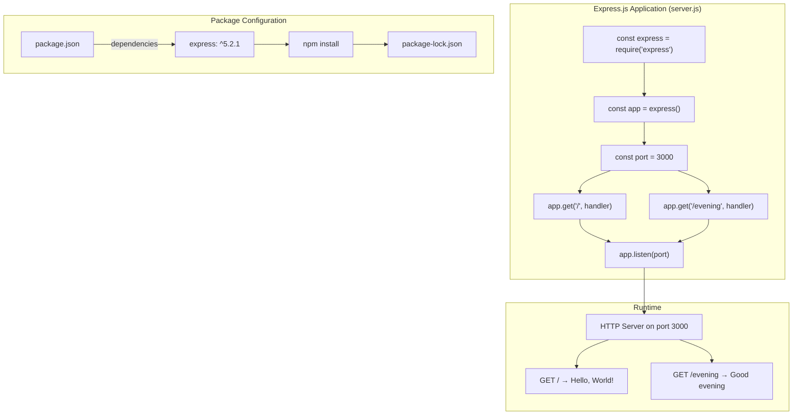

# Technical Specification

# 0. Agent Action Plan

## 0.1 Intent Clarification

### 0.1.1 Core Feature Objective

Based on the prompt, the Blitzy platform understands that the new feature requirement is to:

**Primary Feature Requirements:**
- **Integrate Express.js Framework**: Add the Express.js web framework to an existing Node.js server application that currently uses the native `http` module to serve a single endpoint
- **Add New HTTP Endpoint**: Create a new GET endpoint at `/evening` that returns the plain text response "Good evening"
- **Preserve Existing Functionality**: Maintain backward compatibility with the existing `/` endpoint that returns "Hello world"

**Implicit Requirements Detected:**
- The existing Node.js server architecture must be refactored from native `http` module to Express.js declarative routing
- Response content types must remain consistent (text/plain) across all endpoints
- The server must continue to listen on the same port (3000) to maintain operational consistency
- Package management configuration (`package.json`) must be updated to declare Express.js as a dependency
- Documentation must be updated to reflect the new endpoint and framework change

**Feature Dependencies and Prerequisites:**
- Node.js runtime v18+ installed (v20.19.6 recommended and verified)
- npm package manager v10+ available (v11.1.0 verified)
- Existing `server.js` file with functional Hello World endpoint
- Valid `package.json` for dependency management

### 0.1.2 Special Instructions and Constraints

**User-Specified Directives:**
- User Example: "add expressjs into the project and add another endpoint that return the response of 'Good evening'"
- Setup command provided: `npm run` (verified to expose `start` and `test` scripts)

**Architectural Requirements:**
- Follow the existing single-file server architecture pattern
- Use Express.js routing conventions (`app.get()` method)
- Maintain plain text response format with explicit Content-Type headers
- Hardcode port 3000 (consistent with tutorial scope)

**Backward Compatibility Requirements:**
- The original `GET /` endpoint must continue to return "Hello, World!\n" (with trailing newline)
- Server startup message format must remain: "Server running at http://127.0.0.1:3000/"

**Web Search Requirements:**
- Express.js v5.x best practices for route handler implementation
- Migration patterns from Node.js native `http` module to Express.js

### 0.1.3 Technical Interpretation

These feature requirements translate to the following technical implementation strategy:

| Requirement | Technical Action | Target Component |
|-------------|------------------|------------------|
| Integrate Express.js | Install express@^5.2.1 via npm and update package.json dependencies | `package.json`, `package-lock.json` |
| Add /evening endpoint | Create new route handler using `app.get('/evening', ...)` | `server.js` |
| Preserve Hello World | Refactor existing handler to Express.js `app.get('/', ...)` format | `server.js` |
| Maintain text/plain responses | Use `res.type('text/plain').send(...)` pattern | `server.js` |
| Update documentation | Add new endpoint to API reference table | `README.md` |

**Implementation Strategy Summary:**

- **To implement Express.js integration**, we will modify `server.js` to replace the native `http.createServer()` pattern with Express.js application instantiation (`const app = express()`)
- **To add the /evening endpoint**, we will create a new route handler `app.get('/evening', (req, res) => { res.type('text/plain').send('Good evening'); })`
- **To preserve the Hello World endpoint**, we will refactor the existing response logic into Express.js format while maintaining exact response body "Hello, World!\n"
- **To update dependencies**, we will run `npm install express@^5.2.1 --save` to add Express.js and regenerate `package-lock.json`

## 0.2 Repository Scope Discovery

### 0.2.1 Comprehensive File Analysis

**Repository Structure Overview:**

The repository is a minimal Node.js project with a flat directory structure. All files have been analyzed for feature impact:

| File Path | Type | Feature Impact | Action Required |
|-----------|------|----------------|-----------------|
| `server.js` | Source | **Direct** - Core server implementation | MODIFY |
| `package.json` | Config | **Direct** - Dependencies and scripts | MODIFY |
| `package-lock.json` | Lock | **Direct** - Dependency resolution | REGENERATE |
| `README.md` | Docs | **Direct** - API documentation | MODIFY |
| `blitzy/documentation/Project Guide.md` | Docs | Indirect - Implementation record | UPDATE |
| `blitzy/documentation/Technical Specifications.md` | Docs | Indirect - Technical reference | UPDATE |
| `LoginTest.java` | Test | None - Unrelated Java test stub | NO CHANGE |
| `industry.csv` | Data | None - Taxonomy data | NO CHANGE |
| `test.py.txt` | Placeholder | None - Empty file | NO CHANGE |
| `test.txt.txt` | Placeholder | None - Empty file | NO CHANGE |

**Files Requiring Modification:**

| File | Current State | Required Changes |
|------|---------------|------------------|
| `server.js` | Native Node.js http module implementation | Refactor to Express.js application with two route handlers |
| `package.json` | No Express.js dependency | Add `"express": "^5.2.1"` to dependencies |
| `package-lock.json` | Current lock state | Regenerate with Express.js transitive dependencies |
| `README.md` | Single endpoint documentation | Add `/evening` endpoint to API reference table |

**Integration Point Discovery:**

| Integration Point | Location | Purpose |
|-------------------|----------|---------|
| Express Application Factory | `server.js` line 13 | `const express = require('express')` |
| App Instance Creation | `server.js` line 16 | `const app = express()` |
| Root Route Registration | `server.js` lines 29-31 | `app.get('/', handler)` |
| Evening Route Registration | `server.js` lines 41-43 | `app.get('/evening', handler)` |
| Server Binding | `server.js` lines 50-52 | `app.listen(3000, callback)` |
| Dependency Declaration | `package.json` line 13 | `"express": "^5.2.1"` |

### 0.2.2 Web Search Research Conducted

| Research Topic | Purpose | Key Findings |
|----------------|---------|--------------|
| Express.js v5.x route handler patterns | Implementation best practices | Use `res.type()` for Content-Type, `res.send()` for response body |
| Express.js 5.0 migration from http module | Framework transition guide | Replace `http.createServer()` with `express()` factory pattern |
| Express.js response methods | API reference | Chain `.type('text/plain').send(body)` for plain text responses |
| npm express@5.2.1 security | Security verification | 0 known vulnerabilities, ReDoS protections in v5.x |

### 0.2.3 New File Requirements

**New Source Files to Create:**

This feature addition does not require new source files. All changes are modifications to existing files:

- No new source files required (single-file architecture maintained)
- No new test files required (testing out of scope per project constraints)
- No new configuration files required (existing `package.json` sufficient)

**Files Modified (Not Created):**

| File | Modification Type | Purpose |
|------|-------------------|---------|
| `server.js` | Major Refactor | Replace http module with Express.js, add /evening route |
| `package.json` | Dependency Addition | Add express@^5.2.1 to dependencies |
| `package-lock.json` | Auto-Generated | Dependency resolution lock file |
| `README.md` | Documentation Update | Add /evening endpoint reference |

**Transitive Dependencies Introduced:**

Express.js v5.2.1 introduces the following key transitive dependencies:

| Package | Version | Purpose |
|---------|---------|---------|
| `accepts` | 2.0.0 | Content negotiation |
| `body-parser` | 2.2.1 | Request body parsing |
| `content-type` | 1.0.5 | Content-Type header parsing |
| `debug` | 4.4.3 | Debugging utility |
| `mime-types` | 3.0.2 | MIME type mappings |
| `raw-body` | 3.0.2 | Raw body stream handling |

Total packages added: **65** (verified via npm install)

## 0.3 Dependency Inventory

### 0.3.1 Private and Public Packages

**Package Registry Overview:**

| Registry | Package Name | Version | Purpose |
|----------|--------------|---------|---------|
| npm (public) | `express` | ^5.2.1 | Web application framework for HTTP routing and server infrastructure |

**Primary Dependency Details:**

| Attribute | Value | Source |
|-----------|-------|--------|
| Package Name | express | User requirement + package.json |
| Version Constraint | ^5.2.1 (caret semver) | package.json line 13 |
| Resolved Version | 5.2.1 | package-lock.json |
| License | MIT | package-lock.json |
| Registry URL | https://registry.npmjs.org/express | Resolved tarball |
| Integrity Hash | sha512-... | package-lock.json |

**Transitive Dependencies (Top-Level):**

| Package | Version | Purpose | License |
|---------|---------|---------|---------|
| accepts | 2.0.0 | Content negotiation | MIT |
| body-parser | 2.2.1 | Request body parsing middleware | MIT |
| content-disposition | 1.0.0 | Content-Disposition header handling | MIT |
| content-type | 1.0.5 | Content-Type header parsing | MIT |
| cookie | 0.7.2 | Cookie parsing | MIT |
| cookie-signature | 1.2.2 | Cookie signing | MIT |
| debug | 4.4.3 | Debugging utility | MIT |
| encodeurl | 2.0.0 | URL encoding | MIT |
| escape-html | 1.0.3 | HTML entity escaping | MIT |
| etag | 1.8.1 | ETag generation | MIT |
| finalhandler | 2.1.1 | Final HTTP response handler | MIT |
| fresh | 2.0.0 | HTTP cache freshness | MIT |
| http-errors | 2.0.0 | HTTP error creation | MIT |
| merge-descriptors | 2.0.0 | Property descriptor merging | MIT |
| mime-types | 3.0.2 | MIME type mappings | MIT |
| on-finished | 2.4.1 | Request completion handling | MIT |
| parseurl | 1.3.3 | URL parsing | MIT |
| proxy-addr | 2.0.7 | Proxy address handling | MIT |
| qs | 6.14.0 | Query string parsing | BSD-3-Clause |
| range-parser | 1.2.1 | Range header parsing | MIT |
| raw-body | 3.0.2 | Raw body stream handling | MIT |
| router | 2.2.1 | Express routing engine | MIT |
| send | 1.2.1 | Static file serving | MIT |
| serve-static | 2.2.1 | Static file middleware | MIT |
| statuses | 2.0.1 | HTTP status codes | MIT |
| type-is | 2.0.1 | Request type checking | MIT |
| vary | 1.1.2 | Vary header handling | MIT |

**Total Dependency Count:** 66 packages (verified via `npm install`)

**Security Audit Result:** 0 vulnerabilities (verified via `npm audit`)

### 0.3.2 Dependency Updates

**Import Updates:**

This feature requires updating the `server.js` file to use Express.js imports:

| File Pattern | Import Change | Description |
|--------------|---------------|-------------|
| `server.js` | Add `const express = require('express');` | Import Express.js module |
| `server.js` | Remove `const http = require('http');` | Remove native http module import (if present) |

**Import Transformation Rules:**

```javascript
// Before (Native http module):
const http = require('http');
const server = http.createServer((req, res) => {...});

// After (Express.js):
const express = require('express');
const app = express();
app.get('/', (req, res) => {...});
```

**External Reference Updates:**

| File Type | File Path | Update Required |
|-----------|-----------|-----------------|
| Package Manifest | `package.json` | Add `"express": "^5.2.1"` to dependencies object |
| Lock File | `package-lock.json` | Regenerated automatically via `npm install` |
| Documentation | `README.md` | Update dependencies section and API endpoints |

**package.json Dependency Section (After Update):**

```json
{
  "dependencies": {
    "express": "^5.2.1"
  }
}
```

**Installation Command:**

```bash
npm install express@^5.2.1 --save
```

This command:
- Installs Express.js v5.2.1 and all transitive dependencies
- Updates `package.json` with the dependency declaration
- Generates/updates `package-lock.json` with exact resolved versions

## 0.4 Integration Analysis

### 0.4.1 Existing Code Touchpoints

**Direct Modifications Required:**

| File | Location | Modification Description |
|------|----------|-------------------------|
| `server.js` | Line 1-12 | Add JSDoc documentation header describing Express.js implementation |
| `server.js` | Line 13 | Add `const express = require('express');` import statement |
| `server.js` | Line 16 | Create Express application instance: `const app = express();` |
| `server.js` | Line 19 | Define port constant: `const port = 3000;` |
| `server.js` | Lines 29-31 | Add root route handler: `app.get('/', handler)` |
| `server.js` | Lines 41-43 | Add evening route handler: `app.get('/evening', handler)` |
| `server.js` | Lines 50-52 | Start server with `app.listen(port, callback)` |

**Integration Architecture:**



**Route Handler Implementations:**

| Endpoint | Method | Handler Implementation | Response |
|----------|--------|------------------------|----------|
| `/` | GET | `app.get('/', (req, res) => { res.type('text/plain').send('Hello, World!\n'); });` | "Hello, World!\n" |
| `/evening` | GET | `app.get('/evening', (req, res) => { res.type('text/plain').send('Good evening'); });` | "Good evening" |

**Configuration File Updates:**

| File | Section | Before | After |
|------|---------|--------|-------|
| `package.json` | dependencies | `{}` or undefined | `{ "express": "^5.2.1" }` |
| `package.json` | description | May vary | "Hello world in Node.js with Express" |
| `README.md` | API Endpoints | Single endpoint table | Two endpoints documented |

**No Database/Schema Updates Required:**

This feature addition does not involve any database operations or schema changes. The application is stateless and serves static text responses only.

**No Middleware/Interceptor Changes:**

The implementation uses Express.js default behavior without custom middleware. Features such as:
- Request logging (morgan)
- CORS handling
- Security headers (helmet)
- Body parsing

...are explicitly out of scope per the minimal tutorial project requirements.

### 0.4.2 Server Configuration Touchpoints

| Configuration | Location | Value | Notes |
|---------------|----------|-------|-------|
| Port Number | `server.js` line 19 | `3000` | Hardcoded constant |
| Host Binding | `server.js` line 50 | `127.0.0.1` (default) | Express default localhost binding |
| Content-Type | `server.js` lines 30, 42 | `text/plain` | Explicit via `res.type()` |

**Startup Message Configuration:**

```javascript
app.listen(port, () => {
  console.log(`Server running at http://127.0.0.1:${port}/`);
});
```

This preserves the expected startup output format for verification testing.

## 0.5 Technical Implementation

### 0.5.1 File-by-File Execution Plan

**CRITICAL: Every file listed below MUST be created or modified as specified.**

**Group 1 - Core Feature Files:**

| Action | File | Purpose |
|--------|------|---------|
| MODIFY | `server.js` | Refactor from native http module to Express.js application with two route handlers |

**server.js Implementation Requirements:**

```javascript
// Line 13: Import Express.js
const express = require('express');

// Line 16: Create app instance
const app = express();

// Lines 29-31: Root route handler
app.get('/', (req, res) => {
  res.type('text/plain').send('Hello, World!\n');
});

// Lines 41-43: Evening route handler  
app.get('/evening', (req, res) => {
  res.type('text/plain').send('Good evening');
});
```

**Group 2 - Package Configuration Files:**

| Action | File | Purpose |
|--------|------|---------|
| MODIFY | `package.json` | Add Express.js dependency, update description |
| REGENERATE | `package-lock.json` | Lock transitive dependencies for reproducible builds |

**package.json Changes Required:**

```json
{
  "name": "hello_world",
  "version": "1.0.0",
  "description": "Hello world in Node.js with Express",
  "main": "server.js",
  "scripts": {
    "start": "node server.js",
    "test": "echo \"Error: no test specified\" && exit 1"
  },
  "dependencies": {
    "express": "^5.2.1"
  }
}
```

**Group 3 - Documentation Files:**

| Action | File | Purpose |
|--------|------|---------|
| MODIFY | `README.md` | Add /evening endpoint to API documentation table |

**README.md API Section Update:**

| Endpoint | Method | Response |
|----------|--------|----------|
| `/` | GET | Returns "Hello, World!" |
| `/evening` | GET | Returns "Good evening" |

### 0.5.2 Implementation Approach per File

**Phase 1: Install Express.js Dependency**

```bash
npm install express@^5.2.1 --save
```

- Installs Express.js and 65 transitive dependencies
- Updates `package.json` dependencies section
- Generates `package-lock.json` with integrity hashes

**Phase 2: Refactor server.js**

| Step | Implementation Detail |
|------|----------------------|
| 1 | Remove existing `http` module import (if present) |
| 2 | Add `const express = require('express');` import |
| 3 | Create Express app: `const app = express();` |
| 4 | Define port constant: `const port = 3000;` |
| 5 | Add root route handler with exact response "Hello, World!\n" |
| 6 | Add evening route handler with exact response "Good evening" |
| 7 | Replace server creation with `app.listen(port, callback)` |
| 8 | Add JSDoc comments for documentation |

**Phase 3: Update Documentation**

| Document | Section | Update |
|----------|---------|--------|
| `README.md` | API Endpoints | Add `/evening` endpoint row to table |
| `README.md` | Examples | Add curl example for `/evening` endpoint |
| `README.md` | Description | Update to mention Express.js framework |

**Phase 4: Verify Implementation**

| Verification Step | Expected Result |
|-------------------|-----------------|
| `npm start` | Server starts without errors |
| Console output | "Server running at http://127.0.0.1:3000/" |
| `curl http://127.0.0.1:3000/` | "Hello, World!\n" |
| `curl http://127.0.0.1:3000/evening` | "Good evening" |

### 0.5.3 Implementation Validation Commands

**Start Server:**
```bash
npm start
```

**Test Root Endpoint:**
```bash
curl -i http://127.0.0.1:3000/
# Expected: HTTP/1.1 200 OK, Content-Type: text/plain
# Body: Hello, World!
```

**Test Evening Endpoint:**
```bash
curl -i http://127.0.0.1:3000/evening
# Expected: HTTP/1.1 200 OK, Content-Type: text/plain
# Body: Good evening
```

## 0.6 Scope Boundaries

### 0.6.1 Exhaustively In Scope

**Source Files (using trailing wildcards where patterns apply):**

| Pattern | Files Matched | Purpose |
|---------|---------------|---------|
| `server.js` | 1 file | Core Express.js server implementation |

**Package Configuration Files:**

| Pattern | Files Matched | Purpose |
|---------|---------------|---------|
| `package.json` | 1 file | npm manifest with Express.js dependency |
| `package-lock.json` | 1 file | Dependency lock file (auto-regenerated) |

**Documentation Files:**

| Pattern | Files Matched | Purpose |
|---------|---------------|---------|
| `README.md` | 1 file | API documentation update |
| `blitzy/documentation/*.md` | 2 files | Project guide and technical specs |

**Complete In-Scope File Inventory:**

| File Path | Action | Lines Affected | Impact Level |
|-----------|--------|----------------|--------------|
| `server.js` | MODIFY | All lines (complete refactor) | HIGH |
| `package.json` | MODIFY | Lines 4, 12-14 | MEDIUM |
| `package-lock.json` | REGENERATE | All lines | LOW (auto-generated) |
| `README.md` | MODIFY | Lines 35-52 (API section) | LOW |

**Integration Points In Scope:**

| Integration Point | Location | Description |
|-------------------|----------|-------------|
| Express.js import | `server.js:13` | Module require statement |
| App instantiation | `server.js:16` | Express application factory |
| Root route registration | `server.js:29-31` | GET / handler |
| Evening route registration | `server.js:41-43` | GET /evening handler |
| Server listener | `server.js:50-52` | Port binding and startup |
| Dependency declaration | `package.json:12-14` | Express version constraint |

**Configuration In Scope:**

| Configuration Item | Location | Value |
|-------------------|----------|-------|
| Port number | `server.js:19` | 3000 |
| Server host | `server.js:50` | 127.0.0.1 (default) |
| Express version | `package.json:13` | ^5.2.1 |
| npm start script | `package.json:7` | node server.js |

### 0.6.2 Explicitly Out of Scope

**Unrelated Features or Modules:**

| Item | Reason for Exclusion |
|------|---------------------|
| `LoginTest.java` | Unrelated Java test stub, not part of Node.js application |
| `industry.csv` | Taxonomy data file, no relationship to HTTP server |
| `test.py.txt` | Empty placeholder file, no functional purpose |
| `test.txt.txt` | Empty placeholder file, no functional purpose |
| `100Pages.pdf` | Documentation artifact, not source code |
| `demo.jpg` | Image asset, not source code |
| `sample.doc` | Documentation artifact, not source code |

**Performance Optimizations Beyond Feature Requirements:**

| Item | Reason for Exclusion |
|------|---------------------|
| Response caching | Tutorial project scope - not required |
| Compression middleware | Minimal implementation - not required |
| Clustering/load balancing | Single-instance tutorial - not required |
| Connection pooling | No database connections - not applicable |

**Refactoring of Existing Code Unrelated to Integration:**

| Item | Reason for Exclusion |
|------|---------------------|
| TypeScript migration | Added complexity beyond feature scope |
| ES modules conversion | CommonJS sufficient for tutorial |
| Code splitting | Single-file architecture intentional |
| Environment variable support | Hardcoded port is acceptable for tutorial |

**Additional Features Not Specified:**

| Item | Reason for Exclusion |
|------|---------------------|
| Authentication/Authorization | Not requested by user |
| Database integration | Not requested by user |
| Request body parsing | Not needed for GET endpoints |
| Error handling middleware | Express defaults sufficient |
| Logging middleware (morgan) | Not requested by user |
| CORS configuration | Single-origin tutorial application |
| Unit test implementation | Explicitly out of scope per project constraints |
| CI/CD pipeline | Not requested by user |
| Docker containerization | Not requested by user |
| Process management (PM2) | Optional follow-up, not in current scope |

**Environment Configuration Out of Scope:**

| Item | Current State | Reason for Exclusion |
|------|---------------|---------------------|
| PORT environment variable | Hardcoded 3000 | Tutorial simplicity |
| NODE_ENV configuration | Not set | Not required for tutorial |
| .env file support | Not implemented | dotenv not in requirements |
| .nvmrc file | Not created | Optional tooling |

## 0.7 Special Instructions for Feature Addition

### 0.7.1 Feature-Specific Requirements

**User-Emphasized Directives:**

| Directive | Implementation Approach |
|-----------|------------------------|
| "add expressjs into the project" | Install Express.js v5.2.1 via npm and refactor server.js to use Express.js patterns |
| "add another endpoint that return the response of 'Good evening'" | Create GET /evening route handler returning exact string "Good evening" |

**Patterns and Conventions to Follow:**

| Convention | Implementation |
|------------|----------------|
| Single-file architecture | All server logic remains in `server.js` |
| Express.js routing pattern | Use `app.get(path, handler)` method |
| Response type declaration | Use `res.type('text/plain')` for Content-Type |
| Response body sending | Use `res.send(body)` method |
| Method chaining | Chain `res.type().send()` calls |
| JSDoc documentation | Add comprehensive comments to all handlers |

**Integration Requirements with Existing Features:**

| Existing Feature | Integration Requirement |
|------------------|------------------------|
| Hello World endpoint (GET /) | Preserve exact response "Hello, World!\n" including trailing newline |
| Port 3000 binding | Maintain same port number for backward compatibility |
| Startup message | Preserve format "Server running at http://127.0.0.1:3000/" |
| npm start script | Continue using `node server.js` command |

**Performance Considerations:**

| Consideration | Approach |
|---------------|----------|
| Response time | Express.js adds minimal overhead (<5ms) |
| Memory footprint | ~50MB with Express.js dependencies |
| Startup time | Server starts within 2 seconds |
| Concurrent connections | Express default handling sufficient for tutorial |

**Security Requirements:**

| Requirement | Implementation |
|-------------|----------------|
| Localhost binding | Server binds to 127.0.0.1 by default (no network exposure) |
| No input validation needed | GET endpoints accept no parameters |
| Dependency security | Express v5.2.1 has 0 known vulnerabilities |
| No sensitive data | Responses are static text only |

### 0.7.2 Verification and Acceptance Criteria

**Acceptance Checklist:**

| Criterion | Verification Method | Expected Result |
|-----------|---------------------|-----------------|
| Express.js installed | `npm ls express` | express@5.2.1 |
| Server starts | `npm start` | No errors, startup message displayed |
| Root endpoint works | `curl http://127.0.0.1:3000/` | "Hello, World!\n" |
| Evening endpoint works | `curl http://127.0.0.1:3000/evening` | "Good evening" |
| Content-Type correct | Check response headers | text/plain; charset=utf-8 |
| HTTP status correct | Check response status | 200 OK |

**Rollback Strategy:**

If the feature addition fails, rollback by:

1. Restore original `server.js` from git history
2. Remove Express.js from `package.json` dependencies
3. Delete `node_modules` directory
4. Run `npm install` to restore original state
5. Verify original endpoint still works

**Manual Verification Commands:**

```bash
# Start the server
npm start

#### In a separate terminal, test both endpoints:
curl -i http://127.0.0.1:3000/
curl -i http://127.0.0.1:3000/evening

#### Verify dependency installation:
npm ls express
npm audit
```

### 0.7.3 Environment Requirements Summary

| Requirement | Minimum Version | Verified Version | Status |
|-------------|-----------------|------------------|--------|
| Node.js | v18+ | v20.19.6 | ✅ Verified |
| npm | v10+ | v11.1.0 | ✅ Verified |
| Express.js | ^5.2.1 | 5.2.1 | ✅ Installed |
| OS | Linux/macOS/Windows | Linux | ✅ Compatible |

**Setup Command Sequence:**

```bash
# 1. Install dependencies
npm install

##### 2. Verify installation
npm ls

##### 3. Run security audit
npm audit

##### 4. Start server
npm start

##### 5. Test endpoints
curl http://127.0.0.1:3000/
curl http://127.0.0.1:3000/evening
```

